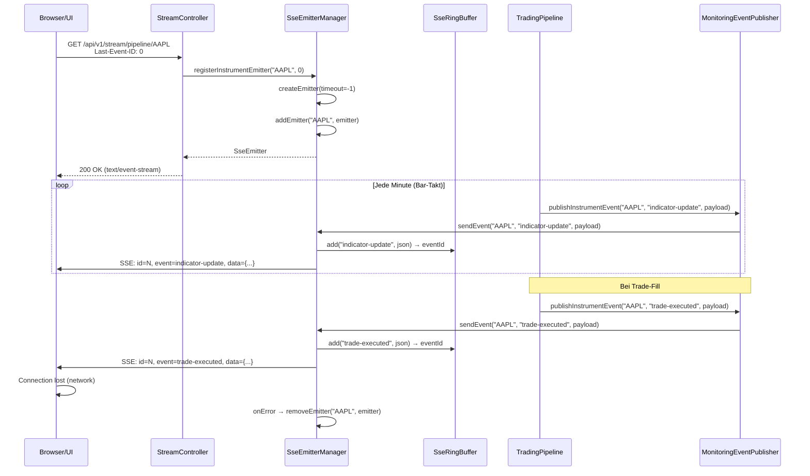
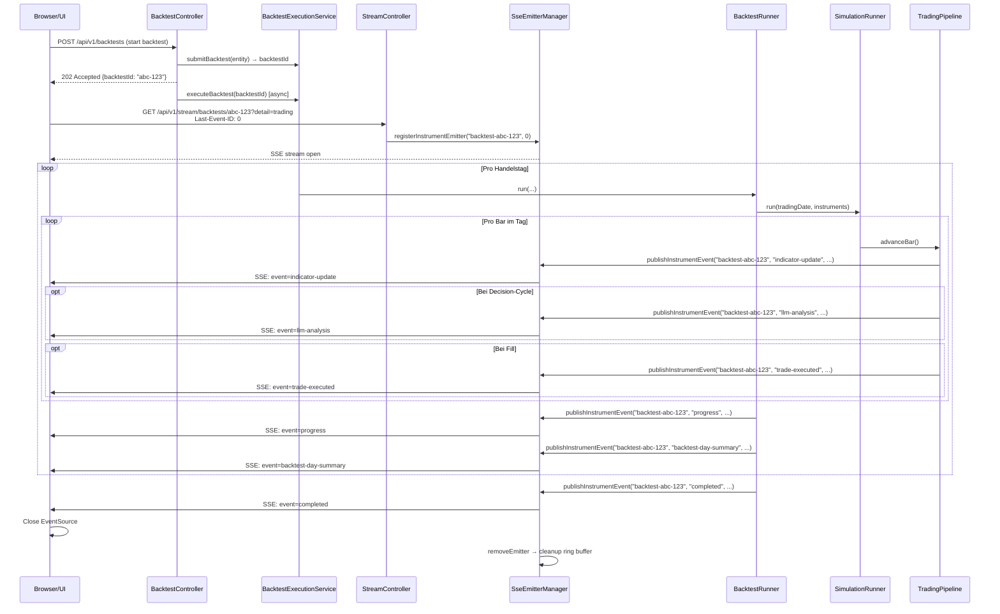
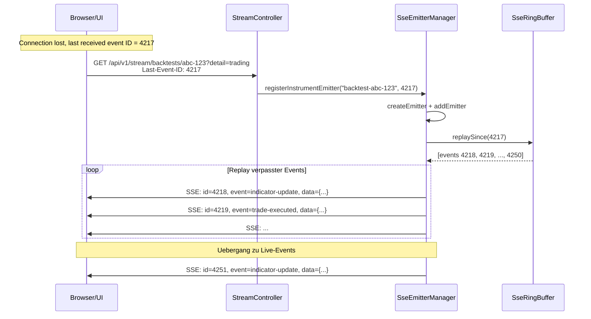
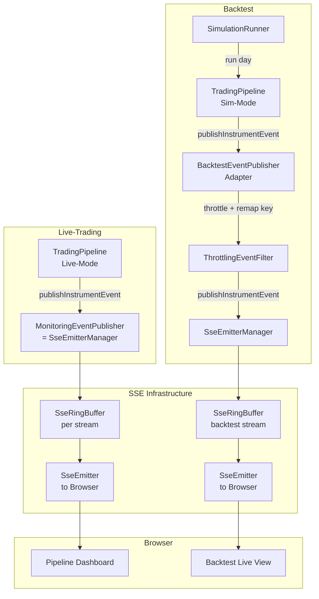

# 11 -- Live-Datenstreaming vom Backtest-Runner an die UI

> **Quellen:** Concept 10 (Observability, SSE-Kommunikation), Concept 09 (Backtesting, BacktestRunner), Build-Spec v3.0, bestehende SSE-Infrastruktur (SseEmitterManager, StreamController, SseRingBuffer, SseEventType), MonitoringEventPublisher Port-Interface

---

## 1. Einleitung

### 1.1 Problemstellung

Ein Backtest-Lauf ueber 6 Monate historischer Daten dauert typischerweise 30--90 Minuten. Waehrend dieser Zeit liefert das System dem Operator lediglich Day-Level-Progress-Events (`progress`, `completed`, `failed`, `cancelled`) ueber den SSE-Backtest-Stream. Der Operator sieht:

- **Fortschrittsbalken:** "Tag 47 von 120 abgeschlossen" — mehr nicht.
- **Keine Trading-Einblicke:** Welche Entscheidungen trifft die Pipeline? Welche Setups werden erkannt? Wo greift das Risk-Gate? Alles unsichtbar bis zum Gesamtreport am Ende.
- **Keine Intraday-Transparenz:** Im Live-Trading existieren per-Pipeline SSE-Streams mit State-Changes, Indikatoren, LLM-Analysen, Trade-Events. Im Backtest: Stille.

Das bedeutet: 90 Minuten Blindflug. Erst nach dem vollstaendigen Durchlauf kann der Operator beurteilen, ob die Strategie sinnvolle Entscheidungen trifft. Debugging erfordert Post-hoc-Analyse der Datenbank statt Live-Beobachtung.

### 1.2 Ziel

Ein einheitliches Live-Streaming-Konzept, das sowohl im **Live-Trading** als auch im **Backtest-Modus** funktioniert:

1. **Backtest-Live-Streaming:** Waehrend eines Backtests werden die gleichen Trading-Events (LLM-Entscheidungen, Indikator-Snapshots, Fills, State-Transitions) in Echtzeit ueber SSE gestreamt.
2. **Dual-Use-Architektur:** Gleiche Event-DTOs, gleicher SSE-Stack. Unterschied nur in der Event-Quelle (Live-Pipeline vs. SimulationRunner).
3. **Backpressure-Strategie:** Backtests produzieren Events um Groessenordnungen schneller als Echtzeit. Das System MUSS damit umgehen, ohne den Browser zu ueberfluten oder den Backtest zu bremsen.
4. **Bar-Level-Fortschritt:** Feinere Fortschrittsmeldungen als Day-Level — auf Bar-Ebene mit Throttling.

### 1.3 Bestandsaufnahme: Was existiert bereits

Die SSE-Infrastruktur ist weiter entwickelt als die Luecke vermuten laesst. Die folgende Tabelle zeigt den IST-Stand:

| Komponente | Status | Klasse / Ort |
|------------|--------|--------------|
| **SseEmitterManager** | Produktionsreif | `de.its.odin.app.sse.SseEmitterManager` |
| **SseRingBuffer** | Produktionsreif | `de.its.odin.app.sse.SseRingBuffer` |
| **SseEventType** | 13 Event-Typen definiert | `de.its.odin.app.sse.SseEventType` |
| **SseProperties** | Konfigurierbar | `de.its.odin.app.config.SseProperties` |
| **StreamController** | 3 Endpoints | `de.its.odin.app.controller.StreamController` |
| **MonitoringEventPublisher** | Port-Interface | `de.its.odin.api.port.MonitoringEventPublisher` |
| **8 SSE-DTOs** | Vollstaendig | `de.its.odin.app.dto.sse.*` |
| **Backtest-Progress-Stream** | Nur Day-Level | `BacktestProgress` + `BACKTEST_PROGRESS` |
| **Per-Pipeline-Stream** | Nur Live-Trading | `GET /api/v1/stream/pipeline/{instrumentId}` |
| **Global Stream** | Nur Live-Trading | `GET /api/v1/stream/global` |

**Fazit:** Die Infrastruktur fuer Streaming steht. Was fehlt, ist die **Verdrahtung** zwischen BacktestRunner/SimulationRunner und dem SSE-Stack fuer Trading-Events.

---

## 2. Architekturentscheidung: SSE

### 2.1 SSE vs. WebSocket

| Kriterium | SSE | WebSocket |
|-----------|-----|-----------|
| **Richtung** | Server → Client (unidirektional) | Bidirektional |
| **Reconnect** | Browser-native (automatisch mit `Last-Event-ID`) | Manuell implementieren |
| **Protokoll** | HTTP/1.1 oder HTTP/2 | Upgrade von HTTP auf WS |
| **Proxy/CDN-Kompatibilitaet** | Gut (normales HTTP) | Problematisch (Upgrade) |
| **Komplexitaet** | Gering (Spring `SseEmitter`) | Hoch (WebSocket-Handler, STOMP) |
| **Bestehende Infra** | Vollstaendig implementiert | Nicht vorhanden |
| **Backpressure** | Ring Buffer + Drop-Policy | Frame-Level-Kontrolle |
| **Concurrent Connections** | HTTP/1.1: 6 pro Domain | Unbegrenzt |

### 2.2 Entscheidung: SSE

SSE ist die richtige Wahl fuer ODIN. Begruendung:

1. **Unidirektional reicht:** Monitoring-Daten fliessen ausschliesslich Server → Client. Steuerung (Kill-Switch, Pause/Resume) erfolgt ueber REST POST — das ist bereits implementiert und funktioniert (Concept 10, Abschnitt 3).
2. **Bestehende Infrastruktur:** SseEmitterManager, SseRingBuffer, StreamController, 8 DTOs — alles produktionsreif. WebSocket wuerde einen Parallel-Stack erfordern.
3. **Automatischer Reconnect:** Der Browser reconnected selbst mit `Last-Event-ID`. Bei WebSocket muesste man das manuell bauen.
4. **Single-User-System:** ODIN ist ein privates System mit einem Operator. Die HTTP/1.1-Beschraenkung von 6 Connections pro Domain ist irrelevant (3 Streams reichen: Pipeline, Global, Backtest).
5. **HTTP/2-Multiplexing:** Falls spaeter noetig, hebt HTTP/2 die Connection-Beschraenkung auf, ohne Code-Aenderungen.

### 2.3 Referenz auf bestehende Implementierung

Die SSE-Infrastruktur wird in `de.its.odin.app.sse.SseEmitterManager` zentral verwaltet:

- **Per-Stream Ring Buffer:** Jeder Stream-Key (Instrument-ID, `__global__`, `backtest-{uuid}`) hat einen eigenen `SseRingBuffer` mit konfigurierbarer Kapazitaet und TTL.
- **Monotone Event-IDs:** Jeder Ring Buffer vergibt aufsteigende Event-IDs (`nextEventId`). Der Client sendet `Last-Event-ID` beim Reconnect, der Buffer replayed alle Events nach dieser ID.
- **Lifecycle-Management:** Emitter werden bei Completion/Timeout/Error automatisch entfernt. Backtest-Streams raeumen ihren Ring Buffer auf, wenn der letzte Emitter disconnected.
- **Heartbeat:** Periodischer Heartbeat (Default: 5s) ueber alle Streams haelt Connections offen.

---

## 3. Event-Katalog

### 3.1 Bestehende Events (bereits implementiert)

| Event-Typ (SSE `event:`) | DTO-Klasse | Kategorie | Stream |
|---------------------------|------------|-----------|--------|
| `pipeline-state` | `PipelineStateEvent` | FSM | Pipeline |
| `position-update` | `PositionUpdateEvent` | Position | Pipeline |
| `indicator-update` | `IndicatorUpdateEvent` | Quant | Pipeline |
| `llm-analysis` | `LlmAnalysisEvent` | LLM | Pipeline |
| `trade-executed` | `TradeExecutedEvent` | Order | Pipeline |
| `alert` | `AlertEvent` | System | Pipeline + Global |
| `degradation-change` | `DegradationChangeEvent` | System | Pipeline + Global |
| `cycle-update` | `CycleUpdateEvent` | KPI | Pipeline |
| `heartbeat` | `{"type":"heartbeat"}` | System | Alle |
| `progress` | `BacktestProgress` | Progress | Backtest |
| `completed` | – | Progress | Backtest |
| `failed` | – | Progress | Backtest |
| `cancelled` | – | Progress | Backtest |

### 3.2 Neue Events fuer Backtest-Live-Streaming

Die folgenden Events muessen NEU definiert werden, um den Backtest-Modus mit voller Transparenz auszustatten:

| Event-Typ (SSE `event:`) | Kategorie | Beschreibung |
|---------------------------|-----------|--------------|
| `backtest-bar-progress` | Progress | Bar-Level-Fortschritt (verarbeitete Bars / Gesamtbars pro Tag) |
| `backtest-day-summary` | KPI | Tageszusammenfassung nach jedem simulierten Handelstag |
| `backtest-quant-score` | Quant | Quant-Engine-Score pro Decision-Cycle |
| `backtest-gate-result` | Quant | Risk-Gate-Ergebnis pro Decision-Cycle |

### 3.3 Vollstaendige JSON-Schemata

#### 3.3.1 PipelineStateEvent (bestehend)

```json
{
  "type": "pipeline-state",
  "instrumentId": "AAPL",
  "state": "POSITIONED",
  "previousState": "OBSERVING",
  "timestamp": "2025-03-05T14:30:00Z"
}
```

#### 3.3.2 PositionUpdateEvent (bestehend)

```json
{
  "type": "position-update",
  "instrumentId": "AAPL",
  "quantity": 100,
  "avgEntryPrice": 178.50,
  "unrealizedPnl": 125.00,
  "realizedPnl": 0.0
}
```

#### 3.3.3 IndicatorUpdateEvent (bestehend)

```json
{
  "type": "indicator-update",
  "instrumentId": "AAPL",
  "ema50": 177.85,
  "ema100": 176.20,
  "rsi": 62.4,
  "atr": 2.15,
  "regime": "TREND_UP",
  "subregime": "BREAKOUT_CONFIRMED"
}
```

#### 3.3.4 LlmAnalysisEvent (bestehend)

```json
{
  "type": "llm-analysis",
  "instrumentId": "AAPL",
  "action": "ALLOW_ENTRY",
  "confidence": 0.82,
  "reasoning": "Strong breakout above VWAP with volume confirmation..."
}
```

Hinweis: `reasoning` wird auf 200 Zeichen truncated (`LlmAnalysisEvent.MAX_REASONING_LENGTH`).

#### 3.3.5 TradeExecutedEvent (bestehend)

```json
{
  "type": "trade-executed",
  "instrumentId": "AAPL",
  "side": "BUY",
  "quantity": 100,
  "price": 178.50,
  "reason": "ENTRY_SETUP_A"
}
```

#### 3.3.6 AlertEvent (bestehend)

```json
{
  "type": "alert",
  "level": "WARNING",
  "message": "High slippage detected on AAPL fill: 0.15 USD",
  "timestamp": "2025-03-05T14:32:00Z"
}
```

`level` ist ein Enum: `INFO`, `WARNING`, `CRITICAL`, `EMERGENCY`.

#### 3.3.7 DegradationChangeEvent (bestehend)

```json
{
  "type": "degradation-change",
  "oldMode": "NORMAL",
  "newMode": "QUANT_ONLY",
  "reason": "LLM timeout exceeded 3 consecutive calls"
}
```

#### 3.3.8 CycleUpdateEvent (bestehend)

```json
{
  "type": "cycle-update",
  "instrumentId": "AAPL",
  "cycleNumber": 2,
  "cycleStartTime": "2025-03-05T15:10:00Z",
  "previousCyclePnl": 245.50
}
```

#### 3.3.9 BacktestBarProgressEvent (NEU)

```json
{
  "type": "backtest-bar-progress",
  "tradingDate": "2025-01-15",
  "completedBars": 195,
  "totalBars": 390,
  "completedDays": 47,
  "totalDays": 120,
  "instrumentId": "AAPL",
  "currentPrice": 178.35,
  "dayPnl": -45.20,
  "overallPnl": 1250.80
}
```

#### 3.3.10 BacktestDaySummaryEvent (NEU)

```json
{
  "type": "backtest-day-summary",
  "tradingDate": "2025-01-15",
  "completedDays": 47,
  "totalDays": 120,
  "instruments": ["AAPL"],
  "totalTrades": 2,
  "dayPnl": 185.40,
  "cumulativePnl": 1436.20,
  "maxDrawdown": -312.50,
  "winRate": 0.625
}
```

#### 3.3.11 BacktestQuantScoreEvent (NEU)

```json
{
  "type": "backtest-quant-score",
  "instrumentId": "AAPL",
  "tradingDate": "2025-01-15",
  "marketTime": "2025-01-15T15:30:00Z",
  "score": 0.78,
  "intent": "ALLOW_ENTRY",
  "setupType": "A",
  "reasonCodes": ["A_EMA_ALIGNED", "A_VOL_DECAY_CONFIRMED"],
  "vetos": []
}
```

#### 3.3.12 BacktestGateResultEvent (NEU)

```json
{
  "type": "backtest-gate-result",
  "instrumentId": "AAPL",
  "tradingDate": "2025-01-15",
  "marketTime": "2025-01-15T15:30:00Z",
  "result": "PASS",
  "gateName": "RISK_GATE",
  "positionSize": 100,
  "stopLevel": 176.20,
  "rrRatio": 2.8,
  "rejectReasons": []
}
```

### 3.4 Frequenz-Abschaetzung

| Event-Kategorie | Live-Trading (Frequenz) | Backtest (Frequenz) | Faktor |
|-----------------|-------------------------|---------------------|--------|
| **Progress** | n/a | 1x pro simuliertem Tag | 1x |
| **Bar-Progress** | n/a | 1x pro Bar (nach Throttling: ~1x/10 Bars) | ~40/Tag |
| **Pipeline-State** | ~5--10/Tag | ~5--10 pro simuliertem Tag | 1x |
| **Indicator-Update** | 1x/min (390/Tag) | 390 pro simuliertem Tag | 390x schneller |
| **LLM-Analysis** | ~5--20/Tag (3m-Takt + TTL) | ~5--20 pro simuliertem Tag | 1x |
| **Trade-Executed** | ~2--6/Tag | ~2--6 pro simuliertem Tag | 1x |
| **Position-Update** | ~10--30/Tag | ~10--30 pro simuliertem Tag | 1x |
| **Quant-Score** | n/a (nur Backtest) | ~130 pro simuliertem Tag (3m-Takt) | n/a |
| **Gate-Result** | n/a (nur Backtest) | ~130 pro simuliertem Tag | n/a |
| **Day-Summary** | n/a | 1x pro simuliertem Tag | 1x |

**Worst-Case Backtest (120 Tage, 1 Instrument):**

- Indicator-Updates: 120 x 390 = 46.800 Events
- Quant-Scores: 120 x 130 = 15.600 Events
- Gate-Results: 120 x 130 = 15.600 Events
- Sonstige: ~120 x 50 = 6.000 Events
- **Gesamt: ~84.000 Events** in 30--90 Minuten

Das sind ~15--47 Events/Sekunde. Ohne Throttling bei schnellen Backtests potentiell deutlich mehr — daher ist Backpressure-Strategie essentiell (Abschnitt 6).

---

## 4. API-Spezifikation

### 4.1 Bestehende Endpoints

| Endpoint | Methode | Beschreibung | Event-Typen |
|----------|---------|--------------|-------------|
| `/api/v1/stream/pipeline/{instrumentId}` | GET | Per-Pipeline-Stream (Live) | pipeline-state, position-update, indicator-update, llm-analysis, trade-executed, alert, degradation-change, cycle-update, heartbeat |
| `/api/v1/stream/global` | GET | Globaler Stream | alert, degradation-change, heartbeat |
| `/api/v1/stream/backtests/{backtestId}` | GET | Backtest-Progress | progress, completed, failed, cancelled |

Alle Endpoints liefern `Content-Type: text/event-stream`. Reconnect wird ueber den `Last-Event-ID` HTTP-Header unterstuetzt.

### 4.2 Erweiterter Backtest-Stream (Aenderung)

Der bestehende Endpoint `GET /api/v1/stream/backtests/{backtestId}` wird erweitert, um neben Progress-Events auch Trading-Events zu liefern:

**Endpoint:** `GET /api/v1/stream/backtests/{backtestId}`

**Zusaetzliche Query-Parameter (NEU):**

| Parameter | Typ | Default | Beschreibung |
|-----------|-----|---------|--------------|
| `detail` | String | `progress` | Subscription-Level: `progress` (nur Fortschritt), `trading` (+ Trading-Events), `full` (+ Quant-Score + Gate-Result) |

**Beispiel:**
```
GET /api/v1/stream/backtests/550e8400-e29b-41d4-a716-446655440000?detail=trading
Last-Event-ID: 0
```

**Event-Typen nach Detail-Level:**

| Detail-Level | Events |
|--------------|--------|
| `progress` | progress, completed, failed, cancelled, heartbeat, backtest-day-summary |
| `trading` | progress-Events + pipeline-state, position-update, indicator-update, llm-analysis, trade-executed, alert, degradation-change, cycle-update, backtest-bar-progress |
| `full` | trading-Events + backtest-quant-score, backtest-gate-result |

**Begruendung fuer Opt-in:** Bei `full`-Detail koennen 84.000+ Events pro Backtest entstehen. Nicht jeder Backtest-Lauf erfordert diese Detailtiefe. Der Default `progress` ist abwaertskompatibel zum bestehenden Verhalten.

### 4.3 Response-Format

Alle Events folgen dem SSE-Standard-Format:

```
id: 4217
event: pipeline-state
data: {"type":"pipeline-state","instrumentId":"AAPL","state":"POSITIONED","previousState":"OBSERVING","timestamp":"2025-01-15T14:30:00Z"}

id: 4218
event: indicator-update
data: {"type":"indicator-update","instrumentId":"AAPL","ema50":177.85,"ema100":176.20,"rsi":62.4,"atr":2.15,"regime":"TREND_UP","subregime":"BREAKOUT_CONFIRMED"}

```

- `id:` monoton steigend, pro Stream-Key unabhaengig
- `event:` SSE Event-Type fuer `addEventListener()`-Dispatch
- `data:` JSON-Payload mit `type`-Diskriminator (Discriminated Union)

### 4.4 Fehlerverhalten

| Fehlerfall | Verhalten |
|------------|-----------|
| Backtest nicht gefunden | HTTP 404 (vor SSE-Verbindung) |
| Backtest bereits abgeschlossen | HTTP 200 + sofort `completed`-Event + Emitter-Complete |
| Backtest abgebrochen | HTTP 200 + sofort `cancelled`-Event + Emitter-Complete |
| Backtest fehlgeschlagen | HTTP 200 + sofort `failed`-Event + Emitter-Complete |
| Client disconnected | Emitter-Cleanup via `onCompletion`/`onError`-Callbacks |
| Ring Buffer Overflow | Aelteste Events werden ueberschrieben (Ring-Buffer-Semantik) |
| Ungueltige `Last-Event-ID` | Wird als 0 behandelt (kein Replay) |

---

## 5. Sequenzdiagramme

### 5.1 Live-Trading: Client Connect → Events → Disconnect



### 5.2 Backtest: Start → Stream-Subscribe → Events → Completed



### 5.3 Reconnect-Flow mit Last-Event-ID



---

## 6. Event-Buffer-Strategie

### 6.1 Bestehender SseRingBuffer

Die Klasse `de.its.odin.app.sse.SseRingBuffer` implementiert einen fixed-capacity Ring Buffer:

```
Kapazitaet:        500 Events (konfigurierbar: odin.frontend.sse.ring-buffer-capacity)
Max-Age:           60 Sekunden (konfigurierbar: odin.frontend.sse.replay-buffer-seconds)
Event-IDs:         Monoton steigend, startet bei 1
Thread-Safety:     Alle public Methoden synchronized
Overflow:          Aeltester Event wird ueberschrieben (Ring-Semantik)
```

**Replay-Logik:** `replaySince(lastEventId)` liefert alle Events mit `eventId > lastEventId` UND `timestamp > now - maxAgeSeconds`. Events die aelter als `maxAgeSeconds` sind, werden nicht replayed — auch wenn sie im Buffer noch vorhanden sind.

### 6.2 Erweiterungsbedarf fuer Backtest-Streams

Im Backtest-Modus gelten andere Anforderungen als im Live-Trading:

| Aspekt | Live-Trading | Backtest |
|--------|-------------|----------|
| **Event-Rate** | ~1/min (Indikatoren), sporadisch (Trades) | Burst: hunderte Events/Sekunde |
| **Replay-Fenster** | 60s reicht (Reconnect innerhalb Sekunden) | Groesseres Fenster noetig |
| **Buffer-Groesse** | 500 Events ausreichend | 2.000--5.000 Events empfohlen |
| **TTL** | 60s sinnvoll | 120--300s sinnvoll |

**Loesung:** Separate `SseProperties`-Werte fuer Backtest-Streams. Die `SseEmitterManager`-Methode `sendEvent()` erstellt Ring Buffers via `computeIfAbsent` — dort kann fuer Backtest-Stream-Keys (`backtest-*`) eine hoehere Kapazitaet und laengere TTL verwendet werden.

### 6.3 Speicher-Abschaetzung

| Event-Typ | Payload-Groesse (JSON) | Events/Tag (1 Instrument) | Pro Backtest-Tag |
|-----------|----------------------|---------------------------|-----------------|
| indicator-update | ~180 Bytes | 390 | 70 KB |
| pipeline-state | ~150 Bytes | 10 | 1.5 KB |
| trade-executed | ~120 Bytes | 6 | 0.7 KB |
| llm-analysis | ~350 Bytes | 15 | 5.3 KB |
| quant-score | ~200 Bytes | 130 | 26 KB |
| gate-result | ~180 Bytes | 130 | 23 KB |
| position-update | ~130 Bytes | 20 | 2.6 KB |
| Sonstige | ~100 Bytes | 10 | 1 KB |

**Pro simuliertem Tag:** ~130 KB (bei `full`-Detail)
**Ring Buffer (5.000 Events):** ~5.000 x 200 Bytes = ~1 MB
**Gesamter Backtest (120 Tage):** ~15.6 MB Event-Daten (werden NICHT alle im Buffer gehalten — nur die letzten 5.000 im Ring)

**Fazit:** Speicher ist unkritisch. Ein Ring Buffer von 5.000 Events bei ~200 Bytes Durchschnitt belegt ~1 MB.

### 6.4 Backpressure: Drop-Policy

Nicht alle Events sind gleich wichtig. Bei Ueberlastung (Client kann nicht schnell genug konsumieren) gilt:

| Prioritaet | Event-Typen | Drop-Policy |
|-----------|-------------|-------------|
| **NON-DROPPABLE** | trade-executed, pipeline-state, completed, failed, cancelled | NIEMALS droppen — diese Events sind geschaeftskritisch |
| **THROTTLE** | indicator-update, backtest-bar-progress, position-update | Sampling: maximal 1 Event pro N Millisekunden |
| **DROPPABLE** | backtest-quant-score, backtest-gate-result | Bei Ueberlastung droppen (nur Diagnose-Events) |

**Implementierung:** Ein `ThrottlingEventFilter` zwischen SimulationRunner und SseEmitterManager. Pro Event-Typ wird ein `lastSentTimestamp` gefuehrt. Wenn `now - lastSent < throttleIntervalMs`, wird das Event verworfen (ausser es ist NON-DROPPABLE).

**Default Throttle-Intervalle (Backtest):**

| Event-Typ | Throttle-Intervall |
|-----------|-------------------|
| indicator-update | 100ms |
| position-update | 200ms |
| backtest-bar-progress | 500ms |
| backtest-quant-score | 250ms |
| backtest-gate-result | 250ms |
| Alle NON-DROPPABLE | 0ms (kein Throttling) |

---

## 7. Late-Join / Catch-up

### 7.1 Bestehender Mechanismus

Der `SseRingBuffer` bietet `replaySince(lastEventId)`:

1. Client sendet `Last-Event-ID: N` im HTTP-Header
2. `SseEmitterManager.registerEmitter()` ruft `replayEvents(emitter, streamKey, lastEventId)` auf
3. Alle Events mit `eventId > N` UND `timestamp > now - maxAgeSeconds` werden gesendet
4. Danach wechselt der Emitter in den Live-Modus (neue Events werden direkt gepusht)

### 7.2 Erweiterung: REST-Endpoint fuer Bulk-Catch-up

Wenn der Client laenger als `replayBufferSeconds` disconnected war, sind Events aus dem Ring Buffer gefallen. Fuer diesen Fall wird ein REST-Endpoint benoetigt:

**Endpoint (NEU):** `GET /api/v1/backtests/{backtestId}/events`

| Parameter | Typ | Beschreibung |
|-----------|-----|--------------|
| `sinceEventId` | long | Events nach dieser ID |
| `limit` | int | Max. Anzahl Events (Default: 1000) |

**Response:**

```json
{
  "events": [
    {"eventId": 4218, "eventType": "indicator-update", "payload": {...}, "timestamp": "..."},
    {"eventId": 4219, "eventType": "trade-executed", "payload": {...}, "timestamp": "..."}
  ],
  "hasMore": true,
  "nextEventId": 5218
}
```

**Hinweis:** Dieser Endpoint erfordert serverseitige Event-Persistierung (z.B. in-memory List oder DB-Table). Das ist ein OPTIONALER Ausbauschritt — fuer V1 reicht der Ring Buffer. Der REST-Catch-up-Endpoint ist ein Erweiterungspunkt fuer spaeter.

**Offene Frage:** Soll die Event-Persistierung in-memory (LinkedList mit Groessenlimit) oder in der Datenbank (eigene Tabelle `bt_sse_event_log`) erfolgen? In-memory ist einfacher, geht aber bei Server-Neustart verloren. Da Backtests endlich sind und ein Neustart den Backtest ohnehin abbricht, ist in-memory fuer V1 ausreichend.

### 7.3 Sequenznummern-Schema

- **Pro Stream-Key:** Jeder Ring Buffer hat einen eigenen `nextEventId`-Counter, startend bei 1.
- **Monotonie:** IDs sind strikt aufsteigend innerhalb eines Streams. Kein Reset waehrend eines Backtests.
- **Cross-Stream:** Event-IDs sind NICHT vergleichbar zwischen verschiedenen Streams. Stream `backtest-abc` und Stream `backtest-xyz` haben unabhaengige ID-Spaces.

### 7.4 Konsistenzgarantien

- **At-Most-Once Delivery:** Ein Event kann bei Disconnect verloren gehen (Ring Buffer Overflow). Keine garantierte Delivery.
- **Ordered Delivery:** Innerhalb eines Streams sind Events strikt nach Event-ID geordnet.
- **Idempotent Replay:** Replay kann Events doppelt senden (z.B. wenn Client den letzten Event vor Disconnect nicht verarbeitet hat). Der Client MUSS Event-IDs tracken und Duplikate ignorieren.

### 7.5 Uebergang Catch-up → Live

Der Uebergang ist nahtlos:

1. `replayEvents()` sendet alle buffered Events mit `eventId > lastEventId`
2. Waehrend des Replays koennen neue Events in den Buffer geschrieben werden
3. Nach dem Replay wird der Emitter in die `emitters`-Liste eingetragen
4. Alle neuen Events ab jetzt werden direkt an den Emitter gesendet
5. **Lueckenfreiheit:** Da `replayEvents()` und `addEmitter()` im selben `registerEmitter()`-Aufruf passieren und `sendEvent()` den Buffer VOR dem Emitter-Broadcast schreibt, gibt es keine Race Condition zwischen Replay-Ende und erstem Live-Event.

**Hinweis:** Die aktuelle Implementierung fuegt den Emitter ZUERST zur Liste hinzu und replayed DANACH. Das bedeutet, der Emitter koennte waehrend des Replays bereits neue Events erhalten. Da Events monoton steigende IDs haben, ist das korrekt — der Client sieht moeglicherweise Event 4250 (live) vor Event 4220 (replay). Der Client MUSS Events nach ID sortieren oder zumindest die hoechste empfangene ID tracken.

---

## 8. Dual-Use-Analyse: Backtest vs. Live

### 8.1 Abstrakte Komponenten (Interface-Ebene)

| Komponente | Interface | Live-Implementierung | Backtest-Implementierung |
|------------|-----------|---------------------|--------------------------|
| **Event-Publishing** | `MonitoringEventPublisher` | `SseEmitterManager` (direkt) | `SseEmitterManager` (ueber Adapter) |
| **Market Clock** | `MarketClock` | `SystemClock` | `SimClock` |
| **Broker** | `BrokerGateway` | `IbkrBrokerGateway` | `BrokerSimulator` |
| **Market Data** | `MarketDataFeed` | `IbkrMarketDataFeed` | `HistoricalMarketDataFeed` |
| **LLM** | `LlmAnalyst` | `OpenAiAnalyst` | `CachedAnalyst` |

### 8.2 Konkrete Unterschiede

| Aspekt | Live-Trading | Backtest |
|--------|-------------|----------|
| **Stream-Key** | Instrument-ID (z.B. `"AAPL"`) | `"backtest-{backtestId}"` |
| **Event-Quelle** | Wrapper um TradingPipeline | SimulationRunner → Adapter → SseEmitterManager |
| **Zeitreferenz** | `SystemClock.now()` | `SimClock.now()` (simulierte Marktzeit) |
| **Event-Rate** | Echtzeit (1 Bar/min) | Schneller als Echtzeit (~1000 Bars/s) |
| **Throttling** | Nicht noetig | Essentiell (siehe Abschnitt 6.4) |
| **Stream-Lifecycle** | Permanenter Stream, lebt solange Server laeuft | Temporaerer Stream, lebt solange Backtest laeuft |

### 8.3 MonitoringEventPublisher als zentraler Abstraktionspunkt

Der `MonitoringEventPublisher` Port (in `de.its.odin.api.port`) ist der Schluessel zur Dual-Use-Architektur:

```
Live-Trading:
  TradingPipeline → [Event erzeugt] → MonitoringEventPublisher.publishInstrumentEvent(instrumentId, ...)
                                        └→ SseEmitterManager.sendEvent(instrumentId, ...)
                                            └→ Ring Buffer + Emitter Broadcast

Backtest:
  SimulationRunner → TradingPipeline → [Event erzeugt] → BacktestEventPublisher.publishInstrumentEvent(instrumentId, ...)
                                                            └→ ThrottlingEventFilter
                                                                └→ SseEmitterManager.sendEvent("backtest-{id}", ...)
                                                                    └→ Ring Buffer + Emitter Broadcast
```

Der entscheidende Unterschied: Im Backtest wird ein **BacktestEventPublisher** (Adapter) injected, der:

1. Den `instrumentId` im Method-Call auf den Backtest-Stream-Key umschreibt (`"AAPL"` → `"backtest-{id}"`)
2. Events durch den `ThrottlingEventFilter` leitet (Backpressure)
3. Die gleichen DTOs verwendet wie im Live-Modus

### 8.4 Komponentendiagramm



---

## 9. Fortschritts-Streaming

### 9.1 Bestehend: Day-Level-Progress

Die aktuelle Implementierung in `BacktestRunner` verwendet einen `Consumer<BacktestProgress>` Callback, der nach jedem simulierten Tag aufgerufen wird:

```java
// BacktestProgress Record:
public record BacktestProgress(
    LocalDate currentDay,
    int completedDays,
    int totalDays
) {}
```

In `BacktestExecutionService.executeBacktest()` wird der Callback an `BacktestRunner.run()` uebergeben:

```java
BacktestReport report = backtestRunner.run(
    entity.getStartDate(),
    entity.getEndDate(),
    entity.getInstruments(),
    entity.getBarInterval(),
    variant,
    progress -> updateProgress(backtestId, progress));
```

Dieser Callback aktualisiert lediglich die Datenbank (`completedDays`, `totalDays`). Die SSE-Events (`progress`) werden separat ueber den Backtest-Stream gesendet.

### 9.2 NEU: Bar-Level-Progress

Zusaetzlich zum Day-Level-Fortschritt soll ein feineres Fortschritts-Update auf Bar-Ebene eingefuehrt werden.

**Event-Format:** `BacktestBarProgressEvent` (siehe Abschnitt 3.3.9)

**Throttling-Strategie:**

- **NICHT** jeden Bar senden — bei 390 Bars/Tag und 120 Tagen waeren das 46.800 Progress-Events.
- **Throttling:** Maximal 1 Bar-Progress-Event pro 500ms Wall-Clock-Time.
- **Resultat:** Bei 30 Min Backtest-Dauer = ~3.600 Bar-Progress-Events. Akzeptabel.

**Trigger:** Der `SimulationRunner` ruft nach jedem Bar-Advance einen Progress-Callback auf. Der `ThrottlingEventFilter` entscheidet, ob das Event gesendet wird.

### 9.3 NEU: Day-Summary-Event

Nach jedem abgeschlossenen simulierten Tag sendet der BacktestRunner ein `BacktestDaySummaryEvent` mit aggregierten Tagesmetriken. Dieses Event ist NON-DROPPABLE und wird IMMER gesendet.

**Inhalt:** Siehe Abschnitt 3.3.10 — Datum, P&L, Trades, Drawdown, kumulative Metriken.

---

## 10. Integration in bestehende Architektur

### 10.1 Zu erstellende/erweiternde Klassen

| Klasse | Modul | Aenderungstyp | Beschreibung |
|--------|-------|---------------|--------------|
| `BacktestEventPublisher` | odin-app | **NEU** | Adapter: implementiert `MonitoringEventPublisher`, routet Events an Backtest-Stream |
| `ThrottlingEventFilter` | odin-app | **NEU** | Backpressure-Filter zwischen Publisher und SseEmitterManager |
| `BacktestBarProgressEvent` | odin-app | **NEU** | DTO Record fuer Bar-Level-Fortschritt |
| `BacktestDaySummaryEvent` | odin-app | **NEU** | DTO Record fuer Tages-Summary |
| `BacktestQuantScoreEvent` | odin-app | **NEU** | DTO Record fuer Quant-Score-Events |
| `BacktestGateResultEvent` | odin-app | **NEU** | DTO Record fuer Gate-Result-Events |
| `SseEventType` | odin-app | **ERWEITERN** | 4 neue Enum-Werte |
| `StreamController` | odin-app | **ERWEITERN** | Query-Parameter `detail` fuer Backtest-Stream |
| `SseEmitterManager` | odin-app | **ERWEITERN** | Backtest-spezifische Ring-Buffer-Konfiguration |
| `SseProperties` | odin-app | **ERWEITERN** | Neue Properties fuer Backtest-Streaming |
| `BacktestExecutionService` | odin-app | **ERWEITERN** | BacktestEventPublisher injicieren und an Runner uebergeben |
| `BacktestRunner` | odin-backtest | **ERWEITERN** | MonitoringEventPublisher akzeptieren und an SimulationRunner weiterreichen |
| `SimulationRunner` | odin-core | **ERWEITERN** | MonitoringEventPublisher fuer Pipeline-Event-Forwarding nutzen |

### 10.2 BacktestRunner: Events an MonitoringEventPublisher routen

Der `BacktestRunner` erhaelt einen optionalen `MonitoringEventPublisher` (nullable fuer Abwaertskompatibilitaet). Wenn vorhanden:

1. **Day-Summary:** Nach jedem `SimulationRunner.run()` wird ein `BacktestDaySummaryEvent` publiziert.
2. **Progress:** Das bestehende `Consumer<BacktestProgress>` bleibt fuer DB-Updates. Zusaetzlich wird der Progress als SSE-Event gesendet.
3. **Weiterreichung:** Der Publisher wird an `SimulationRunner` durchgereicht.

```
BacktestRunner.run(startDate, endDate, instruments, ..., progressCallback, eventPublisher)
  └→ for each tradingDate:
       SimulationRunner.run(tradingDate, instruments, eventPublisher)
         └→ TradingPipeline receives eventPublisher as MonitoringEventPublisher
              └→ Pipeline events automatically routed to SSE
       eventPublisher.publishInstrumentEvent(backtestStreamKey, "backtest-day-summary", summary)
       progressCallback.accept(progress)
```

### 10.3 SimulationRunner: TradingPipeline-Events forwarden

Der `SimulationRunner` (in `de.its.odin.core.sim`) erstellt Pipelines ueber den `LifecycleManager`. Die Pipelines erhalten einen `MonitoringEventPublisher` — im Backtest-Modus ist das der `BacktestEventPublisher`-Adapter.

**Aenderungen am SimulationRunner:**

1. Neuer Konstruktor-Parameter: `MonitoringEventPublisher eventPublisher` (nullable)
2. Der `LifecycleManager.initializePipelines()` muss den Publisher an die Pipelines weiterreichen
3. Fuer Bar-Level-Progress: nach jedem `advanceBar()` optional ein Progress-Event senden (via Callback)

### 10.4 BacktestExecutionService: Stream-Lifecycle

Der `BacktestExecutionService` orchestriert den vollstaendigen Lifecycle:

1. **Stream-Erstellung:** Vor `BacktestRunner.run()` einen `BacktestEventPublisher` mit Stream-Key `"backtest-{backtestId}"` erstellen
2. **Injection:** Den Publisher an `BacktestRunner.run()` uebergeben
3. **Completion:** Nach Abschluss `completed`/`failed`/`cancelled` ueber den Stream senden
4. **Cleanup:** Der `SseEmitterManager` raeumt den Ring Buffer automatisch auf, wenn der letzte Emitter disconnected

### 10.5 SseEmitterManager: Backtest-Streams mit vollen Events

Die bestehende `sendEvent()`-Methode funktioniert bereits fuer Backtest-Streams — sie ist stream-key-agnostisch. Die einzige Erweiterung:

- **Ring-Buffer-Factory:** Fuer Stream-Keys mit Praefix `backtest-` wird ein groesserer Ring Buffer erstellt (Kapazitaet aus `SseProperties.backtestRingBufferCapacity()`).

```java
// In sendEvent():
SseRingBuffer ringBuffer = ringBuffers.computeIfAbsent(streamKey,
    key -> {
        int capacity = isBacktestStream(key)
            ? sseProperties.backtestRingBufferCapacity()
            : sseProperties.ringBufferCapacity();
        int maxAge = isBacktestStream(key)
            ? sseProperties.backtestReplayBufferSeconds()
            : sseProperties.replayBufferSeconds();
        return new SseRingBuffer(capacity, maxAge);
    });
```

---

## 11. Konfiguration

### 11.1 Bestehende SseProperties

Namespace: `odin.frontend.sse.*`

| Property | Typ | Default | Beschreibung |
|----------|-----|---------|--------------|
| `emitter-timeout-ms` | long | -1 (unbegrenzt) | SSE Emitter Timeout |
| `heartbeat-interval-ms` | long | 5000 | Heartbeat-Intervall |
| `replay-buffer-seconds` | int | 60 | Max-Age fuer Ring Buffer Replay |
| `instrument-update-interval-ms` | long | 1000 | Update-Intervall Instrument-Streams |
| `global-update-interval-ms` | long | 5000 | Update-Intervall Global-Stream |
| `ring-buffer-capacity` | int | 500 | Ring-Buffer-Groesse pro Stream |

Definiert in `de.its.odin.app.config.SseProperties` als Record mit `@ConfigurationProperties(prefix = "odin.frontend.sse")` und `@Validated`.

### 11.2 Neue Properties fuer Backtest-Streaming

| Property | Typ | Default | Beschreibung |
|----------|-----|---------|--------------|
| `backtest-ring-buffer-capacity` | int | 5000 | Ring-Buffer-Groesse fuer Backtest-Streams |
| `backtest-replay-buffer-seconds` | int | 300 | Max-Age fuer Backtest-Ring-Buffer |
| `backtest-throttle-indicator-ms` | long | 100 | Throttle-Intervall fuer indicator-update im Backtest |
| `backtest-throttle-position-ms` | long | 200 | Throttle-Intervall fuer position-update im Backtest |
| `backtest-throttle-bar-progress-ms` | long | 500 | Throttle-Intervall fuer Bar-Progress-Events |
| `backtest-throttle-quant-score-ms` | long | 250 | Throttle-Intervall fuer Quant-Score-Events |
| `backtest-throttle-gate-result-ms` | long | 250 | Throttle-Intervall fuer Gate-Result-Events |
| `backtest-default-detail-level` | String | progress | Default-Detail-Level fuer Backtest-Streams |

**Beispiel application.properties:**

```properties
# Bestehend
odin.frontend.sse.emitter-timeout-ms=-1
odin.frontend.sse.heartbeat-interval-ms=5000
odin.frontend.sse.replay-buffer-seconds=60
odin.frontend.sse.instrument-update-interval-ms=1000
odin.frontend.sse.global-update-interval-ms=5000
odin.frontend.sse.ring-buffer-capacity=500

# Neu: Backtest-Streaming
odin.frontend.sse.backtest-ring-buffer-capacity=5000
odin.frontend.sse.backtest-replay-buffer-seconds=300
odin.frontend.sse.backtest-throttle-indicator-ms=100
odin.frontend.sse.backtest-throttle-position-ms=200
odin.frontend.sse.backtest-throttle-bar-progress-ms=500
odin.frontend.sse.backtest-throttle-quant-score-ms=250
odin.frontend.sse.backtest-throttle-gate-result-ms=250
odin.frontend.sse.backtest-default-detail-level=progress
```

### 11.3 Erweiterung des SseProperties Record

```java
@ConfigurationProperties(prefix = "odin.frontend.sse")
@Validated
public record SseProperties(
        // Bestehend
        @Min(-1) long emitterTimeoutMs,
        @Min(1000) long heartbeatIntervalMs,
        @Min(10) int replayBufferSeconds,
        @Min(100) long instrumentUpdateIntervalMs,
        @Min(100) long globalUpdateIntervalMs,
        @Min(10) int ringBufferCapacity,
        // Neu: Backtest
        @Min(100) int backtestRingBufferCapacity,
        @Min(30) int backtestReplayBufferSeconds,
        @Min(10) long backtestThrottleIndicatorMs,
        @Min(10) long backtestThrottlePositionMs,
        @Min(50) long backtestThrottleBarProgressMs,
        @Min(10) long backtestThrottleQuantScoreMs,
        @Min(10) long backtestThrottleGateResultMs,
        String backtestDefaultDetailLevel
) {
}
```

---

## 12. Offene Fragen

| # | Frage | Auswirkung | Vorschlag |
|---|-------|------------|-----------|
| Q1 | Soll der `ThrottlingEventFilter` wall-clock-basiert oder event-count-basiert throtteln? | Performance-Implikation bei schnellen Backtests | Wall-Clock (Millisekunden) — einfacher zu konfigurieren und vorhersagbar fuer die UI |
| Q2 | REST-Catch-up-Endpoint fuer V1 oder spaeter? | Implementierungsaufwand vs. Robustheit bei langen Disconnects | V1 ohne REST-Catch-up. Ring Buffer mit 5.000 Events und 300s TTL reicht fuer typische Reconnects. |
| Q3 | Soll der `BacktestEventPublisher` pro Instrument separate Sub-Streams innerhalb des Backtest-Streams eroeffnen? | UI-Komplexitaet bei Multi-Instrument-Backtests | Nein — ein Stream pro Backtest, Events enthalten `instrumentId` fuer Frontend-Filtering |
| Q4 | Multi-Instrument-Backtest: Wie werden Events verschiedener Instrumente interleaved? | Event-Reihenfolge und Frontend-Rendering | Chronologisch nach SimClock-Time. Frontend filtert nach `instrumentId`. |
