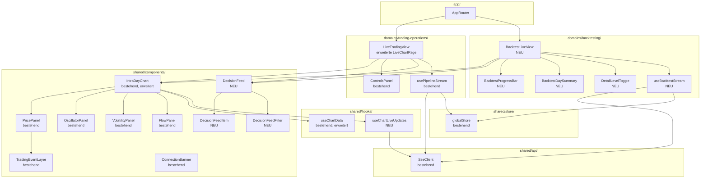
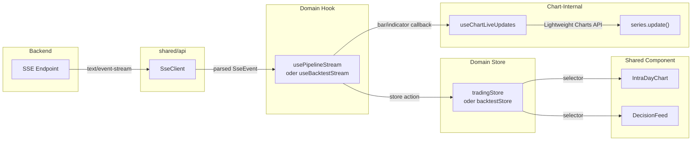

# 12 -- Live-faehige Chart-Komponenten und Backtest-/Trading-Views

> **Quellen:** Concept 10 (Observability, Dashboard-Komponenten), Concept 11 (Live-Datenstreaming, SSE-Infrastruktur, Backtest-Events), Frontend-Guardrail (Projektstruktur, State Management, Kommunikation), bestehende Chart-Infrastruktur (`IntraDayChart`, `useChartData`, `sseClient`, `usePipelineStream`, `tradingStore`, `globalStore`), TradingView Lightweight Charts v4.2.2

---

## 1. Einleitung

### 1.1 Problemstellung

Die Chart-Infrastruktur von ODIN ist weiter entwickelt als die offenen Luecken vermuten lassen. 45 Dateien bilden ein produktionsreifes Multi-Panel-Chart-System mit 16 Indikator-Layern, Client-seitiger Bar-Aggregation, Panel-Synchronisation und Trading-Event-Markern. Gleichzeitig existieren drei kritische Luecken, die das System fuer den Operator unbrauchbar machen:

1. **Frozen Live-Chart:** `LiveChartPage.tsx` uebergibt `mode="live"` an `IntraDayChart`, aber `useChartData` laedt nur einmalig per REST und friert dann ein. Kein SSE-Event aktualisiert die Bars. Der Operator sieht einen statischen Snapshot statt eines lebendigen Charts.

2. **Blinder Backtest:** Waehrend eines Backtest-Laufs (30--90 Minuten) existiert keine Live-Visualisierung. `BacktestChartTab.tsx` zeigt Charts nur fuer abgeschlossene Backtests im `mode="history"`. Der Operator muss warten, bis der gesamte Lauf fertig ist, bevor er beurteilen kann, ob die Strategie sinnvolle Entscheidungen trifft.

3. **Fehlender Decision-Feed:** Weder im Live-Trading noch im Backtest existiert eine chronologische Auflistung der Pipeline-Entscheidungen (LLM-Analysen, Quant-Scores, Gate-Results, Fills). Der Operator sieht Marker im Chart, aber nicht das Reasoning dahinter.

### 1.2 Ziel

Dieses Konzept definiert die Frontend-Architektur fuer:

- **Live-faehige Charts:** `IntraDayChart` empfaengt SSE-Events und aktualisiert Bars, Indikatoren und Trade-Marker inkrementell — sowohl im Live-Trading als auch im Backtest-Live-Modus.
- **Decision-Feed:** Eine chronologische, filterbare Activity-Log-Komponente, die LLM-Analysen, Quant-Scores, Gate-Results und Trade-Events in Echtzeit anzeigt.
- **Backtest-Live-View:** Eine dedizierte View mit Chart, Decision-Feed und Fortschrittsanzeige fuer laufende Backtests.
- **Live-Trading-View:** Die bestehende `LiveChartPage` erweitert um Decision-Feed und korrekte SSE-Verdrahtung.

### 1.3 Bestandsaufnahme: Was existiert bereits

#### Chart-Infrastruktur (45 Dateien, produktionsreif)

| Komponente | Datei / Pfad | Status |
|------------|-------------|--------|
| **IntraDayChart** | `src/shared/components/IntraDayChart/IntraDayChart.tsx` | Produktionsreif. `mode: 'live' \| 'history'` als Discriminated Union. Multi-Panel-Layout: PricePanel (65%), OscillatorPanel (12%), VolatilityPanel (12%), FlowPanel (11%). |
| **PanelSyncController** | `src/shared/components/IntraDayChart/sync/PanelSyncController.ts` | Produktionsreif. Cross-Panel-Zeitskalensynchronisation mit Reentrancy-Guard. |
| **useChartData** | `src/shared/components/IntraDayChart/hooks/useChartData.ts` | REST-only. Laedt 1m-Bars mit 5m-Fallback, Indikatoren, Trade-Events. **Live-SSE-Wiring fehlt.** |
| **LayerToggle** | `src/shared/components/IntraDayChart/toolbar/LayerToggle.tsx` | Produktionsreif. 16 Layer mit Checkboxes und aktuellen Werten. |
| **TimeframeSelector** | `src/shared/components/IntraDayChart/toolbar/TimeframeSelector.tsx` | Produktionsreif. 1m/3m/5m/10m, Client-seitige Aggregation (kein REST-Call). |
| **TradingEventLayer** | `src/shared/components/IntraDayChart/layers/TradingEventLayer.ts` | Produktionsreif. Entry/Exit/Stop-Marker mit `addTradeEvent()`-Methode fuer Live-Updates. **Nicht an SSE verdrahtet.** |
| **resolveChartTokens** | `src/shared/components/IntraDayChart/utils/resolveChartTokens.ts` | Produktionsreif. Dark-Theme-Token-System mit CSS Custom Properties. |
| **barAggregation** | `src/shared/components/IntraDayChart/utils/barAggregation.ts` | Produktionsreif. Client-seitige Aggregation von 1m → 3m/5m/10m. |

#### SSE-Infrastruktur

| Komponente | Datei / Pfad | Status |
|------------|-------------|--------|
| **SseClient** | `src/shared/api/sseClient.ts` (260 Zeilen) | Produktionsreif. EventSource-Wrapper mit Exponential Backoff (10s→20s→40s→60s), Last-Event-ID-Tracking, Reconnect-Logik. |
| **SSE Event Types** | `src/shared/types/sseEvents.ts` | 10 Event-Typen als Discriminated Union: snapshot, market-snapshot, state-change, trade-update, order-update, llm-update, alert, pnl, risk-update, system-health. |
| **usePipelineStream** | `src/domains/trading-operations/hooks/usePipelineStream.ts` (216 Zeilen) | Produktionsreif. Per-Instrument-SSE-Subscription, StrictMode-Handling (100ms Grace), routet Events an tradingStore. |
| **createInstrumentSseClient** | `src/shared/api/sseClient.ts` | Factory fuer `/api/v1/stream/instruments/{instrumentId}`. |
| **createGlobalSseClient** | `src/shared/api/sseClient.ts` | Factory fuer `/api/v1/stream/global`. |

#### State Management (Zustand v5.0.2)

| Store | Datei / Pfad | Inhalt |
|-------|-------------|--------|
| **globalStore** | `src/shared/store/globalStore.ts` | connectionStatus, accountRisk, alerts (max 200, Eviction-Policy), killSwitchActive, pipelines (Map), systemHealth, theme. |
| **tradingStore** | `src/domains/trading-operations/stores/tradingStore.ts` | activeRuns, pipelineSnapshots (Map), trades, decisions, llmHistory, alerts (max 100), livePositionDetails (Map). |

#### Bestehende Seiten

| Seite | Datei / Pfad | Status |
|-------|-------------|--------|
| **LiveChartPage** | `src/domains/trading-operations/pages/LiveChartPage.tsx` | Uebergibt `mode="live"`, verbindet `usePipelineStream` — aber Chart friert nach REST-Load ein. |
| **BacktestChartTab** | `src/domains/backtesting/components/BacktestChartTab.tsx` | History-Modus fuer abgeschlossene Backtests. Kein Live-Modus. |
| **ControlsPanel** | `src/domains/trading-operations/components/ControlsPanel.tsx` | Kill-Switch, Pause/Resume, Safe-Mode — vollstaendig implementiert. |
| **ConnectionBanner** | `src/shared/components/ConnectionBanner.tsx` | Zeigt SSE-Verbindungsstatus an. |

### 1.4 Die Luecken im Detail

| # | Luecke | Auswirkung |
|---|--------|------------|
| G1 | `useChartData` hat keinen SSE-Pfad fuer Live-Modus | Chart zeigt statischen REST-Snapshot, keine Live-Updates |
| G2 | Keine Bar-Append-Logik auf `market-snapshot`-Events | Neue Bars werden nicht gerendert |
| G3 | Keine inkrementellen Indikator-Updates | Overlay-Serien (EMA, Bollinger, RSI) bleiben auf initialem Stand |
| G4 | `TradingEventLayer.addTradeEvent()` nicht an SSE verdrahtet | Trade-Marker erscheinen nicht in Echtzeit |
| G5 | Kein Backtest-Live-View mit SSE-Stream | 30--90 Minuten Blindflug waehrend Backtest |
| G6 | Kein Decision-Feed / Activity-Log | Kein Einblick in LLM-Reasoning, Quant-Scores, Gate-Results |
| G7 | Keine Fortschrittsanzeige auf Bar-Ebene im Backtest | Nur Day-Level-Progress sichtbar |
| G8 | Keine Reconnect-aware Chart-State-Recovery | Nach SSE-Reconnect bleibt Chart auf altem Stand |

### 1.5 Abhaengigkeit: ODIN-101 (Concept 11)

Dieses Konzept setzt die Backend-Streaming-Infrastruktur aus [Concept 11 — Live-Datenstreaming](11-live-data-streaming.md) voraus:

- **3 SSE-Endpoints:** `/api/v1/stream/pipeline/{instrumentId}`, `/api/v1/stream/global`, `/api/v1/stream/backtests/{backtestId}`
- **Detail-Level:** `progress | trading | full` (Query-Parameter am Backtest-Endpoint)
- **4 neue Backtest-Events:** `backtest-bar-progress`, `backtest-day-summary`, `backtest-quant-score`, `backtest-gate-result`
- **Throttling:** Wall-Clock- oder SimTime-basiert, konfigurierbar (Default: Wall-Clock)
- **Stream-Gap-Signalisierung:** `stream-gap`-Control-Event bei Ring-Buffer-Overflow
- **Coalescing:** Latest-Value-Cache fuer Snapshot-Events
- **Flush-on-Pause:** Pending gethrottlete Werte werden bei Tagesabschluss geflusht

---

## 2. Wireframes / View-Layouts

Alle Layouts sind desktop-only (kein Mobile-Support, Frontend-Guardrail §8). Der Operator arbeitet typischerweise mit 2560x1440 oder groesseren Monitoren.

### 2.1 Live-Trading-View

```
+-----------------------------------------------------------------------------------+
| Header: Instrument | Price | State-Badge | Connection-Status         [Controls]   |
+----------+------------------------------------------------------------------------+
|          |                                                                        |
| Controls |                        IntraDayChart                                   |
| Panel    |                     (mode="live")                                      |
|          |   +------------------------------------------------------------+       |
| Kill-    |   |  PricePanel (65%)  — Candles, VWAP, EMA, Bollinger        |       |
| Switch   |   |                    + TradingEventLayer (Entry/Exit/Stop)   |       |
|          |   +------------------------------------------------------------+       |
| Pause/   |   |  OscillatorPanel (12%) — RSI, ADX, DMI                    |       |
| Resume   |   +------------------------------------------------------------+       |
|          |   |  VolatilityPanel (12%) — ATR, ATR-Decay                    |       |
| Safe-    |   +------------------------------------------------------------+       |
| Mode     |   [Toolbar: LayerToggle | TimeframeSelector | ZoomControls]    |       |
|          |                                                                        |
|  ~120px  +------------------------------------------------------------------------+
|          |                                                                        |
|          |                    DecisionFeed (Activity-Log)                          |
|          |   [Filter: All | LLM | Quant | Gate | Order | Alert]                   |
|          |   +------------------------------------------------------------+       |
|          |   | 15:32  LLM  ALLOW_ENTRY  conf=0.82  "Breakout above..."   |       |
|          |   | 15:32  GATE PASS  R/R=2.8  size=100  stop=176.20          |       |
|          |   | 15:32  FILL ENTRY  AAPL  100 @ 178.50  Setup-A            |       |
|          |   | 15:30  QUANT score=0.78 intent=ALLOW  A_EMA_ALIGNED       |       |
|          |   | 15:27  LLM  VETO_ENTRY  conf=0.35  "Choppy range..."     |       |
|          |   +------------------------------------------------------------+       |
|          |                                                        ~250px height   |
+----------+------------------------------------------------------------------------+
```

**Proportionen:**
- ControlsPanel: feste Breite ~120px links
- IntraDayChart: ~65% der verbleibenden Hoehe
- DecisionFeed: ~35% der verbleibenden Hoehe (min 200px, scrollbar)
- Toolbar: innerhalb des Chart-Bereichs (bestehend)

### 2.2 Backtest-Live-View

```
+-----------------------------------------------------------------------------------+
| Header: Backtest-ID | Instrument | SimDate | Status-Badge   [Detail-Level-Toggle] |
+-----------------------------------------------------------------------------------+
| ProgressBar: ████████████████░░░░░░░░ Tag 47/120 | Bar 195/390 | ETA: ~42 min    |
| Day-Summary: P&L +185.40 | Cum. +1436.20 | Trades: 2 | WinRate: 62.5%            |
+-----------------------------------------------------------------------------------+
|                                                                                    |
|                        IntraDayChart                                               |
|                     (mode="backtest-live")                                         |
|   +------------------------------------------------------------------------+      |
|   |  PricePanel (65%)  — Candles + Indicators + TradingEventLayer          |      |
|   +------------------------------------------------------------------------+      |
|   |  OscillatorPanel (12%) — RSI, ADX                                      |      |
|   +------------------------------------------------------------------------+      |
|   |  VolatilityPanel (12%) — ATR, ATR-Decay                                |      |
|   +------------------------------------------------------------------------+      |
|   [Toolbar: LayerToggle | TimeframeSelector | ZoomControls]                |      |
|                                                                          ~55%     |
+-----------------------------------------------------------------------------------+
|                                                                                    |
|                    DecisionFeed (Activity-Log)                                     |
|   [Filter: All | LLM | Quant | Gate | Order | Alert]                              |
|   +------------------------------------------------------------------------+      |
|   | 14:30  QUANT  score=0.78  ALLOW_ENTRY  Setup-A  [A_EMA_ALIGNED, ...]  |      |
|   | 14:30  LLM    ALLOW_ENTRY  conf=0.82  "Strong breakout..."            |      |
|   | 14:30  GATE   PASS  R/R=2.8  size=100  stop=176.20                    |      |
|   | 14:30  FILL   ENTRY  AAPL 100 @ 178.50                                |      |
|   | 14:27  QUANT  score=0.32  NO_ACTION  [A_RSI_OVERHEAT]                 |      |
|   +------------------------------------------------------------------------+      |
|                                                                          ~35%     |
+-----------------------------------------------------------------------------------+
```

**Proportionen:**
- ProgressBar + Day-Summary: feste Hoehe ~80px
- IntraDayChart: ~55% der verbleibenden Hoehe
- DecisionFeed: ~35% der verbleibenden Hoehe
- Kein ControlsPanel links (Backtest hat keine Live-Trading-Controls)

### 2.3 Gemeinsamkeiten und Unterschiede

| Aspekt | Live-Trading-View | Backtest-Live-View |
|--------|-------------------|-------------------|
| **IntraDayChart** | Identisch (gleiche Komponente) | Identisch (gleiche Komponente) |
| **DecisionFeed** | Identisch (gleiche Komponente) | Identisch (gleiche Komponente) |
| **ControlsPanel** | Ja (links, Kill-Switch/Pause/Resume) | Nein (kein Trading-Control noetig) |
| **ProgressBar** | Nein | Ja (Bar-Level + Day-Level) |
| **Day-Summary** | Nein | Ja (kompakte P&L pro Tag) |
| **Detail-Level-Toggle** | Nein | Ja (progress/trading/full) |
| **SSE-Quelle** | `usePipelineStream` (Instrument-Stream) | `useBacktestStream` (Backtest-Stream) |
| **Chart-Modus** | `mode="live"` | `mode="backtest-live"` |
| **Zeitverhalten** | Echtzeit (1 Bar/Minute) | Zeitraffer (hunderte Bars/Sekunde, gedrosselt) |

---

## 3. Komponentenarchitektur

### 3.1 React-Komponentenbaum



### 3.2 Neue Komponenten

| Komponente | Pfad | Typ | Beschreibung |
|------------|------|-----|--------------|
| `BacktestLiveView` | `src/domains/backtesting/pages/BacktestLiveView.tsx` | Page | Container-Seite fuer laufende Backtests mit Chart + Feed + Progress |
| `BacktestProgressBar` | `src/domains/backtesting/components/BacktestProgressBar.tsx` | Component | Bar-Level- und Day-Level-Fortschrittsanzeige |
| `BacktestDaySummary` | `src/domains/backtesting/components/BacktestDaySummary.tsx` | Component | Kompakte P&L-Zusammenfassung pro abgeschlossenem Tag |
| `DetailLevelToggle` | `src/domains/backtesting/components/DetailLevelToggle.tsx` | Component | Toggle zwischen `progress`, `trading`, `full` |
| `useBacktestStream` | `src/domains/backtesting/hooks/useBacktestStream.ts` | Hook | SSE-Subscription fuer Backtest-Stream mit Detail-Level |
| `DecisionFeed` | `src/shared/components/DecisionFeed/DecisionFeed.tsx` | Component | Chronologisches Activity-Log (shared, da Backtest + Trading nutzen) |
| `DecisionFeedItem` | `src/shared/components/DecisionFeed/DecisionFeedItem.tsx` | Component | Einzelner Eintrag im Feed mit aufklappbarer Detail-Ansicht |
| `DecisionFeedFilter` | `src/shared/components/DecisionFeed/DecisionFeedFilter.tsx` | Component | Kategorie-/Instrument-/Zeitfilter |
| `useChartLiveUpdates` | `src/shared/components/IntraDayChart/hooks/useChartLiveUpdates.ts` | Hook | Empfaengt SSE-Events und fuehrt inkrementelle Chart-Updates durch |

### 3.3 Erweiterungen bestehender Komponenten

| Komponente | Aenderung |
|------------|-----------|
| `IntraDayChart` | Neuer `mode`-Wert `'backtest-live'`. Neuer optionaler Prop `onDecisionEvent` Callback. Integration von `useChartLiveUpdates`. |
| `useChartData` | Erweiterung: im `live`- und `backtest-live`-Modus wird nach dem initialen REST-Load ein SSE-Update-Kanal geoeffnet. Neue Methoden `appendBar()`, `updateLastBar()`, `appendIndicator()`. |
| `LiveChartPage` (→ `LiveTradingView`) | Umbau: Layout mit ControlsPanel links, DecisionFeed unten. SSE-Feed fuer Decision-Events. |
| `sseClient.ts` | Neue Factory-Funktion `createBacktestSseClient(backtestId, detailLevel, onEvent)`. Neue SSE-Event-Types fuer Backtest-Events. |
| `sseEvents.ts` | 4 neue Event-Typen: `backtest-bar-progress`, `backtest-day-summary`, `backtest-quant-score`, `backtest-gate-result`. Erweiterung der `SseEvent`-Discriminated-Union. |

### 3.4 Props und State pro Komponente

#### DecisionFeed

```typescript
interface DecisionFeedProps {
  /** Events to display. Ordered newest-first. */
  readonly events: ReadonlyArray<DecisionFeedEvent>;
  /** Currently active category filter. */
  readonly activeFilter: DecisionCategory | 'all';
  /** Callback when filter changes. */
  readonly onFilterChange: (filter: DecisionCategory | 'all') => void;
  /** Optional instrument filter (for multi-instrument views). */
  readonly instrumentFilter?: string;
  /** CSS class override. */
  readonly className?: string;
}

type DecisionCategory = 'llm' | 'quant' | 'gate' | 'order' | 'alert';

interface DecisionFeedEvent {
  readonly id: string;
  readonly category: DecisionCategory;
  readonly timestamp: string;
  readonly instrumentId: string;
  readonly summary: string;
  readonly detail: Record<string, unknown>;
}
```

#### BacktestProgressBar

```typescript
interface BacktestProgressBarProps {
  readonly completedDays: number;
  readonly totalDays: number;
  readonly completedBars: number;
  readonly totalBars: number;
  readonly currentDate: string;
  readonly estimatedRemainingMs: number | null;
}
```

#### BacktestDaySummary

```typescript
interface BacktestDaySummaryProps {
  readonly tradingDate: string;
  readonly dayPnl: number;
  readonly cumulativePnl: number;
  readonly totalTrades: number;
  readonly winRate: number;
  readonly maxDrawdown: number;
}
```

### 3.5 Feature-Isolation und Kommunikation

Gemaess Frontend-Guardrail §2 sind Feature→Feature-Imports verboten. Die Kommunikation erfolgt ausschliesslich ueber den Shared-Layer:

```
domains/backtesting/ ---imports--→ shared/components/DecisionFeed/
domains/backtesting/ ---imports--→ shared/components/IntraDayChart/
domains/trading-operations/ ---imports--→ shared/components/DecisionFeed/
domains/trading-operations/ ---imports--→ shared/components/IntraDayChart/
```

**DecisionFeed** liegt in `shared/components/` weil sowohl `BacktestLiveView` als auch `LiveTradingView` es verwenden. Die Datenprovisionierung (welche Events im Feed landen) obliegt dem jeweiligen Domain-Hook (`useBacktestStream` bzw. `usePipelineStream`). Der Feed selbst ist eine reine Darstellungskomponente.

**Shared-Hooks als Kommunikationskanal:** `useChartLiveUpdates` ist der zentrale Bridge-Hook zwischen SSE-Events und dem Chart. Er wird innerhalb von `IntraDayChart` aufgerufen und empfaengt Events ueber eine Callback-Prop, die der jeweilige Domain-Container (`BacktestLiveView` oder `LiveTradingView`) verdrahtet.

---

## 4. State-Management-Konzept

### 4.1 Datenfluss: SSE-Event → Store → UI-Update



**Zwei Update-Pfade:** SSE-Events werden in zwei Kanaele aufgeteilt:

1. **Store-Pfad (deklarativ):** Zustandsaenderungen (Pipeline-State, Position, P&L, Alerts) gehen in Zustand-Stores. React-Komponenten lesen per Selector und re-rendern automatisch.
2. **Chart-Pfad (imperativ):** Bar- und Indikator-Updates werden direkt an die Lightweight Charts API weitergegeben (`series.update()`). Kein Store-Zwischenschritt fuer hochfrequente Daten — das wuerde unnoetige React-Re-Renders ausloesen.

### 4.2 Store-Architektur

| Store | Verantwortung | Neue Felder |
|-------|---------------|-------------|
| `globalStore` (bestehend) | connectionStatus, killSwitch, systemHealth | Keine Aenderung |
| `tradingStore` (bestehend) | pipelineSnapshots, trades, livePositionDetails | `decisionEvents: DecisionFeedEvent[]` (neu, max 500) |
| `backtestLiveStore` (NEU) | Backtest-spezifischer Live-State | Siehe unten |

#### Neuer Store: backtestLiveStore

```typescript
interface BacktestLiveState {
  // Progress
  readonly completedDays: number;
  readonly totalDays: number;
  readonly completedBars: number;
  readonly totalBars: number;
  readonly currentDate: string;

  // Day Summary (letzter abgeschlossener Tag)
  readonly lastDaySummary: BacktestDaySummaryData | null;
  // Kumulierte Summaries (max. 500 Tage)
  readonly daySummaries: ReadonlyArray<BacktestDaySummaryData>;

  // Decision Feed Events (max 1000, sliding window)
  readonly decisionEvents: ReadonlyArray<DecisionFeedEvent>;

  // Detail Level
  readonly detailLevel: 'progress' | 'trading' | 'full';

  // Backtest Status
  readonly backtestStatus: 'running' | 'paused' | 'completed' | 'failed' | 'cancelled';

  // Actions
  updateProgress: (progress: BacktestBarProgressPayload) => void;
  addDaySummary: (summary: BacktestDaySummaryPayload) => void;
  addDecisionEvent: (event: DecisionFeedEvent) => void;
  setDetailLevel: (level: 'progress' | 'trading' | 'full') => void;
  setBacktestStatus: (status: BacktestLiveState['backtestStatus']) => void;
  reset: () => void;
}
```

**Platzierung:** `src/domains/backtesting/stores/backtestLiveStore.ts` — Domain-lokal, da nur von Backtest-Komponenten genutzt.

### 4.3 Neuer Hook: useBacktestStream

```typescript
/**
 * SSE-Subscription fuer einen laufenden Backtest.
 * Verbindet den Backtest-SSE-Endpoint mit backtestLiveStore
 * und leitet Chart-relevante Events an den onChartEvent-Callback weiter.
 */
function useBacktestStream(
  backtestId: string | undefined,
  detailLevel: 'progress' | 'trading' | 'full',
  onChartEvent?: (event: BacktestChartEvent) => void,
): void;
```

**Event-Routing im Hook:**

| SSE Event-Typ | Ziel |
|---------------|------|
| `backtest-bar-progress` | `backtestLiveStore.updateProgress()` |
| `backtest-day-summary` | `backtestLiveStore.addDaySummary()` |
| `pipeline-state` | `backtestLiveStore.addDecisionEvent()` (als State-Change) |
| `indicator-update` | `onChartEvent` Callback (fuer Chart-Update) |
| `trade-executed` | `backtestLiveStore.addDecisionEvent()` + `onChartEvent` |
| `llm-analysis` | `backtestLiveStore.addDecisionEvent()` |
| `backtest-quant-score` | `backtestLiveStore.addDecisionEvent()` |
| `backtest-gate-result` | `backtestLiveStore.addDecisionEvent()` |
| `completed` / `failed` / `cancelled` | `backtestLiveStore.setBacktestStatus()` |

### 4.4 Erweiterung useChartData fuer Live-Modus

Der bestehende `useChartData`-Hook wird um einen imperativen Update-Kanal erweitert:

```typescript
export interface UseChartDataResult {
  // Bestehend:
  readonly data: ChartDayData | null;
  readonly loadingState: ChartDataLoadingState;
  readonly error: string | null;
  readonly reload: () => void;

  // NEU: Imperative Update-Methoden fuer Live-Modus
  readonly appendBar: (bar: OhlcvBar) => void;
  readonly updateLastBar: (bar: OhlcvBar) => void;
  readonly appendIndicator: (indicator: IndicatorSnapshot) => void;
  readonly appendTradeEvent: (event: ChartTradeEvent) => void;
}
```

**Semantik:**
- `appendBar()`: Fuegt einen neuen abgeschlossenen Bar hinzu (der vorherige "aktive" Bar ist jetzt finalisiert).
- `updateLastBar()`: Aktualisiert den letzten (aktiven) Bar mit neuen OHLCV-Daten.
- `appendIndicator()`: Fuegt einen Indikator-Snapshot fuer den neuen Bar hinzu.
- `appendTradeEvent()`: Fuegt einen Trade-Marker hinzu und leitet an `TradingEventLayer.addTradeEvent()` weiter.

**Initialer REST-Load bleibt:** Auch im Live-Modus werden die historischen Bars des aktuellen Tages per REST geladen (GET `/api/v1/charts/{symbol}/bars`). Anschliessend uebernimmt der SSE-Stream die inkrementellen Updates.

### 4.5 Memory-Windowing-Strategie

Wie in Concept 11, Abschnitt 10.5 gefordert, MUSS das Frontend Memory Windowing implementieren:

| Datentyp | Max. Elemente | Eviction-Policy | Begruendung |
|----------|---------------|-----------------|-------------|
| **Chart-Bars** | 10.000 | Kein Eviction (1 Tag = max. 390 1m-Bars) | Lightweight Charts verarbeitet 10.000+ Bars performant |
| **Indikator-Snapshots** | 10.000 | Gleich wie Bars | 1:1-Zuordnung zu Bars |
| **DecisionFeed-Events** | 1.000 | Oldest-first drop | Bei langen Backtests wuerde unbegrenzter Feed den Speicher fuellen |
| **Day-Summaries** | 500 | Oldest-first drop | Max. 500 Handelstage (> 2 Jahre) |
| **Trade-Events (Chart)** | 5.000 | Kein Eviction erwartet | Selbst bei 50 Trades/Tag ueber 100 Tage = 5.000 |

**Backtest-spezifisch:** Bei Tageswechsel im Backtest wird der Chart-Inhalt zurueckgesetzt (neuer Tag = neue Bars). Die DecisionFeed-Events akkumulieren ueber den gesamten Backtest.

### 4.6 Konsistenz bei Mid-Stream-Connect

Wenn ein Client sich mitten in einem laufenden Backtest verbindet (Late-Join):

1. **REST-Bootstrap:** Chart-Bars des aktuellen simulierten Tages per REST laden (sofern vorhanden).
2. **SSE-Replay:** `Last-Event-ID: 0` sendet den Ring-Buffer-Inhalt (bis zu 5.000 Events).
3. **Luecken-Handling:** Falls `stream-gap` empfangen wird → REST-Refresh ausloesen (siehe Abschnitt 9).
4. **Zustandskonvergenz:** Durch Coalescing (Concept 11, §6.4) konvergiert die UI nach 1--2 Coalescing-Zyklen (~200ms) zum aktuellen Stand.

---

## 5. Chart-Update-Strategie

### 5.1 Inkrementelles Append vs. Re-Render

TradingView Lightweight Charts bietet zwei Update-Methoden:

- `series.update(bar)` — Aktualisiert den letzten Datenpunkt ODER haengt einen neuen an (je nachdem ob `bar.time` dem letzten Datenpunkt entspricht oder neuer ist).
- `series.setData(bars)` — Setzt den gesamten Datensatz. Teuer, nur fuer initiales Laden.

**Strategie:** Nach dem initialen `setData()` (REST-Load) werden ausschliesslich `series.update()` Aufrufe verwendet. Kein Re-Render des gesamten Charts.

### 5.2 Bar-Update-Logik

```
SSE market-snapshot Event empfangen:
  ├── Event enthält price + volume + timestamp
  ├── timestamp → Bar-Zeitslot berechnen (auf 1m-Grenze gerundet)
  │
  ├── Falls Bar-Zeitslot == letzter bekannter Bar:
  │     → Aktiven Bar aktualisieren:
  │       high = max(high, price)
  │       low  = min(low, price)
  │       close = price
  │       volume += inkrementelles Volume
  │     → candlestickSeries.update(updatedBar)
  │     → volumeSeries.update(updatedVolumeBar)
  │
  └── Falls Bar-Zeitslot > letzter bekannter Bar:
        → Vorherigen Bar als abgeschlossen markieren
        → Neuen Bar eroeffnen: open=price, high=price, low=price, close=price
        → candlestickSeries.update(newBar)
        → volumeSeries.update(newVolumeBar)
```

**Fuer indicator-update Events (Backtest-Modus):** Im Backtest-Stream liefert `indicator-update` bereits die vollstaendigen OHLCV-Daten pro Bar plus alle Indikatorwerte. Der Chart kann direkt den abgeschlossenen Bar und die Indikatoren appenden.

### 5.3 Indikator-Update-Strategie

Overlay-Serien (EMA, VWAP, Bollinger, etc.) werden parallel zu den Bars aktualisiert:

| Indikator-Serie | Update-Trigger | Methode |
|-----------------|----------------|---------|
| EMA(9/21/50/100) | `indicator-update` Event | `emaSeries.update({ time, value: ema_value })` |
| VWAP | `indicator-update` Event | `vwapSeries.update({ time, value: vwap })` |
| Bollinger (Upper/Mid/Lower) | `indicator-update` Event | Drei `series.update()` Aufrufe |
| RSI(14) | `indicator-update` Event | `rsiSeries.update({ time, value: rsi14 })` |
| ADX(14) / DMI | `indicator-update` Event | `adxSeries.update()` + `plusDiSeries.update()` + `minusDiSeries.update()` |
| ATR(14) / ATR-Decay | `indicator-update` Event | `atrSeries.update()` + `atrDecaySeries.update()` |
| Volume-Ratio | `indicator-update` Event | `volumeRatioSeries.update()` |

**Wichtig:** Indikator-Updates verwenden denselben `time`-Wert wie der zugehoerige Bar. Bei aktivem (nicht abgeschlossenem) Bar im Live-Trading werden Indikatoren NICHT aktualisiert — sie sind nur fuer abgeschlossene Bars definiert. Im Backtest-Stream sind Indikatoren per Definition an abgeschlossene Bars gebunden.

### 5.4 Multi-Timeframe-Aggregation bei Live-Updates

`useChartData` aggregiert 1m-Bars client-seitig auf die gewaehlte Timeframe (3m/5m/10m) via `aggregateBars()`. Bei Live-Updates muss diese Aggregation inkrementell erfolgen:

1. Neuer 1m-Bar wird empfangen.
2. Falls die aktuelle Aggregationsgruppe noch nicht voll ist (z.B. bei 5m: weniger als 5 Einminueter), wird der aggregierte Bar aktualisiert (open des ersten, max high, min low, close des letzten).
3. Falls die Gruppe voll ist, wird der aggregierte Bar finalisiert und ein neuer begonnen.

**Implementierung:** `useChartLiveUpdates` haelt einen `pendingAggregationBuffer` fuer die aktuelle Teil-Gruppe. Der Buffer wird bei jedem neuen 1m-Bar ausgewertet.

### 5.5 Performance-Betrachtung

TradingView Lightweight Charts ist canvas-basiert und verarbeitet 10.000+ Datenpunkte performant. Einzelne `series.update()` Aufrufe sind O(1) — kein Batching noetig.

**Im Backtest-Zeitraffer jedoch:** Der Backend-Stream kann (nach Throttling) ~15--47 Events/Sekunde liefern (Concept 11, §3.4). Bei jedem Event mehrere `series.update()` Aufrufe (Candle + Volume + N Indikatoren) auszufuehren ist problemlos — aber der React-Render-Cycle darf nicht pro Event getriggert werden.

**Loesung: requestAnimationFrame-Batching:**

```typescript
// In useChartLiveUpdates:
const pendingUpdatesRef = useRef<ChartUpdate[]>([]);

function enqueueUpdate(update: ChartUpdate): void {
  pendingUpdatesRef.current.push(update);

  if (pendingUpdatesRef.current.length === 1) {
    requestAnimationFrame(() => {
      const batch = pendingUpdatesRef.current;
      pendingUpdatesRef.current = [];
      for (const item of batch) {
        applyChartUpdate(item); // series.update() calls
      }
    });
  }
}
```

Dadurch werden alle Updates innerhalb eines Animation-Frames gebuendelt und in einem einzigen Render-Pass angewendet. Bei 47 Events/Sekunde und 60 FPS ergibt das ~0.8 Events pro Frame — also fast immer einzelne Updates, aber bei Bursts korrektes Batching.

### 5.6 Trade-Marker-Live-Update

Die bestehende `TradingEventLayer` hat eine `addTradeEvent(event: ChartTradeEvent)` Methode. Diese wird an den SSE-Stream verdrahtet:

| SSE Event | Chart-Marker |
|-----------|-------------|
| `trade-executed` (side=BUY) | ENTRY-Marker (gruener Pfeil aufwaerts) |
| `trade-executed` (side=SELL, reason=EXIT_*) | EXIT-Marker (roter Pfeil abwaerts) |
| `trade-executed` (side=SELL, reason=STOP_*) | STOP-Marker (orangener Pfeil abwaerts) |
| `position-update` (mit neuem trailLevel) | Stop-Level-Linie Update |

**Mapping:** Der `useChartLiveUpdates`-Hook konvertiert `trade-executed`-Events in `ChartTradeEvent`-Objekte und ruft `addTradeEvent()` auf.

---

## 6. Decision-Feed / Activity-Log

### 6.1 Datenmodell

Der DecisionFeed zeigt folgende Event-Kategorien an:

| Kategorie | SSE Event-Quellen | Farb-Token | Symbol |
|-----------|-------------------|------------|--------|
| **LLM** | `llm-analysis` | `--color-feed-llm` (blau, `#60A5FA`) | Gehirn-Icon |
| **Quant** | `backtest-quant-score`, `indicator-update` (wenn Score enthalten) | `--color-feed-quant` (gruen, `#34D399`) | Chart-Icon |
| **Gate** | `backtest-gate-result` | `--color-feed-gate` (gelb, `#FBBF24`) | Schild-Icon |
| **Order** | `trade-executed`, `position-update` | `--color-feed-order` (orange, `#FB923C`) | Pfeil-Icon |
| **Alert** | `alert`, `degradation-change` | `--color-feed-alert` (rot, `#F87171`) | Warndreick-Icon |

### 6.2 UI-Komponente

```
DecisionFeed
├── DecisionFeedFilter (Kategorie-Buttons: All | LLM | Quant | Gate | Order | Alert)
└── ScrollContainer (overflow-y: auto, chronologisch absteigend)
    ├── DecisionFeedItem (neuestes oben)
    │   ├── Zeitstempel (HH:mm:ss)
    │   ├── Kategorie-Badge (farbcodiert)
    │   ├── Summary-Text (einzeilig)
    │   └── [Aufklappbar] Detail-Panel
    │       ├── Vollstaendige Daten (JSON-formatiert)
    │       ├── Reasoning (bei LLM)
    │       └── Score-Breakdown (bei Quant)
    ├── DecisionFeedItem
    └── ...
```

**Aufklappbare Detail-Ansicht:** Jedes `DecisionFeedItem` kann per Click aufgeklappt werden, um die vollstaendigen Event-Daten zu zeigen. Dies ist essentiell fuer das Debugging — der Operator sieht nicht nur "LLM: ALLOW_ENTRY", sondern auch das vollstaendige Reasoning, die ReasonCodes und die Confidence-Scores.

### 6.3 Filter

| Filter | Typ | Default |
|--------|-----|---------|
| Kategorie | Toggle-Buttons (multi-select) | Alle aktiv |
| Instrument | Dropdown (nur in Multi-Instrument-Views) | Alle |
| Zeitraum | Automatisch (aktuelle Session) | Kein expliziter Filter |

### 6.4 Shared-Platzierung

`DecisionFeed`, `DecisionFeedItem` und `DecisionFeedFilter` liegen in `src/shared/components/DecisionFeed/`. Dies ist zwingend, da sowohl `domains/backtesting/` als auch `domains/trading-operations/` die Komponenten importieren. Feature→Feature-Imports sind verboten (Frontend-Guardrail §2).

### 6.5 Memory-Limit

Der DecisionFeed haelt maximal **1.000 Events** im Speicher (Konfiguration via Konstante). Bei Ueberschreitung werden die aeltesten Events entfernt (FIFO). Der Operator sieht immer die neuesten 1.000 Events.

**Begruendung:** Bei `full`-Detail-Level im Backtest koennen ~84.000 Events ueber den gesamten Lauf entstehen. Davon sind ~15.600 Quant-Scores und ~15.600 Gate-Results — das wuerde ohne Memory-Limit den Browser-Speicher fuellen. 1.000 Events im Feed sind ~2--3 simulierte Tage bei voller Detailtiefe — ausreichend fuer die Live-Analyse.

---

## 7. Fortschrittsanzeige (Backtest-Modus)

### 7.1 BacktestProgressBar

Die Fortschrittsanzeige besteht aus zwei Ebenen:

1. **Day-Level-Progress:** Balken ueber die gesamte Breite. Faerbt sich von links nach rechts mit jedem abgeschlossenen Tag.
2. **Bar-Level-Progress (innerhalb des aktuellen Tages):** Sekundaerer, schmalerer Balken unterhalb des Day-Balkens.

```
Day Progress:  ████████████████████░░░░░░░░░░  Tag 47 / 120 (39.2%)
Bar Progress:  ████████████░░░░░░░░░░░░░░░░░░  Bar 195 / 390 (50.0%)
                                                ETA: ~42 min
```

**Datenquellen:**
- `backtest-bar-progress` Event → `completedBars`, `totalBars`, `completedDays`, `totalDays`
- ETA-Berechnung: `remainingDays * avgSecondsPerDay` (fortlaufend berechnet aus bisheriger Dauer)

### 7.2 BacktestDaySummary

Nach jedem `backtest-day-summary` Event wird eine kompakte Zusammenfassung angezeigt:

```
2025-01-15: P&L +185.40 | Kumulativ +1436.20 | 2 Trades | WinRate 62.5% | MaxDD -312.50
```

Die Summary wird inline unter der ProgressBar angezeigt und bei jedem neuen `backtest-day-summary` Event aktualisiert. Die vorherige Summary wird ueberschrieben (nicht akkumuliert in der Progress-Zeile — die Historie liegt im DecisionFeed).

### 7.3 Integration mit ODIN-101 Events

| Backend-Event | Frontend-Aktion |
|---------------|-----------------|
| `backtest-bar-progress` | `backtestLiveStore.updateProgress()` → ProgressBar re-render |
| `backtest-day-summary` | `backtestLiveStore.addDaySummary()` → DaySummary re-render + DecisionFeed-Eintrag |
| `progress` (Day-Level, bestehend) | Fallback fuer `progress`-only Detail-Level |
| `completed` | Status → "Completed", ProgressBar → 100%, Link zu Ergebnis-Seite |
| `failed` | Status → "Failed", Error-Banner anzeigen |
| `cancelled` | Status → "Cancelled", Info-Banner anzeigen |

---

## 8. User-Control-Matrix

### 8.1 Aktionsmatrix

| Aktion | Backtest Running | Backtest Paused | Backtest Completed | Live Trading | Idle |
|--------|-----------------|-----------------|-------------------|-------------|------|
| **Kill-Switch** | -- | -- | -- | Aktiv | -- |
| **Pause Pipeline** | -- | -- | -- | Aktiv | -- |
| **Resume Pipeline** | -- | -- | -- | Aktiv (wenn paused) | -- |
| **Safe-Mode Toggle** | -- | -- | -- | Aktiv | -- |
| **Cancel Backtest** | Aktiv | Aktiv | -- | -- | -- |
| **Detail-Level wechseln** | Aktiv | Aktiv | -- | -- | -- |
| **Start Backtest** | -- | -- | Aktiv | -- | Aktiv |
| **Chart Timeframe wechseln** | Aktiv | Aktiv | Aktiv | Aktiv | -- |
| **Layer Toggle** | Aktiv | Aktiv | Aktiv | Aktiv | -- |
| **DecisionFeed Filter** | Aktiv | Aktiv | Aktiv | Aktiv | -- |
| **Feed-Item aufklappen** | Aktiv | Aktiv | Aktiv | Aktiv | -- |

### 8.2 Integration mit bestehendem ControlsPanel

Das bestehende `ControlsPanel` (`src/domains/trading-operations/components/ControlsPanel.tsx`) bleibt unveraendert fuer die Live-Trading-View. Es wird NICHT in der Backtest-Live-View verwendet — Backtest-Controls (Cancel, Detail-Level) sind in eigenen Komponenten innerhalb `domains/backtesting/`.

**Backtest-spezifische Controls:**

| Control | Komponente | REST-Endpoint |
|---------|-----------|---------------|
| Cancel Backtest | `BacktestCancelButton` (bestehend in Backtest-Domain) | `POST /api/v1/backtests/{id}/cancel` |
| Detail-Level wechseln | `DetailLevelToggle` (NEU) | Kein Backend-Call — SSE-Client reconnected mit neuem `detail`-Parameter |

**Detail-Level-Wechsel zur Laufzeit:** Wenn der Operator den Detail-Level wechselt (z.B. von `trading` auf `full`), wird der aktuelle SSE-Client disconnected und ein neuer mit dem neuen `detail`-Query-Parameter erstellt. Der Ring Buffer auf dem Server bleibt erhalten — Events seit dem letzten `Last-Event-ID` werden replayed.

---

## 9. Reconnect- und Catch-up-Strategie

### 9.1 Bestehender SSE-Reconnect

Der `SseClient` (`src/shared/api/sseClient.ts`) implementiert bereits Exponential Backoff:

- Initiales Intervall: 10.000ms
- Multiplikator: 2x
- Maximum: 60.000ms
- Last-Event-ID wird bei Reconnect mitgesendet

### 9.2 Chart-State nach Reconnect

Nach einem erfolgreichen SSE-Reconnect muss der Chart-State konsistent sein:

```
Reconnect erkannt (SSE onopen nach onerror):
  ├── REST-Refresh: Bars + Indikatoren des aktuellen Tages neu laden
  │     GET /api/v1/charts/{symbol}/bars?tradingDate={today}&interval=ONE_MINUTE
  │     GET /api/v1/charts/{symbol}/indicators?tradingDate={today}&runId={runId}
  ├── Chart: setData() mit frischen REST-Daten (vollstaendiger Reset)
  └── SSE-Resume: Neue Events werden wieder inkrementell appliziert
```

**Begruendung fuer REST-Refresh:** Waehrend der Disconnect-Phase koennen Bars verpasst worden sein. Der Ring Buffer hat eine begrenzte Kapazitaet (500 Events Live, 5.000 Backtest). Statt zu versuchen, verpasste Events zu rekonstruieren, ist ein vollstaendiger REST-Refresh einfacher und zuverlaessiger.

### 9.3 Stream-Gap-Handling

Wenn der Server ein `stream-gap`-Event sendet (Concept 11, §7.5):

```json
{ "type": "stream-gap", "from": 4218, "to": 4899, "reason": "overflow" }
```

Reagiert der Client wie folgt:

1. **Chart:** REST-Refresh ausloesen (wie bei Reconnect).
2. **DecisionFeed:** Events zwischen `from` und `to` sind verloren. Ein visueller Hinweis wird angezeigt: `"--- Luecke: ~680 Events verpasst (Ring-Buffer-Overflow) ---"`.
3. **ProgressBar:** Der naechste `backtest-bar-progress`-Event liefert den aktuellen Stand — selbstkorrigierend.

### 9.4 Decision-Feed nach Reconnect

Fuer den DecisionFeed gilt ein einfacheres Modell:

- **Neue Events:** Werden ab dem Reconnect-Zeitpunkt normal angezeigt.
- **Verpasste Events:** Werden NICHT nachgeladen (kein REST-Endpoint fuer Decision-Events). Stattdessen wird ein Trennstrich mit "Reconnect — aeltere Events moeglicherweise unvollstaendig" angezeigt.
- **Begruendung:** Decision-Events sind Diagnose-Daten, keine geschaeftskritischen Daten. Der vollstaendige DecisionLog ist nach Backtest-Abschluss ueber den bestehenden REST-Endpoint `/api/v1/runs/{runId}/decisions` verfuegbar.

### 9.5 Connection-Status-Banner

Das bestehende `ConnectionBanner.tsx` zeigt den SSE-Verbindungsstatus an. Es liest `connectionStatus` aus dem `globalStore`. Keine Aenderung noetig — es funktioniert bereits fuer alle SSE-Verbindungen.

**Erweiterung fuer Backtest:** Der `useBacktestStream`-Hook setzt `connectionStatus` im `globalStore`, genau wie `usePipelineStream`. Dadurch zeigt das `ConnectionBanner` automatisch den Reconnect-Status an.

---

## 10. Dual-Use-Analyse (Backtest vs. Live)

### 10.1 Identische Komponenten

| Komponente | Nutzung in Live-Trading | Nutzung in Backtest-Live |
|------------|------------------------|--------------------------|
| `IntraDayChart` | `mode="live"` | `mode="backtest-live"` |
| `DecisionFeed` | Events aus `tradingStore.decisionEvents` | Events aus `backtestLiveStore.decisionEvents` |
| `ConnectionBanner` | SSE-Status fuer Instrument-Stream | SSE-Status fuer Backtest-Stream |
| `LayerToggle` / `TimeframeSelector` | Identisch | Identisch |

### 10.2 Unterschiedliche Datenquellen

| Aspekt | Live-Trading | Backtest-Live |
|--------|-------------|---------------|
| **SSE-Hook** | `usePipelineStream(instrumentId)` | `useBacktestStream(backtestId, detailLevel)` |
| **SSE-Endpoint** | `/api/v1/stream/pipeline/{instrumentId}` | `/api/v1/stream/backtests/{backtestId}?detail={level}` |
| **Bar-Quelle** | `market-snapshot` Events | `indicator-update` Events (enthalten OHLCV) |
| **Store** | `tradingStore` | `backtestLiveStore` |
| **REST-Initial-Load** | Heutiges Datum, aktuelles Instrument | Aktueller simulierter Tag, Backtest-Instrument |

### 10.3 Erweiterung des ChartMode-Types

Der bestehende `ChartMode`-Type wird um einen dritten Wert erweitert:

```typescript
// Bestehend (src/shared/components/IntraDayChart/types/chart.ts):
type ChartMode = 'live' | 'history';

// NEU:
type ChartMode = 'live' | 'history' | 'backtest-live';
```

**Auswirkung in IntraDayChart:**
- `'live'`: REST-Initial-Load + SSE-Updates via Instrument-Stream. Auto-Scroll (neueste Bar sichtbar).
- `'history'`: Nur REST-Load. Kein SSE. Statischer Chart.
- `'backtest-live'`: REST-Initial-Load + SSE-Updates via Backtest-Stream. Auto-Scroll. Tageswechsel → Chart-Reset.

### 10.4 Zeitverhalten

| Aspekt | Live | Backtest-Live |
|--------|------|---------------|
| **Bar-Frequenz** | 1 Bar pro Minute (Echtzeit) | Hunderte Bars pro Sekunde (nach Throttling: ~4 Bars/Sekunde UI-seitig) |
| **Auto-Scroll** | Ja (neueste Bar am rechten Rand) | Ja, aber mit optionalem Freeze (Operator kann scrollen) |
| **Tageswechsel** | Nicht relevant (ein Handelstag pro Session) | Chart wird zurueckgesetzt: `setData([])`, neue Bars vom neuen Tag |
| **requestAnimationFrame-Batching** | Nicht noetig (1 Event/Minute) | Essentiell (siehe Abschnitt 5.5) |

### 10.5 Feature-Zuordnung

| Feature-Ordner | Komponenten |
|----------------|-------------|
| `src/domains/backtesting/` | `BacktestLiveView`, `BacktestProgressBar`, `BacktestDaySummary`, `DetailLevelToggle`, `useBacktestStream`, `backtestLiveStore` |
| `src/domains/trading-operations/` | `LiveTradingView` (erweiterte LiveChartPage), `usePipelineStream` (bestehend), `ControlsPanel` (bestehend), `tradingStore` (erweitert) |
| `src/shared/components/` | `IntraDayChart` (erweitert), `DecisionFeed` (NEU), `ConnectionBanner` (bestehend) |
| `src/shared/components/IntraDayChart/hooks/` | `useChartData` (erweitert), `useChartLiveUpdates` (NEU) |
| `src/shared/api/` | `sseClient.ts` (erweitert: `createBacktestSseClient`) |
| `src/shared/types/` | `sseEvents.ts` (erweitert: 4 neue Backtest-Event-Typen) |

---

## 11. Konfiguration und Theming

### 11.1 CSS Modules Konventionen

Alle neuen Komponenten verwenden CSS Modules (`.module.css`) gemaess Frontend-Guardrail §8. Kein CSS-in-JS, keine Inline-Styles.

| Komponente | CSS-Datei |
|------------|----------|
| `DecisionFeed` | `DecisionFeed.module.css` |
| `DecisionFeedItem` | `DecisionFeedItem.module.css` |
| `DecisionFeedFilter` | `DecisionFeedFilter.module.css` |
| `BacktestLiveView` | `BacktestLiveView.module.css` |
| `BacktestProgressBar` | `BacktestProgressBar.module.css` |
| `BacktestDaySummary` | `BacktestDaySummary.module.css` |
| `DetailLevelToggle` | `DetailLevelToggle.module.css` |

### 11.2 Dark-Theme-Token-System

Das bestehende `resolveChartTokens.ts` definiert CSS Custom Properties fuer Chart-Farben. Neue Tokens fuer den DecisionFeed werden in das gleiche System integriert:

#### Neue CSS Custom Properties

```css
/* Decision-Feed Kategorie-Farben (Dark Theme) */
--color-feed-llm:     #60A5FA;   /* Blau — LLM-Analysen */
--color-feed-quant:   #34D399;   /* Gruen — Quant-Scores */
--color-feed-gate:    #FBBF24;   /* Gelb — Gate-Results */
--color-feed-order:   #FB923C;   /* Orange — Trade-Events */
--color-feed-alert:   #F87171;   /* Rot — Alerts, Degradation */

/* Decision-Feed Hintergruende (10% Opacity der Kategorie-Farbe) */
--color-feed-llm-bg:     rgba(96, 165, 250, 0.1);
--color-feed-quant-bg:   rgba(52, 211, 153, 0.1);
--color-feed-gate-bg:    rgba(251, 191, 36, 0.1);
--color-feed-order-bg:   rgba(251, 146, 60, 0.1);
--color-feed-alert-bg:   rgba(248, 113, 113, 0.1);

/* ProgressBar */
--color-progress-bar:         #60A5FA;   /* Blau */
--color-progress-bar-bg:      rgba(96, 165, 250, 0.15);
--color-progress-bar-sub:     #34D399;   /* Gruen (Bar-Level) */
--color-progress-text:        var(--color-text-secondary);

/* Day-Summary */
--color-summary-positive:     #34D399;   /* Gruen (Gewinn) */
--color-summary-negative:     #F87171;   /* Rot (Verlust) */
```

### 11.3 Bestehende Chart-Farben (Referenz)

Aus Concept 10, §12.1 — diese bleiben unveraendert:

| Element | Farbe | CSS Variable |
|---------|-------|-------------|
| Bullish | `#0EB35B` | `--color-candle-up` |
| Bearish | `#FC3243` | `--color-candle-down` |
| VWAP | `#2196F3` | `--color-vwap` |
| EMA50 | `#214226` | `--color-ema50` |
| RSI | `#A78BFA` | `--color-rsi` |

---

## 12. Offene Fragen

| # | Frage | Auswirkung | Vorschlag |
|---|-------|------------|-----------|
| Q1 | Soll der `DecisionFeed` Events auch nach Backtest-Abschluss persistent ueber REST nachladen koennen (z.B. fuer Forensik)? | UX-Verbesserung fuer Post-Backtest-Analyse | Nein fuer V1. Die bestehenden REST-Endpoints (`/api/v1/runs/{runId}/decisions`, `/api/v1/runs/{runId}/llm-history`) decken den Post-hoc-Bedarf ab. |
| Q2 | Soll der Chart bei Tageswechsel im Backtest den vorherigen Tag als "miniaturisierte Uebersicht" behalten oder komplett zuruecksetzen? | Speicher und visuelle Komplexitaet | Komplett zuruecksetzen. Der vorherige Tag ist im Day-Summary zusammengefasst. Bei Bedarf kann der Operator nach Abschluss in der History-View navigieren. |
| Q3 | Soll `useChartLiveUpdates` die Indikator-Berechnung client-seitig durchfuehren (fuer Live-Trading, wo nur Bars per SSE kommen) oder erwartet es server-seitige Indikator-Events? | Implementierungsaufwand, Genauigkeit | Server-seitige Events (bereits definiert in Concept 10/11). Client-seitige Berechnung wuerde Duplikation der Quant-Engine-Logik erfordern. |
| Q4 | Multi-Instrument-Backtest: Soll die Backtest-Live-View gleichzeitig Charts fuer mehrere Instrumente zeigen oder nur eines mit Instrument-Switcher? | UI-Komplexitaet | Instrument-Switcher (Dropdown). Ein Chart zur Zeit. Multi-Instrument waere Tab-Layout — erhoehte Komplexitaet ohne klaren Mehrwert fuer V1. |
| Q5 | Soll der `backtestLiveStore` bei Tageswechsel zurueckgesetzt werden oder den vollstaendigen State aller Tage halten? | Speicher | DecisionFeed-Events akkumulieren (mit Memory-Limit 1.000). Progress wird ueberschrieben. Day-Summaries akkumulieren (max 500). Chart-Bars werden zurueckgesetzt. |

---

## 13. Zusammenfassung: Implementierungs-Roadmap

Die folgenden Stories sind aus diesem Konzept ableitbar (geordnet nach Abhaengigkeiten):

| # | Story | Abhaengigkeit | Scope |
|---|-------|---------------|-------|
| S1 | SSE-Event-Types erweitern (`sseEvents.ts`) — 4 neue Backtest-Events + `stream-gap` | -- | shared/types |
| S2 | `createBacktestSseClient` Factory in `sseClient.ts` | S1 | shared/api |
| S3 | `useChartData` um imperative Update-Methoden erweitern | -- | shared/components/IntraDayChart |
| S4 | `useChartLiveUpdates` Hook implementieren (Bar-Append, Indikator-Update, rAF-Batching) | S3 | shared/components/IntraDayChart |
| S5 | `IntraDayChart` um `mode="backtest-live"` erweitern + `useChartLiveUpdates` integrieren | S3, S4 | shared/components/IntraDayChart |
| S6 | `DecisionFeed` + `DecisionFeedItem` + `DecisionFeedFilter` implementieren | -- | shared/components/DecisionFeed |
| S7 | `backtestLiveStore` implementieren | S1 | domains/backtesting |
| S8 | `useBacktestStream` Hook implementieren | S2, S7 | domains/backtesting |
| S9 | `BacktestProgressBar` + `BacktestDaySummary` implementieren | S7 | domains/backtesting |
| S10 | `BacktestLiveView` Page zusammenbauen | S5, S6, S8, S9 | domains/backtesting |
| S11 | `LiveTradingView` erweitern (DecisionFeed + SSE-Wiring fuer Chart) | S4, S5, S6 | domains/trading-operations |
| S12 | Reconnect-aware Chart-State-Recovery implementieren | S4 | shared/components/IntraDayChart |
| S13 | `DetailLevelToggle` + SSE-Reconnect bei Level-Wechsel | S8 | domains/backtesting |

**Kritischer Pfad:** S1 → S2 → S8 → S10 (Backtest-Live-View) und parallel S3 → S4 → S5 → S11 (Live-Trading-Erweiterung).
