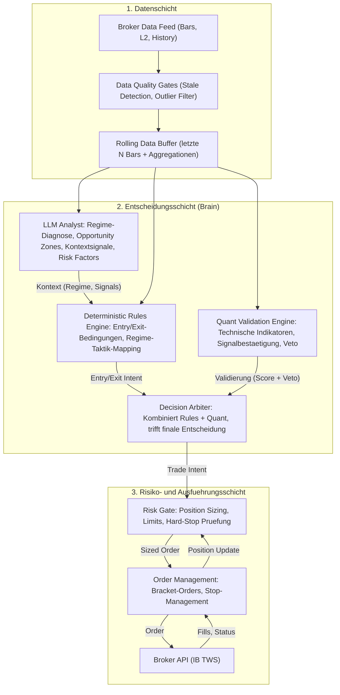
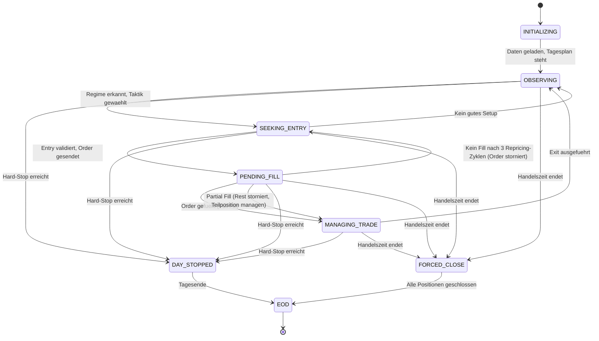

# ODIN — Konsolidierte Master-Spezifikation (MC + Unified BuildSpec + Iterationen) v1.0

**Stand:** 2026-02-21 (Europe/Berlin)  
**Status:** Konsolidierter Gesamtstand (Single Source of Truth + Appendices)  
**Gültigkeit:** Dieses Dokument beschreibt das **Zielsystem** (keine MVP-/Final-Unterscheidung). Priorisierung/Iterationen werden später festgelegt.

> **Hinweis:** Keine Anlageberatung. Das Dokument ist eine Fach-/Algorithmus-/Architektur-Spezifikation.

---

## 0. Dokumentsteuerung

### 0.1 Quellenbasis (ohne Informationsverlust)

Diese Master-Spezifikation ist eine **Konsolidierung** aus:

- **IA**: `intraday-agent-concept.md` (initiales, umfangreiches Fachkonzept)  
- **MC**: `odin-master-concept.md` (Gegenentwurf mit Architektur-/Codebase-Bezug)  
- **Unified BuildSpec**: `odin-hybrid-intraday-unified-build-spec-v3_0.md`  
- **Feedback-Iterationen in diesem Chat** (Entscheidungen und Ergänzungen, u. a. Evaluationsdesign, Bucket-Schwellen, Indifferenz-Regel, L2-Kompromiss)

Um **jeden Informationsverlust auszuschließen**, sind alle drei Quell-Dokumente im **Appendix Z** vollständig (verbatim) eingebettet.  
Die Kapitel 1–16 sind die **konsolidierte, widerspruchsauflösende Zielbeschreibung**.

### 0.2 Normative Sprache

- **MUSS** = verpflichtend  
- **DARF NICHT / NIE** = verboten  
- **SOLL** = dringend empfohlen (Abweichung nur mit dokumentierter Begründung)  
- **KANN** = optional

---

## 1. Zielbild, Scope, Constraints

### 1.1 Zielbild (Long-only Intraday)

Das System handelt **Aktien**, **Long-only**, **intraday**. Ziel:

- Entry nach Open-Volatilität / Konsolidierung (**nicht hektisch**)  
- taktische Teilgewinnmitnahmen bei parabolischen Moves (Exhaustion/Climax)  
- Re-Entry / Aufstockung nach bestätigter Trendwiederaufnahme (Multi-Cycle-Day)  
- robuste Reaktion auf Extremsituationen (Breakout-Explosion, Crash/News-Shock, Halt/Resume)  
- deterministische Guardrails + Audit/Replay-Fähigkeit

### 1.2 Harte Daten-Constraint (OHLCV-only)

Das System MUSS mit folgenden Daten robust arbeiten:

- **1-Minute OHLCV Bars** (inkl. Volume) pro Symbol

Nicht verfügbar:
- Bid/Ask, Spread, Orderbuch (L2), Marktbreite, Imbalance, Tick-by-Tick als Voraussetzung

### 1.3 Level-2 (L2) Kompromisslösung (verbindlich)

- **Alpha/Regime/Setups:** ausschließlich aus **OHLCV** (backtestbar)  
- **Execution-Verbesserung:** optional **live** mit L2 (nicht backtest-kritisch)  
- **Backtest:** nutzt konservative OHLCV-basierte Fill-/Kostenmodelle + Stress-Szenarien, die L2-Nutzen/Risiken approximieren

Konsequenz:
- L2 DARF live die **Orderausführung** verbessern (z. B. aggressivere/defensivere Limit-Logik, Repricing, Market-Vermeidung bei dünnem Buch),
- L2 DARF NICHT die **Entry/Exit-Logik** (Alpha) determinieren, solange keine historische L2-Historie für Backtests vorliegt.

### 1.4 Zeitauflösung (Entscheidung aus Iteration)

- **1m Monitor Layer**: Event-Erkennung (Crash/Spike/Exhaustion/DQ), keine direkten Trades  
- **3m Decision Layer**: primäre KPI- und Entry/Exit/Scale Entscheidungen  
- **10m Confirmation Layer**: Trend-/Regime-Quercheck, Fakeout-Filter

### 1.5 Governance-Modi (beide Ansätze verproben)

Das System MUSS drei Governance-Modi unterstützen (konfigurierbar):

1) **MC-Mode (KPI-first / LLM sekundär)**  
   - LLM als Tactical Parameter Controller (bounded), keine direkten Trigger
2) **Unified-Veto (LLM als Schutzengel)**  
   - Quant schlägt vor, LLM kann blocken; keine LLM-erzwungenen Entries
3) **Unified-Full (Dual-Key)**  
   - Entry/Add nur bei Quant∧LLM; Exit per Pending+Confirm

**Cold-Start Policy (verbindlich):**  
Solange Reliability-/Fusion-Kalibrierung nicht erfüllt ist, läuft das System **MC-Mode** als Default.

---

## 2. Funktionsanforderungen

### 2.1 Ausführungsstrategie-Funktionen (a/b/c)

**(a) Entry-Timing nach Open-Konsolidierung**  
- Erkennen, wenn erste High-Vol-Phase vorbei ist  
- Entry über Pullbacks/Breakouts mit Bestätigung (3m + 10m)

**(b) Teilverkäufe bei parabolischem Anstieg**  
- Erkennen von Exhaustion/Climax, um Giveback zu reduzieren  
- Teilgewinnmitnahme + engerer Trail, ohne „alles raus“ reflexartig

**(c) Re-Entry / Aufstocken**  
- Wenn morgens kein Entry möglich war (Downpressure) und später Boden+Turn bestätigt  
- Wenn nach (Teil-)Exit ein Downtrend abgelaufen ist und neuer Uptrend bestätigt

### 2.2 Nicht-Ziele

- HFT / Tick-Arbitrage  
- Overnight-Hold  
- Abhängigkeit von L2 als Alpha-Quelle  
- „Jede Minute handeln“; Overtrading ist ausdrücklich zu vermeiden

---

## 3. Systemarchitektur (konzeptionell, implementierungsneutral)

### 3.1 Schichten

1) **Data Layer**  
   - Feed, Validierung, 1m Buffer, Resampling 3m/10m, DataQuality Gates, Monitor Events
2) **Brain Layer**  
   - QuantEngine (KPIs, Scores, Vetos)  
   - LLM Engine (Regime/Pattern/Parameter/Vote in bounded enums)  
   - Strategy FSMs (Setups A–D)  
   - Arbiter (Fusion, Konfliktauflösung, Governance Mode)
3) **Risk & Execution Layer**  
   - Risk Gate (Sizing, Budgets, Exposure)  
   - OMS (Orders, Stops, Targets, Trailing, Forced Close)
4) **Observability & Control**  
   - Event Log, Audit Trail, Replay, Dashboards, Operator Controls (Kill/Pause/Resume)

### 3.2 Verantwortlichkeiten (kompakt)

- **Risk/Forced Close** ist immer deterministisch und MUSS durchgesetzt werden.  
- **LLM** liefert nur bounded Outputs; Freitext ist Logging-only.  
- **QuantEngine** berechnet KPIs und harte Daten-Fakten.

---

## 4. Datenmodell, Resampling, Data Quality

### 4.1 Resampling (normativ)

- 3m-Bar aus 3×1m: O=Open(1), C=Close(3), H=max, L=min, V=sum  
- 10m-Bar analog.

### 4.2 Data Quality Gates (verbindliche Reihenfolge)

1) Completeness (OHLC vorhanden, Volume ≥ 0)  
2) Staleness (fehlende Bars)  
3) Crash Detection (markieren, nicht verwerfen)  
4) Outlier Filter (nur wenn kein Crash)  
5) Gap Detection (markieren, strengere Policies)

---

## 5. Signal- und Entscheidungs-Hierarchie

### 5.1 FSM pro Symbol

Zustände (MUSS): INITIALIZING → WARMUP → OBSERVING → SEEKING_ENTRY → PENDING_FILL → MANAGING_TRADE → FLAT_INTRADAY → (Re-Entry) → FORCED_CLOSE → EOD; plus DAY_STOPPED.

### 5.2 Decision Loop (3m)

Pro 3m Close:
1) Hard Risk checks  
2) DQ Gate  
3) Snapshot (1m/3m/10m + KPIs + Events)  
4) Quant Output  
5) LLM Output (TTL geprüft)  
6) Regime Fusion + Hysterese  
7) Strategy FSMs  
8) Arbiter: Intent (max 1)  
9) Risk Gate  
10) OMS Actions + Audit

Tie-break: Exit > Entry.

### 5.3 1m Monitor Events (keine direkten Trades)

Events: CRASH_DOWN, SPIKE_UP, EXHAUSTION_CLIMAX, STRUCTURE_BREAK_1M, DQ_STALE, DQ_OUTLIER, DQ_GAP, VWAP_CROSS_1M, EMA_CROSS_1M (Hinweis).

---

## 6. Feature- und KPI-Engine (OHLCV-only)

### 6.1 Primär (3m)

VWAP (intraday), EMA(9/21), RSI(14), ATR(14), ADX(14), VolRatio, VWAP-Extension (in ATR), Swing-Struktur (HL/LH).

### 6.2 Confirmation (10m)

EMA(9/21), Trendstärke (ADX oder Proxy), Compression/Expansion (ATR slope, Range slope).

### 6.3 Context (Daily aus Aggregation)

ADR14 aus Daily Range, Gap vs prior close (wenn verfügbar), intraday_range/ADR.

---

## 7. Regime-, Pattern- und Setup-Modell

### 7.1 Regime Enum

OPENING_VOLATILITY, TREND_UP, TREND_DOWN, RANGE_BOUND, HIGH_VOLATILITY, BREAKOUT_ATTEMPT, EXHAUSTION_RISK, RECOVERY, UNCERTAIN

### 7.2 Regime Policy Map

- TREND_UP/RECOVERY: Entries möglich (mit Gates)  
- RANGE/UNCERTAIN: default NO-TRADE bzw. strenger  
- HIGH_VOL/EXHAUSTION: keine Adds, Profit Protection aggressiv  
- TREND_DOWN: Long-only → block

### 7.3 Setups (FSMs)

- **Setup A:** Opening Consolidation → Trend Entry  
- **Setup B:** Flush → Reclaim → Run (V-Reversal)  
- **Setup C:** Coil/Compression → Breakout  
- **Setup D:** Pullback-Reentry / Scale-Up

---

## 8. LLM-Integration (bounded, sicher)

### 8.1 Output Contract (bounded JSON)

LLM MUSS liefern:
- llm_regime + confidence
- llm_vote + confidence
- pattern_candidates (Enum + confidence + phase)
- tactical_controls (exit_bias, trail_mode, profit_protection_profile, scale_out_profile, entry_timing_bias, risk_mode)
- safety_flags (z. B. SAFETY_VETO)

Freitext nur logging_only.

### 8.2 Call Cadence (eventgetrieben)

Baseline 6–12 min; schneller in HighVol. Sofort bei Crash/Exhaustion/State-Wechsel/Regime confirm/Forced-Close proximity.

### 8.3 TTL-Regeln

Für Entries/Re-Entries MUSS LLM Output frisch sein (TTL <= konfig). Bei stale/fehlend: keine neuen Entries.

### 8.4 Anti-Halluzination

Schema-Validation, invalid → reject + ggf. retry 1×; wiederholt invalid → Degraded Mode.

---

## 9. Arbiter/Fusion und Governance-Modi

### 9.1 MC-Mode (KPI-first)

- Regime primär Quant, LLM sekundär (konservativer Tie-break bei Konflikt)
- LLM wirkt als Tactical Parameter Controller (bounded), darf keine Entries erzwingen

### 9.2 Unified-Veto

- Quant generiert Entry/Add Intents
- LLM kann blocken (NO_TRADE / SAFETY_VETO) und Parameterprofile verschärfen
- Exits: LLM EXIT_NOW → PENDING_EXIT; Confirm durch Events/Struktur/Timeout

### 9.3 Unified-Full (Dual-Key)

- Entry/Add nur bei QuantVote∧LLMVote (beide Conf >= threshold, 10m confirm ok)
- Exit/Scale-Out via Pending+Confirm; Hard risk immer sofort

### 9.4 Reliability-weighted Fusion (BuildSpec) — konsolidierter Endstand

**Problem aus Feedback:** EOD-only Updates sind zu langsam; Regime-spezifische Scores zu sparse; ohne Bootstrapping ist Fusion im Cold Start wertlos.  
**Konsolidierte Lösung (verbindlich):**
- Reliability wird auf **Decision-Level** inkrementell aktualisiert (mit Downweighting für Autokorrelation)  
- EOD ist Persistenz-/Report-Zeitpunkt, nicht die einzige Lernchance  
- **Hierarchisches Pooling:** globaler Score pro Modell + regime offsets (shrinkage)  
- **Cold Start:** MC-Mode, bis Kalibrierkriterium erfüllt ist  
- Kalibrierkriterium: min effective samples pro Modell (und pro relevanten Regime-Offset) oder CI-Breite < Schwelle

---

## 10. Risk, Sizing, Guardrails

- Max Risk/Trade, Max Daily DD, Max Cycles/Day, Exposure Limit
- Cooldown nach Stop-Out
- Kill Switch bei DQ-Stale/OMS-Fehler
- EOD Flat ist MUSS

---

## 11. Execution/OMS (OHLCV-backtestbar, L2 optional live)

### 11.1 OHLCV-basierte Execution Policy (backtest)

- Entry/Targets: Limit (Zonen aus VWAP/EMA/Struktur)  
- Stops: Stop-Limit + Fallback Stop-Market  
- Forced Close: Market (konservativ)

### 11.2 L2 live (optional, nur Execution)

L2 KANN live genutzt werden für:
- realistischere Fill-Entscheidungen (Repricing, passiv/aggressiv)  
- Market-Vermeidung bei dünnem Buch  
- bessere Stop-Fallback Policies

Aber:
- Alpha/Regime/Setups bleiben OHLCV-only.

---

## 12. Observability, Audit, Replay

- EventLog MUSS alle Inputs/Outputs (Quant, LLM, Fusion, Intent, OMS) enthalten
- Snapshot-Hashing, Prompt-Versionierung
- LLM Responses werden gecacht; Backtests nutzen Cache für Determinismus

---

## 13. Backtesting- und Validierungsdesign

- SimClock auf 1m, Decision auf 3m, Confirm 10m
- Fill-Modell: next-bar fills, limit cross, stop trigger + gap
- Kostenmodell: commission + spread/slippage proxy (ATR/Preis, range share)
- Stress: Slippage×2/×3, Latenz 1–2m, Bar-Alignment Shift, LLM-Outage Simulation

---

## 14. Evaluationsdesign (Postgres-first) inkl. Indifferenz-Regel

### 14.1 Varianten

MC, Unified-Veto, Unified-Full (+ Quant-only als Kontrolle)

### 14.2 FusionLab (isolierte Fusion-Evaluation)

- Separate Messung von Regime-/Vote-Fusion vs Ground Truth (30m lookforward, ATR-basiert)
- Fusion-Mechaniken: F0 (MC), F1 (EOD reliability), F2 (decision-level), F3 (pooling)

### 14.3 Entscheidungskaskade bei fehlender P&L-Signifikanz (verbindlich)

Gate 0: Unified darf Tail-Risk nicht verschlechtern (Non-Inferiority Schwellen)  
Gate 1: Signifikanter Score-Vorteil → Unified gewinnt (wenn Gate 0 ok)  
Gate 2: Indifferenz → FusionLab Proxy + Bucket/Stress Robustheit  
Default: Bei Indifferenz gilt MC.

### 14.4 Postgres-Ergebnis-Schema

Siehe Appendix B (DDL + Views).

---

## 15. Challenger Suite (20 Szenarien) + Bucket-Schwellen

Challenger-Suite MUSS als Regression Pack gepflegt werden.  
Zusätzlich Bucket-Schwellen (OHLCV-only) für:
- Opening Shock  
- Parabolic+Plateau+Fade  
- Compression→Breakout  
- VWAP Whipsaw  
- etc. (Appendix C)

---

## 16. Appendix-Übersicht

- **Appendix A:** MC Architektur/Technologie und Mapping auf Zielsystem (konkret für Entwickler)  
- **Appendix B:** Postgres Evaluationsschema (bt_*) + Standard-SQL  
- **Appendix C:** Bucket-Definitionen & Ground-Truth Labeling (FusionLab)  
- **Appendix D:** JSON Schemas (Quant Output, LLM Output, Arbiter Intent, Events)  
- **Appendix E:** Traceability Matrix (IA/MC/BuildSpec → Master)  
- **Appendix Z:** Quell-Dokumente (verbatim): IA, MC, Unified BuildSpec v3.0

---

# Appendix A — MC Architektur/Technologie: Mapping & Guardrails

## A.1 Ziel

Dieser Appendix ist explizit **implementierungsnah**, damit ein Entwickler den Bezug zur (in MC beschriebenen) Codebase hat, ohne dass der Hauptteil implementierungsabhängig sein muss.

## A.2 Kanonische Komponenten (aus MC) und Zuordnung

| Konzept-Komponente | MC-kompatible Bausteine (Beispiele) | Zuordnung im Master |
|---|---|---|
| Market Data Feed | HistoricalMarketDataFeed / LiveFeed Adapter | Data Layer |
| Clock | SimClock | Data/Backtest |
| Broker Adapter | IbBrokerGateway (TWS API) | Execution |
| Broker Simulation | BrokerSimulator (Fill-Modell) | Backtest |
| LLM Client | ClaudeAnalystClient / OpenAiAnalystClient | LLM Engine |
| LLM Cache | CachedAnalyst (recorded responses) | Replay/Determinismus |
| Event Log | PostgresEventLog (async/sync barrier) | Audit/Observability |
| Control API | REST + SSE Endpoints (Run/Decision/LLM History, Kill/Pause/Resume) | Control Layer |

## A.3 Guardrails für Code-Umsetzung

1) **Single Decision Path**: Live und Backtest nutzen denselben Brain/Risk/OMS-Codepfad; Unterschiede nur in Adaptern (Feed/Broker/Clock).  
2) **LLM Determinismus**: Backtest MUSS CachedAnalyst verwenden; Live MUSS Cache-Keying und Prompt-Versionierung erzwingen.  
3) **Event Sourcing**: Alle Entscheidungen müssen über EventLog reproduzierbar sein (SnapshotHash).  
4) **Mode Switch**: Governance Mode ist Konfig; keine “hardcoded” Einzelsicht.  
5) **L2 Scope**: L2 darf nur Execution beeinflussen; Alpha bleibt OHLCV-only (bis historische L2 vorhanden).

## A.4 Minimaler Modul-Schnittstellenvertrag (konzeptionell)

- `IDataFeed.get_bar_1m(symbol, t)`  
- `IResampler.update(bar_1m) -> bars_3m/bars_10m`  
- `IQuantEngine.evaluate(snapshot) -> QuantOutput`  
- `ILlmAnalyst.evaluate(snapshot) -> LlmOutput` (live) / `CachedAnalyst` (backtest)  
- `IArbiter.decide(QuantOutput, LlmOutput, snapshot) -> TradeIntent`  
- `IRiskGate.approve(intent, snapshot) -> ApprovedIntent | RejectReason`  
- `IOMS.execute(approved_intent) -> Orders/Stops/Targets`  
- `IEventLog.append(event)`  

---

# Appendix B — Postgres Evaluation Schema (DDL + Standard Queries)

(Die vollständige DDL und Standard-SQL-Abfragen sind im Evaluationsdesign-Teil dieses Dokuments verbindlich.  
Im Zweifelsfall gilt: alles, was für Geometrie/Drawdown/FusionLab benötigt wird, MUSS persistiert werden.)

## B.1 Tabellen (bt_dataset, bt_run, bt_variant, bt_day, bt_trade, bt_decision_cycle, bt_monitor_event, bt_llm_cache, bt_day_bucket)

Siehe Abschnitt „SQL DDL“ in Appendix B.2.

## B.2 SQL DDL (verbatim)


```sql
-- (1) Dataset Registry
create table if not exists bt_dataset (
  dataset_id bigserial primary key,
  name text not null,
  source text not null,
  start_date date not null,
  end_date date not null,
  ohlcv_granularity text not null default '1m',
  checksum_sha256 text not null,
  created_at timestamptz not null default now()
);

-- (2) Run
create table if not exists bt_run (
  run_id bigserial primary key,
  dataset_id bigint not null references bt_dataset(dataset_id),
  engine_version text not null,
  created_at timestamptz not null default now(),
  notes text,
  global_config jsonb not null
);

-- (3) Variants
create table if not exists bt_variant (
  variant_id bigserial primary key,
  run_id bigint not null references bt_run(run_id) on delete cascade,
  variant_name text not null,
  governance text not null,
  prompt_version text,
  model_version text,
  random_seed int not null default 0,
  latency_mode text not null default '0m',
  slippage_mode text not null default 'base',
  bar_alignment_shift_minutes int not null default 0,
  variant_config jsonb not null,
  created_at timestamptz not null default now()
);

create index if not exists ix_bt_variant_run on bt_variant(run_id);

-- (4) Daily metrics
create table if not exists bt_day (
  variant_id bigint not null references bt_variant(variant_id) on delete cascade,
  trading_date date not null,
  equity_start numeric(20,8) not null,
  equity_end numeric(20,8) not null,
  daily_return numeric(18,10) not null,
  log_return numeric(18,10) not null,
  gross_pnl numeric(20,8) not null,
  net_pnl numeric(20,8) not null,
  fees numeric(20,8) not null,
  slippage_cost numeric(20,8) not null,
  trades_count int not null,
  orders_count int not null,
  churn_score numeric(18,10) not null,
  primary key (variant_id, trading_date)
);

create index if not exists ix_bt_day_date on bt_day(trading_date);

-- (5) Trades
create table if not exists bt_trade (
  trade_id bigserial primary key,
  variant_id bigint not null references bt_variant(variant_id) on delete cascade,
  symbol text not null,
  entry_time timestamptz not null,
  exit_time timestamptz not null,
  qty numeric(20,8) not null,
  entry_price numeric(20,8) not null,
  exit_price numeric(20,8) not null,
  initial_stop numeric(20,8),
  pnl_net numeric(20,8) not null,
  r_multiple numeric(18,10),
  mfe numeric(20,8),
  mae numeric(20,8),
  cycle_no int not null,
  entry_reason text,
  exit_reason text,
  tags jsonb not null default '{}'::jsonb
);

create index if not exists ix_bt_trade_variant_time on bt_trade(variant_id, entry_time);
create index if not exists ix_bt_trade_symbol on bt_trade(symbol);

-- (6) Decision cycles (3m)
create table if not exists bt_decision_cycle (
  variant_id bigint not null references bt_variant(variant_id) on delete cascade,
  symbol text not null,
  decision_time timestamptz not null,
  state text not null,
  regime_final text not null,
  intent text not null,
  reject_reason text,
  quant_vote text,
  quant_conf numeric(6,5),
  llm_vote text,
  llm_conf numeric(6,5),
  confirm_10m text,
  snapshot_hash text not null,
  primary key (variant_id, symbol, decision_time)
);

create index if not exists ix_bt_dc_snapshot on bt_decision_cycle(snapshot_hash);

-- (7) Monitor events (1m)
create table if not exists bt_monitor_event (
  variant_id bigint not null references bt_variant(variant_id) on delete cascade,
  symbol text not null,
  event_time timestamptz not null,
  event_type text not null,
  severity int not null default 1,
  payload jsonb not null default '{}'::jsonb,
  primary key (variant_id, symbol, event_time, event_type)
);

-- (8) LLM cache
create table if not exists bt_llm_cache (
  snapshot_hash text primary key,
  prompt_version text not null,
  model_version text not null,
  created_at timestamptz not null default now(),
  valid boolean not null,
  output jsonb,
  error text,
  latency_ms int
);

-- (9) Day Buckets
create table if not exists bt_day_bucket (
  variant_id bigint not null references bt_variant(variant_id) on delete cascade,
  trading_date date not null,
  symbol text not null,
  bucket text not null,
  bucket_score numeric(18,10),
  details jsonb not null default '{}'::jsonb,
  primary key (variant_id, trading_date, symbol, bucket)
);

create index if not exists ix_bt_bucket_bucket on bt_day_bucket(bucket);

-- (10) Ground truth (FusionLab)
create table if not exists bt_ground_truth (
  snapshot_hash text primary key,
  symbol text not null,
  decision_time timestamptz not null,
  lookforward_minutes int not null default 30,
  atr_ref numeric(20,8) not null,
  c_t numeric(20,8) not null,
  c_t_fwd numeric(20,8) not null,
  fwd_max_high numeric(20,8) not null,
  fwd_min_low numeric(20,8) not null,
  gt_regime text not null,
  gt_conf numeric(6,5) not null,
  details jsonb not null default '{}'::jsonb
);

create index if not exists ix_bt_gt_time on bt_ground_truth(symbol, decision_time);

-- (11) Regime Eval (FusionLab)
create table if not exists bt_regime_eval (
  run_id bigint not null,
  variant_id bigint,
  fusion_id text not null,
  snapshot_hash text not null references bt_ground_truth(snapshot_hash),
  symbol text not null,
  decision_time timestamptz not null,
  quant_regime text not null,
  llm_regime text,
  fused_regime text not null,
  gt_regime text not null,
  correct boolean not null,
  loss_cost numeric(18,10) not null,
  quant_conf numeric(6,5),
  llm_conf numeric(6,5),
  fused_conf numeric(6,5),
  r_quant numeric(6,5),
  r_llm numeric(6,5),
  meta jsonb not null default '{}'::jsonb,
  primary key (fusion_id, snapshot_hash)
);

create index if not exists ix_bt_re_fusion_time on bt_regime_eval(fusion_id, decision_time);
```


# Appendix C — Bucket-Definitionen & Ground-Truth Labeling (FusionLab)

## C.1 Bucket: Parabolic + Plateau + Fade (Startdefinition, OHLCV-only)

**Run-up früh:** HOD innerhalb der ersten 120 Minuten und Run ≥ 4% oder ≥ 0.60×ADR14  
**Plateau:** mindestens 30 Minuten mit 30m Rolling Range ≤ 0.8×ATR10m(t_high)  
**Fade:** Giveback ≥ 60% und letzte 60 Minuten negativ (≤ -0.5×ATR10m)

## C.2 Bucket: Compression → Breakout

**Compression:** 60m Range / 180m Range ≤ 0.35 und ATR10m-Slope 60m < 0  
**Breakout:** in nächsten 30m Move ≥ 1.5×ATR10m und VolRatio10m ≥ 1.8

## C.3 Bucket: VWAP Whipsaw (Chop)

Auf 3m:
- VWAP Crosses in 120m ≥ 8  
- ADX10m ≤ 15  
- |Close−Open| ≤ 0.25×ADR14

## C.4 Ground Truth (30m Lookforward, ATR-basiert)

Inputs: C_t, ATR_ref(t), C_fwd, H_fwd_max, L_fwd_min (Window [t, t+30m])

- TREND_UP: C_fwd ≥ C_t + 0.50×ATR_ref und (H_fwd_max−C_fwd) ≤ 0.60×ATR_ref  
- TREND_DOWN: C_fwd ≤ C_t − 0.50×ATR_ref  
- HIGH_VOL: (H_fwd_max−L_fwd_min) ≥ 2.0×ATR_ref und kein eindeutiger Trend  
- RANGE_BOUND: |C_fwd−C_t| ≤ 0.25×ATR_ref und Range_fwd ≤ 1.0×ATR_ref  
- UNCERTAIN: sonst

Tie-break: TREND_UP/DOWN > HIGH_VOL > RANGE > UNCERTAIN

## C.5 Loss-Cost Matrix (Default)

- GT=TREND_DOWN, Pred=TREND_UP → 3.0  
- GT=HIGH_VOL, Pred=TREND_UP → 2.0  
- GT=RANGE, Pred=TREND_UP → 1.0  
- GT=TREND_UP, Pred=RANGE → 0.5  
- korrekt → 0.0


# Appendix D — JSON Schemas (konzeptionell)

## D.1 QuantOutput (bounded)

```json
{
  "quant_regime": "TREND_UP",
  "quant_regime_confidence": 0.74,
  "quant_vote": "ALLOW_ENTRY",
  "quant_vote_confidence": 0.68,
  "quant_score": 0.62,
  "hard_veto_flags": [],
  "features": {
    "ext_vwap_atr": 0.4,
    "ema9_gt_ema21": true,
    "rsi14": 61.2,
    "adx14": 23.8,
    "vol_ratio": 1.4,
    "atr_decay_ratio": 0.55
  }
}
```

## D.2 LlmOutput (bounded)

```json
{
  "llm_regime": "TREND_UP",
  "llm_regime_confidence": 0.71,
  "llm_vote": "ALLOW_ENTRY",
  "llm_vote_confidence": 0.64,
  "pattern_candidates": [
    {"pattern":"SETUP_A_OPENING_CONSOLIDATION", "confidence":0.66, "phase":"MATURE"}
  ],
  "tactical_controls": {
    "risk_mode": "NORMAL",
    "trail_mode": "NORMAL",
    "profit_protection_profile": "STANDARD",
    "scale_out_profile": "STANDARD",
    "entry_timing_bias": "WAIT_FOR_PULLBACK",
    "exit_bias": "HOLD"
  },
  "safety_flags": [],
  "logging_only": {
    "key_observations": [],
    "risk_factors": []
  }
}
```

## D.3 TradeIntent

```json
{
  "intent": "ENTRY",
  "symbol": "XYZ",
  "time": "2026-02-21T14:33:00Z",
  "size_profile": "STARTER",
  "order_policy": "LIMIT_IN_ZONE",
  "reason_codes": ["SETUP_A_PULLBACK", "TREND_UP_CONFIRMED"],
  "constraints": {"max_chase_r": 0.2}
}
```


# Appendix E — Traceability (Kurzform)

Diese Matrix zeigt, wo zentrale Elemente herkommen und wie Konflikte aufgelöst wurden.

- OHLCV-only Constraint + 1m/3m/10m Hierarchie: Chat-Entscheidung (Feb 2026), kompatibel mit IA/BuildSpec  
- MC-Mode / TPC / Codebase-Referenzen: MC  
- Unified Hybrid + Reliability + Ground Truth: BuildSpec  
- Statistik-Feedback (EOD-only Reliability zu langsam) + Lösung (decision-level updates + pooling + cold start): Chat-Iteration  
- Evaluationsdesign (Postgres) + Indifferenz-Regel: Chat-Iteration


# Appendix Z — Quell-Dokumente (verbatim)

> Dieser Appendix dient ausschließlich dazu, **Informationsverlust auszuschließen**.  
> Die konsolidierte, widerspruchsauflösende Zielbeschreibung ist in Kapitel 1–16.

---

## Z.1 IA — intraday-agent-concept.md (verbatim)

```markdown
# LLM Intraday Trading Agent — Konzept v1.5

Hybrides System aus LLM-Situationsanalyse, deterministischen Regeln und quantitativer Validierung — Februar 2026

---

## Inhaltsverzeichnis

1. [Systemparameter & Rahmenbedingungen](#1-systemparameter--rahmenbedingungen)
2. [Designphilosophie](#2-designphilosophie)
3. [Vier-Schichten-Architektur](#3-vier-schichten-architektur)
4. [Tages-Lifecycle](#4-tages-lifecycle)
5. [Zustandsmaschine des Agenten](#5-zustandsmaschine-des-agenten)
6. [LLM-Integration & Prompt-Architektur](#6-llm-integration--prompt-architektur)
7. [Deterministic Strategy Rules](#7-deterministic-strategy-rules)
8. [Quantitative Validierungsschicht](#8-quantitative-validierungsschicht)
9. [Entscheidungsschleife (Decision Loop)](#9-entscheidungsschleife-decision-loop)
10. [Risikomanagement & Guardrails](#10-risikomanagement--guardrails)
11. [Anti-Halluzination & Absicherung](#11-anti-halluzination--absicherung)
12. [Datenarchitektur & Subscriptions](#12-datenarchitektur--subscriptions)
13. [Intraday Regime Detection](#13-intraday-regime-detection)
14. [Volatilitaetsabnahme im Tagesverlauf](#14-volatilitaetsabnahme-im-tagesverlauf)
15. [Execution Policy](#15-execution-policy)
16. [News Security & Input Validation](#16-news-security--input-validation)
17. [Backtesting & Validierungspipeline](#17-backtesting--validierungspipeline)
18. [Model Risk Management](#18-model-risk-management)
19. [Security & Isolation](#19-security--isolation)
20. [Operationelle Sicherheit](#20-operationelle-sicherheit)
21. [Edge Cases & Failure Modes](#21-edge-cases--failure-modes)
22. [Monitoring & Logging](#22-monitoring--logging)
23. [Appendix: Glossar](#23-appendix-glossar)

---

## 1. Systemparameter & Rahmenbedingungen

| Parameter | Wert |
|-----------|------|
| Tageskapital | 10.000 EUR (aufgeteilt auf aktive Pipelines) |
| Max. Tagesverlust (Hard-Stop) | -10% (1.000 EUR) — global ueber alle Pipelines |
| Instrumente | 1–3 parallel (je Pipeline ein Instrument) |
| Richtung | Long only |
| Instrumenttyp | Aktien |
| Handelszeiten | Pre-Market + RTH |
| Autonomie | Vollautomatisch |

> **Kerngedanke:** Der Agent betreibt 1–3 isolierte Pipelines parallel, jede Pipeline handelt genau ein Instrument pro Tag. Die Instrumente werden extern vorgegeben und beim Start der Pre-Market-Phase (07:00 ET) eingefroren — kein Symbolwechsel waehrend des Handelstages. Wird ein Instrument vor RTH gehalted oder mit einer Trading-Restriction belegt, wechselt die betroffene Pipeline in DAY_STOPPED (kein Ersatzsymbol, andere Pipelines laufen weiter). Jede Pipeline diagnostiziert selbststaendig das Intraday-Regime (steigend, fallend, seitwaerts) und waehlt die passende Taktik. Am Ende des Handelstages sind alle Positionen aller Pipelines geschlossen.

---

## 2. Designphilosophie

### Das Prinzip der asymmetrischen Verantwortung

Das zentrale Designprinzip lautet: **Das LLM analysiert und kontextualisiert — deterministische Regeln entscheiden und handeln.**

| Faehigkeit | Verantwortlich | Begruendung |
|------------|---------------|-------------|
| Marktlage diagnostizieren (Regime) | LLM Analyst | Musterkennung in komplexen, nicht-stationaeren Situationen |
| Kontextsignale & Opportunity Zones liefern | LLM Analyst | Kontextuelles Verstaendnis von Kursverlaeufen, Nachrichtenlage, Anomalien |
| Entry/Exit-Entscheidung treffen | Deterministic Rules | Testbar, reproduzierbar, kein stochastisches Verhalten |
| Entry-Signale validieren | Quant | Deterministische Gegenkontrolle, Anti-Halluzination |
| Position Sizing | Rules | Muss deterministisch und verlaesslich sein |
| Stop-Loss setzen | Rules | Ausschliesslich ATR-basiert. LLM hat null Einfluss auf Stop-Levels |
| Hard-Stop (Tagesverlust) | Rules | Ultimative Sicherheit, nicht verhandelbar |
| Exit-Timing optimieren | Rules + Quant | Rules reagieren auf LLM-Regime-Wechsel, Quant validiert Signal |
| Order-Execution | Execution | Rein technisch, deterministisch |

> **Eiserne Regel:** Das LLM hat niemals direkten Zugriff auf Broker-APIs und trifft keine Handelsentscheidungen. Es ist ein *Analyst*, kein *Policy-Maker*. Jede LLM-Analyse durchlaeuft zwingend die Deterministic Rules Engine, die Quant-Validierung und die Risiko-Schicht, bevor sie als Order materialisiert wird. Das LLM produziert Kontext und Einschaetzungen in einem strukturierten Format — niemals Handlungsanweisungen.

### Warum ein LLM und nicht nur Quant?

Klassische quantitative Algorithmen arbeiten mit festen mathematischen Regeln. Sie sind exzellent in stationaeren Marktphasen, aber kaempfen mit:

- **Regime-Uebergaengen:** Der Moment, in dem ein Aufwaertstrend kippt, liegt per Definition ausserhalb der bisherigen statistischen Verteilung.
- **Kontextabhaengiger Volatilitaetsabnahme:** Die Intraday-Volatilitaet haengt von Nachrichtenlage, Sektor, Earnings-Kalender und Marktphase ab.
- **Muster-Erkennung in verrauschten Daten:** Ein LLM kann Muster (Doppelboden, Erschoepfungsluecken, Volumenanomalien) holistisch bewerten.

Das LLM bringt die adaptive Intelligenz fuer Situationsbeurteilung. Die Deterministic Rules Engine bringt die reproduzierbare Entscheidungslogik. Die Quant-Schicht bringt die mathematische Disziplin fuer Risikokontrolle.

### Warum das LLM kein Policy-Maker ist (v1.1 Shift)

In v1.0 lieferte das LLM direkte Handlungsempfehlungen (BUY/SELL). Das ist problematisch:

- **Nicht reproduzierbar:** Gleicher Input kann unterschiedliche Actions ergeben.
- **Nicht testbar:** Eine BUY/SELL-Entscheidung des LLM ist nicht unit-testbar.
- **Verantwortungsdiffusion:** Unklar ob LLM-Signal oder Marktlage fuer Verlust verantwortlich.

Stattdessen liefert das LLM jetzt *Kontext* (Regime, Opportunity Zones, Risikofaktoren, Urgency), und die **Deterministic Rules Engine** trifft die Handelsentscheidung basierend auf diesem Kontext plus quantitativen Indikatoren. Jede Entscheidung ist nachvollziehbar und testbar.

---

## 3. Vier-Schichten-Architektur



**LLM Analyst** — Erhaelt komprimierte Marktdaten, historischen Kontext und den aktuellen Agenten-Zustand. Produziert strukturierte Analysen (JSON): Regime-Label mit Confidence, Opportunity Zones, Kontextsignale und Risikofaktoren. Trifft **keine** Handelsentscheidungen. Event-driven aufgerufen.

**Deterministic Rules Engine (v1.1 NEU)** — Neue Schicht zwischen LLM und Quant. Empfaengt LLM-Kontext (Regime, Opportunity Zones, Urgency) und kombiniert diesen mit quantitativen Indikatoren zu deterministischen Entry/Exit-Entscheidungen. Regeln sind explizit, testbar und reproduzierbar. Siehe Kapitel 7.

**Quant Validation Engine** — Laeuft synchron auf jedem relevanten Bar-Update. Berechnet technische Indikatoren (VWAP, RSI, ATR, Volumen-Profil) und kann die Rules-Engine-Entscheidung mit einem Veto blockieren. Das Veto ist nicht verhandelbar.

**Execution Layer** — Nimmt validierte Trade-Intents entgegen, berechnet Position Size und Stops nach festen Regeln, erzeugt Orders (Limit/OCA-Gruppen) und ueberwacht die Ausfuehrung. Null LLM-Einfluss — rein regelbasiert. **Single Source of Truth fuer Positionsdaten ist der Broker-State** (IB Account/Portfolio-Updates). Der interne OMS-State wird bei jedem Fill-Event vom Broker synchronisiert. Bei Drift zwischen internem State und Broker-State gilt der Broker-State. EOD-Reconciliation prueft und korrigiert verbleibende Abweichungen.

---

## 4. Tages-Lifecycle

> **Zeitzone:** Alle Uhrzeiten in diesem Dokument sind in **US Eastern Time (ET)** angegeben — EST (UTC-5) im Winter, EDT (UTC-4) im Sommer. Die Implementierung muss den Sommerzeitwechsel korrekt behandeln (Exchange-TZ `America/New_York`).

### Phase 1: Pre-Market (07:00 – 09:30 ET)

1. **System-Initialisierung:** Tageskapital festlegen, Verlust-Counter auf 0, Agent-State auf INITIALIZING. Historische Tagesdaten laden (letzte 20 Tage Daily Bars, letzte 5 Tage Intraday-Bars).
2. **LLM Overnight-Gap Analyse:** LLM erhaelt Schlusskurs Vortag, Pre-Market-Preis, Nachrichtenlage, historisches Gap-Verhalten. Erstellt Gap-Einschaetzung.
3. **LLM Tagesplan:** Erwartetes Regime, Opportunity Zones, Zeitfenster mit hoechster Chance.
4. **Pre-Market Monitoring:** Passive Beobachtung, Datensammlung. LLM kann Tagesplan revidieren. Trades nur bei aktiviertem Pre-Market-Trading (siehe unten).

### Phase 2: Regular Trading Hours (09:30 – 15:55 ET)

1. **Opening Auction (09:30 – 09:45):** Beobachtung der Eroeffnung. Kein sofortiger Trade — die ersten 15 Minuten sind reine Diagnose. Quant-Engine kalibriert Intraday-ATR und Volumen-Baseline.
2. **Aktive Handelsphase (09:45 – 15:15 ET):** Die Decision Loop laeuft. Trades werden eroeffnet und geschlossen. LLM wird periodisch konsultiert (alle 3–15 Minuten je nach Volatilitaet, siehe Kap. 9).
3. **Power Hour (15:15 – 15:45):** Verschaerfte Regeln. Keine neuen Positionen nach 15:30. Bestehende Positionen auf enge Trailing-Stops.
4. **Forced Close (15:45 – 15:55):** Alle offenen Positionen werden zwangsgeschlossen. Keine Position ueber Nacht.

### Phase 3: End-of-Day (15:55 – 16:15 ET)

1. **Reconciliation:** Abgleich aller Fills mit dem internen State. Berechnung der Tages-P&L.
2. **Performance-Logging:** Jeder Trade wird mit LLM-Analyse, Quant-Score und Ergebnis protokolliert.

> **Pre-Market Trading (v1.3 praezisiert):** Pre-Market-Trading ist per Konfigurationsschalter steuerbar (`moses.intraday.pre-market-trading-enabled`, **Default: false**). Bei aktiviertem Schalter darf der Agent waehrend Phase 1 von OBSERVING nach SEEKING_ENTRY wechseln — die Zustandsmaschine gilt unveraendert, lediglich der State-Uebergang OBSERVING→SEEKING_ENTRY wird vor 09:30 ET freigeschaltet. Es gelten die verschaerften Pre-Market-Regeln aus Kap. 15 (halbe Positionsgroesse, Mindest-Spread < 0.5%, Mindest-Volumen > 10.000, kein Repricing). Bei deaktiviertem Schalter: Agent bleibt in OBSERVING bis RTH-Beginn.

---

## 5. Zustandsmaschine des Agenten



| State | Beschreibung | LLM aktiv? | Trading erlaubt? |
|-------|-------------|------------|-----------------|
| INITIALIZING | Systemstart, Daten laden, Tagesplan erstellen | Ja (Planung) | Nein |
| OBSERVING | Markt beobachten, Regime diagnostizieren | Ja (Analyse) | Nein |
| SEEKING_ENTRY | Aktiv nach Entry-Punkt suchen | Ja (Kontext) | Ja (Entry) |
| PENDING_FILL | Order gesendet, warte auf Fill. Repricing-Zyklen laufen | Nein | Nein (wartend) |
| MANAGING_TRADE | Position offen, Stop aktiv, Exit-Timing | Ja (Kontext) | Ja (Exit/Adjust) |
| DAY_STOPPED | Tagesverlust-Limit erreicht | Nein | Nein |
| FORCED_CLOSE | Handelszeit vorbei, Positionen schliessen | Nein | Nur Exits |
| EOD | Reconciliation und Logging | Nein | Nein |

> **PENDING_FILL (v1.2 NEU):** Dieser State trennt sauber zwischen "Order validiert und gesendet" und "Position offen". Waehrend PENDING_FILL laufen die Repricing-Zyklen der Execution Policy (max. 3). Das LLM wird nicht konsultiert — die Order-Verwaltung ist rein deterministisch. Bei Partial Fill nach Timeout wird der Rest storniert und mit der Teilposition in MANAGING_TRADE gewechselt.

---

## 6. LLM-Integration & Prompt-Architektur

### Strukturierter Output (Anti-Halluzination by Design)

Das LLM kommuniziert ausschliesslich ueber ein definiertes JSON-Schema. Freitext-Antworten werden verworfen.

### LLM-Analyse-Schema (v1.1 — kein `action`, kein `stop_loss_suggestion`)

| Feld | Typ | Beschreibung |
|------|-----|-------------|
| regime | Enum | TREND_UP, TREND_DOWN, RANGE_BOUND, HIGH_VOLATILITY, UNCERTAIN |
| regime_confidence | Float 0.0–1.0 | Wie sicher ist die Regime-Einschaetzung? |
| opportunity_zones | Object[] | Preis-Zonen mit erhoehter Chance: `{price_min, price_max, type: ENTRY/EXIT, reasoning}`. Kontextuell — informiert die Rules Engine ueber potentielle Kauf-/Verkaufszonen (v1.4 Klarstellung) |
| market_context_signals | String[] | Kontextuell relevante Beobachtungen (max 5): z.B. "Gap-Fill 70% abgeschlossen", "Volumen-Divergenz zu Preis" |
| urgency_level | Enum | LOW, MEDIUM, HIGH, CRITICAL — Wie zeitkritisch ist die aktuelle Situation? |
| entry_price_zone | Object | `{min, ideal, max}` — konkreter Preisbereich fuer den Entry (nur bei erkannter Opportunity). `ideal` = Limit-Preis fuer Execution, `max` = harte Obergrenze fuer Repricing, `min`/`max` = Plausibilitaetsgrenzen. **Beziehung zu opportunity_zones:** `entry_price_zone` ist die Konkretisierung einer ENTRY-typed `opportunity_zone` auf einen handelbaren Preisbereich. Die Rules Engine prueft ob der aktuelle Preis in einer `opportunity_zone` liegt; die Execution nutzt `entry_price_zone` fuer den Order-Preis (v1.4 Klarstellung) |
| target_price | Float oder null | Optionales Gewinnziel (LLM-Schaetzung, wird von Rules validiert) |
| hold_duration_bars | Int | Erwartete Haltedauer in 5-Minuten-Bars (Referenz-Timeframe fuer alle LLM-Haltedauer-Angaben). Beispiel: 15 = 75 Minuten |
| reasoning | String | Kurze Begruendung (max 200 Zeichen, fuer Logging) |
| key_observations | String[] | Bis zu 5 Beobachtungen, die zur Analyse gefuehrt haben |
| risk_factors | String[] | Erkannte Risiken, auch wenn Einschaetzung positiv |
| pattern_candidates | Object[] | Erkannte Pattern mit Confidence: `{pattern: Enum, confidence: Float 0.0–1.0, phase: String}`. Pattern-Enum: FLUSH_RECLAIM_RUN, COIL_BREAKOUT, NONE. Phase beschreibt den vermuteten aktuellen State (z.B. "FLUSH_DETECTED", "COIL_MATURE"). Max. 2 Kandidaten (v1.3 NEU) |

> **Entfernte Felder (v1.0 → v1.1):**
> - `action` (BUY/SELL/HOLD/NO_ACTION) — Entry/Exit-Entscheidung liegt jetzt bei der Deterministic Rules Engine
> - `action_confidence` — Ersetzt durch `urgency_level` als qualitatives Signal
> - `stop_loss_suggestion` — Stop-Loss ist ausschliesslich Rules-Domaene (ATR-basiert). Das LLM hat null Einfluss auf Stop-Levels.

### Regime-Confidence-Schwellen

- **regime_confidence < 0.5:** Regime gilt als UNCERTAIN, unabhaengig vom Label. Deterministic Rules verbieten Entry.
- **regime_confidence 0.5–0.7:** Entry nur bei Quant-Score >= 0.70 (hohe Quant-Huerde).
- **regime_confidence > 0.7:** Entry bei Quant-Score >= 0.50 (Standard-Huerde, da LLM sicher ist).

Die Schwellen sind konfigurierbar und werden durch Backtesting optimiert.

### Prompt-Architektur: Dreistufiges Context Window

1. **System Prompt (fest):** Rollendefinition ("Du bist ein Intraday-Marktanalyst"), Regeln (Output-Schema, Confidence-Kalibrierung, verbotene Felder), Instrument-Profil (Name, Sektor, Beta, avg. Tagesvolatilitaet)
2. **Kontext-Fenster (dynamisch):** Komprimierte Kurshistorie (20d Daily + 5d Intraday), heutiger Tagesplan, bisherige Trades heute, aktuelle Position & offene Stops
3. **Aktueller Tick (pro Aufruf):** Letzte N Bars (Detaildaten), aktuelle Indikatoren (RSI, VWAP, ATR), Volumen-Anomalien, Uhrzeit & verbleibende Handelszeit

### Datenkompression fuer das Context Window

| Zeitfenster | Granularitaet | Datenpunkte |
|-------------|--------------|-------------|
| Letzte 15 Minuten | 1-Minuten-Bars (OHLCV) | ~15 |
| Letzte 2 Stunden | 5-Minuten-Bars (OHLCV) | ~24 |
| Rest des Tages | 15-Minuten-Bars (OHLCV) | ~16 |
| Letzte 5 Handelstage | 30-Minuten-Bars | ~65 |
| Letzte 20 Handelstage | Daily Bars | 20 |

Zusaetzlich vorberechnete Aggregationen: VWAP, kumulatives Volumen-Profil, Intraday-High/Low, aktuelle RSI-Werte auf mehreren Timeframes.

### LLM-Aufruf-Strategie: Event-Driven, nicht Tick-Driven

1. **Periodisch:** Alle 3 Minuten bei hoher Volatilitaet (> 120% Daily-ATR), alle 5 Minuten bei normaler, alle 15 Minuten bei niedriger Volatilitaet. Exakte Schwellen siehe Kap. 9.
2. **Event-Driven:** Bei signifikanten Ereignissen sofort (VWAP-Durchbruch, Volumen-Spike >2x, Stop-Loss-Annaeherung, Profit-Target erreicht).
3. **Entry-Approaching (v1.4 NEU):** Wenn der Preis eine LLM-Opportunity-Zone **betritt** (Edge-triggered: Crossing, nicht Level-triggered) oder den naechsten Rand der `entry_price_zone` (min oder max) auf < 0.5x ATR(14) unterschreitet, wird ein LLM-Refresh getriggert. **Debounce:** Min. 90 Sekunden zwischen zwei *proaktiven* Entry-Approaching-Refreshes pro Zone. **Ausnahme:** Wenn die Rules Engine einen Entry evaluiert und der Kontext > 2 Min alt ist, wird der Debounce ueberbruckt — das Freshness-Gate fuer Entries hat Vorrang. **Single-Flight:** Nie mehr als ein laufender LLM-Call gleichzeitig; weitere Trigger werden koalesziert. Nur Preis-Crossings triggern (Zonenverschiebung durch LLM-Update zaehlt nicht als Eintritt). **Pre-Market:** Vor RTH-Kalibrierung (< 09:45 ET) wird der letzte RTH-ATR(14) als Referenz verwendet. Trigger nur in SEEKING_ENTRY (und OBSERVING bei aktiviertem Pre-Market).
4. **State-Transition:** Bei jedem Zustandswechsel der State Machine.

### Optionales Vision-Modul (Ausblick)

Ergaenzend zur zahlenbasierten Analyse (2a) ist ein Vision-Modul denkbar, das Chart-Bilder analysiert (2b). **Wichtig:** Vision ist nur als sekundaeres Signal vorgesehen, nicht als primaere Entscheidungsquelle.

- **Einsatz:** Vision-Modell erkennt **ausschliesslich Pattern-Labels** (Triangle, Pennant, Flag, Double-Bottom). Keine Kurslevels, keine Handlungsempfehlungen.
- **Order-Trigger bleibt zahlenbasiert:** Breakout-Level, ATR, Stops werden weiterhin aus numerischen Daten berechnet. Vision liefert nur eine Zweitmeinung zur Pattern-Klassifikation.
- **Problem:** Chart-Bilder sind "messy" — Layout, Zoom und Indikatorfarben veraendern die Interpretation. Backtesting ist schwieriger, weil Bild-Pipeline und Ground-Truth auseinanderlaufen.
- **Priorisierung:** Erst nach erfolgreicher Validierung des zahlenbasierten Kerns (Kap. 17 Pipeline komplett). Vision-Modul ist kein MVP-Bestandteil.

---

## 7. Deterministic Strategy Rules (v1.1 NEU)

Die Deterministic Rules Engine ist die neue Schicht zwischen LLM-Analyse und Quant-Validierung. Sie empfaengt den LLM-Kontext (Regime, Opportunity Zones, Urgency, Risk Factors) und trifft basierend auf expliziten, testbaren Regeln die Entry/Exit-Entscheidung.

### Design-Prinzipien

- **Determinismus:** Gleicher Input → gleiches Ergebnis. Keine Zufallskomponente.
- **Testbarkeit:** Jede Regel ist als Unit-Test formulierbar.
- **Transparenz:** Jede Entscheidung ist vollstaendig nachvollziehbar (Audit Trail).
- **Konfigurierbarkeit:** Schwellenwerte sind externalisiert (Properties), nicht hartcodiert.

### Entry-Regeln pro Regime

| Regime | Entry-Bedingung | Zusaetzliche Quant-Anforderung |
|--------|----------------|-------------------------------|
| TREND_UP | Preis in LLM-Opportunity-Zone AND Preis <= VWAP + 0.5x ATR(14) AND urgency >= MEDIUM | EMA(9) > EMA(21), RSI < 70 |
| TREND_DOWN | **Default: Kein Entry.** Nur bei explizit aktiviertem Aggressive Mode (siehe Kap. 13) | RSI < 25, Volumen-Spike, halbe Positionsgroesse |
| RANGE_BOUND | Preis am unteren Range-Ende (LLM-Zone) AND urgency >= MEDIUM | RSI < 40, Preis nahe VWAP-Support |
| HIGH_VOLATILITY | LLM urgency = HIGH/CRITICAL AND Preis in Opportunity Zone | Volumen > 1.5x Durchschnitt, Spread < 0.3% |
| UNCERTAIN | **Kein Entry.** Beobachten und warten. | — |

### Exit-Regeln

| Trigger | Bedingung | Aktion |
|---------|-----------|--------|
| Stop-Loss | Preis <= Entry - 1.5x ATR(14) | Sofortiger Exit (Broker-seitiger Stop) |
| Trailing-Stop | Preis faellt um 1x ATR vom Intraday-High | Exit |
| Regime-Wechsel | LLM meldet neues Regime (2x bestaetigt), Position passt nicht | Beschleunigter Exit |
| Gewinnmitnahmen | R-basierte Tranchen (siehe Scaling-Out-Strategie) | Stufenweiser Exit in 3–5 Tranchen (budgetabhaengig) |
| Zeitbasiert | hold_duration_bars ueberschritten ODER < 30 Min bis Forced Close | Exit |
| Urgency CRITICAL | LLM urgency = CRITICAL bei offener Position | Sofortige Re-Evaluation durch Rules Engine. Rules entscheiden ueber Exit basierend auf Quant-Signalen — Urgency allein loest keinen Exit aus (v1.2 praezisiert) |

### Scaling-Out-Strategie (Gewinnmitnahmen in Chargen)

Statt eines einzelnen Profit-Targets wird die Position in Chargen abgebaut. Dies sichert Teilgewinne frueh und laesst einen kleinen "Runner" fuer grosse Trend-Moves laufen. Der psychologische Effekt ist erheblich: Nach der ersten Tranche ist der Trade "bezahlt", was Hope-Trading eliminiert.

Die Tranchenanzahl ist **budgetabhaengig konfigurierbar**. Bei kleinem Kapital (z.B. 3.000 EUR) wuerden 5 Tranchen zu winzigen Teilverkaufs-Stueckzahlen fuehren, deren Kommissionskosten den Gewinn aufzehren. Die Konfiguration bestimmt daher automatisch die passende Variante:

| Variante | Bedingung (Positionsgroesse) | Tranchen | Aufteilung |
|----------|------------------------------|----------|------------|
| **Kompakt (3T)** | < 5.000 USD Positionswert | 3 | 40% @ 1R, 40% @ 2R, 20% Runner |
| **Standard (4T)** | 5.000–15.000 USD | 4 | 30% @ 1R, 30% @ Key-Level, 25% @ 2R, 15% Runner |
| **Voll (5T)** | > 15.000 USD | 5 | 25% @ 1R, 25% @ Key-Level, 25% @ 2R, 15% @ 3R, 10% Runner |

> **Schwellenwerte als Properties konfigurierbar.** Die USD-Grenzen und Prozentaufteilungen sind externalisiert, nicht hartcodiert. Die Auswahl der Variante erfolgt automatisch basierend auf der berechneten Positionsgroesse zum Zeitpunkt des Entries.

**Vollstaendige Tranchentabelle (Variante 5T als Referenz):**

| Tranche | Anteil | Trigger | Zweck |
|---------|--------|---------|-------|
| Tranche 1 | 25% | Entry + 1R (1x Stop-Distance) | Trade bezahlt sich. Stop auf Break-Even nachziehen |
| Tranche 2 | 25% | Key-Level / First Meaningful Resistance (aus LLM `opportunity_zones`) | Gewinnsicherung an natuerlicher Supply-Zone |
| Tranche 3 | 25% | Entry + 2R | Signifikanter Gewinn realisiert |
| Tranche 4 | 15% | Entry + 3R | Aggressives Reduzieren in Staerke |
| Runner | 10% | Trailing-Stop (siehe unten) | Offener Upside fuer Trend-Days |

Bei 3T/4T entfallen die hoeheren Tranchen; der Runner-Anteil wird entsprechend angehoben, damit immer ein Restbestand fuer Trend-Days gehalten wird.

**Runner-Trailing-Regeln:**

- **Standard:** Trail unter EMA(9) oder letztes Higher-Low — je nachdem was naeher am Kurs liegt
- **Ueberhitzter Kurs** (RSI > 80, Preis am oberen Bollinger-Band): Trail enger, unter letzte Kerze
- **Exit:** Close unter MA-Zone oder Strukturbruch (Lower-Low)

**If-Then-Exit am Rücksetzer (kein Hope-Trading):**

- **Rücksetzer gesund** (Preis hält über MA-Zone, kein Lower-Low, nur flacher Pullback): Runner halten — oft folgt ein zweiter Impuls
- **Rücksetzer kippt** (Close deutlich unter MA-Zone oder Lower-Low): Runner sofort schliessen — Trendbruch / Regimewechsel

> **Konfigurierbar:** Die Chargen-Prozentsaetze und R-Multiples sind als Properties externalisiert, nicht hartcodiert.

### Warum keine LLM-gesteuerten Stops?

Stop-Loss-Level werden **ausschliesslich** durch die Rules Engine berechnet (ATR-basiert). Gruende:

- **Determinismus:** ATR-basierte Stops sind reproduzierbar und testbar.
- **Kein Halluzinationsrisiko:** Das LLM koennte unrealistische Stop-Levels vorschlagen.
- **Konsistenz:** Jeder Trade hat eine mathematisch begruendete Stop-Distance.

### Trade-Pattern-State-Machines

Die Rules Engine kennt konkrete, wiederholbare Intraday-Setups als Pattern-State-Machines. Jedes Pattern durchlaeuft definierte Zustaende mit expliziten Uebergangsbedingungen. Pattern-State-Machines operieren innerhalb der Agent-States SEEKING_ENTRY und MANAGING_TRADE.

#### Setup A: Flush → Reclaim → Run (V-Reversal)

Klassisches Mean-Reversion-zu-Momentum-Play: Ein scharfer Abverkauf (Stop-Run / Flush) wird gefolgt von einer schnellen Rueckeroberung (Reclaim) relevanter Referenzniveaus. Dieses Pattern hat keinen Silver-Bullet-Charakter — es ist eine **Edge-Schablone**, die stark ist wenn Kontext und Struktur passen, aber durchschnittlich bis schlecht performt wenn der Markt keinen Trend hergibt. Die "Bullet" kommt aus Risikomanagement + Skalierung + klarer Invalidierung.

| State | Erkennungskriterien | Uebergang |
|-------|---------------------|-----------|
| FLUSH_DETECTED | Kerze mit Range > 2x ATR(14), Close nahe Low, Sweep unter Key-Level (Tages-Low, VWAP) | → RECLAIM wenn Preis innerhalb von 3 Bars > VWAP/MA-Zone zurueckkehrt |
| RECLAIM | Preis zurueck ueber VWAP + MA-Cluster, Hold fuer min. 2 Bars | → RUN wenn Higher-Low gebildet + EMA(9) > EMA(21). Starter-Position Entry |
| RUN | Hoehere Tiefs, Pullbacks flach (< 0.5x ATR), Preis > Trend-MA | → EXIT bei Lower-Low oder Close unter MA-Zone. Add-Position bei Bestaetigung |
| EXIT | Strukturbruch (Lower-Low) ODER Close unter MA-Cluster ODER Trailing-Stop getriggert | → OBSERVING |

**Invalidierungslevel:** Das Low des Flush. Wird dieses unterschritten, ist das Setup sofort ungueltig.

**Optimale Bedingungen:** Shorts gefangen (schnelle Reversal-Kerze), Volumen steigt beim Reclaim, ADX dreht von schwach auf staerker.

**Regime-Abhaengigkeit:** Das Pattern liefert Edge vor allem wenn der Markt danach Trend-Momentum entwickelt. In choppy/mean-reverting Phasen wird man haeufiger ausgestoppt oder bekommt nur kleine Moves.

#### Setup B: Coil → Breakout (Volatilitaets-Kontraktion)

Trichterfoermig zulaufende Kursbewegungen (symmetrisches Dreieck, Pennant, Keil) als Vorbote einer Expansion. Fallende Hochs + steigende Tiefs signalisieren ein kurzfristiges Kaeufer/Verkaeufer-Gleichgewicht — eine "Energieaufladung", der typischerweise eine schnelle Expansion folgt.

| State | Erkennungskriterien | Uebergang |
|-------|---------------------|-----------|
| COIL_FORMING | Fallende Hochs + steigende Tiefs ueber min. 5 Bars, ATR faellt, Range schrumpft | → COIL_MATURE wenn Kontraktion > 40% vs. initiale Range |
| COIL_MATURE | Range < 60% der initialen Range, Preis nahe Apex | → BREAKOUT bei Close ausserhalb der oberen Begrenzung + Tempo/Range-Bestaetigung |
| BREAKOUT | Close oberhalb oberer Trendlinie + Bar-Range > 1.5x aktuelle ATR | → RUN. Entry bei Breakout oder Retest |
| RUN | Trend etabliert, Pullbacks halten Breakout-Level | → EXIT bei Reentry in die Formation oder Lower-Low |
| EXIT | Rueckkehr in die Formation ODER Trailing-Stop getriggert | → OBSERVING |

**Continuation-Bias:** Nach vorhergehendem Aufwaertsimpuls ist die statistische Wahrscheinlichkeit fuer einen Breakout nach oben erhoeht (Bull-Pennant-Signatur), solange der Preis ueber den relevanten MAs bleibt und Ruecksetzer an der unteren Trendlinie schnell gekauft werden.

**Distribution-Warnsignale:** Untere Trendlinie wird weich (Tiefs nicht mehr verteidigt), Erholungen werden schwaecher (obere Begrenzung bleibt Deckel), Close unter unterer Linie + unter MAs = Regimewechsel.

**Fakeout-Schutz:** Je naeher am Apex, desto hoeher das Fakeout-Risiko. Am Apex wird keine neue Position eroeffnet — Entry nur bei Breakout mit klarer Bestaetigung (Close ausserhalb + Range). Risiko am Apex reduzieren, Markt "zeigen lassen" wohin er will.

#### Position Building: Starter + Add

Fuer Setup A (Flush→Reclaim→Run) wird eine gestufte Positionsaufbau-Strategie verwendet statt eines einzelnen Entry mit voller Groesse:

1. **Starter-Position (klein, ~40% der Zielgroesse):** Entry im RECLAIM-State bei erstem Hold ueber MA/VWAP. Stop unter Flush-Low. Da der Stop weit entfernt sein kann, wird die Position klein gehalten, um das Risiko zu begrenzen.
2. **Add-Position (~60% der Zielgroesse):** Erst wenn der RUN-State bestaetigt ist (Reclaim + kleiner Pullback + Continuation, Higher-Low). Stop fuer den Add enger (unter letztes Higher-Low).

> Der Gesamtrisikobetrag (Starter + Add) darf den `max_risk` pro Trade (3% Tageskapital) nicht ueberschreiten.

#### Pattern-Auswahl durch LLM (v1.3 ueberarbeitet)

Das LLM identifiziert via das strukturierte Feld `pattern_candidates` (Enum + Confidence + Phase), welches Pattern sich aktuell formiert. Die Rules Engine aktiviert die entsprechende Pattern-State-Machine **nur wenn** die Pattern-Confidence >= 0.5 ist UND die deterministische Pattern-Feature-Erkennung (Kap. 12) den Uebergang bestaetigt.

> **Kein unstrukturierter Text fuer Pattern-Aktivierung.** In v1.2 wurden Patterns via `market_context_signals` (String[]) identifiziert — das war halluzinationsanfaellig. Ab v1.3 ist `pattern_candidates` ein typisiertes Feld mit Enum-Werten. Die Rules Engine reagiert ausschliesslich auf dieses Feld, nicht auf Freitext-Signale. `market_context_signals` bleibt als ergaenzender Kontext erhalten, hat aber keinen Einfluss auf die Pattern-Aktivierung.

Mehrere Patterns koennen parallel ueberwacht werden, aber nur ein Pattern darf gleichzeitig eine Position halten.

---

## 8. Quantitative Validierungsschicht

Die Quant-Engine laeuft deterministisch und schnell (Sub-Millisekunde).

### Indikator-Toolkit

| Indikator | Verwendung | Veto-Kriterium |
|-----------|-----------|----------------|
| VWAP | Intraday-Trend-Richtung und Fair Value | Long-Entry bei Preis > 2% ueber VWAP → Veto |
| RSI(14) auf 5-Min | Ueberkauft/Ueberverkauft | Long-Entry bei RSI > 75 → Veto |
| ATR(14) auf 5-Min | Volatilitaetsmessung, Stop-Berechnung | Kein Veto, aber bestimmt Stop-Distance |
| Volumen-Profil | Support/Resistance-Zonen | Entry in Volumen-Luecke → Warnung |
| EMA(9) / EMA(21) auf 1-Min | Kurzfristiger Trend | Long-Entry bei EMA(9) < EMA(21) → Veto |
| Spread-Monitor | Liquiditaetspruefung | Spread > 0.5% → Hard-Veto |
| Intraday-ATR-Decay | Abnehmende Volatilitaet messen | ATR-Decay > 60% → Taktik-Wechsel |

### Quant-Validierung: Scoring-Modell (0.0–1.0)

Der `quant_score` ist durchgaengig auf 0.0–1.0 normiert (nicht 0–100%):

| Check | Gewichtung |
|-------|-----------|
| Trend-Alignment (EMA, VWAP) | 0.25 |
| Overbought/Sold (RSI) | 0.20 |
| Volumen-Bestaetigung | 0.20 |
| Spread-Pruefung | 0.15 |
| Risk/Reward-Ratio | 0.20 |

**Schwelle:** `quant_score >= 0.50` → Trade erlaubt. `quant_score < 0.50` → Trade blockiert.

> **Veto ist absolut:** Einzelne Checks haben ein Hard-Veto-Recht unabhaengig vom Gesamtscore. Beispiel: Spread > 0.5% ist ein sofortiges Veto.

---

## 9. Entscheidungsschleife (Decision Loop)

Die Decision Loop orchestriert LLM Analyst, Deterministic Rules, Quant-Engine und Risk Gate waehrend der aktiven Handelsphase.

### Flow (v1.2)

1. **Timer/Event-Trigger** feuert
2. **Hard-Stop-Pruefung** — wenn Tagesverlust >= 10%: → DAY_STOPPED
3. **LLM Analyst** liefert Kontext (Regime, Opportunity Zones, Urgency, Risk Factors). **Fuer Entries zwingend frisch (< 2 Min), fuer Exits/Stops nicht erforderlich** (siehe LLM-Criticality-Klassifikation)
4. **Deterministic Rules** pruefen Entry/Exit-Bedingungen basierend auf LLM-Kontext + Quant-Indikatoren
5. **Quant Validation** bestaetigt oder blockiert (Score + Hard-Veto)
6. **Risk Gate** prueft Position Sizing, Limits, R/R-Ratio, verbleibendes Tages-Budget
7. **Execute** oder **Reject** (mit vollstaendigem Audit-Log)

### Reject-Semantik (v1.2 NEU)

Wenn ein Trade-Intent in Schritt 5, 6 oder 7 abgelehnt wird, gilt:

| Ablehnungsgrund | Reaktion | Retry? |
|-----------------|----------|--------|
| Quant Hard-Veto (Spread, RSI, EMA) | Intent verwerfen. Kein Retry fuer diesen Trigger-Zyklus | Nein |
| Quant Soft-Block (Score < Schwelle) | Intent verwerfen. Naechster regulaerer Trigger-Zyklus darf neu evaluieren | Nein (naechster Zyklus) |
| Risk Gate: Position zu gross | Intent verwerfen. Kein automatisches Downsizing — naechster Zyklus mit neuen Marktdaten | Nein |
| Risk Gate: Tages-Budget erschoepft | Intent verwerfen. Keine weiteren Entries heute | Nein (final) |
| Risk Gate: R/R-Ratio unzureichend | Intent verwerfen. Naechster Zyklus darf neu evaluieren | Nein (naechster Zyklus) |

> **Kein automatisches Retry.** Jeder abgelehnte Intent wird final verworfen und im Audit-Log mit Ablehnungsgrund protokolliert. Der naechste regulaere Timer-/Event-Trigger startet eine komplett neue Evaluation mit frischen Marktdaten. Retry-Schleifen wuerden zu Overtrading und Signal-Fixierung fuehren.

### LLM-Criticality-Klassifikation (v1.2 NEU)

Nicht jeder Schritt im Decision Loop benoetigt das LLM. Bei LLM-Latenz oder -Ausfall darf das System zeitkritische Aktionen nicht blockieren.

| Aktion | LLM-Abhaengigkeit | Begruendung |
|--------|-------------------|-------------|
| Stop-Loss-Execution | **Keine** (rein Rules/Broker) | Stops sind broker-seitig gesetzt, reagieren ohne Systemeingriff |
| Forced Close (15:45+) | **Keine** (rein Execution) | Zeitbasiert, deterministisch, keine Analyse noetig |
| Kill-Switch | **Keine** (rein System) | Notfall, jede Millisekunde zaehlt |
| Trailing-Stop-Anpassung | **Keine** (rein Quant/Rules) | ATR-basiert, deterministisch |
| Neuer Entry | **Erforderlich, frisch** (max. 2 Min alt, gemessen ab LLM-Response-Timestamp) | Regime-Kontext ist Voraussetzung fuer Entry-Entscheidung. Veralteter Kontext (> 2 Min) reicht NICHT fuer Entry — kein Entry bis frischer Kontext vorliegt. Entry-Approaching-Trigger (Kap. 6) sorgt fuer proaktiven LLM-Refresh |
| Regime-Wechsel-Pruefung | **Erforderlich** | LLM liefert Regime-Diagnose |
| Exit bei Regime-Wechsel | **Erforderlich** (mit Timeout) | LLM-Timeout 10s → Fallback: Quant-Only-Exit wenn Quant-Signale negativ |
| Position-Management (offene Position) | **Wuenschenswert** (max. 15 Min alt) | Letzter gueltiger Kontext reicht fuer Trailing-Stop-Anpassung und Regime-Monitoring. Bei Timeout: bestehende Stops bleiben, kein aktives Management |
| Scaling-Out (Tranchen) | **Keine** (rein Rules) | R-basierte Trigger, deterministisch |

### LLM-Timeout- und Ausfall-Policy (v1.2 NEU)

| Ebene | Schwelle | Reaktion | Recovery |
|-------|----------|----------|----------|
| **Per-Call-Timeout** | LLM-Response > 10 Sekunden | Call abbrechen. Fuer Entries: kein Entry (frischer Kontext noetig). Fuer Position-Management: letzten gueltigen Kontext verwenden (max. 15 Min alt) | Naechster regulaerer Call |
| **Consecutive Failures** | 3 aufeinanderfolgende Timeouts oder HTTP 5xx | Wechsel in Quant-Only-Modus (keine neuen Entries, bestehende Positionen mit Trailing-Stops managen) | Erster erfolgreicher LLM-Call hebt Quant-Only auf |
| **Prolonged Outage** | > 30 Min ohne erfolgreichen LLM-Call | Keine neuen Trades mehr, bestehende Positionen bis EOD managen oder bei naechstem Exit-Signal schliessen | Manueller Reset durch Operator |

> **Kritisch:** Zeitkritische Aktionen (Stop-Loss, Forced Close, Kill-Switch, Trailing-Stop, Scaling-Out) sind **grundsaetzlich LLM-unabhaengig** und werden von dieser Timeout-Policy nicht beeinflusst. Sie laufen immer durch — auch bei totalem LLM-Ausfall.

### Flow pro Agent-State

- **OBSERVING:** LLM Analyst → Regime-Diagnose → Regime klar (confidence >= 0.6)? → SEEKING_ENTRY
- **SEEKING_ENTRY:** LLM Analyst → Kontext + Opportunity Zones → Deterministic Rules pruefen Entry-Bedingungen → Quant validiert → Risk Gate → Order senden → PENDING_FILL → (Fill) → MANAGING_TRADE
- **MANAGING_TRADE:** LLM Analyst → Kontext-Update → Deterministic Rules pruefen Exit-Bedingungen → Quant bestaetigt → Position schliessen → OBSERVING

### Timing der Loop-Durchlaeufe

| Volatilitaet (ATR vs. Daily-ATR) | LLM-Intervall | Quant-Intervall |
|---------------------------------|---------------|-----------------|
| Hoch (> 120% Daily-ATR) | Alle 3 Minuten | Jeder 1-Min-Bar |
| Normal (80–120%) | Alle 5 Minuten | Jeder 1-Min-Bar |
| Niedrig (< 80%) | Alle 15 Minuten | Jeder 5-Min-Bar |

> Events (Stop-Loss-Annaeherung, Volumen-Spike, VWAP-Durchbruch) unterbrechen den Timer-Zyklus und loesen sofort einen Loop-Durchlauf aus.

---

## 10. Risikomanagement & Guardrails

### Drei Verteidigungslinien

**Linie 1: Per-Trade**

| Regel | Wert | Begruendung |
|-------|------|-------------|
| Stop-Loss-Distance | 1.5 x ATR(14) auf 5-Min-Bars | Adaptiv an aktuelle Volatilitaet. Ausschliesslich Rules-Domaene |
| Max. Positionsgroesse | 50% des Tageskapitals (5.000 EUR) | Nie All-In |
| Min. Risk/Reward-Ratio | 1 : 1.5 | Nur Trades mit positivem Erwartungswert |
| Max. Slippage-Toleranz | 0.3% vom Entry-Preis | Order wird storniert bei zu viel Abweichung |

**Linie 2: Tages-Ebene**

- Hard-Stop bei -10% Tageskapital: Absolut und nicht verhandelbar. Realisierte + unrealisierte Verluste zaehlen zusammen. **Echtzeit-Pruefung** ueber IB PnL-Stream (`reqPnL()`), nicht ueber den 3-Min-Account-Update-Zyklus. Lokale P&L-Berechnung als Primaerquelle (Position x Live-Price), IB PnL-Stream als Bestaetigung, `reqAccountUpdates()` nur als Reconciliation-Backup (v1.3).
- Max. 5 Round-Trip-Trades pro Tag: Verhindert Overtrading.
- Cooling-Off nach 3 Verlusten in Folge: 30 Minuten Pause. Unterbricht moegliche Fehlsignal-Kaskaden.

**Linie 3: System-Ebene**

- Broker-seitige Stops: Server-seitiger Stop-Loss bei IB als Redundanz.
- Heartbeat-Monitor: Alle 30 Sekunden. 3 Heartbeats fehlen (= 90s) → Kill-Switch.
- Daten-Feed-Monitor: Kein valider Tick seit > 60s → Kill-Switch (siehe Kap. 12, DQ-Gate "Stale Quote Detection").
- Kill-Switch: Sofort alle Positionen schliessen, alle Orders stornieren.

> **Harmonisierung (v1.3):** Heartbeat-Monitor (System-Gesundheit) und Stale-Quote-Detection (Daten-Gesundheit) sind zwei unabhaengige Kill-Trigger. Beide fuehren zum selben Kill-Switch. Im Audit-Log wird der ausloesende Trigger dokumentiert (HEARTBEAT_FAILURE vs. DATA_FEED_LOSS).

### Position Sizing: Fixed Fractional Risk mit Confidence-Skalierung

Die Positionsgroesse wird nach dem **Fixed Fractional Risk**-Ansatz berechnet (nicht Kelly-Criterion). Warum kein echtes Kelly: Im Intraday-Kontext fehlen zuverlaessige Schaetzungen fuer Edge (Gewinnwahrscheinlichkeit) und Varianz. Kelly wuerde auf unsicheren Parametern basieren und zu aggressives Sizing erzeugen.

| Schritt | Formel / Regel |
|---------|---------------|
| 1. Risikobetrag pro Trade (EUR) | `max_risk_eur = min(Tageskapital x 3%, remaining_daily_budget x 0.8)` (v1.2: Budget-aware) |
| 1b. FX-Conversion (v1.4) | `max_risk_usd = max_risk_eur x EUR/USD_spot` (Spot-Kurs vom Broker, aktualisiert bei jedem Sizing-Durchlauf) |
| 2. Stop-Distance (USD) | `stop_dist = 1.5 x ATR(14)` in USD-Preis-Einheiten |
| 2b. Stress-Adjusted Stop (v1.3) | `effective_stop_dist = stop_dist x stress_factor` (Default: 1.0, bei HIGH_VOLATILITY: 1.3) |
| 3. Stueckzahl | `shares = floor(max_risk_usd / effective_stop_dist)` |
| 4. Positionswert (USD) | `position_value_usd = shares x entry_price` |
| 5. Cap anwenden | `if position_value_usd > 50% x Tageskapital x EUR/USD_spot → reduziere shares` |
| 6. Confidence-Skalierung | `shares = shares x min(regime_confidence, quant_score)` |

Beide Werte (`regime_confidence` und `quant_score`) sind auf 0.0–1.0 normiert. Bei 0.6 Confidence wird die Position auf 60% der berechneten Groesse reduziert.

> **Stress-Factor (v1.3 NEU):** In HIGH_VOLATILITY-Regimen oder bei aktivem Aggressive Mode kann ein Gap oder Fast-Move die Stop-Limit-Order ueberspringen. Der `stress_factor` von 1.3 sorgt dafuer, dass die Positionsgroesse so berechnet wird, als waere der Stop 30% weiter entfernt — ein Puffer fuer Worst-Case-Slippage. Im Normalregime (TREND_UP, RANGE_BOUND) bleibt der Faktor bei 1.0.

### Dynamisches Tages-Budget (v1.2 NEU)

Der `remaining_daily_budget` ist die Differenz zwischen Hard-Stop-Grenze und aktuellem realisiertem + unrealisiertem Tagesverlust:

`remaining_daily_budget = (Tageskapital x 10%) - abs(realisierte_verluste + unrealisierte_verluste)`

**Problem ohne Budget-Awareness:** Bei 8% Tagesverlust und weiterhin 3% Risk pro Trade kann ein einzelner Trade den Hard-Stop durchbrechen. Durch den Faktor 0.8 (Safety Margin) wird sichergestellt, dass immer ein Puffer zum Hard-Stop bleibt.

**Beispiel:** Tageskapital 10.000 EUR, bereits 700 EUR Verlust realisiert.
- `remaining_daily_budget = 1.000 - 700 = 300 EUR`
- `max_risk = min(300, 300 x 0.8) = min(300, 240) = 240 EUR` (statt pauschal 300 EUR)

### Transaktionskosten und Waehrungsrisiko (v1.2 NEU)

- **Kommissionen:** IB-Tiered-Pricing (0.0035 USD/Share, min. 0.35 USD, max. 1% des Handelswertes) wird als Standard-Kostenmodell verwendet — konsistent in R/R-Berechnung und Backtesting (Kap. 17).
- **FX-Exposure:** Bei EUR-Budget und USD-Instrumenten entsteht intraday ein FX-Risiko. Fuer das Tageskapital von 10.000 EUR ist die Intraday-EUR/USD-Schwankung (< 0.1%) vernachlaessigbar. Die P&L-Berechnung erfolgt dennoch in der Settlement-Waehrung (USD) und wird erst bei EOD-Reconciliation in EUR umgerechnet.
- **Spread-Kosten:** Der Bid-Ask-Spread ist in der Quant-Validierung als eigener Check enthalten (Hard-Veto bei > 0.5%). Bei der R/R-Berechnung wird der halbe Spread als zusaetzliche Kostenkomponente beruecksichtigt.

### Risk/Reward ohne Target-Price

Wenn das LLM kein `target_price` liefert (null), wird der **Expected Move** als synthetisches Target verwendet:

- `expected_move = 2 x ATR(14)` auf 5-Min-Bars
- `synthetic_target = entry_price + expected_move`
- `risk_reward_ratio = expected_move / stop_dist` (muss >= 1.5 sein)

Damit wird sichergestellt, dass auch ohne LLM-Target jeder Trade eine valide R/R-Ratio hat.

---

## 11. Anti-Halluzination & Absicherung

Fuenf Verteidigungsschichten gegen fehlerhafte LLM-Ausgaben:

### Schicht 1: Schema-Validierung

Jede LLM-Antwort wird gegen das JSON-Schema validiert. Fehlende Felder, falsche Typen → Verwerfung. Ein Retry erlaubt, dann wird das letzte gueltige Assessment weiterverwendet.

### Schicht 2: Plausibilitaetspruefung

| Halluzinationstyp | Erkennung | Aktion |
|-------------------|-----------|--------|
| entry_price_zone weicht > 1.5x ATR(14) vom aktuellen Kurs ab | ATR-relative Pruefung (v1.2: statt fixer 1%) | Verwerfen |
| target_price unrealistisch (> 4x ATR(14) vom Entry) | ATR-relative Pruefung (v1.2: statt fixer 5%) | Target auf 2x ATR begrenzen |
| hold_duration_bars > verbleibende Handelszeit | Vergleich mit Uhrzeit | Verwerfen oder kuerzen |
| regime_confidence = 1.0 bei offensichtlich unklarem Markt | Quant-Gegencheck | Confidence auf 0.7 deckeln |
| opportunity_zones ausserhalb der heutigen Range + 1x ATR | ATR-erweiterte Range (v1.2) | Verwerfen |

> **ATR-relative Schwellen (v1.2):** Fixe Prozent-Schwellen (z.B. "1% vom Kurs") verwerfen in hochvolatilen Regimen (ATR > 150% Daily-ATR) systematisch valide Setups. Alle Plausibilitaetsschwellen werden daher in ATR-Einheiten ausgedrueckt. Dadurch passen sie sich automatisch an die aktuelle Volatilitaet an.

### Schicht 3: Konsistenzpruefung

LLM-Output wird gegen sich selbst geprueft:
- Regime = TREND_DOWN + Opportunity Zone vom Typ ENTRY → Inkonsistent (ausser Aggressive Mode aktiv)
- Regime = UNCERTAIN + urgency = HIGH → Inkonsistent (UNCERTAIN impliziert LOW/MEDIUM urgency)
- risk_factors enthalten "starker Abwaertstrend" + regime = TREND_UP → Warnung

### Schicht 4: Quant-Gegenstimme

Siehe Kapitel 8 — Quant-Score und Hard-Veto-System.

### Schicht 5: Historische Kalibrierung

Nach einer Einlaufphase von mindestens **100 Handelstagen** (nicht 20 wie in v1.0 — 20 Tage sind statistisch nicht belastbar) wird die Kalibrierung der LLM-Confidence geprueft:

- Ist `regime_confidence = 0.8` tatsaechlich in 80% der Faelle korrekt?
- **Bootstrapping-Methode:** Aus den gesammelten Daten werden per Resampling Konfidenzintervalle fuer die Kalibrierungskurve berechnet.
- Systematische Ueber-/Unterschaetzung fuehrt zur Anpassung der Schwellenwerte in der Rules Engine.

### Ground-Truth-Labeling fuer Regime-Accuracy (v1.2 NEU)

Um die LLM-Regime-Diagnose zu kalibrieren (Schicht 5), wird ein ex-post Ground-Truth-Label benoetigt. Definition:

| Regime-Label | Ground-Truth-Kriterium (ex-post, auf 30-Min-Fenster) |
|--------------|------------------------------------------------------|
| TREND_UP | Close(t+30min) > Close(t) + 0.5x ATR UND hoehere Hochs/Tiefs im Fenster |
| TREND_DOWN | Close(t+30min) < Close(t) - 0.5x ATR UND tiefere Hochs/Tiefs im Fenster |
| RANGE_BOUND | abs(Close(t+30min) - Close(t)) < 0.3x ATR UND keine klare Richtung |
| HIGH_VOLATILITY | Intra-Fenster-Range > 2x ATR |
| UNCERTAIN | Keines der obigen Kriterien eindeutig erfuellt |

> Das Labeling erfolgt automatisiert im EOD-Report (Kap. 22). Kein manuelles Labeling erforderlich. Die 30-Minuten-Fenster vermeiden Leakage (kein Vorwissen ueber den gesamten Resttag). Die Kalibrierungskurve wird nach 100 Handelstagen erstmals berechnet und danach taeglich rollierend aktualisiert.

> **Worst Case — LLM faellt komplett aus:** System schaltet in Quant-Only-Modus. Keine neuen Trades, bestehende Positionen mit Trailing-Stops managen, bei EOD schliessen. Graceful Degradation.

---

## 12. Datenarchitektur & Subscriptions

### Benoetigte Daten-Feeds (IB TWS API)

| Feed | Subscription | Verwendung | Update-Frequenz |
|------|-------------|-----------|-----------------|
| Realtime Bars | reqRealTimeBars() | 5-Sekunden-Bars fuer Quant-Engine | Alle 5 Sekunden |
| Historical Data | reqHistoricalData() | 1-Min + 5-Min Bars fuer LLM-Kontext | Init + alle 5 Min Refresh |
| Market Depth (L2) | reqMktDepth() | Spread-Monitoring, Liquiditaets-Check | Echtzeit |
| Tick Data | reqMktData() | Last Price, Bid/Ask, Volume | Echtzeit |
| Order Status | reqOpenOrders() | Fill-Bestaetigung, Order-Tracking | Event-basiert |
| Account Data | reqAccountUpdates() | Cash-Balance, Reconciliation-Backup | Alle 3 Min |
| P&L Stream (v1.3) | reqPnL() / reqPnLSingle() | Echtzeit unrealisierte P&L pro Position | Echtzeit (IB-Push) |

### Interner Rolling Data Buffer

- Raw Ring Buffer (letzte 2h, 5s-Bars) → Aggregationen: 1-Min, 5-Min, 15-Min
- Indikator-Cache (RSI, VWAP, EMA, ATR)
- Spread Tracker (Min, Max, Avg) aus Level 2 + Ticks
- Verbraucher: Quant Engine, LLM Prompt Builder, Deterministic Rules, Risk Monitor

### Pattern-Feature-Erkennung

Aus dem Rolling Data Buffer werden deterministische Pattern-Features berechnet, die als Input fuer die Trade-Pattern-State-Machines (Kap. 7) und das LLM dienen:

| Feature | Berechnung | Verwendung |
|---------|-----------|-----------|
| Flush-Detection | Bar-Range > 2x ATR(14) AND Close < Open AND Close nahe Bar-Low (< 20% der Range) | Trigger fuer Setup A (FLUSH_DETECTED) |
| Reclaim-Detection | Nach Flush: Preis > VWAP AND Preis > MA-Cluster innerhalb von 3 Bars | Uebergang FLUSH_DETECTED → RECLAIM |
| Coiling-Detection | Fallende N-Bar-Hochs + steigende N-Bar-Tiefs + ATR(5) < 60% ATR(14) | Trigger fuer Setup B (COIL_FORMING) |
| Higher-Low-Detection | Lokales Minimum > vorheriges lokales Minimum (Swing-Low-Analyse) | Trendbestaetigung, Trailing-Stop-Anker |
| Breakout-Strength | Bar-Range bei Breakout vs. durchschnittliche Range der Coil-Phase | Validierung ob echter Breakout vs. Fakeout |
| Pullback-Depth | Ruecksetzer-Tiefe relativ zum vorherigen Impuls (in ATR-Einheiten) | Beurteilung ob Pullback "gesund" (< 0.5x ATR) oder strukturbrechend |

### Data Quality Gates (v1.2 aktualisiert)

Vor der Einspeisung in den Rolling Buffer durchlaufen alle Daten Quality Gates. **Wichtig:** Die Verarbeitungsreihenfolge ist entscheidend — Crash-Detection laeuft VOR dem Outlier-Filter, damit extreme aber reale Marktbewegungen nicht faelschlich herausgefiltert werden.

**Verarbeitungsreihenfolge:**

1. **Bar Completeness** → unvollstaendige Bars verwerfen
2. **Time Sync** → Drift-Warnung
3. **L2 Integrity** → invertiertes Book verwerfen
4. **Stale Quote Detection** → Warnung/Kill-Switch
5. **Crash Detection (v1.2 NEU)** → Extreme Bewegung erkennen und als Signal weiterleiten (NICHT verwerfen)
6. **Outlier Filter** → Nur Bars verwerfen die NICHT als Crash klassifiziert wurden

| Gate | Pruefung | Reaktion |
|------|---------|---------|
| Bar Completeness | OHLCV-Werte vollstaendig? Volume > 0? | Unvollstaendige Bars verwerfen |
| Time Sync | System-Clock vs. Exchange-Timestamp Drift > 2s | Warnung an Monitoring |
| L2 Integrity | Bid > Ask (inverted book)? Spread > 10%? | L2-Daten verwerfen, Spread-Monitor auf Last-Tick-Basis |
| Stale Quote Detection | Kein neuer Tick seit > 30s waehrend RTH | Warnung → nach 60s Kill-Switch |
| Crash Detection | Preis > 5% Abweichung in < 1 Min UND Volumen > 3x Durchschnitt | Bar als **Crash-Signal** markieren, an Rules Engine weiterleiten (Flash-Crash-Exit-Trigger) |
| Outlier Filter | Preis > 5% Abweichung in < 1 Bar UND **kein Crash-Signal** UND Volumen normal | Bar verwerfen, naechsten Bar abwarten |

> **Signal-Interferenz-Schutz (v1.2):** Der Outlier-Filter prueft explizit, ob die Crash-Detection den Bar bereits als reale Extrembewegung klassifiziert hat. Nur Bars die sowohl eine extreme Preisabweichung zeigen ALS AUCH kein erhoehtes Volumen haben (typisch fuer fehlerhafte Ticks/Bad Prints), werden als Outlier verworfen.

**Degradation vor Kill-Switch:** Bei einzelnen Quality-Gate-Verletzungen wird das System zunaechst degradiert (z.B. groessere Intervalle, konservativere Regeln), bevor der Kill-Switch gezogen wird. Nur bei persistierendem Datenausfall (> 60s keine validen Ticks) wird sofort geschlossen.

---

## 13. Intraday Regime Detection

### Regime-Taktik-Zuordnung

| Regime | Diagnose-Kriterien | Taktik (Long-Only) |
|--------|-------------------|-------------------|
| TREND_UP | Preis ueber VWAP, hoehere Hochs/Tiefs, EMA(9) > EMA(21) | Trend-Following: Pullbacks zum VWAP kaufen, Trailing-Stop, Gewinne laufen lassen |
| TREND_DOWN | Preis unter VWAP, tiefere Hochs/Tiefs | **Default: Nicht handeln.** Siehe Aggressive Mode unten |
| RANGE_BOUND | Preis pendelt um VWAP, keine klare Richtung, ATR abnehmend | Mean-Reversion: Am unteren Range-Ende kaufen, am oberen verkaufen |
| HIGH_VOLATILITY | ATR > 150% Daily-ATR, grosse Swings | Spike-Harvesting: Schnelle Trades, sehr enge Stops, halbe Positionsgroesse |
| UNCERTAIN | Kein klares Muster, widerspruechliche Signale | Nicht handeln. Beobachten und warten |

### TREND_DOWN: Aggressive Mode (v1.1 Praezisierung)

Im Normalfall wird bei TREND_DOWN **nicht gehandelt** — die professionellste Entscheidung fuer einen Long-Only-Agent in einem Abwaertstrend ist, dem Markt fernzubleiben.

**Aggressive Mode** ist ein explizit zu aktivierender Modus (Konfigurationsschalter, default: OFF) fuer Spike-Harvesting in Abwaertstrends:

- **Halbes Kapital:** Max. Positionsgroesse = 25% statt 50% des Tageskapitals
- **Enge RSI-Schwelle:** Entry nur bei RSI < 25 (extrem ueberverkauft)
- **Volumen-Bestaetigung:** Volumen-Spike > 2x Durchschnitt (Zeichen fuer Kapitulation)
- **Sehr kurze Haltedauer:** Max. 15 Bars (bei 5-Min-Bars = 75 Minuten)
- **Enge Stops:** 1.0x ATR statt 1.5x ATR
- **Max. 2 Trades/Tag** im Aggressive Mode (strengeres Limit als normal)

### Regime-Wechsel-Erkennung

1. **Frueherkennung:** LLM erkennt Warnsignale (abnehmende Highs bei TREND_UP, Volumen-Einbruch bei Rally)
2. **Confirmation Lag:** Regime-Wechsel erst nach zwei aufeinanderfolgenden Auswertungen mit neuem Regime. Bei niedrigem LLM-Intervall (15 Min) sind Event-Trigger (VWAP-Durchbruch, Volumen-Spike) die primaere Beschleunigung — sie erzwingen einen sofortigen LLM-Refresh unabhaengig vom periodischen Intervall. Damit kann ein Regime-Wechsel auch bei 15-Min-Grundintervall innerhalb weniger Minuten bestaetigt werden.
3. **Schutz bei Wechsel:** Sofortige Pruefung ob aktuelle Position zum neuen Regime passt, ggf. beschleunigter Exit

---

## 14. Volatilitaetsabnahme im Tagesverlauf

| Tageszeit (ET) | Typische Volatilitaet | Agent-Verhalten |
|-----------------|----------------------|-----------------|
| 09:30 – 10:30 | Hoch (Opening Rush) | Volle Positionsgroesse, enge Stops. Hoechste Chance fuer profitable Trades |
| 10:30 – 11:30 | Mittel (Stabilisierung) | Trends bestaetigen sich oder kippen. Guter Zeitraum fuer Trend-Following-Entries |
| 11:30 – 14:00 | Niedrig (Lunch Doldrums) | Konservativ. Groessere Bar-Intervalle, kleinere Positionen. Mean-Reversion bei RANGE_BOUND |
| 14:00 – 15:00 | Zunehmend | Institutionelle Kaeufer aktiv. Erhoehte Aufmerksamkeit, kuerzeres LLM-Intervall |
| 15:00 – 15:45 | Hoch (Power Hour) | Letzte Chance. Keine neuen Positionen nach 15:30 |

**Adaptive ATR-Decay-Messung:** `decay_ratio = current_5min_ATR / morning_5min_ATR`. Wird dem LLM als Kontext mitgegeben fuer dynamische Anpassung.

---

## 15. Execution Policy (v1.1 NEU)

### Order-Typ-Strategie

| Situation | Order-Typ | Details |
|-----------|----------|---------|
| Normal Entry | Limit Order | Preis = `entry_price_zone.ideal` aus LLM-Schema. Aggressives Repricing alle 5 Sekunden in Richtung NBBO |
| Entry nach 15s ohne Fill | Cancel/Replace | Neuer Limit-Preis = min(aktueller Ask, `entry_price_zone.max`) (bei Long). Max. 3 Cancel/Replace-Zyklen. **Repricing darf `entry_price_zone.max` nicht ueberschreiten** (v1.4 NEU) |
| Entry nach 3 Zyklen ohne Fill ODER Preis > entry_price_zone.max | Abandon | Kein Entry. Opportunity verpasst, State zurueck auf SEEKING_ENTRY |
| Normal Exit (Tranchen) | Limit Order | Preis = aktueller Bid. Repricing alle 5s |
| Forced Close (15:45+) | Market Order | Position MUSS geschlossen werden, Slippage wird akzeptiert |
| Kill-Switch | Market Order | Notfall-Schliessung, keine Limit-Logik |
| Stop-Loss | Stop-Limit (bei IB) | Stop-Trigger = Stop-Level, Limit = Stop - 0.1%. Fallback-Kriterien siehe unten |

> **Market-Order-Policy (v1.3 vollstaendig):** Market Orders sind ausschliesslich in folgenden Faellen erlaubt:
> 1. **Forced Close** (15:45+ ET) — Position MUSS geschlossen werden
> 2. **Kill-Switch** — Notfall-Schliessung
> 3. **Stop-Market-Fallback** — wenn Stop-Limit nach 5s nicht gefuellt (Kap. 15 Stop-Market-Fallback-Kriterien)
> 4. **Partial-Fill-Notfall auf Stop** — Restmenge + alle Targets sofort als Market schliessen
> 5. **Gap-Opening unter Stop** — sofort Market-Order bei Markteroeffnung
>
> Jeder Market-Order-Einsatz wird im Audit-Log mit Ausnahmegrund klassifiziert. Kein Market-Order fuer regulaere Entries oder planmaessige Exits.

### Stop-Market-Fallback-Kriterien (v1.2 NEU)

Der Stop-Loss ist als Stop-Limit konfiguriert (Stop-Trigger mit 0.1% Limit-Offset). Wenn der Stop-Limit-Order nicht gefuellt wird, greift ein zeitbasierter Fallback:

| Bedingung | Aktion |
|-----------|--------|
| Stop-Limit nicht gefuellt nach 5 Sekunden | Cancel Stop-Limit, ersetze durch Stop-Market |
| Gap-Opening unter Stop-Level (Pre-Market-Check) | Sofort Market-Order bei Markteroeffnung |
| LULD-Halt aktiv | Keine Aktion moeglich, nach Resume sofort Market-Close |

### Multi-Tranchen-Order-Management (v1.2 NEU, v1.3 ueberarbeitet, v1.5 erweitert)

Die Scaling-Out-Strategie (Kap. 7) arbeitet je nach Budget mit 3, 4 oder 5 Tranchen. IB-Bracket-Orders bestehen aus Entry + 1 Stop + 1 Target — fuer mehrere Targets wird ein separates Order-Management benoetigt. Die OMS-Logik ist fuer alle Tranchen-Varianten identisch; nur die Anzahl der initialen Target-Orders variiert.

**Architektur: Stop und Targets sind getrennte Strukturen**

- **Stop-Loss-Order:** Immer als eigenstaendige Stop-Order auf die **gesamte Restposition**. NICHT in einer OCA-Gruppe mit Targets. Der Stop wird bei jedem Teil-Exit auf die verbleibende Stueckzahl angepasst (Reduce-Only).
- **Target-Orders:** Jede Tranche als separate Limit-Sell-Order mit exakter Stueckzahl. Targets sind untereinander unabhaengig (keine OCA). Werden durch OMS-Logik verwaltet, nicht durch Broker-seitige Gruppenlogik.

**Fill-Event-Handling (atomar, idempotent):**

| Event | OMS-Reaktion |
|-------|-------------|
| Target-Tranche gefuellt | Stop-Quantity reduzieren (= Restposition). Stop-Preis ggf. anpassen (Tranche 1 → Break-Even). Alle verbleibenden Targets behalten ihre Stueckzahl |
| Stop getriggert | Alle offenen Target-Orders sofort stornieren. Position ist geschlossen |
| Partial Fill auf Target | OMS trackt gefuellte vs. offene Menge. Stop-Quantity wird auf Restposition angepasst. Kein neuer Target-Order fuer den Restbetrag der Tranche |
| Partial Fill auf Stop | Verbleibende Stop-Menge + alle Targets sofort als Market-Order schliessen (Notfall) |

> **Kein OCA-Einsatz fuer Stop/Target-Kombination.** OCA wuerde bei einem Target-Fill den Stop canceln — das waere fatal. Die Synchronisation zwischen Stop und Targets erfolgt ausschliesslich ueber die interne OMS-Logik, die nach jedem Fill-Event atomar die Restposition und offene Orders abgleicht.

### Pre-Market-Regeln

- **Mindest-Spread:** < 0.5% (Bid-Ask-Spread relativ zum Midpoint)
- **Mindest-Volumen:** > 10.000 Stueck in den letzten 30 Minuten Pre-Market
- **Halbe Positionsgroesse:** Max. 25% Tageskapital (statt 50%)
- **Kein Aggressive Repricing:** Nur ein Limit-Order-Versuch, kein Cancel/Replace

### Slippage-Management

- **Per-Trade Tracking:** Jeder Fill wird gegen den Intent-Preis verglichen. Slippage = Fill-Preis - Intent-Preis.
- **Alert-Schwelle:** Wenn durchschnittliche Slippage ueber 5 Trades > 0.2% → Warnung an Monitoring.
- **Auto-Adjustment:** Bei persistenter hoher Slippage (> 0.3% avg ueber 10 Trades) wird die max. Positionsgroesse um 25% reduziert, bis die Slippage wieder sinkt.

### Repricing-Degradation (v1.2 NEU)

Aggressives Repricing (alle 5s, max. 3 Zyklen) kann mit dem Order/Trade-Ratio-Monitoring (Kap. 22) kollidieren. Definierte Degradations-Stufen:

| Bedingung | Reaktion | Dauer |
|-----------|----------|-------|
| Cancel/Replace-Rate > 5:1 (ueber 30 Minuten) | Repricing-Intervall von 5s auf 10s erhoehen | Bis Rate < 3:1 |
| Order/Trade-Ratio > 10:1 (ueber 60 Minuten) | Repricing auf 1 Zyklus (statt 3) reduzieren, kein Abandon-Retry | Bis Ratio < 6:1 |
| Fill-Rate < 30% (ueber 5 aufeinanderfolgende Versuche) | Positionsgroesse halbieren ODER in OBSERVING wechseln | Bis naechster LLM-Zyklus |

> Die Degradation wird im Audit-Log protokolliert. Repricing-Parameter normalisieren sich automatisch wenn die Ratio-Metriken wieder unter den Schwellenwerten liegen.

---

## 16. News Security & Input Validation (v1.1 NEU)

### Grundprinzip

Externe Textdaten (Nachrichtenartikel, Social-Media-Posts, Analystenkommentare) sind potentielle Angriffsvektoren fuer Prompt Injection. Das System behandelt alle externen Texte als **untrusted input**.

### Input-Normalisierung

| Massnahme | Details |
|-----------|---------|
| Whitelist-Felder | Nur strukturierte Felder werden ans LLM weitergegeben: Headline (max 200 Chars), Source, Timestamp, Sentiment-Score (numerisch) |
| Keine Rohtexte | Artikel-Body wird NIEMALS in den LLM-Prompt eingespeist. Nur extrahierte, strukturierte Metadaten |
| Character-Sanitization | Nur ASCII + Standard-Unicode. Control Characters, Zero-Width-Zeichen, RTL-Override werden entfernt |
| Length Limits | Jedes String-Feld hat ein striktes Max-Length. Truncation bei Ueberschreitung |
| Prompt-Injection-Schutz | Externe Texte werden in einem dedizierten JSON-Block markiert (`external_context`), nicht als System/User-Prompt |

### Monitoring

- **Anomalie-Detection:** Wenn LLM-Output nach Einspeisung von News-Kontext signifikant vom Baseline-Verhalten abweicht (z.B. ploetzlich CRITICAL urgency bei normalem Markt), wird die Antwort verworfen und ohne News-Kontext wiederholt.
- **Audit-Trail:** Jeder LLM-Aufruf loggt den kompletten Input (inklusive News-Kontext) fuer spaetere Forensik.

---

## 17. Backtesting & Validierungspipeline (v1.1 NEU, v1.5 vereinfacht)

### Release-Gate: Zweistufiger Validierungsprozess

Keine Aenderung am Live-System ohne Durchlauf beider Stufen. Paper Trading gegen den IB-Paper-Account ist der Startpunkt.

| Stufe | Modus | Dauer | Kriterium fuer naechste Stufe |
|-------|-------|-------|------------------------------|
| 1. Paper Trading | Simulated Orders gegen echte Marktdaten (kein echtes Geld). Der Agent arbeitet vollstaendig, platziert aber Orders im IB-Paper-Account | Min. 20 Handelstage | Simulated P&L positiv, Drawdown < 10%, Win-Rate > 40% |
| 2. Klein-Live | Echtes Trading mit 10% des Normal-Kapitals (1.000 EUR) | Min. 20 Handelstage | P&L positiv, keine unerwarteten Failure Modes |

### Walk-Forward Validation

- Trainingsperiode: 60 Handelstage (Schwellenwerte optimieren)
- Validierungsperiode: 20 Handelstage (Out-of-Sample-Test)
- Rolling Window: Alle 20 Tage wird das Fenster um 20 Tage weitergeschoben
- **Kriterium:** Parameter muessen in mindestens 3 von 4 aufeinanderfolgenden Validierungsperioden profitabel sein

### Kostenmodell fuer Backtesting (v1.2 NEU)

Simulated P&L im Paper-Trading und Walk-Forward muss realistische Kosten abbilden:

| Kostenkomponente | Modellierung |
|-----------------|-------------|
| Kommissionen | IB-Tiered-Pricing: 0.0035 USD/Share (min. 0.35 USD, max. 1% des Handelswertes) |
| Spread-Kosten | Halber durchschnittlicher Bid-Ask-Spread des jeweiligen Instruments (aus historischen L2-Daten oder Tick-Daten) |
| Slippage | Konservativ: 1 Tick ueber Spread fuer Entries, 0.5 Tick fuer Exits. Bei Volumen < 50.000/Tag: 2 Ticks |
| Partial Fills | Nicht modelliert in Stufe 1 (Paper). In Stufe 2 (Klein-Live): echte Fills |
| FX-Kosten | 0.002% (IB-typischer FX-Spread bei automatischer Konvertierung) |

> **Kein Simulations-Paradies:** Backtesting ohne Kostenmodell ueberschaetzt die Performance systematisch. Alle drei Validierungsstufen verwenden dasselbe Kostenmodell, damit die Ergebnisse vergleichbar sind.

### LLM-Response-Caching fuer Replay (v1.2 NEU)

Fuer reproduzierbare Backtests werden alle LLM-Responses gecacht:

- **Cache-Key:** Hash aus (System-Prompt-Version + Kontext-Fenster + aktuellem Tick-Payload)
- **Speicherung:** Jeder LLM-Call im Paper-Trading und Klein-Live wird mit Input + Output + Model-ID + Timestamp persistiert
- **Replay-Modus:** Im Backtesting koennen gecachte Responses statt Live-LLM-Calls verwendet werden. Damit ist der gesamte Decision Loop deterministisch reproduzierbar — unabhaengig von LLM-Model-Updates
- **Cache-Invalidierung:** Bei Prompt-Version-Wechsel (Major/Minor) wird der Cache fuer die neue Version neu aufgebaut

> **Einschraenkung:** temp=0 + seed garantieren nicht 100% Reproduzierbarkeit ueber Model-Updates hinweg. Der Response-Cache ist daher die einzige zuverlaessige Methode fuer exakte Replays.

### Parameter-Stabilitaet

Konfigurierbare Schwellenwerte (z.B. RSI-Veto-Grenze, Confidence-Schwellen) werden auf Stabilitaet getestet:
- **Sensitivitaetsanalyse:** Parameter +/- 10% variieren. Wenn P&L-Ergebnis um > 30% schwankt, ist der Parameter instabil und muss ueberarbeitet werden.
- **Plateau-Test:** Optimaler Parameterwert sollte auf einem Plateau liegen, nicht auf einer Spitze.

---

## 18. Model Risk Management (v1.1 NEU)

### Prompt-Versionierung

- **Semantic Versioning:** Jeder System-Prompt hat eine Version (z.B. `prompt-v2.1.0`). Major = Schema-Aenderung, Minor = Regel-Aenderung, Patch = Wording.
- **Changelog:** Jede Aenderung am Prompt wird mit Datum, Autor und Begruendung dokumentiert.
- **Rollback:** Jederzeit auf vorherige Prompt-Version zurueckschaltbar (Konfigurationsschalter, kein Code-Deployment noetig).

### Deterministische LLM-Settings

| Setting | Wert | Begruendung |
|---------|------|-------------|
| temperature | 0 | Maximale Reproduzierbarkeit. Keine kreative Variation gewuenscht |
| top_p | 1.0 | Kein Nucleus-Sampling |
| seed | Fester Wert (konfigurierbar) | Reproduzierbare Ergebnisse bei gleichem Input |
| max_tokens | 2000 | Begrenzt Output-Laenge, verhindert Endlos-Generierung |

### Evaluation-Suites

Vor jedem Prompt-Update wird eine Evaluation-Suite durchlaufen:

- **Regressionstests:** 50+ historische Szenarien mit bekanntem Expected-Output. Alle muessen bestehen.
- **Halluzinations-Tests:** 10+ Szenarien mit absichtlich widerspruechlichen Daten. LLM muss UNCERTAIN melden.
- **Schema-Compliance:** 100% der Outputs muessen valides JSON nach Schema sein.
- **Performance-Benchmark:** Latenz p95 < 5 Sekunden.

### Change Management

1. Aenderung am Prompt/Schema wird als PR erstellt
2. Paper-Trading-Test (min. 5 Handelstage)
3. Review durch zweite Person (oder automatisierte Evaluation-Suite)
4. Erst nach Approval: Rollout via Konfigurationsschalter (kein Deployment)
5. Bei Anomalien: Sofortiger Rollback auf vorherige Version

---

## 19. Security & Isolation (v1.1 NEU)

### Secrets-Handling

- **Broker-Credentials:** Ausschliesslich via Environment-Variablen oder Secrets-Manager. Niemals in Code, Config-Files oder Logs.
- **LLM API-Keys:** Rotation alle 30 Tage. Separater Key pro Environment (Dev/Paper/Live).
- **Keine Secrets im LLM-Kontext:** Der LLM-Prompt enthaelt niemals Zugangsdaten, Account-Nummern oder persoenliche Daten.

### Netzwerk-Policy

- **Outbound-Whitelist:** Das System darf nur mit zwei externen Endpunkten kommunizieren:
  1. IB TWS Gateway (lokal oder feste IP)
  2. LLM API (fester FQDN)
- **Kein Internet-Zugang** fuer andere Dienste. News-Daten werden ueber einen separaten, isolierten Prozess vorverarbeitet und nur als strukturierte Metadaten eingespeist.

### Data-Leakage-Schutz

- **LLM-Kontext:** Keine Account-Groesse, keine persoenlichen Daten, keine historischen P&L-Werte im Prompt.
- **Logging:** Logs enthalten Trade-Daten (Preis, Stueckzahl), aber keine Kontoinformationen.
- **Retention:** Trade-Logs werden nach Ablauf der konfigurierbaren Aufbewahrungsfrist archiviert (`moses.intraday.log-retention-years`, Default: 5). Der Default von 5 Jahren ist pragmatisch gewaehlt und deckt den eigenen Bedarf an historischer Analyse ab.

### Trade-Intent-Signierung

Jeder Trade-Intent (Output der Decision Loop) wird mit einem HMAC signiert:
- **Payload:** Instrument, Richtung, Stueckzahl, Limit-Preis, Timestamp
- **Zweck:** Nachweisbarkeit, dass kein Trade-Intent nachtraeglich manipuliert wurde
- **Pruefung:** Die Execution-Schicht validiert die Signatur vor Order-Submission

### Tamper-Proof Audit Logs

- **Append-Only:** Logs koennen nur geschrieben, nicht geaendert oder geloescht werden.
- **Hash-Chain:** Jeder Log-Eintrag enthaelt den Hash des vorherigen Eintrags (Blockchain-Prinzip).
- **Externe Kopie:** Taeglich wird eine signierte Kopie auf einen separaten Storage geschrieben.

---

## 20. Operationelle Sicherheit (v1.1 NEU, v1.5 pragmatisiert)

### Kontext

Der Agent wird zunaechst ausschliesslich im privaten Kontext betrieben. Regulatorische Compliance (MiFID II, SEC) ist daher kein Designtreiber. Die folgenden Massnahmen dienen der **eigenen operationellen Sicherheit** — nicht der Erfuellung regulatorischer Pflichten.

> **Falls spaeter eine Lizenzierung angestrebt wird**, koennen die vorhandenen Mechanismen (Kill-Switch, Audit-Trail, Pre-Trade-Limits) als Grundlage fuer ein formales Compliance-Framework dienen. Zum jetzigen Zeitpunkt wird das nicht designed.

### Massnahmen

| Bereich | Umsetzung |
|---------|-----------|
| **Pre-Trade Limits** | Hard-Stop bei -10% Tageskapital, Max. 5 Trades/Tag, Max. Positionsgroesse 50%, Min. R/R 1:1.5 |
| **Validierung** | Paper Trading → Klein-Live Pipeline (Kap. 17). Walk-Forward Validation |
| **Real-Time Monitoring** | Heartbeat-Monitor, P&L-Tracking, Anomalie-Detection (Kap. 22) |
| **Kill-Switch** | Sofortige Schliessung aller Positionen + Order-Stornierung. Manuell + automatisch |
| **Audit-Trail** | Logs mit Hash-Chain. Jeder Trade-Intent, jede LLM-Antwort, jeder Fill protokolliert |
| **Change Management** | Prompt-Versionierung, Evaluation-Suites, Approval-Prozess (Kap. 18) |

### Kill-Switch-Spezifikation

Der Kill-Switch ist mehrfach implementiert:

1. **Software-Kill-Switch:** Agent geht in DAY_STOPPED, schliesst alle Positionen per Market-Order (einer der zwei erlaubten Market-Order-Faelle, siehe Kap. 15)
2. **Broker-seitiger Kill-Switch:** IB-Account-Limits als Fallback
3. **Hardware-Kill-Switch:** Externer Watchdog-Prozess, der den Agenten bei Anomalien beendet
4. **Manueller Kill-Switch:** Jederzeit per Tastendruck oder Remote-Command ausloesbar

---

## 21. Edge Cases & Failure Modes

| Szenario | Erkennung | Reaktion |
|----------|-----------|---------|
| LLM-Ausfall (API nicht erreichbar) | 3 aufeinanderfolgende Call-Timeouts (je > 10s) ODER HTTP 5xx | Quant-Only-Modus: Keine neuen Trades, Trailing-Stops, EOD schliessen. Recovery: erster erfolgreicher Call hebt Quant-Only auf |
| Daten-Feed-Ausfall | Keine Ticks seit > 60s (waehrend RTH) | Kill-Switch: Alle Positionen sofort schliessen |
| Flash Crash (> 5% in < 1 Min) | Quant-Engine erkennt abnormale Bewegung | Sofortiger Exit, DAY_STOPPED |
| Halt/LULD Pause | Feed zeigt Halt | Agent pausiert, nach Resume LLM-Re-Assessment |
| **LULD ueber Close** (v1.1) | Halt dauert bis nach 15:55 | Position kann nicht geschlossen werden. Broker-seitige MOC-Order als Fallback. Am naechsten Tag pruefen |
| Halluzinations-Kaskade (3+ verworfen) | Counter fuer verworfene Outputs | Quant-Only-Modus fuer Rest des Tages |
| Slippage-Ueberraschung (> 0.5%) | Fill vs. Order-Preis | Stop anpassen, ggf. sofortiger Exit wenn R/R zerstoert |
| Partial Fill | Nicht komplett nach 30s | Rest stornieren, mit Teilposition weiter |
| System-Neustart bei offener Position | Recovery-Check bei Start | Positionen aus Broker-API lesen, Stops setzen, MANAGING_TRADE |
| **"Cannot Liquidate"** (v1.1) | Broker lehnt Close-Order ab (z.B. Instrument halted, Account-Restriction) | Eskalation: Alert an Operator, Retry alle 30s, manueller Eingriff dokumentieren |
| **Pre-Trade Exposure-Limit** (v1.1) | Neue Position wuerde Tageskapital-Exposure > 80% bringen | Entry blockieren. Nur nach Teil-Exit einer bestehenden Position |
| **Abnormale Fill-Rate** (v1.1) | < 30% der Orders werden gefuellt (ueber 5 Versuche) | Liquiditaetsproblem erkannt. Positionsgroesse halbieren oder OBSERVING |
| **Quote Staleness** (v1.3 praezisiert) | Best Bid/Ask aelter als 15s bei aktivem Markt | Order-Sperre: Keine neuen Orders bis frische Quotes vorliegen. Ab 30s: DQ-Warnung. Ab 60s: Kill-Switch (siehe Kap. 12) |
| **Reclaim ohne Follow-through** (v1.1) | Setup A: Preis reclaimed VWAP/MAs, wird aber sofort wieder abverkauft (Bull Trap) | Position wird durch Initial-Stop (unter Flush-Low) geschuetzt. Wenn Starter-Position ausgestoppt wird, kein Re-Entry fuer dieses Pattern heute |
| **Zu tiefer Pullback** (v1.1) | Ruecksetzer frisst den Impuls, Lower-Low entsteht statt Higher-Low | Setup invalid. Sofortiger Exit bei Lower-Low, Pattern-State-Machine zurueck auf OBSERVING |
| **Spaeter Entry** (v1.1) | Entry erst nach der 2./3. gruenen Kerze statt beim Reclaim → schlechtes R/R, normaler Pullback spuelt raus | Rules Engine blockiert Entry wenn Preis bereits > 1R ueber optimalem Entry-Level (entry_price_zone.max) |
| **Fakeout am Apex** (v1.1) | Setup B: Ausbruch aus Coil-Formation wird sofort negiert, Preis kehrt in Formation zurueck | Exit bei Reentry in die Formation. Am Apex wird grundsaetzlich kein Entry eroeffnet (Fakeout-Schutz) |
| **Event-Schock waehrend Pattern** (v1.1) | News/Orderflow-Schock (Earnings, Fed-Speaker) zerreisst aktives Setup | Kill-Switch-Logik greift bei Flash-Crash. Bei moderatem Schock: LLM-Urgency wird CRITICAL → sofortige Re-Evaluation |

---

## 22. Monitoring & Logging

### Trade-Journal (pro Trade)

- Trade-Daten: Instrument, Entry/Exit-Zeit/Preis, Stueckzahl, P&L
- LLM-Analyse: Regime, regime_confidence, Opportunity Zones, market_context_signals, urgency_level, Risk-Factors
- Deterministic Rules: Welche Regel hat den Entry/Exit ausgeloest (Rule-ID + Parameter)
- Quant-Validierung: quant_score (gesamt + je Check), Vetos
- Risk-Gate: Position-Size, Stop-Level, Risk/Reward-Ratio
- Execution: Order-Typ, Fill-Preis, Slippage, Cancel/Replace-Zyklen, Dauer bis Fill
- Kontext: Tageszeit, Regime, bisherige Tages-P&L, Trade-Nr

### Tages-Report

- Gesamt-P&L, Anzahl Trades, Win-Rate, avg. Gewinn/Verlust
- LLM-Accuracy (Regime-Diagnose korrekt?)
- Quant-Veto-Rate und Veto-Qualitaet
- Rules-Engine-Statistiken: Welche Regeln haben am haeufigsten Entry/Exit ausgeloest?
- Max. Drawdown, groesster Einzeltrade-Verlust/Gewinn

### Langfrist-Metriken

- LLM Confidence Calibration (ueber 100+ Handelstage)
- Regime-Detection-Accuracy
- Quant-Override-Analyse (waere der Trade profitabel gewesen?)
- Adaptions-Tracking (optimale Schwellenwerte ueber Zeit)
- Sharpe Ratio vs. Buy-and-Hold

### Alert-Routing & Eskalation (v1.1 NEU)

| Alert-Level | Beispiele | Routing | Reaktionszeit |
|-------------|----------|---------|---------------|
| INFO | Tages-Report, Trade-Summary | Dashboard + Email (EOD) | Kein SLO |
| WARNING | Hohe Slippage, LLM-Retry, DQ-Gate-Verletzung | Push-Notification | < 30 Min |
| CRITICAL | Kill-Switch ausgeloest, LLM-Ausfall, Daten-Feed-Ausfall | Push + SMS/Call | < 5 Min |
| EMERGENCY | "Cannot Liquidate", Account-Restriction, System-Crash | SMS + Call + Auto-Escalation | < 2 Min |

### Eskalationspfade

1. **Automatische Reaktion** (System reagiert selbst: Kill-Switch, Quant-Only, etc.)
2. **Operator-Alert** (Mensch wird informiert, System laeuft weiter)
3. **Operator-Eingriff** (System pausiert, wartet auf manuellen Eingriff)
4. **Notfall-Shutdown** (System wird komplett gestoppt, alle Positionen geschlossen)

### SLOs (Service Level Objectives)

| Metrik | SLO | Messung |
|--------|-----|---------|
| System-Uptime (waehrend RTH) | 99.5% pro Monat | Heartbeat-Monitoring |
| LLM-Response-Latenz (p95) | < 5 Sekunden | Per-Call-Messung |
| Order-Latenz (Intent → Broker) | < 500ms | Per-Order-Messung |
| Kill-Switch-Latenz | < 2 Sekunden | Regelmaessige Tests |
| DQ-Gate-False-Positive-Rate | < 1% | Taeglich auswerten |

### Market Surveillance (v1.1 NEU)

Ueberwachung des eigenen Orderverhaltens zur Compliance und Selbstkontrolle:

- **Cancel/Replace-Rate:** Verhaeltnis Cancel/Replace zu gefuellten Orders. Alert bei > 5:1.
- **Order/Trade-Ratio:** Gesamtzahl gesendeter Orders zu ausgefuehrten Trades. Alert bei > 10:1.
- **Clustering-Detection:** Erkennung ob der Agent repetitiv in den gleichen Preisbaendern Orders platziert (koennte als Marktmanipulation interpretiert werden).
- **Runbooks:** Fuer jeden Alert-Typ existiert ein dokumentiertes Runbook mit Schritt-fuer-Schritt-Anleitung zur Diagnose und Behebung.

---

## 23. Appendix: Glossar

| Begriff | Bedeutung |
|---------|----------|
| ATR | Average True Range — Mass fuer Volatilitaet, berechnet ueber N Perioden |
| Bracket Order | Kombination aus Entry-Order + Stop-Loss + Profit-Target bei IB |
| Decision Arbiter | Komponente, die Rules-Engine-Intent und Quant-Score zu einer finalen Entscheidung kombiniert |
| Deterministic Rules Engine | Regelbasierte Schicht, die basierend auf LLM-Kontext + Quant-Indikatoren Entry/Exit-Entscheidungen trifft (v1.1 NEU) |
| EMA | Exponential Moving Average — gewichteter gleitender Durchschnitt |
| Fixed Fractional Risk | Position-Sizing-Methode: Fixer Prozentsatz des Kapitals wird pro Trade riskiert (v1.1: ersetzt "Kelly") |
| Hard-Stop | Absolutes Verlustlimit, bei dem der Agent den Handel fuer den Tag einstellt |
| Kill-Switch | Notfall-Mechanismus: Alle Positionen sofort schliessen, alle Orders stornieren |
| LULD | Limit Up / Limit Down — SEC-Regel, die den Handel bei extremen Kursbewegungen pausiert |
| Mean Reversion | Strategie, die auf Rueckkehr zum Mittelwert setzt |
| MiFID II Art. 17 | EU-Regulierung fuer algorithmischen Handel. Derzeit nicht designrelevant (Privatbetrieb), aber vorhandene Mechanismen (Kill-Switch, Audit-Trail) koennten spaeter als Grundlage dienen |
| Prompt Versioning | Versionierung von LLM-System-Prompts mit Semantic Versioning und Rollback-Faehigkeit (v1.1 NEU) |
| Quant-Only-Modus | Degraded Mode ohne LLM: Nur deterministische Regeln, keine neuen Trades |
| Regime | Aktueller Marktzustand (Trend-Up, Trend-Down, Range, High-Vol, Uncertain) |
| RSI | Relative Strength Index — Momentum-Oszillator (0–100) |
| RTH | Regular Trading Hours — regulaere Handelszeiten (US: 09:30–16:00 EST) |
| Paper Trading | Betriebsmodus bei dem Orders im IB-Paper-Account ausgefuehrt werden. Erste Validierungsstufe vor Live-Betrieb |
| Spike-Harvesting | Strategie, die kurze Gegenbewegungen in einem Trend fuer schnelle Gewinne nutzt |
| Trailing-Stop | Stop-Loss, der dem Kurs in Gewinnrichtung folgt |
| VWAP | Volume Weighted Average Price — volumensgewichteter Durchschnittspreis des Tages |
| Coiling | Trichterfoermig zulaufende Kursbewegungen (Volatilitaets-Kontraktion). Vorbote einer Expansion. Siehe Setup B (v1.1 NEU) |
| Flush | Scharfer Abverkauf (Stop-Run), typischerweise mit Range > 2x ATR und Close nahe Low. Siehe Setup A (v1.1 NEU) |
| Pattern-State-Machine | Zustandsmaschine fuer ein konkretes Intraday-Setup (z.B. Flush→Reclaim→Run). Operiert innerhalb der Agent-State-Machine (v1.1 NEU) |
| Reclaim | Schnelle Rueckeroberung wichtiger Referenzniveaus (VWAP, MA-Zone) nach einem Flush (v1.1 NEU) |
| Runner | Kleiner Restbestand einer Position (10%), der mit Trailing-Stop fuer grosse Trend-Moves gehalten wird (v1.1 NEU) |
| Scaling-Out | Stufenweiser Abbau einer Position in R-basierten Tranchen statt eines einzelnen Exit (v1.1 NEU) |
| Starter + Add | Gestufte Positionsaufbau-Strategie: Kleine Starter-Position bei erstem Signal, Add bei Bestaetigung (v1.1 NEU) |
| Walk-Forward Validation | Backtesting-Methode mit rollendem Train/Test-Fenster zur Vermeidung von Overfitting (v1.1 NEU) |

```

---

## Z.2 MC — odin-master-concept.md (verbatim)

```markdown
# ODIN — Gesamtkonzept (Master Concept)

Version: 1.1
Stand: 2026-02-20
Konsolidiert aus: Fachkonzept v1.5, Strategie-Optimierung-Sparring, Architekturkapitel 0-10, Guardrails

> **Kapitelreferenzen:** Dieses Dokument verwendet **MC-1 bis MC-11** fuer seine eigenen Kapitel. Verweise auf die Architektur-Detailkapitel verwenden das Praefix **ARCH-** (z.B. ARCH-00 fuer Systemuebersicht, ARCH-07 fuer OMS). So wird eine Verwechslung zwischen Master-Concept-Kapitel 7 (Risk Management) und Architektur-Kapitel 07 (OMS) vermieden.

> **Normative Sprache:** Dieses Dokument verwendet RFC-2119-konforme Modalverben: **MUSS** = zwingend erforderlich, **DARF NICHT** / **NIE** = verboten, **SOLL** = dringend empfohlen (Abweichung nur mit dokumentierter Begruendung), **KANN** = optional. **IMMER** wird synonym zu MUSS verwendet. Regeln ohne Modalverb sind deskriptiv und beschreiben den Ist-Zustand oder Design-Intent.

> **Status-Kennzeichnung:** Regeln und Features sind mit ihrem Implementierungsstatus gekennzeichnet: **(Normativ)** = verbindlich und implementiert oder bei Implementierung zwingend einzuhalten, **(Geplant)** = konzipiert aber noch nicht implementiert, **(Stakeholder-Entscheidung)** = durch den Stakeholder entschieden und vorrangig gegenueber aelteren Dokumenten.

---

## Inhaltsverzeichnis

1. [Executive Summary](#1-executive-summary)
2. [Strategielogik](#2-strategielogik)
3. [Multi-Cycle-Day](#3-multi-cycle-day)
4. [Trailing Stop und Profit Protection](#4-trailing-stop-und-profit-protection)
5. [LLM-Integration](#5-llm-integration)
6. [OMS](#6-oms)
7. [Risk Management](#7-risk-management)
8. [KPI Engine](#8-kpi-engine)
9. [Datenmodell](#9-datenmodell)
10. [Frontend](#10-frontend)
11. [Offene Punkte / Roadmap](#11-offene-punkte-roadmap)

---

## 1. Executive Summary

### Was ist ODIN?

**ODIN** (Orderflow Detection & Inference Node) ist ein vollautomatischer Intraday-Trading-Agent fuer Aktien (US, Europa). Das System kombiniert drei Saeulen:

1. **LLM-Situationsanalyse** — Regime-Erkennung, Kontextsignale, taktische Parametersteuerung
2. **Deterministische Regellogik** — Entry/Exit-Entscheidungen, Pattern-State-Machines
3. **Quantitative Validierung** — Indikatoren, Scoring, Veto-Mechanismus

### Kernprinzipien

| Prinzip | Bedeutung |
|---------|----------|
| **Asymmetrische Verantwortung** | Das LLM analysiert und parametrisiert — deterministische Regeln entscheiden und handeln |
| **Simulationsfaehigkeit als First-Class-Concern** | Live und Simulation durchlaufen denselben Codepfad. Unterschiede nur ueber austauschbare Adapter und die Clock |
| **EOD-Flat** | Am Ende jedes Handelstages MUESSEN alle Positionen geschlossen sein |
| **Determinismus** | Gleicher Input fuehrt zum gleichen Ergebnis. Keine Zufallskomponente |
| **MarketClock** | Einzige Zeitquelle im Trading-Codepfad. Kein `Instant.now()` |

### Systemparameter

| Parameter | Wert |
|-----------|------|
| Tageskapital | 10.000 EUR (aufgeteilt auf aktive Pipelines) |
| Max. Tagesverlust (Hard-Stop) | -10% (1.000 EUR) — global ueber alle Pipelines |
| Instrumente | 1–3 parallel (je Pipeline ein Instrument) |
| Richtung | Long only |
| Instrumenttyp | Aktien |
| Handelszeiten | Pre-Market + RTH |
| Autonomie | Vollautomatisch |
| Max. Zyklen pro Tag pro Pipeline | 3 (konfigurierbar) |

### Vier-Schichten-Architektur

1. **Datenschicht** — Marktdaten empfangen, validieren, puffern (odin-data)
2. **Entscheidungsschicht (Brain)** — LLM Analyst, KPI Engine, Rules Engine, Quant Validation, Decision Arbiter (odin-brain)
3. **Risiko- und Ausfuehrungsschicht** — Risk Gate, OMS, Broker-Anbindung (odin-execution, odin-broker)
4. **Praesentation & Monitoring** — SSE Gateway, REST Controls, React Dashboard (odin-frontend, odin-app)

### Fuenf zentrale Ports

| Port | Live-Implementierung | Simulation-Implementierung |
|------|---------------------|---------------------------|
| MarketClock | SystemMarketClock (Exchange-TZ) | SimClock (vom Runner gesteuert) |
| MarketDataFeed | IbMarketDataFeed (TWS API) | HistoricalMarketDataFeed (Replay) |
| BrokerGateway | IbBrokerGateway (TWS API) | BrokerSimulator (Fill-Modell) |
| LlmAnalyst | ClaudeAnalystClient / OpenAiAnalystClient | CachedAnalyst (aufgezeichnete Responses) |
| EventLog | PostgresEventLog (async) | PostgresEventLog (synchron in Barrier) |

> **Detaillierte Architektur:** ARCH-00 (Systemuebersicht), ARCH-01 (Modularchitektur), ARCH-02 bis ARCH-10 (Detailkapitel)

---

## 2. Strategielogik

### 2.1 Tages-Lifecycle

> **Zeitzone:** Alle Uhrzeiten in **US Eastern Time (ET)**. Implementierung MUSS Sommerzeitwechsel korrekt behandeln (Exchange-TZ `America/New_York`).

| Phase | Zeitraum | Verhalten |
|-------|----------|-----------|
| Pre-Market | 07:00 – 09:30 ET | System-Initialisierung, LLM-Tagesplan, passive Beobachtung. Trades nur bei aktiviertem Pre-Market-Trading (halbe Position, verschaerfte Regeln) |
| Opening Auction | 09:30 – 09:45 ET | Reine Diagnose. Kein Trade. ATR und Volumen-Baseline kalibrieren |
| Aktive Handelsphase | 09:45 – 15:15 ET | Decision Loop laeuft. Entries und Exits erlaubt |
| Power Hour | 15:15 – 15:45 ET | Verschaerfte Regeln. **Entries bis 15:30 erlaubt**, danach keine neuen Positionen. Enge Trailing-Stops |
| Forced Close | 15:45 – 15:55 ET | Alle offenen Positionen werden zwangsgeschlossen |
| End-of-Day | 15:55 – 16:15 ET | Reconciliation, Performance-Logging |

### 2.2 Pipeline-Zustandsmaschine (FSM)

| State | Beschreibung | LLM aktiv? | Trading erlaubt? |
|-------|-------------|------------|-----------------|
| INITIALIZING | Systemstart, Daten laden | Ja (Planung) | Nein |
| WARMUP | Indikator-Warmup, Decision Loop laeuft mit Guards | Ja (Analyse) | Nein (Entry blockiert) |
| OBSERVING | Markt beobachten, Regime diagnostizieren | Ja (Analyse) | Nein |
| SEEKING_ENTRY | Aktiv nach Entry-Punkt suchen | Ja (Kontext) | Ja (Entry) |
| PENDING_FILL | Order gesendet, warte auf Fill | Nein | Nein (wartend) |
| MANAGING_TRADE | Position offen, Stop aktiv, Exit-Timing | Ja (Kontext) | Ja (Exit/Adjust) |
| **FLAT_INTRADAY** | Position komplett geschlossen, Tag laeuft weiter | Ja (Analyse) | Ja (Re-Entry moeglich) |
| DAY_STOPPED | Tagesverlust-Limit erreicht oder Max-Cycles | Nein | Nein |
| FORCED_CLOSE | Handelszeit vorbei, Positionen schliessen | Nein | Nur Exits |
| EOD | Reconciliation und Logging | Nein | Nein |

**FLAT_INTRADAY** ist ein neuer State (Stakeholder-Entscheidung, **Status: Geplant — Roadmap P4a**), der den Multi-Cycle-Day ermoeglicht. Er unterscheidet sich von OBSERVING durch den mitgefuehrten Zyklen-Kontext (realisierter P&L, verbrauchtes Risk-Budget, Cycle-Counter). Bis zur Implementierung wechselt die Pipeline nach komplettem Exit in OBSERVING.

**State-Uebergaenge:**

```
INITIALIZING → WARMUP → OBSERVING ↔ SEEKING_ENTRY → PENDING_FILL → MANAGING_TRADE
                                                                           │
                                                                    FLAT_INTRADAY
                                                                           │
                                                              → SEEKING_ENTRY (Re-Entry)
                                                              → FORCED_CLOSE
                                                              → DAY_STOPPED
```

### 2.3 Decision Loop

Der Decision Loop orchestriert alle Entscheidungsschritte pro Decision-Bar (1-Minuten-Bar-Close):

1. **Hard-Stop-Pruefung** — Tagesverlust >= 10%? → DAY_STOPPED
2. **MarketSnapshot** erzeugen (immutable, MarketClock-Timestamp)
3. **KPI-Engine** — Indikatoren berechnen → IndicatorResult
4. **LlmAnalysis** aus LlmAnalysisStore lesen (async bereitgestellt)
5. **Regime-Bestimmung** (KPI primaer, LLM sekundaer)
6. **Rules Engine** — Entry/Exit-Bedingungen pruefen
7. **Quant Validation** — Score + Hard-Veto
8. **Decision Arbiter** — Finale Entscheidung
9. **Risk Gate** — Position Sizing, Limits, R/R
10. **OMS** — Order erzeugen oder Intent verwerfen + EventLog

> **Ein-Intent-pro-Bar:** Maximal ein TradeIntent pro Decision-Cycle. Tie-Break: Exit > Entry. **Trailing-Stops und Scaling-Out sind OMS-Maintenance**, keine TradeIntents.

### 2.4 Regime Detection

Die Regime-Bestimmung folgt dem Prinzip **KPI primaer, LLM sekundaer**:

| Regime | KPI-Kriterien |
|--------|--------------|
| TREND_UP | EMA(9) > EMA(21) AND Preis > VWAP AND ADX > 20 (konfigurierbar) |
| TREND_DOWN | EMA(9) < EMA(21) AND Preis < VWAP AND ADX > 20 (konfigurierbar) |
| RANGE_BOUND | ADX < 20 AND Preis innerhalb VWAP ± 1.0x ATR (konfigurierbar) |
| HIGH_VOLATILITY | ATR(aktuell) > 1.5 x ATR(20-Bar-SMA) (konfigurierbar) |
| UNCERTAIN | Keines der obigen klar erfuellt |

**Bei KPI/LLM-Widerspruch:** Das konservativere Regime gilt (im Long-Only-Kontext: UNCERTAIN > TREND_DOWN > HIGH_VOLATILITY > RANGE_BOUND > TREND_UP).

**Regime-Wechsel:** Erst nach zwei aufeinanderfolgenden Bar-Closes mit konsistentem neuem Regime.

### 2.5 Entry-Regeln

**Vorbedingung (Mandatory Gate):** Ein frischer LLM-Output mit `regimeConfidence > 0` MUSS vorliegen. Ohne frischen LLM-Output ist `regimeConfidence = 0.0` und Entries sind blockiert. Das LLM **triggert** keinen Entry — es liefert ein notwendiges Input-Feature.

| Regime-Confidence | Quant-Score-Schwelle |
|-------------------|---------------------|
| < 0.5 | Kein Entry (Regime = UNCERTAIN) |
| 0.5 – 0.7 | >= 0.70 (erhoehte Schwelle) |
| > 0.7 | >= 0.50 (Standard-Schwelle) |

| Regime | Entry-Bedingung |
|--------|----------------|
| TREND_UP | EMA(9) > EMA(21) AND RSI < 70 AND Preis <= VWAP + 0.5x ATR(14) |
| TREND_DOWN | **Default: Kein Entry.** Aggressive Mode (Config OFF): RSI < 25, Volume > 2x SMA, halbe Position |
| RANGE_BOUND | RSI < 40 AND Preis nahe VWAP-Support |
| HIGH_VOLATILITY | Volume > 1.5x SMA AND Spread < 0.3% |
| UNCERTAIN | **Kein Entry** |

### 2.6 Exit-Regeln (Prioritaetsordnung)

Exit-Trigger werden in fester Rangfolge geprueft. Hoehere Prioritaet uebersteuert niedrigere:

| Prio | Trigger | LLM-Abhaengigkeit |
|------|---------|-------------------|
| 1 | **Stop-Loss** (Preis <= Entry - 2.2 x entryAtr) | Keine (Broker-seitig, GTC) |
| 2 | **Forced Close** (MarketClock > RTH-Ende - Buffer) | Keine |
| 3 | **Trailing-Stop** (Preis faellt um Trail-Factor x ATR vom High) | Keine |
| 4 | **Regime-Wechsel** (2x bestaetigt, Position passt nicht) | Wuenschenswert |
| 5 | **TACTICAL_EXIT** (LLM exit_bias + KPI-Bestaetigung) | Nur als Signal |
| 6 | **Zeitbasiert** (hold_duration_bars ueberschritten) | Kontext |
| 7 | **Gewinnmitnahmen** (R-basierte Tranchen) | Keine |

**TACTICAL_EXIT** (Stakeholder-Entscheidung) ist eine neue Exit-Prioritaet zwischen REGIME_CHANGE und zeitbasiertem Exit. Das LLM allein erzwingt KEINEN Exit — mindestens ein KPI-Signal MUSS bestaetigen.

### 2.7 Pattern-State-Machines

Die Rules Engine kennt zwei konkrete Intraday-Setups:

**Setup A: Flush → Reclaim → Run (V-Reversal)**

| State | Uebergang |
|-------|-----------|
| FLUSH_DETECTED | Bar-Range > 2x ATR, Close nahe Low → RECLAIM wenn Preis innerhalb 3 Bars > VWAP |
| RECLAIM | Preis ueber VWAP + MA-Cluster, Hold 2 Bars → RUN bei Higher-Low. **Starter-Entry** |
| RUN | Hoehere Tiefs, flache Pullbacks → EXIT bei Lower-Low. **Add-Position bei Bestaetigung** |
| EXIT | Strukturbruch → IDLE |

**Setup B: Coil → Breakout (Volatilitaets-Kontraktion)**

| State | Uebergang |
|-------|-----------|
| COIL_FORMING | Fallende Hochs + steigende Tiefs, min. 5 Bars → COIL_MATURE bei > 40% Kontraktion |
| COIL_MATURE | Range < 60% Initial, nahe Apex → BREAKOUT bei Close ausserhalb + Range > 1.5x ATR |
| BREAKOUT/RUN | Trend etabliert → EXIT bei Reentry in Formation |

**Pattern-Aktivierung:** LLM schlaegt Patterns vor (`patternCandidates`), aber State-Machine-Uebergaenge werden ausschliesslich durch KPI-Kriterien getriggert. Pattern-Confidence >= 0.5 UND deterministische KPI-Bestaetigung MUESSEN beide vorliegen.

> **Timeframe:** Pattern-State-Machines operieren auf **1-Minuten-Bars** (Decision-Bar-Ebene). ATR-Referenzen in Pattern-Definitionen (z.B. "Range > 2x ATR") verwenden ATR(14) auf 5-Min-Bars. Diese Mischung ist beabsichtigt: feinere Granularitaet fuer Pattern-Erkennung, robustere ATR fuer Normalisierung.

### 2.8 Pre-Market-Trading

Pre-Market-Trading ist per Konfigurationsschalter steuerbar (`odin.core.pipeline.pre-market-trading-enabled`, **Default: false**). Bei aktiviertem Schalter darf der Agent waehrend der Pre-Market-Phase von OBSERVING nach SEEKING_ENTRY wechseln. Es gelten verschaerfte Regeln:

| Regel | Wert |
|-------|------|
| Max. Positionsgroesse | 25% Tageskapital (halbe Standardgroesse) |
| Mindest-Spread | < 0.5% (Bid-Ask relativ zum Midpoint) |
| Mindest-Volumen | > 10.000 Stueck in den letzten 30 Min Pre-Market |
| Repricing | Kein Repricing — ein Limit-Order-Versuch (Override der Standard-Execution-Policy MC-6.6) |

### 2.9 Edge Cases und Market Exceptions

| Szenario | Erkennung | Reaktion |
|----------|-----------|---------|
| **Trading Halt / LULD Pause** | Feed zeigt Halt | Agent pausiert. Nach Resume: LLM-Re-Assessment bevor neue Aktion |
| **LULD ueber Close** | Halt dauert bis nach 15:55 ET | Position kann nicht geschlossen werden. Broker-seitige MOC-Order als Fallback. Am naechsten Tag Reconciliation |
| **Flash Crash** (> 5% in < 1 Min) | Crash-Detection (DQ-Gate) | Sofortiger Exit, DAY_STOPPED |
| **Cannot Liquidate** | Broker lehnt Close-Order ab | Eskalation: Alert an Operator, Retry alle 30s, manueller Eingriff dokumentieren |
| **Instrument Halt vor RTH** | Trading-Restriction auf zugewiesenem Instrument | Pipeline wechselt in DAY_STOPPED (kein Ersatzsymbol, andere Pipelines laufen weiter) |
| **Abnormale Fill-Rate** (< 30%) | Ueber 5 Versuche gemessen | Positionsgroesse halbieren oder OBSERVING |
| **Quote Staleness** (> 15s) | Best Bid/Ask aelter als 15s bei aktivem Markt (NBBO-basiert) | Order-Sperre bis frische Quotes vorliegen. Ab 30s: DQ-Gate-Warnung. Ab 60s: Kill-Switch via DQ-Gate (Stale Quote Detection) |
| **Reclaim ohne Follow-through** (Bull Trap) | Setup A: Preis reclaimed, wird sofort abverkauft | Initial-Stop schuetzt. Kein Re-Entry fuer dieses Pattern heute |
| **Fakeout am Apex** | Setup B: Breakout wird negiert | Exit bei Reentry in Formation. Am Apex kein Entry |

### 2.10 Instrument-Selektion

Die Instrumente werden **extern vorgegeben** und beim Start der Pre-Market-Phase (07:00 ET) eingefroren. Kein Symbolwechsel waehrend des Handelstages. Die Auswahl erfolgt ausserhalb des Agenten (manuell oder durch ein vorgelagertes Screening). ODIN handelt nur vorgegebene Symbole — es gibt kein internes Instrument-Discovery.

**Anforderungen an geeignete Instrumente:**
- Aktien (US, Europa)
- Ausreichende Liquiditaet (Spread < 0.5%, taegl. Volumen > 500.000)
- Keine Penny Stocks (Preis > 5 USD/EUR)
- Handelbar ueber IB TWS

### 2.11 Position Building: Starter + Add

Fuer Setup A wird eine gestufte Positionsaufbau-Strategie verwendet:

| Phase | Anteil | Zeitpunkt | Stop |
|-------|--------|-----------|------|
| Starter | ~40% der Zielgroesse | RECLAIM-State | Unter Flush-Low |
| Add | ~60% der Zielgroesse | RUN-State bestaetigt | Unter letztes Higher-Low |

Gesamtrisiko (Starter + Add) DARF den max_risk pro Trade (3% Tageskapital) NICHT ueberschreiten.

> **Details:** ARCH-06 (Rules Engine), ARCH-07 (OMS)

---

## 3. Multi-Cycle-Day

### 3.1 Paradigmenwechsel (Stakeholder-Entscheidung)

ODIN unterstuetzt **mehrere vollstaendige Entry/Exit-Zyklen pro Tag** auf demselben Instrument. Dies ist DER zentrale Use-Case fuer die LLM-Integration — ein statischer Algorithmus kann nicht zuverlaessig entscheiden, ob ein Plateau temporaer oder terminal ist.

### 3.2 FLAT_INTRADAY State (Stakeholder-Entscheidung)

Ein neuer Pipeline-State FLAT_INTRADAY MUSS nach komplettem Exit eingefuehrt werden. Er traegt den Kontext des abgeschlossenen Zyklus:

- Realisierter P&L
- Verbrauchtes Risk-Budget
- Cycle-Counter

**State-Uebergaenge:**

```
MANAGING_TRADE → FLAT_INTRADAY     (komplett verkauft, Handelstag laeuft)
FLAT_INTRADAY → SEEKING_ENTRY      (LLM: ALLOW_RE_ENTRY + KPI-Bestaetigung)
FLAT_INTRADAY → FORCED_CLOSE       (Handelszeit endet)
FLAT_INTRADAY → DAY_STOPPED        (Hard-Stop oder Max-Cycles)
```

### 3.3 Zyklen-Typen

| Zyklus-Typ | Timing | Positionsgroesse | Besonderheit |
|------------|--------|-----------------|--------------|
| **Trend-Riding** (Zyklus 1) | Fruehe RTH | Standard | Proaktiver Exit beim Plateau via TACTICAL_EXIT |
| **Recovery-Trade** (Zyklus 2+) | Nach Korrektur (typ. 30-90 Min) | Reduziert (Default 60%) | Konservativere Entry-Schwellen, engerer initialer Stop |

### 3.4 Re-Entry vs. Scale-Up (Aufstocken)

| Merkmal | Re-Entry | Aufstocken (Scale-Up) |
|---------|----------|----------------------|
| Position zwischen Zyklen | 0 (komplett flat) | > 0 (Runner gehalten) |
| Pipeline-State | FLAT_INTRADAY | MANAGING_TRADE (unveraendert) |
| Trigger | `entry_timing_bias = ALLOW_RE_ENTRY` | LLM-Recovery-Signal + KPI bei bestehender Position |
| Semantik | Neuer Trade | Vergroesserung einer bestehenden Position |

**Scale-Up OMS-Implikationen:**
- Aufgestockter Teil hat eigenen Entry-Preis und Entry-ATR
- Position besteht aus Tranchen mit unterschiedlichen Entry-Parametern
- P&L-Berechnung pro Tranche
- Cycle-Counter zaehlt Aufstocken als eigenen Zyklus

### 3.5 Cycle-Counter (Stakeholder-Entscheidung)

Pro Pipeline MUSS ein `cycleNumber` gefuehrt werden. Maximum: 3 (konfigurierbar, Hard-Cap als Guardrail).

### 3.6 Guardrails fuer Multi-Cycle

| Guardrail | Regel |
|-----------|-------|
| Max-Cycles-Per-Day | 3 (konfigurierbar) |
| Cooling-Off nach Exit | Min. 15 Minuten zwischen Zyklen |
| Profit-Gate | Re-Entry nur wenn vorheriger Zyklus profitabel |
| Budget-Gate | Verbleibendes Risk-Budget MUSS minimale Position erlauben |
| LLM-Pflicht | Re-Entry nur mit frischem LLM-Assessment (`ALLOW_RE_ENTRY`) |
| Zeitfenster | Kein Re-Entry nach 15:15 ET (30 Min vor FORCED_CLOSE). **Strenger als Erst-Entry** (bis 15:30 erlaubt) |

### 3.7 LLM-Rolle bei Multi-Cycle

Das LLM MUSS vier Arten von Entscheidungen unterstuetzen:
1. **Plateau-Erkennung** — Exhaustion-Signale fuer proaktiven Exit (via TACTICAL_EXIT)
2. **Drawdown-Timing** — Bewertung ob Korrektur abgeschlossen ist
3. **Recovery-Signal** — Identifikation nachhaltiger Erholung
4. **Re-Entry-Freigabe** — `entry_timing_bias = ALLOW_RE_ENTRY`

> **Details:** Strategie-Optimierung-Sparring Teil 5

---

## 4. Trailing Stop und Profit Protection

### 4.1 Grundprinzipien (Stakeholder-Entscheidungen)

| Prinzip | Regelung | Status |
|---------|----------|--------|
| **Highwater-Mark** | Trailing Stop DARF nur steigen, nie fallen. `effectiveStop = max(prevStop, stop0, trailCandidate, mfeLockStop)` | Implementiert |
| **ATR-Freeze** | ATR wird bei Entry eingefroren. Faktor 2.2 fuer Stop-Berechnung, R-Normalisierung, Trail-Basis | Implementiert |
| **Runner-Trail** | Der bisherige Runner-Trail (EMA(9)/Higher-Low) bleibt als zusaetzlicher Stop-Kandidat in `max()` bestehen | Bestaetigt |
| **Profit Protection als Floor** | R-basierte Tabelle definiert Mindest-Stop-Level. LLM-Parameter KOENNEN innerhalb des Floors variieren, aber nie darunter | Bestaetigt |

### 4.2 R-basierte Profit-Protection Stufentabelle

| R-Schwelle | Stop-Typ | Trail-ATR-Factor | MFE-Lock % |
|------------|----------|-----------------|------------|
| < 1.0R | Nur initialer Stop (`stop0`) | — | — |
| >= 1.0R | Break-Even: Stop >= Entry + 0.10R (Puffer fuer Fees) | — | — |
| >= 1.5R | Trail aktiv (wide) | 2.75 | — |
| >= 2.0R | Trail enger + MFE-Lock | 2.00 | 35% |
| >= 3.0R | Aggressiver Trail + Lock | 1.25 | 60% |
| >= 4.0R | Final Protect | 1.00 | 75% |

**MFE-Lock:** Sichert einen Mindestprozentsatz des bisher erreichten Maximum Favorable Excursion (MFE) ab.

**Berechnung:**
```
effectiveStop = max(prevStop, stop0, trailCandidate, mfeLockStop)
```

### 4.3 Regime-spezifische Trail-Weite

| Regime | Trail-Faktor `k` |
|--------|------------------|
| TREND_UP stark (ADX hoch) | 2.0 – 3.0 (breiter, Trend Luft lassen) |
| TREND_UP schwach / Chop | 1.2 – 2.0 (enger) |
| HIGH_VOLATILITY | Initial 3.0, dann via Profit-Protection progressiv enger |

### 4.4 Runner-Trailing-Regeln

| Situation | Trailing-Regel |
|-----------|---------------|
| Standard | Trail unter EMA(9) oder letztes Higher-Low — je nachdem was naeher am Kurs |
| Ueberhitzt (RSI > 80, oberes Bollinger-Band) | Engerer Trail, unter letzte Kerze |
| Ruecksetzer gesund (Preis haelt MA-Zone) | Runner halten |
| Ruecksetzer kippt (Close unter MA-Zone, Lower-Low) | Runner sofort schliessen |

### 4.5 Precedence-Kette und Konfliktaufloesung (Stakeholder-Entscheidung)

Die strikte Rangfolge aller Einflussquellen:

1. **Hard-Exits** (KillSwitch, ForcedClose, StopLoss, TrailingStop) — IMMER zuerst, LLM-unabhaengig
2. **Profit-Protection** setzt Floor der Tightness
3. **LLM `trail_mode`** darf innerhalb der Grenzen variieren, aber nie gegen (2)
4. **LLM `exit_bias`** kann nur Soft-Exit-Schwellen veraendern, nicht Hard-Exits

**Konfliktaufloesung:**
```
effectiveTrailFactor = min(factor_from_llm, factor_from_profit_protection)
```

Es gilt IMMER der engere (konservativere) Wert.

> **Details:** ARCH-07 (OMS), Strategie-Optimierung-Sparring Teil 1+2

---

## 5. LLM-Integration

### 5.1 Architekturprinzip: Tactical Parameter Controller (Stakeholder-Entscheidung)

Das LLM ist KEIN reiner Analyst mehr — es ist ein **Tactical Parameter Controller**. Es entscheidet nicht BUY/SELL, sondern liefert **gebundene, strukturierte Parameter** (bounded Enums), die deterministisch in Regeln uebersetzt werden.

> **Eiserne Regel:** Kein LLM-Output DARF direkt einen Trigger ausloesen. LLM-Features fliessen in die Rules Engine, die eigenstaendig und deterministisch entscheidet.

### 5.2 Provider-Anbindung (Stakeholder-Entscheidung)

| Provider | SDK/Protokoll | Rolle |
|----------|--------------|-------|
| **Claude** | **Claude Agent SDK** (Java) | Primaer. Strukturierte Analyse via Tool-Use/Structured-Output |
| **OpenAI** | OpenAI API (REST, pay-per-use) | Alternativ. A/B-Tests, Evaluation. **Kein Runtime-Failover** |

Der aktive Provider wird **vor Handelsstart per Konfiguration** gewaehlt und steht fuer den gesamten Handelstag fest. Bei Ausfall greift der Circuit Breaker → Quant-Only-Modus, KEIN automatischer Provider-Wechsel.

**Backtest LLM Provider** (Stakeholder-Entscheidung): Konfigurierbar CACHED / CLAUDE / OPENAI.

### 5.3 LLM-Analyse-Schema (Decision-Features)

| Kategorie | Felder | Nutzung |
|-----------|--------|---------|
| **Decision-Features** | `regime`, `regime_confidence`, `pattern_candidates` | Input fuer Rules Engine und Quant Validation |
| **Kontext-Features** | `opportunity_zones`, `entry_price_zone`, `target_price`, `hold_duration_bars`, `urgency_level` | Optionale Kontextsignale fuer Rules Engine |
| **Logging-Only** | `reasoning`, `key_observations`, `risk_factors`, `market_context_signals` | Nur Telemetrie/Logging, NIE in Entscheidungslogik |

### 5.4 Tactical Decision-Features (Stakeholder-Entscheidung)

**P0 — Kern (bounded Enums):**

| Feature | Typ | Interpretation |
|---------|-----|---------------|
| `exit_bias` | Enum: HOLD, NEUTRAL, EXIT_SOON, EXIT_NOW | Aktiviert TACTICAL_EXIT-Check (siehe MC-5.5) |
| `trail_mode` | Enum: WIDE, NORMAL, TIGHT | Multiplikator auf base trailingStopAtrFactor: WIDE=1.5x, NORMAL=1.0x, TIGHT=0.75x. Clamp auf [minTrail, maxTrail] |
| `profit_protection_profile` | Enum: OFF, STANDARD, AGGRESSIVE | OFF = keine Profit-Protection. STANDARD = R-basierte Stufentabelle (MC-4.2) ab 1.5R. AGGRESSIVE = Stufentabelle ab 1.0R mit engeren Faktoren |
| `target_policy` | Enum: KEEP, CAP_AT_R_MULTIPLE, TRAIL_ONLY | KEEP = Standard-Targets. CAP_AT_R_MULTIPLE = Target deckeln bei aktuellem R-Multiple. TRAIL_ONLY = alle Targets stornieren, nur Trail (MC-6.4) |

**P1 — Regime-Feinsteuerung:**

| Feature | Typ | Interpretation |
|---------|-----|---------------|
| `subregime` | Enum pro Regime | Beeinflusst Entry-Strenge und Exit-Defaults |
| `exhaustion_signal` | Enum: NONE, EARLY_WARNING, CONFIRMED | Schaltet Protect-Policy |

**P2/P3 — Spaeter:**

| Feature | Typ |
|---------|-----|
| `entry_timing_bias` | Enum: ALLOW_NOW, WAIT_PULLBACK, WAIT_CONFIRMATION, ALLOW_RE_ENTRY, SKIP |
| `scale_out_profile` | Enum: OFF, CONSERVATIVE, STANDARD, AGGRESSIVE |

### 5.5 TACTICAL_EXIT (Stakeholder-Entscheidung)

TACTICAL_EXIT ist eine neue Exit-Prioritaet zwischen REGIME_CHANGE (Prio 4) und zeitbasiertem Exit (Prio 6). Es ist der primaere Mechanismus fuer LLM-Einfluss auf Exit-Timing.

**KPI-Signale (alle aus IndicatorResult):**

| Signal | Bedingung |
|--------|-----------|
| `rsi_reversal` | RSI war > 70, kreuzt unter 60 |
| `ema_bear_cross` | EMA(9) < EMA(21) |
| `vwap_loss` | Close < VWAP bei hoher volumeRatio |
| `structure_break` | Lower-Low / Close unter Vorbar-Low |

**Logik nach exit_bias:**

| exit_bias | Verhalten |
|-----------|-----------|
| NEUTRAL / HOLD | TACTICAL_EXIT deaktiviert |
| EXIT_SOON | Exit wenn mind. 2 von 4 Signalen true ODER 1 Signal + exhaustion >= EARLY_WARNING |
| EXIT_NOW | Exit wenn mind. 1 Signal true UND (exhaustion == CONFIRMED ODER MFE >= 1R) |

> **Eiserne Regel:** Das LLM allein erzwingt KEINEN Exit. Ohne mindestens ein bestaetigendes KPI-Signal bleibt die Position offen.

### 5.6 TRAIL_ONLY als OMS-Override (Stakeholder-Entscheidung)

Wenn `target_policy = TRAIL_ONLY`, MUSS das OMS alle Target-Orders ignorieren und ausschliesslich den Trailing-Stop verwenden. Dies ist ein LLM-gesteuerter Override, der nur den Runner-Anteil oder die gesamte Position betreffen kann (konfigurierbar).

### 5.7 Subregimes

Das 5-stufige Regime-Modell wird um Subregimes erweitert:

| Regime | Subregimes |
|--------|-----------|
| TREND_UP | EARLY, MATURE, LATE, EXHAUSTION |
| TREND_DOWN | RELIEF_RALLY, PULLBACK, ACCELERATION, CAPITULATION |
| RANGE_BOUND | MEAN_REVERT, RANGE_EXPANSION, BREAKOUT_ATTEMPT, CHOP |
| HIGH_VOLATILITY | NEWS_SPIKE, MOMENTUM_EXPANSION, AFTERSHOCK_CHOP, LIQUID_VOL |
| UNCERTAIN | TRANSITION, MIXED_SIGNALS, LOW_LIQUIDITY, DATA_QUALITY |

**Bestimmung:** KPI-Engine primaer, LLM als sekundaerer Hint. Bei Widerspruch: konservativeres Subregime.

### 5.8 Exhaustion-Detection (KPI-basiert)

Drei Saeulen, ALLE muessen mindestens ein true-Kriterium liefern:

**Saeule A — Extension:** RSI >= 78 ODER Bollinger-Extension ODER VWAP-Extension
**Saeule B — Climax:** volumeRatio >= 2.5 ODER Bar-Range/ATR >= 1.8
**Saeule C — Rejection:** BB Re-Entry ODER VWAP Snapback ODER Fast RSI Drop ODER Trend Stall

```
exhaustion_kpi_confirmed = A AND B AND C
```

### 5.9 Anti-LLM-Drift Guardrails

| Guardrail | Regel |
|-----------|-------|
| R-abhaengige Mindestweiten | Vor 1.5R ist Trail verboten. 1.5-2R: mindestens 2.5 als Factor |
| Mode-Hysterese | `trail_mode` darf nur wechseln bei 2 consecutive Bars mit gleichem Mode |
| Monitoring | pct_tight > 80% UND median_R_captured < 0.35R → LLM-Influence zurueck auf NORMAL |

### 5.10 Aufruf-Strategie

| Volatilitaet | Periodisches LLM-Intervall |
|--------------|---------------------------|
| Hoch (> 120% Daily-ATR) | Alle 3 Minuten |
| Normal (80-120%) | Alle 5 Minuten |
| Niedrig (< 80%) | Alle 15 Minuten |

**Event-Trigger (zusaetzlich zum periodischen Intervall):**

| Trigger | Bedingung |
|---------|-----------|
| Entry-Approaching | Preis betritt eine Opportunity-Zone (Edge-triggered) oder naehert sich `entry_price_zone` auf < 0.5x ATR(14). Debounce: 90s zwischen proaktiven Refreshes |
| Signifikante Ereignisse | VWAP-Durchbruch, Volumen-Spike > 2x, Stop-Loss-Annaeherung, Profit-Target erreicht |
| State-Transition | Jeder Zustandswechsel der FSM |

> **Freshness-Garantie bei Low-Vol:** Das periodische 15-Min-Intervall allein wuerde die Entry-Freshness-Anforderung (< 120s) verletzen. Die Event-Trigger (insbesondere Entry-Approaching) sorgen dafuer, dass bei einer tatsaechlichen Entry-Evaluation IMMER ein frischer LLM-Output vorliegt. Kein Entry ohne frischen Kontext — auch nicht bei 15-Min-Grundintervall.

**Single-Flight:** Nie mehr als ein laufender LLM-Call gleichzeitig pro Pipeline. Weitere Trigger werden koalesziert.

### 5.11 Safety Contract

5 Schichten:
1. **Schema-Validierung** — Striktes JSON-Schema, keine Toleranz
2. **Plausibilitaetspruefung** — ATR-relative Schwellen
3. **Konsistenzpruefung** — Feld-Kombinationen
4. **TTL/Freshness** — MarketClock-basiert (Entry: < 120s, Management: < 900s)
5. **Historische Kalibrierung** — Ab 100 Handelstagen Confidence-Pruefung

### 5.12 News Security und Input Validation

Externe Textdaten (Nachrichtenartikel, Social-Media, Analystenkommentare) sind potentielle Angriffsvektoren fuer Prompt Injection. Alle externen Texte werden als **untrusted input** behandelt:

| Massnahme | Detail |
|-----------|--------|
| Whitelist-Felder | Nur strukturierte Felder ans LLM: Headline (max 200 Chars), Source, Timestamp, Sentiment-Score |
| Keine Rohtexte | Artikel-Body wird NIEMALS in den LLM-Prompt eingespeist |
| Character-Sanitization | Nur ASCII + Standard-Unicode. Control Characters, Zero-Width-Zeichen werden entfernt |
| Length Limits | Jedes String-Feld hat striktes Max-Length mit Truncation |
| Prompt-Injection-Schutz | Externe Texte in dediziertem `external_context` JSON-Block, nicht als System/User-Prompt |
| Anomalie-Detection | LLM-Output nach News-Einspeisung signifikant abweichend → verwerfen und ohne News wiederholen |

### 5.13 Circuit Breaker und Quant-Only-Modus

| Stufe | Schwelle | Reaktion |
|-------|----------|----------|
| Per-Call-Timeout | Response > 10s | Call abbrechen |
| Quant-Only | 3 Failures in Folge | Keine neuen Entries, bestehende Positionen trailen |
| Trade-Halt | > 30 Min ohne Erfolg | Nur passive Verwaltung |

> **Details:** ARCH-05 (LLM-Integration)

---

## 6. OMS

### 6.1 Scaling-Out-Strategie (Multi-Tranchen)

Die Tranchenanzahl ist **budgetabhaengig**:

| Variante | Bedingung | Tranchen | Aufteilung |
|----------|----------|----------|------------|
| Kompakt (3T) | < 5.000 USD | 3 | 40% @ 1R, 40% @ 2R, 20% Runner |
| Standard (4T) | 5.000–15.000 USD | 4 | 30% @ 1R, 30% @ Key-Level, 25% @ 2R, 15% Runner |
| Voll (5T) | > 15.000 USD | 5 | 25% @ 1R, 25% @ Key-Level, 25% @ 2R, 15% @ 3R, 10% Runner |

**Schwellenwerte und Prozentaufteilungen sind als Properties konfigurierbar.** Die USD-Schwellenwerte gelten fuer US-Aktien. Fuer EU-Aktien werden die Schwellenwerte in EUR mit dem aktuellen EUR/USD-Spot umgerechnet.

### 6.2 Order-Architektur

- **Stop-Loss-Order:** Eigenstaendige Stop-Order auf **gesamte Restposition**. NICHT in OCA-Gruppe. GTC beim Broker (ueberlebt Crash). Wird bei jedem Teil-Exit angepasst
- **Target-Orders:** Separate Limit-Sell-Order pro Tranche. Targets untereinander unabhaengig (keine OCA)
- **Kein OCA fuer Stop/Target-Kombination** — Synchronisation ueber interne OMS-Logik

### 6.3 Stop-Nachfuehrung

Die Stop-Nachfuehrung erfolgt auf **Tick-Ebene** (nicht nur bei Bar-Close). Sie ist OMS-Maintenance, kein TradeIntent.

Bei Tranche 1 Fill: Stop auf Break-Even (Entry + 0.10R).

### 6.4 TRAIL_ONLY Override (Stakeholder-Entscheidung)

Wenn `target_policy = TRAIL_ONLY` vom LLM geliefert wird, MUSS das OMS:
- Alle offenen Target-Orders stornieren
- Ausschliesslich den Trailing-Stop als Exit-Mechanismus verwenden
- Die gesamte Restposition per Trail managen

> **Nebenwirkung:** TRAIL_ONLY deaktiviert implizit das Scaling-Out ueber Target-Orders. Die gesamte Restposition wird ausschliesslich per Trailing-Stop gemanagt. Dies ist beabsichtigt fuer Trend-Days, bei denen partielle Gewinnmitnahmen den Gesamtprofit schmaelern wuerden.

### 6.5 Multi-Cycle-Handling

| Aspekt | Regelung |
|--------|---------|
| Cycle-Counter | Pro Pipeline, `cycleNumber` in Events |
| Unabhaengige Trades | Jeder Zyklus = eigenstaendiger Trade mit eigenen Stops, Targets, P&L |
| Positionsgroessen | Zyklus 2+: Sizing beruecksichtigt verbrauchtes Tagesbudget |

### 6.6 Execution Policy

| Situation | Order-Typ |
|-----------|----------|
| Normal Entry | Limit Order, Repricing alle 5s (max. 3 Zyklen) |
| Normal Exit (Tranchen) | Limit Order, Repricing alle 5s |
| Forced Close (15:45+) | Market Order |
| Kill-Switch | Market Order |
| Stop-Loss | Stop-Limit (Offset 0.1%), Fallback: Stop-Market nach 5s |

**Market Orders sind AUSSCHLIESSLICH erlaubt bei:** Forced Close, Kill-Switch, Stop-Market-Fallback, Partial-Fill-Notfall, Gap-Opening (= Markteroeffnung bei der der Preis unter dem Stop-Level liegt, z.B. nach Overnight-Gap oder LULD-Resume).

**Repricing-Degradation:** Bei hoher Cancel/Replace-Rate MUSS das Repricing-Verhalten degradiert werden:

| Bedingung | Reaktion |
|-----------|----------|
| Cancel/Replace-Rate > 5:1 (ueber 30 Min) | Repricing-Intervall von 5s auf 10s erhoehen |
| Order/Trade-Ratio > 10:1 (ueber 60 Min) | Repricing auf 1 Zyklus (statt 3), kein Abandon-Retry |
| Fill-Rate < 30% (ueber 5 Versuche) | Positionsgroesse halbieren ODER in OBSERVING |

### 6.7 Fill-Event-Handling

| Event | OMS-Reaktion |
|-------|-------------|
| Target-Tranche gefuellt | Stop-Quantity reduzieren, ggf. Stop auf Break-Even |
| Stop getriggert | Alle offenen Targets stornieren |
| Partial Fill auf Stop | Restmenge + alle Targets sofort Market schliessen |

> **Details:** ARCH-07 (OMS)

---

## 7. Risk Management

### 7.1 Drei Verteidigungslinien

**Linie 1 — Per-Trade:**

| Regel | Wert |
|-------|------|
| Stop-Loss-Distance | **2.2 x ATR(14)** auf 5-Min-Bars (Stakeholder-Entscheidung: Faktor 2.2 ersetzt bisherigen 1.5). ATR wird bei Entry eingefroren und fuer die gesamte Trade-Dauer verwendet |
| Max. Positionsgroesse | 50% des Tageskapitals |
| Min. Risk/Reward-Ratio | 1 : 1.5 |
| Max. Slippage-Toleranz | 0.3% vom Entry-Preis |

> **ATR-Freeze und Faktor 2.2 (Stakeholder-Entscheidung):** Der ATR-Wert wird zum Zeitpunkt des Entries eingefroren (`entryAtr`). Der Faktor 2.2 (statt vormals 1.5) wird fuer drei Berechnungen verwendet: (1) Initiale Stop-Distance = `2.2 x entryAtr`, (2) R-Normalisierung: 1R = `2.2 x entryAtr`, (3) Basis fuer die Profit-Protection-Trail-Berechnung. Der breitere Faktor verhindert vorzeitiges Ausstoppen bei normalem Intraday-Noise.

**Linie 2 — Tages-Ebene (global ueber alle Pipelines UND alle Zyklen):**

| Regel | Wert | Scope |
|-------|------|-------|
| Hard-Stop | -10% Tageskapital (realisiert + unrealisiert). Echtzeit-Pruefung | Global |
| Max. Round-Trip-Trades/Tag | 5 | **Global** ueber alle Pipelines und Zyklen |
| Max. Zyklen pro Pipeline/Tag | 3 (konfigurierbar) | Per Pipeline |
| Cooling-Off | 30 Minuten nach 3 Verlusten in Folge | Global |

> **Limit-Hierarchie:** Das globale 5-Round-Trip-Limit dominiert ueber das per-Pipeline-Cycle-Limit. Beispiel: Bei 3 Pipelines mit je 2 Zyklen waeren 6 Round-Trips theoretisch moeglich — das globale Limit von 5 greift vorher. In der Praxis ist das globale Limit das schaerfere Constraint.

**Linie 3 — System-Ebene:**

| Regel | Wert |
|-------|------|
| Broker-seitige GTC-Stops | Redundanz bei System-Ausfall |
| Heartbeat-Monitor | 3 x 30s = 90s → Kill-Switch |
| Daten-Feed-Monitor | Kein Tick seit > 60s → Kill-Switch |

### 7.2 Position Sizing: Fixed Fractional Risk

| Schritt | Formel |
|---------|--------|
| 1. Risikobetrag | `max_risk = min(Tageskapital x 3%, remaining_budget x 0.8)` |
| 1b. FX-Conversion | `max_risk_usd = max_risk_eur x EUR/USD_spot` |
| 2. Stop-Distance | `stop_dist = 2.2 x entryAtr` (ATR eingefroren bei Entry) |
| 2b. Stress-Adjusted | `effective_stop_dist = stop_dist x stress_factor` (1.0 normal, 1.3 bei HIGH_VOL) |
| 3. Stueckzahl | `shares = floor(max_risk_usd / effective_stop_dist)` |
| 4. Cap | Max. 50% Tageskapital |
| 5. Confidence-Skalierung | `shares = shares x min(regime_confidence, quant_score)` |

### 7.3 Dynamisches Tages-Budget

```
remaining_budget = (Tageskapital x 10%) - abs(realisierte_verluste) - abs(unrealisierte_verluste)
```

Gewinne erhoehen das Budget NICHT. Die Safety Margin (0.8) stellt sicher, dass ein einzelner Trade den Hard-Stop nicht durchbrechen kann.

### 7.4 Multi-Cycle Risk-Budget

| Aspekt | Single-Trade-Day | Multi-Cycle-Day |
|--------|-------------------|-----------------|
| Positionsgroesse | Standard-Sizing | Zyklus 2+: Reduziert (Default 60%) |
| Risk-Budget pro Zyklus | Gesamtes Tagesbudget | Restbudget nach realisiertem P&L |
| Max. Zyklen | 1 | 3 (konfigurierbar) |

### 7.5 Kill-Switch

Der Kill-Switch ist mehrfach implementiert:
1. **Software** — Agent → DAY_STOPPED, alle Positionen per Market-Order schliessen
2. **Broker-seitig** — IB Account-Limits als Fallback
3. **Hardware** — Externer Watchdog
4. **Manuell** — Tastendruck, REST-Endpoint, CLI-Command

**Kill-Switch-Ownership:** odin-data eskaliert, odin-core entscheidet.

### 7.6 Crash-Recovery

ODIN ist in v1 NICHT intraday-restartable fuer Trading. Bei Crash:
- GTC-Stops schuetzen offene Positionen beim Broker
- WinSW startet Prozess automatisch neu
- Startup-Recovery erkennt Crash → **Safe-Mode** (kein Trading, nur Dashboard)
- Naechster regulaerer Tagesstart: Flat-Check Reconciliation

### 7.7 Security und Secrets

| Bereich | Regelung |
|---------|---------|
| Broker-Credentials | Ausschliesslich via Environment-Variablen. Nie in Code, Config-Files oder Logs |
| LLM API-Keys | Rotation alle 30 Tage. Separater Key pro Environment (Dev/Paper/Live) |
| LLM-Kontext | Keine Account-Groesse, persoenliche Daten oder historische P&L im Prompt |
| Netzwerk | Outbound-Whitelist: nur IB TWS Gateway + LLM API. Kein allgemeiner Internet-Zugang |
| Audit-Logs | Append-Only mit Hash-Chain. Taeglich signierte Kopie auf separaten Storage |
| Trade-Intent-Signierung | HMAC-Signatur auf jedem Trade-Intent (Instrument, Richtung, Stueckzahl, Preis, Timestamp) |

### 7.8 Backtesting und Simulation

**Validierungspipeline (Release-Gate):**

| Stufe | Modus | Dauer | Kriterium |
|-------|-------|-------|-----------|
| 1. Paper Trading | Simulated Orders gegen echte Marktdaten (IB-Paper-Account) | Min. 20 Handelstage | Simulated P&L positiv, Drawdown < 10%, Win-Rate > 40% |
| 2. Klein-Live | Echtes Trading mit 10% des Normal-Kapitals (1.000 EUR) | Min. 20 Handelstage | P&L positiv, keine unerwarteten Failure Modes |

**Kostenmodell (MUSS in allen Simulationen verwendet werden):**

| Kostenkomponente | Modellierung |
|-----------------|-------------|
| Kommissionen | IB-Tiered: 0.0035 USD/Share (min. 0.35 USD, max. 1% Handelswert) |
| Spread-Kosten | Halber durchschnittlicher Bid-Ask-Spread |
| Slippage | 1 Tick ueber Spread fuer Entries, 0.5 Tick fuer Exits. Bei Volumen < 50.000/Tag: 2 Ticks |
| FX-Kosten | 0.002% (IB-typischer FX-Spread) |

**Fill-Modell (BrokerSimulator):** Der BrokerSimulator MUSS ein realistisches Fill-Modell verwenden. Fills erfolgen auf dem naechsten verfuegbaren Bar-Preis nach Order-Submission, NICHT auf dem Signal-Bar. Partial Fills werden in Simulation nicht modelliert (erst in Klein-Live mit echten Fills).

**Walk-Forward Validation:** Trainingsperiode 60 Handelstage, Validierungsperiode 20 Handelstage, Rolling Window alle 20 Tage. Parameter MUESSEN in mindestens 3 von 4 aufeinanderfolgenden Validierungsperioden profitabel sein.

**LLM-Response-Caching:** Alle LLM-Responses werden gecacht (Cache-Key: Hash aus System-Prompt-Version + Kontext + Tick-Payload). Im Backtesting MUSS der CachedAnalyst verwendet werden fuer deterministische Reproduzierbarkeit.

> **Details:** ARCH-00 (Systemuebersicht), ARCH-10 (Deployment)

---

## 8. KPI Engine

### 8.1 Indikator-Toolkit

| Indikator | Timeframe | Verwendung |
|-----------|-----------|-----------|
| EMA(9) | 1-Min | Kurzfristiger Trend |
| EMA(21) | 1-Min | Trend-Kreuzung |
| RSI(14) | 5-Min | Ueberkauft/Ueberverkauft |
| ATR(14) | 5-Min | Volatilitaet, Stop-Distance, Sizing |
| Bollinger Bands(20,2) | 5-Min | Ueberhitzung, Runner-Trailing |
| ADX(14) | 5-Min | Trendstaerke |

**Derived Values:**
- `ATR-Decay-Ratio = current_5min_ATR / morning_5min_ATR`
- `Volumen-Ratio = lastBarVolume / SMA(barVolume, 20)`

**ATR-Decay-Trigger:** Wenn `ATR-Decay-Ratio < 0.40` (d.h. aktuelle ATR ist auf weniger als 40% der Morning-ATR gefallen, was einem Decay von ueber 60% entspricht), MUSS die Strategie von Trend-Following auf konservativeres Verhalten umschalten: groessere Decision-Intervalle, kleinere Positionen, Mean-Reversion bevorzugen. Dieser Trigger wird dem LLM als Kontext mitgegeben.

### 8.2 VWAP

VWAP ist **Source-of-Truth ausschliesslich in odin-data**. Die KPI-Engine konsumiert ihn aus dem MarketSnapshot.

### 8.3 Data Quality Gates

Alle Marktdaten durchlaufen vor Einspeisung in den Rolling Buffer Quality Gates in fester Reihenfolge:

1. **Bar Completeness** — OHLCV vollstaendig, Volume > 0. Unvollstaendige Bars verwerfen
2. **Time Sync** — System-Clock vs. Exchange-Timestamp Drift > 2s → Warnung
3. **L2 Integrity** — Bid > Ask (invertiertes Book)? Spread > 10%? → L2-Daten verwerfen
4. **Stale Quote Detection** — Kein neuer Tick seit > 30s waehrend RTH → Warnung. > 60s → Kill-Switch
5. **Crash Detection** — Preis > 5% in < 1 Min UND Volume > 3x Durchschnitt → Bar als Crash-Signal markieren, an Rules Engine weiterleiten (NICHT verwerfen)
6. **Outlier Filter** — Preis > 5% in < 1 Bar UND KEIN Crash-Signal UND normales Volume → Bar verwerfen

> **Reihenfolge MUSS eingehalten werden:** Crash-Detection laeuft VOR dem Outlier-Filter, damit extreme aber reale Marktbewegungen nicht faelschlich gefiltert werden.

**Benoetigte IB-Subscriptions:** reqRealTimeBars (5s-Bars), reqHistoricalData (1-Min/5-Min), reqMktDepth (L2), reqMktData (Ticks), reqOpenOrders, reqAccountUpdates, reqPnL/reqPnLSingle.

### 8.4 Quant-Validierung: Scoring-Modell

| Check | Gewichtung |
|-------|-----------|
| Trend-Alignment (EMA, VWAP) | 0.25 |
| Overbought/Sold (RSI) | 0.20 |
| Volumen-Bestaetigung | 0.20 |
| Spread-Pruefung | 0.15 |
| Risk/Reward-Ratio | 0.20 |

**Schwelle:** `quant_score >= 0.50` → erlaubt. **Veto ist absolut:** Einzelne Hard-Veto-Checks (z.B. Spread > 0.5%) blockieren unabhaengig vom Gesamtscore.

### 8.5 Warmup

Indikatoren gelten erst als valid nach `period + 1` Bars. `warmupComplete = false` → Rules Engine erzeugt keinen Intent. Decision-Cycle laeuft trotzdem (gleicher Codepfad, Guard in Rules Engine).

### 8.6 ADX als Entry-Filter (geplant)

ADX > 20-25 als Trend-Qualitaetsfilter fuer TREND_UP-Entries. Backtest/Plateau-Test erforderlich vor Aktivierung.

> **Details:** ARCH-04 (KPI-Engine)

---

## 9. Datenmodell

### 9.1 Entity-Modell (9 Entities)

| Entity | Modul | Beschreibung |
|--------|-------|-------------|
| TradingRunEntity | odin-execution | Ein Run pro Instrument/Tag |
| TradeEntity | odin-execution | Entry-bis-Exit Round-Trip |
| FillEntity | odin-execution | Broker-Ausfuehrung |
| ConfigSnapshotEntity | odin-execution | Reproduzierbarkeit |
| DecisionLogEntity | odin-brain | Decision-Cycle-Protokoll |
| LlmCallEntity | odin-brain | LLM-Protokollierung + Cache |
| EventRecordEntity | odin-audit | Flaches Append-Only-Archiv |
| PipelineStateEntity | odin-core | State-Recovery |
| DailyPerformanceEntity | odin-core | Tages-Aggregat |

### 9.2 Zwei Persistierungspfade

1. **Direkte Domaenen-Persistierung** — Domaenen-Module schreiben strukturierte Daten synchron ueber eigene Repositories (DDD)
2. **AuditEventDrainer** — Konsumiert EventLog-Spool, schreibt NUR EventRecords (flaches Archiv)

### 9.3 Events

Events sind **immutable**. Alle entscheidungsrelevanten Events (MarketData, Broker-Events, LLM-Calls, Decisions, State-Transitions) werden persistiert. `runId` ist der universelle Join-Key.

**Multi-Cycle-Erweiterungen:**
- `cycleNumber` als Feld in relevanten Events
- Cycle-Summary als aggregierter Event am Ende jedes Zyklus
- Tages-Summary aggregiert ueber alle Zyklen

### 9.4 DDD-Modulschnitt

Entities leben in ihren fachlichen Domaenen-Modulen. `odin-persistence` = reine Infrastruktur (DataSource, JPA, Flyway). Kein zentrales Persistence-Modul fuer fachliche Inhalte.

> **Details:** ARCH-08 (Datenmodell)

---

## 10. Frontend

### 10.1 Kommunikation

| Protokoll | Zweck | Richtung |
|-----------|-------|----------|
| **SSE** | Monitoring-Streams (Pipeline-State, Kurse, P&L, Alerts) | Server → Client |
| **REST POST** | Controls (Kill-Switch, Pause/Resume) | Client → Server |

**Kein WebSocket.** SSE fuer unidirektionales Streaming, REST fuer seltene Control-Aktionen.

### 10.2 SSE-Streams

| Endpoint | Daten |
|----------|-------|
| `/api/stream/instruments/{instrumentId}` | Pipeline-State, Kurs, Indikatoren, P&L, Orders, LLM-Status |
| `/api/stream/global` | Globaler Risk-Status, aggregierte P&L, Kill-Switch-State, Alerts |

### 10.3 REST-Endpoints

| Endpoint | Zweck |
|----------|-------|
| `POST /api/controls/kill` | Kill-Switch Request |
| `POST /api/controls/pause/{id}` | Pipeline pausieren |
| `POST /api/controls/resume/{id}` | Pipeline fortsetzen |
| `GET /api/runs/{runId}` | TradingRun-Details |
| `GET /api/runs/{runId}/decisions` | DecisionLog |
| `GET /api/runs/{runId}/llm-history` | LLM-Call-Historie |

### 10.4 Komponenten

- **Chart:** TradingView Lightweight Charts (Candlestick, Volumen, Indikatoren, Entry/Exit-Marker)
- **Pipeline-Status-Panel:** State, Position, Orders, P&L pro Instrument
- **Global Dashboard:** AccountRiskState, aggregierte P&L, Kill-Switch-State
- **Alert-Panel:** Eskalationsstufen (INFO → WARNING → CRITICAL → EMERGENCY)
- **Controls:** Kill-Switch-Button, Pause/Resume pro Pipeline

### 10.5 Alert-Routing und Eskalation

| Alert-Level | Beispiele | Routing |
|-------------|----------|---------|
| INFO | Tages-Report, Trade-Summary | Dashboard + Email (EOD) |
| WARNING | Hohe Slippage, LLM-Retry, DQ-Gate-Verletzung | Push-Notification |
| CRITICAL | Kill-Switch ausgeloest, LLM-Ausfall, Daten-Feed-Ausfall | Push + SMS/Call |
| EMERGENCY | "Cannot Liquidate", Account-Restriction, System-Crash | SMS + Call + Auto-Escalation |

### 10.6 SLOs (Service Level Objectives)

| Metrik | SLO |
|--------|-----|
| System-Uptime (waehrend RTH) | 99.5% pro Monat |
| LLM-Response-Latenz (p95) | < 5 Sekunden |
| Order-Latenz (Intent → Broker) | < 500ms |
| Kill-Switch-Latenz | < 2 Sekunden |

### 10.7 Tech-Stack

- React 18+, TypeScript strict
- Feature-basierte Ordnerstruktur (DDD)
- CSS Modules, Dark Theme, Desktop-only
- Union-Types statt enum-Keyword, Discriminated Unions fuer SSE-Events
- Feature→Feature-Imports verboten

> **Details:** ARCH-09 (Frontend), Frontend-Guardrails

---

## 11. Offene Punkte / Roadmap

### 11.1 Implementierungs-Roadmap

| Phase | Scope | Status |
|-------|-------|--------|
| **P0** | R-basierte Profit-Protection, Highwater-Mark Trail, ATR-Freeze 2.2, Trail ab 1.5R, Regime-Trail-Weite | Teilweise implementiert |
| **P1** | LLM-Schema erweitern (exit_bias, trail_mode, profit_protection_profile, target_policy), TacticalPolicy-Resolver, TACTICAL_EXIT | Offen |
| **P2** | exhaustion_signal, Subregime-Resolver, Anti-LLM-Drift Monitoring | Offen |
| **P3** | entry_timing_bias, scale_out_profile | Offen |
| **P4a** | FLAT_INTRADAY State, Cycle-Counter, EventLog-Erweiterung | Offen |
| **P4b** | ALLOW_RE_ENTRY, Recovery-Trade Entry-Guards | Offen |
| **P4c** | Risk-Budget zyklenuebergreifend, Reduced Sizing | Offen |
| **P4d** | Scalp/Quick-Trade (Zyklus-Typ 3) | Spaeter |

### 11.2 Nicht im Scope (v1)

- Short-Selling
- Options/Futures
- Multi-Broker-Support
- Cloud-Deployment
- Mobile App
- Vision-Modul (Chart-Bild-Analyse) — nach erfolgreicher Validierung des zahlenbasierten Kerns

### 11.3 Offene Architekturentscheidungen

| Frage | Status |
|-------|--------|
| `target_policy = TRAIL_ONLY` vs. bestehende Tranchierung | Klaerungsbedarf: Empfehlung nur fuer Runner-Anteil oder nach OMS-Anpassung |
| Runner-Trail Struktur (EMA/HL) vs. einheitliches R/MFE-System | Entschieden: Beides als Stop-Kandidaten in `max()` beibehalten |
| ADX als Entry-Filter | Backtest/Plateau-Test erforderlich vor Aktivierung |

### 11.4 Sensitivitaetsanalyse

Fuer die kritischen Parameter `stopLossAtrFactor`, `trailingStopAtrFactor` und `vwapOffsetAtrFactor` SOLL ein systematischer Plateau-Test durchgefuehrt werden:
- Jeden Parameter um +/- 10% variieren
- Plateau = robust (Performance-Kurve flach)
- Nadel = Overfit (Performance bricht bei minimaler Aenderung ein)

---

## Anhang: Vorrangregel bei Dokumentenkonflikten

1. **Dieses Gesamtkonzept** ist die normative Quelle der Wahrheit fuer alle strategischen und fachlichen Entscheidungen
2. **Stakeholder-Entscheidungen** (in diesem Dokument markiert) haben Vorrang vor aelteren Dokumenten
3. **Architekturkapitel 0-10** sind autoritativ fuer technische Implementierungsdetails
4. **Fachkonzept v1.5** gilt operativ weiter fuer Bereiche, die hier als "Geplant" markiert sind, bis die Umsetzung erfolgt
5. **Strategie-Optimierung-Sparring** ist die detaillierte Referenz fuer Profit-Protection, Tactical Parameter Controller und Multi-Cycle-Day

## Anhang: Glossar

| Begriff | Bedeutung |
|---------|----------|
| ATR | Average True Range — Mass fuer Volatilitaet |
| Decision-Bar | 1-Minuten-Bar als primaerer Decision-Trigger |
| EOD-Flat | End-of-Day Flat — alle Positionen am Tagesende geschlossen |
| FSM | Finite State Machine — Zustandsmaschine |
| GTC | Good-Til-Cancel — Order bleibt aktiv bis explizit storniert |
| Hard-Stop | Absolutes Verlustlimit (-10% Tageskapital) |
| Highwater-Mark | Stop kann nur steigen, nie fallen |
| Kill-Switch | Notfall-Mechanismus: Sofort alle Positionen schliessen |
| MFE | Maximum Favorable Excursion — hoechster unrealisierter Gewinn |
| OCA | One-Cancels-All — Broker-seitige Order-Gruppe (NICHT verwendet fuer Stop/Target) |
| Quant-Only-Modus | Degraded Mode ohne LLM: Keine neuen Trades |
| R | Risk-Multiple: 1R = Distanz Entry zu Initial Stop |
| RTH | Regular Trading Hours (US: 09:30–16:00 ET) |
| Runner | Kleiner Restbestand (10-20%) mit Trailing-Stop fuer Trend-Days |
| Scaling-Out | Stufenweiser Positionsabbau in R-basierten Tranchen |
| TACTICAL_EXIT | LLM-gesteuerter Exit (bounded, KPI-bestaetigt) |
| VWAP | Volume Weighted Average Price — Source-of-Truth in odin-data |

```

---

## Z.3 Unified BuildSpec — odin-hybrid-intraday-unified-build-spec-v3_0.md (verbatim)

```markdown
# ODIN/IA — Hybrid Intraday Trading System (Equities, Long-only)
## Unified Concept & Build Spec (v3.0)

**Stand:** 2026-02-20  
**Ziel:** Ein vollständiges, implementierbares Fach-/Algorithmuskonzept für ein hybrides Intraday-Aktiensystem (QuantEngine + LLM auf Augenhöhe), basierend auf **1-Minuten-OHLCV** als einzigem Marktdaten-Input (plus Volume).

> Keine Anlageberatung.

---


## 0. Normative Sprache, Status, Leserführung

### 0.1 Normative Sprache

Dieses Dokument nutzt RFC-2119-artige Modalverben:

- **MUSS / DARF NICHT / NIE**: zwingend, Abweichung = Defekt
- **SOLL**: starke Empfehlung, Abweichung nur mit dokumentierter Begründung
- **KANN**: optional

### 0.2 Status-Tags

- **(Normativ)**: MVP/Build-Requirement, muss implementiert sein
- **(Geplant)**: vorgesehen, aber nicht MVP-kritisch
- **(Entscheidung)**: stakeholderseitig festgelegt (nicht “wegzuoptimieren” ohne neue Entscheidung)

### 0.3 Was „vollständig“ hier bedeutet

„Vollständig“ meint: Das Dokument deckt **alle** Entwicklungsrelevanten Punkte ab:

- Scope/Constraints
- Signal-Hierarchie (1m/3m/10m) und Entscheidungslogik
- Rollen/Verantwortlichkeiten (QuantEngine, LLM, Arbiter, Risk/OMS)
- Datenarchitektur + Data-Quality-Gates
- OMS/Execution-Policy ohne Orderbuchdaten
- Backtesting/Validierung inkl. Reproduzierbarkeit
- Model Risk Management (Prompt-/Schema-Versionierung, Regression)
- Security/Operational Safety (Kill-Switch, Audit)
- Monitoring/Logging + UI/Controls (anbieteragnostisch)

---


## 1. Executive Summary

### 1.1 Was ist das System?

Ein vollautomatischer Intraday-Trading-Agent für **Aktien**, **Long-only**, der pro Instrument/Tag typischerweise einen Haupt-Trade managt, dabei aber:

- **Entry** nach Opening-Konsolidierung finden kann,
- **Teil-Exits** bei parabolischen Anstiegen ausführen kann,
- nach Pullback/Bottom **Re-Entry** bzw. **Aufstocken** in einem Multi-Cycle-Tag unterstützt,
- und am Ende des Tages **EOD-flat** ist.

### 1.2 Kerndesign: Hybrid auf Augenhöhe (Entscheidung)

- **QuantEngine**: deterministisch, schnell, nachvollziehbar; wertet KPIs und Pattern-Features aus.
- **LLM**: liefert Kontext-/Regimebeurteilung und Parameter-Bias, erkennt „ungewöhnliche“ Muster; aber strikt **bounded**.
- **Arbiter**: fusioniert deterministisch (Dual-Key-Mechanismen, Vetos, Hysterese).
- **Risk/OMS**: ist eine eigenständige Verteidigungslinie; kann beide „überstimmen“, wenn Limits verletzt sind.

> Ergebnis: Adaptivität ohne Kontrollverlust.

### 1.3 Systemparameter & Rahmenbedingungen (Normativ, konfigurierbar)

| Parameter | Default | Kommentar |
|---|---:|---|
| Tageskapital | 10.000 EUR | Aufgeteilt auf aktive Pipelines |
| Max. Tagesverlust (Hard-Stop) | -10% | global über alle Pipelines |
| Instrumente parallel | 1–3 | je Pipeline genau 1 Instrument |
| Richtung | Long-only | kein Short |
| Instrumenttyp | Aktien | keine Derivate |
| Datenbasis | 1-Min OHLCV + Volume | kein Orderbuch, keine Breadth |
| Rohsignal | 1m | Monitoring-Ebene |
| Quant-Decision-Frame | 3m | resampled |
| Confirmation-Frame | 10m | Trend-/Regime-Hysterese |
| Handelszeiten | Exchange-konfigurierbar | typ. US RTH + optional Pre |
| Autonomie | Vollautomatisch | mit manuellen Controls (Pause/Kill) |
| EOD-Flat | MUSS | keine Overnight-Position |

**Instrumentauswahl:**  
- Instrumente werden **extern vorgegeben** (Scanner/Watchlist außerhalb dieses Systems).
- Auswahl wird zu Session-Start „eingefroren“ (kein Symbolwechsel intraday), damit Backtests/Logs reproduzierbar bleiben.

---


## 2. Scope, Nicht-Ziele, harte Constraints

### 2.1 In Scope (Normativ)

- Intraday Long-Trades auf Aktien
- Ein- und Ausstieg, Teilverkäufe, Trailing-Stops, Re-Entry/Scale-In
- Multi-Cycle-Handling (mehrere Episoden pro Tag pro Instrument), aber begrenzt
- Degradation Modes (z. B. LLM-Ausfall)
- Backtesting + Walk-Forward + Paper/Klein-Live Pipeline

### 2.2 Nicht-Ziele (MVP)

- Short, Optionen, Futures
- Portfolio-Optimierung / Korrelationen über viele Instrumente
- HFT / Sekunden-Scalping
- Orderbuch-/Spread-Arbitrage
- News-getriebene Strategie (News höchstens optional als Metadaten)

### 2.3 Harte Constraints (Entscheidung)

- Marktdaten: **nur 1-Minuten-OHLCV inklusive Volumen** (plus ableitbare Daily-Kontexte).
- Keine bid/ask, kein L2, keine Marktbreite.
- System muss dennoch robust auf **Extremsituationen** reagieren (Sprünge nach oben/unten, Shock Events, Blow-off-Tops, Flushes).

---


## 3. Zeitauflösung, Datenpipeline, Resampling

### 3.1 Zeit & Trading-Kalender (Normativ)

- Alle Zeiten beziehen sich auf die Börsen-Zeitzone des Instruments (z. B. `America/New_York` für US).
- **MarketClock** ist die einzige Zeitquelle im Trading-Codepfad.  
  Kein direkter Zugriff auf Systemzeit in Decision-/Risk-/OMS-Logik.
- Trading-Kalender MUSS Feiertage, halbe Handelstage, DST-Umstellungen korrekt abbilden.

### 3.2 Timeframes & Rollen (Normativ)

| Frame | Quelle | Rolle |
|---|---|---|
| **1m** | direkt | Monitoring, Extrembewegungen, Event-Detektoren, stop tightening |
| **3m** | resampled | Quant-Decision Frame: Entry/Exit/Scale-Entscheidungen |
| **10m** | resampled | Trend-/Regime-Confirmation, Anti-Flip/Hysterese |
| **Daily** | aus Historie | ADR(14), Gap, Prior Day Levels |

**Entscheidung:** Rohsignal 1m; QuantEngine rechnet primär auf 3m (klarere Signale); 10m als Quercheck.

### 3.3 Resampling-Regeln (Normativ)

Resampling erfolgt **zeitbasiert und bar-close-basiert**:

- Eine 3m-Bar ist gültig erst nach Close der dritten 1m-Bar.
- Aggregation:
  - Open = Open der ersten 1m-Bar
  - High = max(High)
  - Low = min(Low)
  - Close = Close der letzten 1m-Bar
  - Volume = Sum(Volume)

**Alignment:**  
- Resampling ist an Session-Start ausgerichtet (z. B. 09:30:00 → 09:32:59, 09:33:00 → 09:35:59).

### 3.4 Rolling Buffers (Normativ)

Minimale Buffergrößen je Pipeline:

- 1m: 240 Bars (≈ 4h)
- 3m: 200 Bars (≈ 10h)
- 10m: 80 Bars (≈ 13h)
- Daily: 30 Tage

### 3.5 VWAP aus OHLCV (Normativ)

Da kein Tick-VWAP verfügbar ist, wird bar-basiert approximiert:

- `typical_price = (High + Low + Close) / 3`
- `VWAP_day = sum(typical_price * Volume) / sum(Volume)`

VWAP ist Bestandteil jedes MarketSnapshot und wird im EventLog versioniert.

### 3.6 Data Quality Gates (Normativ)

**Wichtig:** Reihenfolge ist entscheidend. Crash-/Extrem-Detection MUSS vor Outlier-Filter laufen, damit echte Extrembewegungen nicht „weggefiltert“ werden.

Empfohlene Reihenfolge (nur OHLCV, ohne L2):

1. **Bar Completeness**  
   - OHLC vorhanden, Volume vorhanden (darf 0 sein bei manchen Märkten; konfigurieren)  
   - sonst: Bar verwerfen, `DQ_BAR_INCOMPLETE`
2. **Time Sync / Monotonicity**  
   - barTimestamp strikt monoton  
   - Drift MarketClock vs BarTimestamp > threshold → WARNING
3. **Stale Bar Detection**  
   - keine neue 1m Bar innerhalb X Sekunden nach erwarteter Zeit → WARNING  
   - länger anhaltend → Trading Halt (Degradation)
4. **Crash/Spike Detection (markieren, nicht verwerfen)**  
   - Preisänderung > P% in 1–2 Bars UND VolumeRatio > V  
   - → `EVENT_CRASH_OR_SPIKE` erzeugen, Bar bleibt im Buffer
5. **Outlier Filter (verwerfen)**  
   - Preisänderung > P% in 1 Bar UND VolumeRatio „normal“  
   - → vermutlich Datenfehler; Bar verwerfen, `DQ_OUTLIER_REJECTED`
6. **Session Boundary Guard**  
   - außerhalb Session: Bars je nach Regel (Pre/Post) akzeptieren oder ignorieren

> Parameter P/V sind konfigurierbar und werden in der Challenger-Suite kalibriert.

---


## 4. Architektur: Module, Ports, Verantwortlichkeiten

### 4.1 Vier-Schichten-Architektur (Normativ)

1. **Datenschicht**
   - Marktdaten empfangen, DQ-Gates, Rolling Buffers, Snapshots
2. **Entscheidungsschicht (Brain)**
   - QuantEngine (KPIs + Pattern), LLM Analyst, Strategy-FSM, Arbiter
3. **Risiko- & Ausführungsschicht**
   - Risk Gate, OMS (Orders/Stops/Targets), ExecutionGateway
4. **Präsentation & Monitoring**
   - Event-Streams, Dashboards, Controls (Pause/Kill), Reporting

### 4.2 Fünf zentrale Ports (Normativ)

Diese Ports sind die Mindest-Schnittstellen, damit Live und Simulation denselben Codepfad nutzen können:

| Port | Verantwortung | Live-Adapter | Sim-Adapter |
|---|---|---|---|
| **MarketClock** | Zeit, Kalender, Session-Phasen | SystemClock (Exchange TZ) | SimClock (Replay) |
| **MarketDataFeed** | liefert 1m Bars | LiveFeedAdapter | HistoricalReplayFeed |
| **ExecutionGateway** | Orders/Fills/Cancels | BrokerAdapter | BrokerSimulator |
| **LlmAnalyst** | liefert JSON-Analyse | LLMClientAdapter | CachedAnalyst/Stub |
| **EventLog** | append-only persistieren | Persistenter Store | Gleicher Store + Barrier |

**Entscheidung:** Simulation ist First-Class-Concern: Unterschiede nur über Adapter.

### 4.3 Domain-Module & Ownership (Normativ)

- **data-domain**: RollingBuffer, MarketSnapshot, DQ events
- **brain-domain**: Strategy FSM, Arbiter, QuantEngine, LLM-Protokoll
- **execution-domain**: Risk Gate, OMS, Execution policy
- **observability-domain**: EventLog schema, reports, dashboards

**Persistenzprinzip:**  
- Domain-Module dürfen strukturierte Entities persistieren (Repositories).  
- Zusätzlich existiert ein flaches **AuditEvent-Archiv** (EventRecords).  
- `runId` ist universeller Join-Key.

### 4.4 Verantwortlichkeits-Duo (Quant ⇄ LLM) (Entscheidung)

- Quant und LLM liefern beide **Votes** und **Constraints**, aber:
  - LLM darf **nie** direkte Order-Details (Stückzahl, Stop-Level, Limit-Preis) bestimmen.
  - Quant darf **nie** „blind“ handeln ohne Regime-/Kontext-Konsistenzchecks (Hysterese).

Der **Arbiter** ist deterministisch und hat die endgültige Entscheidung über **Intent** (ENTER/EXIT/…),
während **Risk/OMS** die endgültige Entscheidung über **Ausführung** und **Safety** hat.

---


## 5. Datenmodell, Events, Audit-Trail

### 5.1 Warum Events „first-class“ sind (Normativ)

Das System MUSS jeden entscheidungsrelevanten Schritt in Events festhalten, um:

- Replays deterministisch zu ermöglichen (Backtest/Forensik),
- Entscheidungen nachvollziehbar zu machen (Warum Entry?),
- Drift und Fehlverhalten zu erkennen (LLM, Datenfeed, Execution).

### 5.2 Identitäten & Join Keys (Normativ)

- `runId`: Instrument × Handelstag × Pipeline
- `cycleNumber`: 1..N (Multi-Cycle-Episoden)
- `decisionId`: pro Decision-Bar (3m) eindeutig
- `llmCallId`: pro LLM-Aufruf eindeutig
- `orderId` / `fillId`: OMS/Broker IDs

### 5.3 Minimales Entity-Modell (Normativ)

| Entity | Muss-Felder (Auszug) |
|---|---|
| TradingRun | runId, instrumentId, exchange, session, configHash, start/end |
| Cycle | runId, cycleNumber, start/end, realizedPnl |
| Position | runId, qty, avgPrice, unrealizedPnl, highwater |
| Order | orderId, runId, cycleNumber, side, qty, type, limit, status |
| Fill | fillId, orderId, price, qty, timestamp |
| DecisionLog | decisionId, featureSnapshots, votes, arbiterDecision, reasons |
| LlmCall | llmCallId, promptVersion, inputHash, outputJson, validationResult, latency |
| Alert | severity, code, message, timestamp |

### 5.4 Event-Taxonomie (Normativ)

**Market/Data**
- `Bar1mReceived`
- `Bar3mClosed`
- `Bar10mClosed`
- `DataQualityEvent` (code)

**Features**
- `FeatureSnapshot1m`
- `FeatureSnapshot3m`
- `FeatureSnapshot10m`

**Hybrid Votes**
- `QuantVote` (regime + intent + conf + vetos)
- `LlmVote` (regime + bias + conf + redFlags)

**Decision/State**
- `DecisionCycleStarted`
- `IntentProposed`
- `IntentApproved`
- `IntentRejected` (reason codes)
- `StateTransition`

**OMS/Execution**
- `OrderSubmitted`
- `OrderCanceled`
- `OrderRepriced`
- `OrderFilled` / `OrderPartiallyFilled`
- `StopPlaced` / `StopUpdated`
- `TargetPlaced` / `TargetFilled`

**Risk/Safety**
- `RiskGateRejected`
- `DailyHardStopTriggered`
- `KillSwitchTriggered`
- `DegradationModeChanged`

**EOD**
- `CycleSummary`
- `RunSummaryEod`

### 5.5 Reason Codes (Normativ)

Jede Blockade muss maschinenlesbar begründet werden, z. B.:

- `DQ_BAR_INCOMPLETE`, `DQ_OUTLIER_REJECTED`, `DQ_STALE_FEED`
- `WARMUP_INCOMPLETE`, `SESSION_ENTRY_BLOCKED`, `EOD_ENTRY_BLOCKED`
- `RISK_DAILY_LIMIT`, `RISK_RR_TOO_LOW`, `RISK_MAX_TRADES`
- `HYBRID_DUAL_KEY_FAIL`, `QUANT_HARD_VETO`, `LLM_VETO_ENTRY`
- `LLM_SCHEMA_INVALID`, `LLM_TIMEOUT`, `LLM_TTL_EXPIRED`

### 5.6 Tamper-Proof Audit (Normativ, empfohlen aus IA/MC)

- EventLog ist append-only.
- Jeder Eintrag enthält Hash des vorherigen Eintrags (**Hash-Chain**).
- Zusätzlich tägliche signierte Kopie auf separaten Storage.

### 5.7 Trade-Intent Signierung (Geplant, aber sinnvoll)

- Jeder finaler Intent (ENTER/EXIT/…) wird als Payload signiert (HMAC o. ä.).
- Execution-Schicht validiert Signatur vor Order-Submission.
- Ziel: Nachweisbarkeit gegen Manipulation zwischen Brain und Execution.

---


## 6. KPI Engine & Quantitative Validierung

### 6.1 Indikator-Toolkit (Normativ)

Alle Indikatoren werden aus OHLCV berechnet.

| Indikator | Frame | Zweck |
|---|---|---|
| EMA(9) | 3m | kurzfristiger Trend |
| EMA(21) | 3m | Trend-Kreuzung / Pullback-Qualität |
| RSI(14) | 3m | Overbought/Oversold-Veto, Momentum |
| ATR(14) | 3m | Stop-Distance, Sizing, Vol-Regime |
| ADX(14) | 3m | Trendqualität (Filter) |
| VWAP (bar-basiert) | intraday | Mean-/Trend-Anchor |
| Volume Ratio | 1m/3m | Bestätigung/Climax-Detektion |
| Range/ATR Ratio | 1m/3m | Extrembewegungen/“zu wild” |

**Confirmation (10m)** nutzt weniger Indikatoren, dient primär der Hysterese.

### 6.2 Derived Values (Normativ)

- `ATR_Decay_Ratio = current_ATR_10m / morning_ATR_10m`  
  (oder 3m→10m konsistent; wichtig ist: ein „Morning Baseline“-Fenster)
- `Volume_Ratio = lastVolume / SMA(volume, 20)`
- `DistToVWAP_ATR = (close - vwap) / ATR`

### 6.3 Volatilitätsabnahme im Tagesverlauf (Normativ)

**Trigger:** Wenn `ATR_Decay_Ratio < 0.40` (Beispielschwelle, zu kalibrieren), MUSS das System umschalten:

- Decision-Frequenz wird konservativer (z. B. keine „Immediate“ Decisions ohne CRITICAL Event)
- Positionsgröße wird reduziert
- Mean-Reversion-/Reclaim-Setups priorisiert, aggressive Trend-Chasing deaktiviert

Dieser Trigger geht als Kontext in LLM-Calls und als Flag in QuantEngine ein.

### 6.4 Pattern-Feature-Erkennung (Normativ)

Pattern-Features werden deterministisch aus Rolling Buffers abgeleitet und als Events/Flags dem Brain geliefert:

| Feature | Berechnung (Beispiel) | Verwendung |
|---|---|---|
| Flush-Detection | Range > 2×ATR UND Close nahe Low UND Volume_Ratio > X | Setup „Flush→Reclaim“ |
| Reclaim-Detection | Nach Flush: Close > VWAP UND Close > MA-Cluster binnen N Bars | Transition FLUSH→RECLAIM |
| Coil-Detection | fallende Hochs + steigende Tiefs + ATR sinkt | Breakout-Setup |
| Higher-Low | lokales Low > vorheriges Low (Swing-Analyse) | Trendbestätigung/Re-Entry |
| Breakout-Strength | Breakout-Range / avgRange(phase) | Fakeout-Filter |
| Pullback-Depth | Pullback in ATR-Einheiten | „gesund“ vs strukturbrechend |

> Swing-Analyse MUSS ohne Lookahead implementiert werden (nur bestätigte Swings).

### 6.5 Quant-Validierung: Scoring + Hard-Vetos (Normativ)

QuantEngine liefert sowohl einen **Score** als auch **Hard-Vetos**.

**Score-Komponenten (Beispiel, anpassbar):**
- Trend alignment (EMA + VWAP): 0.25
- Momentum/Overbought (RSI): 0.20
- Volume confirmation: 0.20
- Liquidity proxy check (Volume/Range): 0.15
- Risk/Reward Check: 0.20

**Schwelle:** `quant_score >= 0.50` → grundsätzlich erlaubt.  
**Hard-Veto:** einzelne Checks können absolut blockieren (z. B. „zu illiquide“, „EOD Entry blocked“).

### 6.6 Warmup (Normativ)

Indikatoren sind erst gültig nach `period + 1` Bars (je Frame).  
Vor `warmupComplete == true` darf die Rules Engine **keinen** Entry-Intent erzeugen (Decision Loop läuft trotzdem).

---


## 7. Tages-Lifecycle, Pipeline-FSM, Decision Loop

### 7.1 Tagesphasen (Normativ, konfigurierbar)

Beispiel für US RTH (in Exchange TZ):

| Phase | Zeitfenster | Verhalten |
|---|---|---|
| Pre-Market (optional) | 07:00–09:30 | Beobachten, ggf. strengere Regeln |
| Opening Auction/Spike | 09:30–09:45 | **kein Entry**, Baseline-Kalibrierung |
| Active Trading | 09:45–15:15 | Decision Loop aktiv, Setups erlaubt |
| Power Hour | 15:15–15:30 | strengere Gates, neue Entries nur noch selektiv |
| Entry Cutoff | ab 15:30 | **keine neuen Entries** |
| Forced Close | 15:45–15:55 | Positionen schließen (Policy) |
| End-of-Day | 15:55–16:15 | Reconciliation, Reports, Calibration |

### 7.2 Pipeline-Zustandsmaschine (FSM) (Normativ)

| State | Zweck | Trading erlaubt? |
|---|---|---|
| INITIALIZING | Start, Config-Snapshot, Buffer init | Nein |
| WARMUP | Indikatoren füllen | Nein (Entry block) |
| OBSERVING | Markt lesen, keine Position | Ja (nur wenn Gates) |
| SEEKING_ENTRY | aktives Entry-Scannen | Ja |
| PENDING_FILL | Order offen | Nein (nur mgmt/cancel) |
| MANAGING_TRADE | Position offen | Ja (Scale/Exit) |
| COOLDOWN | nach Exit, Overtrade-Schutz | Nein |
| DAY_STOPPED | Hard-Stop / Kill / severe DQ | Nein |
| FORCED_CLOSE | EOD liquidation | Nein (nur closing) |
| EOD | Abschluss | Nein |

**Multi-Cycle:** `cycleNumber` wird bei `COOLDOWN → SEEKING_ENTRY` erhöht.

### 7.3 Decision Loop (3m) — deterministische Hauptschleife (Normativ)

Bei jedem Close einer 3m-Bar:

1. DQ Gates check
2. FeatureSnapshot3m berechnen
3. QuantVote erzeugen (Regime + Intent + Score/Vetos)
4. LLMVote anfordern oder Cache/TTL prüfen
5. Arbiter fusioniert (Dual-Key + Hysterese)
6. RiskGate prüft Budget/Sizing/Stop
7. OMS/Execution setzt Orders & Schutz
8. Alle Schritte als Events loggen

**Pseudocode (fachlich):**
```text
on Bar3mClosed:
  if state in {DAY_STOPPED, FORCED_CLOSE, EOD}: return
  dq = runDQ()
  if dq.failCritical: enter(DAY_STOPPED)

  features = computeFeatures3m()
  quant = quantEngine.vote(state, features, monitorEvents, confirmation10m)

  llm = llmManager.getVoteOrRequest(state, features, context, ttlPolicy)

  arbiterDecision = arbiter.decide(state, quant, llm, riskBudget, sessionPhase)

  if arbiterDecision.intent != NO_ACTION:
     if riskGate.allows(arbiterDecision):
        oms.execute(arbiterDecision)
     else:
        log IntentRejected(RISK_...)
```

### 7.4 1m Monitoring Loop (Normativ)

Bei jeder 1m-Bar:

- aktualisiert 1m Features (schnell)
- detektiert Events:
  - Crash/Spike
  - Parabolic acceleration
  - Exhaustion/Climax
  - VWAP reclaim
- kann triggern:
  - **Immediate Re-Evaluation** (außerhalb 3m-Takt) bei CRITICAL
  - Stop/Trail tightening (OMS maintenance)
  - LLM refresh (wenn TTL abläuft & Ereignis stark)

**Regel:** 1m-Monitor darf nicht final handeln, sondern nur:
- Stop-/Risk-Protect auslösen,
- oder eine Decision Cycle sofort anfordern.

### 7.5 10m Confirmation Loop (Normativ)

Bei jedem Close einer 10m-Bar:

- bestätigt Trend-/Regime (Hysterese)
- aktualisiert RegimePersistenz
- setzt „DayType“-Flags (TrendDay, RangeDay, HighVolDay)
- wirkt als Gate im Arbiter

---


## 8. Hybrid-Protokoll: QuantEngine ⇄ LLM ⇄ Arbiter

### 8.1 Grundprinzip (Entscheidung)

- QuantEngine und LLM liefern **beide** eine Lagebeurteilung.
- Der Arbiter fusioniert deterministisch.
- Risk/OMS hat Safety-Priorität.

### 8.2 LLM ist bounded (Normativ)

LLM darf:
- Regime-/Kontextlabels liefern,
- taktische Bias (ALLOW/CAUTION/VETO) liefern,
- bounded Parameter-Modifikationen vorschlagen (innerhalb Clamps),
- RedFlags melden.

LLM darf NICHT:
- Stückzahlen, Orderpreise, Stop-Level, Ordertypen bestimmen,
- unstrukturierte Texte als Entscheidungsoutput liefern (nur Schema).

### 8.3 Vote-Schemata (Normativ)

#### 8.3.1 QuantVote

MUSS enthalten:
- `regime_label` (UP/DOWN/RANGE/HIGH_VOL/UNCERTAIN)
- `regime_confidence` (0..1)
- `intent_vote` (ENTER/ADD/SCALE_OUT/EXIT/NO_ACTION)
- `intent_confidence` (0..1)
- `quant_score` (0..1) + Score-Komponenten
- `hard_vetos` (Liste Enums)
- Baseline-Parameter (trail_width_atr, stop_atr_mult, etc.)

#### 8.3.2 LlmVote

MUSS enthalten:
- `regime_label` (UP/DOWN/RANGE/HIGH_VOL/UNCERTAIN)
- `regime_confidence` (0..1)
- `intent_bias` (ALLOW_ENTRY/NEUTRAL/CAUTION/VETO_ENTRY/EXIT_BIAS/SCALE_OUT_BIAS)
- `urgency` (LOW/MEDIUM/HIGH/CRITICAL)
- `param_modifiers` (bounded deltas)
- `red_flags` (bounded enums)
- `ttl_seconds` (vorgeschlagen, Arbiter clamp’t)

### 8.4 Dual-Key Regeln (Normativ)

**Entry** ist Dual-Key:
- QuantEngine muss Entry erlauben (Score >= threshold, keine Hard-Vetos)
- LLM darf nicht vetoen

**Exit**:
- Hard Stops / Forced Close: rein deterministisch (LLM nicht erforderlich)
- Tactical Exit/Scale-out: mindestens ein starker Trigger + keine Quant-Hard-Vetos gegen Exit (Exit soll nicht blockiert werden)

**Re-Entry/Scale-In**:
- erfordert Confirmation (10m) und reduziert sizing (Risk Policy)

### 8.5 Konfliktauflösung (Normativ)

Wenn Quant und LLM widersprechen:

1. **Safety zuerst**: Risk/OMS kann immer blocken.
2. **Entry-Konflikt**:
   - Quant ENTER, LLM VETO → kein Entry
   - Quant NO_ACTION, LLM ALLOW_ENTRY → kein Entry (LLM kann nicht allein entry erzwingen)
3. **Exit-Konflikt**:
   - Quant EXIT, LLM NEUTRAL/CAUTION → Exit ist erlaubt, wenn Risk/Policy ok
   - Quant hält, LLM EXIT_BIAS + CRITICAL → Arbiter kann „Scale-Out“ priorisieren statt Voll-Exit (Konservativ)

### 8.6 Parameter-Fusion (Normativ)

- Quant liefert Baseline.
- LLM liefert bounded delta.
- Arbiter clamp’t final.

Beispiel:
- Baseline trail_width = 1.0 ATR
- LLM delta = +0.2 ATR (HIGH_VOL)
- Clamp: [0.6, 1.6] → final = 1.2 ATR

### 8.7 LLM Call-Management (Normativ)

- **Single-flight** pro Pipeline: niemals zwei parallele LLM-Calls für dieselbe Entscheidung.
- **Caching**: jede LLM-Response wird gecacht (Key = promptVersionHash + inputHash).
- **TTL/Freshness**:
  - Entry braucht frische LLM-Analyse (z. B. < 120s)
  - Management darf länger (z. B. < 900s)
- **Timeouts**:
  - Timeout → Degradation (Quant-only, keine neuen Entries)

### 8.8 Anti-Halluzination & Input Hardening (Normativ)

- Schema-Validation: invalid → reject, `LLM_SCHEMA_INVALID`
- Plausibilität: Confidence darf nicht immer konstant hoch sein → Drift-Alert
- Konsistenz: LLM darf nicht UP labeln, wenn Confirmation10m eindeutig DOWN ist (dann auto-override auf CAUTION)
- Prompt Injection: Wenn optionale externe Inputs genutzt werden, müssen sie als untrusted markiert werden (kein direkter Steuerbefehl)

---


## 9. Strategielogik: Regime, Setups, Multi-Cycle

### 9.1 Regime-Definitionen (Normativ)

Regime werden als Labels mit Confidence geführt:

- **UP**: Preis > VWAP, EMA9>EMA21 (3m), Higher-High/Higher-Low, ADX↑
- **DOWN**: Preis < VWAP, EMA9<EMA21, Lower-Lows
- **RANGE**: VWAP-Magnet, ADX niedrig, häufige Richtungswechsel
- **HIGH_VOL**: große Ranges, schnelle Swings, Spike/Crash-Events
- **UNCERTAIN**: widersprüchlich / zu wenig Daten / DQ warnings

### 9.2 Regime-Hysterese (Normativ)

Regimewechsel wird nur akzeptiert wenn:

- 10m Confirmation: 2 Bars konsistent **oder**
- 1× 10m + 1× CRITICAL Event (z. B. Crash+Reclaim)

Ziel: Nicht bei jedem VWAP-Cross flippen.

### 9.3 Setup-Katalog (MVP) (Normativ)

MVP umfasst mindestens diese 4 Setups:

- **Setup A**: Opening Konsolidierung → Trend Entry
- **Setup B**: Flush → Reclaim → Run (V-Reversal)
- **Setup C**: Coil/Compression → Breakout
- **Setup D**: Re-Entry / Aufstocken nach Korrektur

Jedes Setup wird als **State Machine** implementiert (deterministisch), mit:

- Conditions für EntryGate
- Management-Regeln (Stops/Targets/Scale)
- Invalidation & Exit-Regeln
- erlaubte Re-Entry-Bedingungen

### 9.4 Setup A — Opening Konsolidierung → Trend Entry

**Intent:** nicht im ersten Chaos kaufen, sondern nach Beruhigung.

**States:**
- `A_OBSERVE_OPEN`
- `A_WAIT_CONSOLIDATION`
- `A_READY`
- `A_IN_TRADE`
- `A_DONE`

**Detektion (1m, Opening-Window):**
- `OPENING_SPIKE` wenn:
  - 1m Range/ATRproxy hoch
  - VolumeRatio hoch
- `CONSOLIDATION` wenn:
  - Range-Kompression über N Bars
  - Preis hält VWAP oder reclaim’t VWAP
  - keine neuen Lows

**EntryGate (3m, nach Opening-Block):**
- quant_score >= threshold
- regime != DOWN confirmed (10m)
- LLM intent_bias != VETO_ENTRY
- Entry-Preis in „reasonable zone“ (nicht > X ATR über VWAP)

**Trade Management:**
- initial stop: unter Struktur (Swing Low) oder ATR-multiple
- scale-out bei 1R/2R oder bei Parabolic/Exhaustion Event
- runner mit trailing stop

### 9.5 Setup B — Flush → Reclaim → Run

**Intent:** starke Abwärtsübertreibung + schnelle Erholung nutzen, aber Fake-Bounces vermeiden.

**States:**
- `B_NEUTRAL`
- `B_FLUSH_DETECTED`
- `B_RECLAIM`
- `B_CONFIRM_RUN`
- `B_IN_TRADE`
- `B_DONE`

**FLUSH_DETECTED (1m):**
- großer Down-Move in kurzer Zeit + Volume spike
- Close nahe Low (seller climax)

**RECLAIM (3m):**
- Close reclaim’t VWAP oder MA-Cluster
- keine neuen Lows seit Flush

**CONFIRM_RUN (10m):**
- Higher-Low bestätigt + Trendfilter dreht

**Entry:**
- Starter-Entry in RECLAIM (kleiner)
- Add erst in CONFIRM_RUN (wenn bestätigt)

**Invalidation:**
- neues Low unter Flush-Low → sofortiger Exit/Abort

### 9.6 Setup C — Coil/Compression → Breakout

**Intent:** aus enger Konsolidierung einen explosiven Breakout handeln.

**States:**
- `C_NEUTRAL`
- `C_COIL_FORMING`
- `C_BREAKOUT_TRIGGERED`
- `C_RETEST_OPTIONAL`
- `C_IN_TRADE`
- `C_DONE`

**COIL_FORMING (3m/10m):**
- fallende Hochs + steigende Tiefs
- ATR sinkt
- Volumen moderat oder fallend

**BREAKOUT (3m):**
- Close außerhalb Range + VolumeRatio > X
- LLM red_flag fakeout_risk? → entscheidet Retest vs Sofortentry (als Bias)

**Management:**
- schnelle Profit Protection, da Coil oft zu Blow-offs führt
- scale-out Ladder bei Parabolic

### 9.7 Setup D — Re-Entry / Aufstocken nach Korrektur

**Intent:** nach vorherigem Exit oder nach frühem Downtrend späteren Trendwechsel handeln.

**States:**
- `D_ELIGIBLE` (nur wenn Cycle>0 oder Vormittag ohne Trade)
- `D_BOTTOMING`
- `D_RECLAIM`
- `D_CONFIRM`
- `D_IN_TRADE`
- `D_DONE`

**Gates:**
- Cooldown abgelaufen
- 10m nicht DOWN confirmed
- Reclaim VWAP + Higher-Low
- LLM erkennt Regimewechsel (bias shift)

**Sizing:** reduziert (z. B. 60–80% von Cycle1), aggressivere Profit Protection.

### 9.8 Multi-Cycle-Day Regeln (Normativ)

- Max Zyklen pro Pipeline/Tag: Default 3
- Cycle2+ sizing reduziert
- Globales Round-Trip-Limit dominiert (z. B. 5 pro Tag global)

### 9.9 Ground-Truth Labeling für Regime-Kalibrierung (Normativ)

Für Kalibrierung von Regime-Confidences wird ex-post ein Ground-Truth erzeugt (EOD), ohne Leakage:

- Window: 30 Minuten ab Zeitpunkt t
- Kriterien (Beispiel):
  - TREND_UP: Close(t+30m) > Close(t) + 0.5×ATR und höhere Hochs/Tiefs
  - TREND_DOWN: Close(t+30m) < Close(t) - 0.5×ATR und tiefere Hochs/Tiefs
  - RANGE: |Close(t+30m)-Close(t)| < 0.3×ATR
  - HIGH_VOL: Range(window) > 2×ATR
  - UNCERTAIN: sonst

Damit werden Konfidenzen (Quant & LLM) über Zeit kalibriert (Calibration Curve).

---


## 10. Risk Management, Sizing, Guardrails

### 10.1 Drei Verteidigungslinien (Normativ)

**Linie 1: Trade-Ebene**
- max risk pro Trade (fixed fractional)
- min R/R
- stop distance bounds (zu eng/zu weit blocken)

**Linie 2: Tages-Ebene**
- globaler Hard-Stop (z. B. -10% Tageskapital)
- max Round-Trips/Tag global
- max Zyklen/Tag/Pipeline
- Cooling-Off nach Verlustserie

**Linie 3: System-Ebene**
- DataFeed Heartbeat
- LLM availability
- Broker errors
- Kill-Switch & Safe Mode

### 10.2 Dynamisches Tagesbudget (Normativ)

Budget basiert nur auf Verlusten; Gewinne erhöhen das Budget nicht.

Beispiel:
```text
remaining_budget = (daily_capital * daily_loss_limit) 
                   - abs(realized_losses) 
                   - abs(unrealized_losses)
```

Zusätzlich Safety-Margin:
- `effective_budget = remaining_budget * 0.8`

Ziel: ein einzelner Trade kann Hard-Stop nicht durchbrechen.

### 10.3 Position Sizing: Fixed Fractional Risk (Normativ)

**Schritte (beispielhaft, anpassbar):**
1. Risikobetrag:
   - `max_risk = min(daily_capital * 0.03, effective_budget)`
2. Stop-Distance:
   - `stop_dist = stop_atr_mult * entry_ATR` (ATR bei Entry eingefroren)
   - `effective_stop_dist = stop_dist * stress_factor`  
     stress_factor = 1.0 normal, 1.3 bei HIGH_VOL
3. Stückzahl:
   - `shares = floor(max_risk / effective_stop_dist)`
4. Cap:
   - max Positionswert (z. B. 50% Tageskapital)
5. Confidence-Skalierung:
   - `shares *= min(regime_confidence, quant_score)` (clamp’t)

**Cycle2+**: sizing multipliziert mit 0.6–0.8 (konfigurierbar).

### 10.4 Stop-Policy (Normativ)

- Initial Stop MUSS sofort nach Fill gesetzt werden.
- Stops dürfen **nie gelockert** werden (nur tighten).
- Trailing basiert auf:
  - Highwater-Mark (Preis) und
  - optional Struktur (Higher-Low) und
  - ATR-basierte Trail-Width.

### 10.5 Profit Protection (Normativ)

Ab definierten MFE/R-Schwellen:
- ab 1R: Stop mindestens Break-even
- ab 2R: Teilgewinn realisieren oder trail enger (Policy)
- bei Parabolic/Exhaustion: aggressive scale-out + trail tighten

### 10.6 Kill-Switch (Normativ)

Kill-Switch ist mehrfach implementiert:

1. **Software**: Pipeline → DAY_STOPPED, Orders cancel, Position schließen (Policy)
2. **Broker-seitig**: broker-Stop/limits als Fallback (wenn verfügbar)
3. **Manuell**: Control-Interface (Button/Endpoint/CLI)

Kill-Switch erzeugt EMERGENCY Alert + Audit Event.

### 10.7 Crash-Recovery (Normativ)

Wenn Prozess abstürzt:

- Broker-seitige Stops schützen Position (wenn möglich).
- Nach Restart: System startet in **Safe Mode** (kein Trading), nur Dashboard.
- Nächster regulärer Tagesstart führt Flat-Reconciliation durch.

### 10.8 Degradation Modes (Normativ)

| Situation | Mode | Verhalten |
|---|---|---|
| LLM Timeout / invalid schema | QUANT_ONLY | keine neuen Entries, bestehende Position managen, EOD close |
| Data feed stale | DATA_HALT | keine neuen Orders, ggf. risk-reducing exit |
| Broker rejects/cannot liquidate | EMERGENCY | Kill-Switch, manuelle Eskalation |

---


## 11. OMS & Execution Policy (ohne Orderbuchdaten)

### 11.1 Grundprinzip (Normativ)

- OMS ist deterministisch, reproduzierbar.
- Keine Mikrosekunden-Optimierung; Orders werden auf 1m/3m Takt gesteuert.
- LLM liefert maximal **Dringlichkeit** und **Bias**, aber keine Orderdetails.

### 11.2 Order-Arten (Normativ)

- **Entry Orders**: Limit (Standard), optional Stop-Limit (Breakout)
- **Exit Orders**:
  - Stop (schutz)
  - Targets (Tranche)
  - Forced Close (Market oder aggressive Limit) in Close-Out-Phase

### 11.3 Bracket-Logik (Normativ)

Nach erfolgreichem Entry-Fill MUSS OMS atomar:

1. Schutzstop platzieren
2. Targets/Tranchen platzieren (falls Policy)
3. Trailing-Policy aktivieren

> „Atomar“ heißt: im Eventlog als zusammenhängender Schritt; bei Fehlern Recovery-Mechanismus.

### 11.4 Multi-Tranche Modell (Normativ)

Position wird in Tranchen geführt:

- Tranche1 (early): Gewinn früh sichern (z. B. 20–30%)
- Tranche2/3: Profit Taking bei Momentum
- Runner: kleiner Rest (z. B. 10–20%) mit Trailing Stop

Tranche-Auslösung:
- R-Multiples (1R, 2R, 3R)
- oder Parabolic/Exhaustion Events

### 11.5 Repricing Policy ohne Echtzeit-Quotes (Normativ)

Da nur 1m Bars verfügbar sind:

- Repricing maximal einmal pro neuer 1m Bar (oder pro 3m Decision Cycle).
- Repricing ist bounded: max N Reprice-Versuche, max price drift in ATR.
- Wenn nach maxReprice kein Fill: Order cancel, Intent zurück an Arbiter (state bleibt SEEKING_ENTRY).

### 11.6 Fill Handling (Normativ)

OMS MUSS:

- Partial Fills korrekt behandeln (Position/Stops/Targets anpassen)
- Idempotent sein (doppelte Fill-Events dürfen keine doppelte Position erzeugen)
- Broker-Rejections als CRITICAL Alert behandeln

### 11.7 Stop Update Cadence (Normativ)

Stops werden aktualisiert:
- auf jedem 1m Close (wenn trailing aktiv)
- oder bei CRITICAL Monitor Event (z. B. Blow-off → tighten)

### 11.8 Forced Close Policy (Normativ)

- Ab `forcedCloseStart` werden keine neuen Entries angenommen.
- Offene Positionen werden sukzessive geschlossen:
  - bevorzugt aggressive Limit
  - fallback Market (wenn riskant, nicht liquidierbar)
- „Cannot liquidate“ → EMERGENCY Alert + Kill-Switch + Eskalation

---


## 12. LLM-Integration: Prompt-Architektur, Schema, Safety

### 12.1 Rollenmodell: LLM als Analyst (Normativ)

LLM ist **Analyst** und **Regime-Sensor**, nicht Trader.

- Es liefert Lagebeurteilung + Bias + RedFlags.
- Es erzeugt keinen finalen Trade-Intent und keine Orderdetails.

### 12.2 Input-Design (Normativ)

LLM erhält ausschließlich:

- komprimierte Markt-/Feature-Historie (1m/3m/10m)
- Session-Phase + State
- Position/Trade-Kontext (ohne sensitive Daten)
- Risk-Budget als kategoriale Klasse (LOW/MED/HIGH), nicht exakter Kontostand

**Datensparsamkeit (Security):**
- keine Account-Größe, keine persönlichen Daten, kein historisches P&L im Prompt
- keine Secrets (API keys etc.)

### 12.3 Prompt-Architektur (Normativ)

- **System Prompt**: Rolle, Regeln, Output-Schema, Verbote (keine Orderdetails)
- **Context Prompt**: Tageskontext, Regime-/Volatilitätsflags, ggf. ATR-decay
- **Market Snapshot**: letzte Bars + Features in kompakter Form
- **Memory**: letzte Decisions + Outcomes (begrenzt)

### 12.4 Output-Schema (Normativ)

LLM MUSS JSON liefern, z. B.:

- `regime_label` (enum)
- `regime_confidence` (0..1)
- `intent_bias` (enum)
- `urgency` (enum)
- `param_modifiers` (bounded deltas)
- `red_flags` (enum list)
- `explanation_short` (max 1–2 Sätze, optional, rein fürs Dashboard)

**Schema Validation** ist hart: invalid = reject.

### 12.5 Caching & Deterministischer Replay (Normativ)

- Jede LLM-Response wird gecacht.
- Cache-Key = Hash(SystemPromptVersion + SchemaVersion + InputPayloadHash).
- Backtests MÜSSEN den CachedAnalyst nutzen, um deterministischen Replay zu gewährleisten.

### 12.6 TTL & Freshness (Normativ)

- Entry-Entscheidungen dürfen nur auf LLM Outputs basieren, deren TTL nicht abgelaufen ist.
- TTL wird abhängig von Vol-Regime gesetzt (HIGH_VOL → kürzer).

### 12.7 Drift Monitoring (Normativ)

- Verteilung von `regime_confidence` über Zeit überwachen (wenn immer 0.9 → Alert)
- Agreement Rate Quant vs LLM überwachen
- Impact-Analyse: wie oft LLM-Veto Trades verhindert, wie oft es Exits beschleunigt

---


## 13. Backtesting & Validierungspipeline (Release-Gate)

### 13.1 Ziele (Normativ)

- Realistisches Ausführungsmodell auf OHLCV
- Keine Lookahead-Leakage
- Reproduzierbarkeit (Replay) inkl. LLM
- Robustheit gegen Overfitting (Walk-Forward, Sensitivität)

### 13.2 Grundregel: Kein „Signal-Bar-Fill“ (Normativ)

Orders dürfen im Backtest nicht auf derselben Bar gefüllt werden, auf der das Signal entsteht,
sondern frühestens auf der nächsten verfügbaren Bar/Preis (Policy definiert).

### 13.3 Fill-Modell (OHLCV) (Normativ)

**Limit Order Fill (konservativ):**
- Wenn Limit innerhalb [Low, High] der **nächsten** Bar liegt → fill
- Fill-Preis:
  - konservativ: ungünstiger Preis innerhalb Bar
  - oder: Limit-Preis (weniger konservativ)
- Wenn nicht erreicht → kein Fill, repricing/cancel gemäß OMS-Policy

**Stop Fill:**
- Wenn Stop durch Gap übersprungen → fill zum Open der nächsten Bar (worst-case)

### 13.4 Kostenmodell ohne Spread (Normativ)

Da kein bid/ask:

- Kommission: konfigurierbar (pro share / pro Order / prozentual)
- Slippage Proxy:
  - `slippage = base_slippage + k * ATR * volatility_factor`
  - volatility_factor abhängig von Range/ATR und VolumeRatio
- Zusätzlich „Shock Slippage“ bei Crash/Spike Events

> Wichtig: gleiches Kostenmodell in Backtest, Paper, Klein-Live (Vergleichbarkeit).

### 13.5 Walk-Forward Validation (Normativ)

- Rolling windows (Beispiel):
  - Train: 60 Handelstage
  - Validate: 20 Handelstage
  - Schrittweite: 20 Tage
- Parameter gelten als robust, wenn sie in ≥ 3 von 4 Validierungsfenstern profitabel sind
  und Risk-Metriken innerhalb Limits liegen.

### 13.6 Ablation Tests (Normativ)

MUSS mindestens:

- Quant-only
- LLM-only (nur als Experiment, nicht produktiv)
- Hybrid

auswerten, um den Mehrwert des LLM objektiv zu messen.

### 13.7 Release-Gate Pipeline (Normativ)

Empfohlenes Gate:

1. **Backtest Suite** (historisch)  
2. **Paper Trading** (simulated orders gegen echte Marktdaten) — min 20 Handelstage  
3. **Klein-Live** (z. B. 10% Kapital) — min 20 Handelstage  
4. **Live** (voll)

Jede Stufe hat Abbruchkriterien (Drawdown, Incident-Rate, Unexpected Failure Modes).

### 13.8 Report-Artefakte (Normativ)

Jeder Run erzeugt:
- EOD Summary (P&L, Trades, MAE/MFE, Slippage Proxy)
- Regime Calibration Update (Ground Truth vs Pred)
- LLM/Quant Agreement Stats
- Incident Log (DQ, LLM timeouts, broker rejects)

---


## 14. Model Risk Management (LLM) & Change Management

### 14.1 Versionierung (Normativ)

- `prompt_version` (semver)
- `schema_version` (semver)
- `strategy_version` (semver)
- `cost_model_version` (semver)

Alle Versionen werden pro Run im ConfigSnapshot geloggt.

### 14.2 Regression-Gates (Normativ)

Vor Deployment einer neuen Version MUSS:

- Challenger-Suite (Kap. 16) durchlaufen
- Backtest über repräsentative Perioden laufen
- LLM Schema-Compliance 100% (sonst reject)
- Drift Checks: Confidence-Verteilungen, Agreement-Rate, etc.

### 14.3 Safety-Contract Tests (Normativ)

Automatisierte Tests stellen sicher, dass LLM:

- keine Orderdetails ausgibt
- keine verbotenen Felder ausgibt
- bei unklaren Situationen UNCERTAIN/CAUTION wählt (nicht overconfident)

### 14.4 „Worst Case: LLM komplett weg“ (Normativ)

System schaltet auf Quant-only:

- Keine neuen Trades (Entry blockiert)
- Bestehende Positionen werden deterministisch gemanagt
- EOD wird geschlossen

### 14.5 Monitoring in Produktion (Normativ)

- LLM Timeout Rate
- Schema Invalid Rate
- Response Latency p95
- Anteil LLM-Vetos
- Performance-Delta Hybrid vs Quant-only (Shadow Mode möglich)

---


## 15. Security, Isolation, Operational Safety

### 15.1 Secrets (Normativ)

- Broker-Credentials nur über Environment/Secret-Store, nie in Code/Logs.
- LLM API Keys separat pro Environment; Rotation regelmäßig.
- Logs dürfen keine Secrets enthalten (Log-Scrubber).

### 15.2 Netzwerk-Isolation (Geplant, empfohlen)

- Outbound-Whitelist: nur DataFeed/Broker/LLM-Endpunkte.
- Kein allgemeiner Internetzugang im Trading-Prozess.

### 15.3 Audit-Logs (Normativ)

- Append-only + Hash-Chain (siehe Kap. 5.6)
- Retention-Policy: definierter Zeitraum
- tägliche signierte Kopie

### 15.4 Heartbeats & Watchdogs (Normativ)

- DataFeed Heartbeat: wenn Bars ausbleiben → WARNING → HALT
- Process watchdog: wenn Prozess abstürzt → restart in Safe Mode
- OMS/Broker heartbeat: fehlende Bestätigungen → ALERT

### 15.5 Incident-Eskalation (Normativ)

Alert-Level:
- INFO → WARNING → CRITICAL → EMERGENCY

EMERGENCY löst aus:
- Kill-Switch
- manuelle Eskalation (Call/SMS/Push)

---


## 16. Edge Cases & Failure Modes

### 16.1 Markt-Extremfälle (Normativ)

1. **Explosiver Breakout nach langer Konsolidierung**
   - 1m Monitor erkennt Breakout/Acceleration
   - Arbiter erlaubt schnelle Teilgewinne, Trail tighten
2. **News-/Shock-artiger Absturz**
   - Crash/Spike Event
   - Stop/Hard-Risk greift
   - ggf. sofortige Risk-Reducing Exit (ohne LLM)
3. **Gap über Stop**
   - Stop fill zum nächsten Bar-Open (worst-case)
   - Event `GAP_STOP_SLIPPAGE`
4. **„Parabolic + Plateau + Dump into Close“**
   - Exhaustion/Climax Events
   - Scale-out ladder zwingend
   - EOD forced close
5. **Opening flush + schnelle Erholung**
   - Setup B (Flush→Reclaim), Starter Entry nur nach Reclaim

### 16.2 Infrastruktur-Fälle (Normativ)

- Datafeed stottert → DQ_STALE_FEED → DATA_HALT
- LLM antwortet nicht → QUANT_ONLY → keine neuen Entries
- Broker rejects/cannot liquidate → EMERGENCY → Kill-Switch
- Duplicate fills → OMS idempotent

### 16.3 Trading Halts / Session Interrupts (Geplant)

Ohne spezielle Halt-Daten wird ein Halt indirekt erkannt:
- plötzliche Bar-Lücken + keine Updates → HALT Mode
- keine neuen Orders, nur risk-reducing cancels

---


## 17. Monitoring, Logging, Dashboard & Controls

### 17.1 Monitoring-Streams (Normativ)

Das System MUSS in Echtzeit bereitstellen:

- Pipeline State (FSM)
- aktueller Kurs (1m), VWAP, EMA, RSI, ATR, ADX (mind. die wichtigsten)
- Position, unrealized/realized P&L
- offene Orders, Stops, Targets
- LLM Status (letzter Call, TTL, latency, validation)
- Alerts

### 17.2 Control-Interface (Normativ)

Minimale Controls:

- `kill` (global)
- `pause`/`resume` pro Pipeline
- `safe_mode` (read-only, kein Trading)

### 17.3 Empfohlenes Kommunikationsmodell (Geplant)

- **Server → Client**: unidirektionales Streaming (z. B. SSE)
- **Client → Server**: REST/Command-Endpoints

Konkrete Protokolle sind Implementation-Details; wichtig ist die Trennung:
- seltene Control-Kommandos
- häufige Monitoring-Updates

### 17.4 SLOs (Geplant, sinnvoll)

Beispielziele:
- LLM response latency p95 < 5s
- Intent→Broker latency < 500ms (abhängig von Broker)
- Kill-Switch latency < 2s
- Uptime während Session > 99%

### 17.5 Logging-Standards (Normativ)

- Structured Logs (JSON)
- Korrelation über runId, cycleNumber, decisionId
- Keine Secrets
- Log-Level Policy (INFO/WARN/ERROR)

---


## 18. Challenger-Suite: 20 Intraday-Szenarien als Abnahmetests

**Ziel:** Das Konzept ist nur dann „vollständig“, wenn es sich gegen typische und extreme Tagesverläufe behauptet.
Diese Suite ist eine Mischung aus synthetischen Pattern-Tagen und historischen Beispieltagen (wenn Daten vorhanden).

### 18.1 Testformat (Normativ)

Jeder Challenger definiert:

- **Input:** 1m OHLCV Serie (ggf. Daily-Kontext)
- **Erwartete Detektion:** welche MonitorEvents/Flags müssen entstehen?
- **Erwartete erlaubte Aktionen:** Entry/Exit/Scale/Block
- **Erwartete Safety-Reaktionen:** Stop-Updates, Degradation, EOD flat
- **Pass/Fail-Kriterien:** deterministische Bedingungen (nicht nur P&L)

### 18.2 Die 20 Szenarien (MVP) (Normativ)

> Hinweis: Schwellenwerte sind in Parametern definiert; die Suite prüft die Logik, nicht die exakten Werte.

#### S01 — Opening Spike → Konsolidierung → Trend up (Setup A)
- Verlauf: starke erste 5–10 Minuten, dann Range-Kompression, dann Trend.
- Erwartung:
  - Opening-Block verhindert Entry vor Ende Opening Window.
  - CONSOLIDATION erkannt.
  - Entry im 3m Frame nach Freigabe.
  - Profit Protection ab 1R, ggf. Runner.

#### S02 — Opening Spike → Fake Breakout → Range Day
- Verlauf: Spike, kurzer Ausbruch, sofort zurück zur VWAP, Chop.
- Erwartung:
  - LLM oder Quant RedFlag „fakeout/chop“.
  - Entry wird blockiert oder sehr schnell wieder beendet.
  - Overtrade-Schutz (kein ständiges Rein/Raus).

#### S03 — -10% Flush in 5–10 min → V-Reversal → Rally (Setup B)
- Verlauf: schneller Abverkauf, dann Rückeroberung, dann Rally.
- Erwartung:
  - FLUSH_DETECTED Event.
  - Starter-Entry erst nach RECLAIM.
  - Add erst nach Confirmation (10m) / Higher-Low.

#### S04 — -10% Flush → Dead-Cat-Bounce → weiter DOWN
- Erwartung:
  - FLUSH erkannt.
  - Reclaim-Gate wird nicht erfüllt ODER Setup wird abgebrochen.
  - Kein „Averaging down“.

#### S05 — Coil über 2h → Breakout midday (Setup C)
- Erwartung:
  - COIL_FORMING erkannt.
  - Entry entweder Breakout oder Retest abhängig von Fakeout-Risiko.
  - Parabolic-Protection aktiv, wenn Ausbruch explodiert.

#### S06 — Coil → Fakeout → Stop small loss
- Erwartung:
  - Breakout Entry möglich.
  - Hard-Stop greift schnell.
  - Cooldown verhindert sofortigen Re-Entry.

#### S07 — Parabolic Run → Plateau → Dump into Close
- Verlauf: schneller Run, Plateau, dann schneller Abverkauf zum Close.
- Erwartung:
  - Parabolic/Exhaustion Events.
  - Scale-out ladder vor Dump.
  - EOD forced close zuverlässig.

#### S08 — Slow Trend Day (steady up, wenige Pullbacks)
- Erwartung:
  - Kein hektisches Scalping.
  - Runner bleibt, Trailing folgt.
  - Nicht zu früh alles verkaufen.

#### S09 — VWAP Magnet Chop Day
- Erwartung:
  - RANGE Regime.
  - Entry-Gates restriktiv.
  - Max-Trades und Cooldown verhindern Overtrade.

#### S10 — Gap Up & Fade
- Verlauf: Gap up, dann Abverkauf unter VWAP.
- Erwartung:
  - Entry nur nach Reclaim; kein blindes Kaufen in Gap-Extension.
  - Wenn Position offen: schneller Exit, wenn VWAP nicht hält.

#### S11 — Gap Down & Recover (Setup B Variante)
- Erwartung:
  - keine Panik-Entries; nur nach Reclaim+Confirmation.

#### S12 — News-ähnlicher Shock Dump (intraday)
- Erwartung:
  - Crash Event.
  - Stop/Exit ohne LLM.
  - Degradation möglich (wenn Daten unsicher).

#### S13 — Volatility Halt / Datenlücke
- Verlauf: plötzlich fehlen Bars.
- Erwartung:
  - DQ_STALE_FEED, Trading Halt.
  - Keine neuen Orders, bestehende Position nur risk-reducing.

#### S14 — Datafeed liefert Outlier-Bar (Fehler)
- Verlauf: einzelne Bar mit absurd hoher Range, aber ohne Volumen-Anomalie.
- Erwartung:
  - Outlier Filter verwirft Bar.
  - Keine falschen Trades.

#### S15 — LLM outage mitten im Trade
- Erwartung:
  - QUANT_ONLY Mode.
  - Keine neuen Entries.
  - Bestehende Position deterministisch managen, EOD close.

#### S16 — Broker reject bei Order
- Erwartung:
  - OMS erkennt Reject, CRITICAL Alert.
  - Retry nur begrenzt.
  - ggf. Kill-Switch je nach Severity.

#### S17 — Partial fills (simuliert)
- Erwartung:
  - Position/Stops/Targets werden korrekt skaliert.
  - Keine doppelte Exposure.

#### S18 — Re-Entry nach Take Profit + Pullback + neuer Trend (Setup D)
- Erwartung:
  - Cycle2 wird erlaubt nach Cooldown.
  - sizing reduziert.
  - Profit Protection früher.

#### S19 — Kein Entry vormittags (DOWN), Trendwechsel nachmittags
- Erwartung:
  - Setup D wird aktiv.
  - Confirmation (10m) verhindert zu frühes „Catch the falling knife“.

#### S20 — End-of-day squeeze → reversal
- Erwartung:
  - Neue Entries nach cutoff blockiert.
  - Offene Position wird geschützt/geschlossen (EOD flat).

### 18.3 Regression Report (Normativ)

Jeder Challenger erzeugt:
- Pass/Fail je Erwartung
- Timeline der Events/States
- Decisions + ReasonCodes
- (optional) Chart-Overlay aus Eventlog

---


## 19. Appendix A — Parameterkatalog (konfigurierbar)

### 19.1 Session & Zeitparameter

| Parameter | Beschreibung | Default |
|---|---|---|
| opening_no_trade_start | Start Opening-Block | session open |
| opening_no_trade_end | Ende Opening-Block | +15m |
| entry_cutoff_time | keine neuen Entries ab | 15:30 |
| forced_close_start | forced liquidation start | 15:45 |
| forced_close_end | spätestens flat | 15:55 |
| cooldown_after_exit_min | Cooldown nach Exit | 10–30m |
| max_cycles_per_day | max cycle pro pipeline | 3 |
| max_round_trips_global | globales Limit | 5 |

### 19.2 DQ/Extrem-Detection

| Parameter | Beschreibung | Default |
|---|---|---|
| dq_stale_seconds_warn | Warnschwelle, keine Bar | 90s |
| dq_stale_seconds_halt | Halt-Schwelle | 180s |
| crash_move_pct | Move% für Crash/Spike | 5% |
| crash_volume_ratio | VolumeRatio für Crash/Spike | 3.0 |
| outlier_move_pct | Move% für Outlier | 5% |
| outlier_max_volume_ratio | max VolumeRatio für Outlier | 1.2 |

### 19.3 Quant Scoring

| Parameter | Beschreibung | Default |
|---|---|---|
| quant_score_threshold | Gate für Entry | 0.50 |
| weight_trend | EMA/VWAP alignment | 0.25 |
| weight_rsi | overbought/sold | 0.20 |
| weight_volume | volume confirm | 0.20 |
| weight_liquidity_proxy | volume/range filter | 0.15 |
| weight_rr | risk/reward | 0.20 |

### 19.4 Risk/Sizing

| Parameter | Beschreibung | Default |
|---|---|---|
| daily_loss_limit | Hard-Stop | 10% |
| trade_risk_fraction | max risk/trade | 3% |
| budget_safety_margin | safety clamp | 0.8 |
| stop_atr_mult | initial stop distance | 2.2 |
| stress_factor_high_vol | multiplier | 1.3 |
| cycle2_size_factor | sizing cycle2+ | 0.6–0.8 |

### 19.5 LLM

| Parameter | Beschreibung | Default |
|---|---|---|
| llm_timeout_sec | request timeout | 5–10s |
| llm_entry_ttl_sec | TTL für Entry | 120s |
| llm_mgmt_ttl_sec | TTL für Mgmt | 900s |
| llm_debounce_sec | debounce for event-driven calls | 30–60s |

---

## 20. Appendix B — Enumerations & JSON Schema (Skizze)

### 20.1 Enums

- `RegimeLabel`: UP, DOWN, RANGE, HIGH_VOL, UNCERTAIN
- `Intent`: ENTER, ADD, SCALE_OUT, EXIT, NO_ACTION
- `IntentBias`: ALLOW_ENTRY, NEUTRAL, CAUTION, VETO_ENTRY, EXIT_BIAS, SCALE_OUT_BIAS
- `Urgency`: LOW, MEDIUM, HIGH, CRITICAL
- `RedFlag`: CHOP_RISK, FAKEOUT_RISK, EXHAUSTION_RISK, GAP_RISK, DATA_QUALITY_RISK

### 20.2 LLM Output JSON (Beispiel)

```json
{
  "schema_version": "1.0",
  "regime_label": "UP",
  "regime_confidence": 0.72,
  "intent_bias": "ALLOW_ENTRY",
  "urgency": "MEDIUM",
  "ttl_seconds": 120,
  "param_modifiers": {
    "trail_width_atr_delta": -0.1,
    "entry_strictness_delta": 0.2
  },
  "red_flags": ["CHOP_RISK"],
  "explanation_short": "VWAP reclaim + higher lows, vol stabilizing"
}
```

---

## 21. Appendix C — Glossar (Auszug)

- **Pipeline**: isolierter Handelspfad für ein Instrument/Tag
- **Cycle**: Episode innerhalb eines Tages (Entry→Exit)
- **Dual-Key**: Entry braucht Quant-Gate + kein LLM-Veto
- **DQ**: Data Quality
- **Arbiter**: deterministische Fusionslogik
- **EOD-flat**: keine Position über Nacht

---

## 22. Traceability: Abdeckung von IA (Fachkonzept) und MC (Master Concept)

### 22.1 Warum diese Matrix?

Deine Kritik („21 KB vs. 80 KB“) ist valide als Warnsignal: Kürze kann bedeuten, dass Teile fehlen.
Dateigröße ist jedoch kein zuverlässiges Maß für Vollständigkeit — viele Konzepte sind lang, weil sie:
- provider-spezifische APIs enthalten,
- Wiederholungen haben,
- oder sehr breit (Security, UI, Ops, Validierung) ausformulieren.

Diese Matrix macht es explizit: Welche IA/MC-Themen sind hier enthalten?

### 22.2 IA Kapitel → dieses Dokument

| IA Kapitel (v1.5) | Abdeckung in diesem Dokument |
|---|---|
| Systemparameter & Rahmenbedingungen | Kap. 1.3 |
| Designphilosophie | Kap. 0 + 1.2 + 4 |
| Vier-Schichten-Architektur | Kap. 4 |
| Tages-Lifecycle | Kap. 7.1 |
| Zustandsmaschine des Agenten | Kap. 7.2 |
| LLM-Integration & Prompt-Architektur | Kap. 12 |
| Deterministic Strategy Rules | Kap. 9 |
| Quantitative Validierungsschicht | Kap. 6 |
| Entscheidungsschleife (Decision Loop) | Kap. 7.3 |
| Risikomanagement & Guardrails | Kap. 10 |
| Anti-Halluzination & Absicherung | Kap. 8.8 + 12.4 |
| Datenarchitektur & Subscriptions | Kap. 3 + 4.2 + 6.6 |
| Intraday Regime Detection | Kap. 9.1–9.2 + 9.9 |
| Volatilitätsabnahme | Kap. 6.3 |
| Execution Policy | Kap. 11 |
| News Security & Input Validation | Kap. 8.8 + 12.2 (untrusted inputs) |
| Backtesting & Validierungspipeline | Kap. 13 |
| Model Risk Management | Kap. 14 |
| Security & Isolation | Kap. 15 |
| Operationelle Sicherheit | Kap. 10.6–10.8 + 15.4–15.5 |
| Edge Cases & Failure Modes | Kap. 16 |
| Monitoring & Logging | Kap. 17 |
| Appendix | Kap. 19–21 |

### 22.3 MC Kapitel → dieses Dokument

| MC Kapitel (v1.1) | Abdeckung in diesem Dokument |
|---|---|
| Strategielogik | Kap. 9 |
| Multi-Cycle-Day | Kap. 9.8 |
| Trailing Stop & Profit Protection | Kap. 10.4–10.5 |
| LLM-Integration | Kap. 12 |
| OMS | Kap. 11 |
| Risk Management | Kap. 10 |
| KPI Engine | Kap. 6 |
| Datenmodell | Kap. 5 |
| Frontend | Kap. 17.1–17.3 (anbieteragnostisch) |
| Roadmap | Kap. 16–18 + Appendix |

### 22.4 Bewusste Änderungen gegenüber IA/MC (Entscheidung)

- **Keine provider-spezifischen Subscriptions** (wie IB reqRealTimeBars, L2, Ticks).  
  Stattdessen: OHLCV-only DQ Gates + Proxy-Liquidität.
- **Zeitauflösung angepasst:** Rohsignal 1m; Quant-Entscheidung 3m; Confirmation 10m.
- **Hybrid symmetrisch:** IA/MC tendieren teils asymmetrisch (LLM analysiert, Regeln entscheiden).  
  Hier: beide liefern Votes; Arbiter fusioniert deterministisch; Risk/OMS bleibt Safety-Owner.
- **Execution ohne Orderbuch:** Repricing/Stops werden auf 1m/3m Cadence modelliert.

---

## 23. Ergänzungen für Engineering-Umsetzung

Dieses Kapitel enthält bewusst „engineering-nahe“ Spezifikationen, ohne Frameworks zu diktieren.

### 23.1 Arbiter: Entscheidungstabelle (Normativ)

Der Arbiter entscheidet pro Decision Cycle genau **einen** Intent:

- NO_ACTION
- ENTER
- ADD
- SCALE_OUT
- EXIT

**Allowed Actions per State:**

| State | ENTER | ADD | SCALE_OUT | EXIT |
|---|---:|---:|---:|---:|
| WARMUP | ✗ | ✗ | ✗ | ✗ |
| OBSERVING | ✓ | ✗ | ✗ | ✗ |
| SEEKING_ENTRY | ✓ | ✗ | ✗ | ✗ |
| PENDING_FILL | ✗ | ✗ | ✗ | ✓ (Cancel/Abort) |
| MANAGING_TRADE | ✗ | ✓ | ✓ | ✓ |
| COOLDOWN | ✗ | ✗ | ✗ | ✗ |
| DAY_STOPPED | ✗ | ✗ | ✗ | ✓ (force close only) |
| FORCED_CLOSE | ✗ | ✗ | ✗ | ✓ |
| EOD | ✗ | ✗ | ✗ | ✗ |

**Dual-Key Matrix (Entry):**

| QuantVote | LLM Bias | Ergebnis |
|---|---|---|
| ENTER + score ok + keine vetos | ALLOW_ENTRY/NEUTRAL | ENTER möglich |
| ENTER | CAUTION | ENTER nur wenn Confirmation UP + urgency HIGH (optional) |
| ENTER | VETO_ENTRY | BLOCK |
| NO_ACTION | ALLOW_ENTRY | BLOCK |
| EXIT (z. B. OVERBOUGHT) | ALLOW_ENTRY | BLOCK |

> Diese Tabellen verhindern, dass “implizite” Regeln später anders implementiert werden.

### 23.2 OMS: Order State Machine (Normativ)

Orders durchlaufen mindestens diese Zustände:
- NEW → SUBMITTED → (PARTIAL_FILLED)* → FILLED
- NEW/SUBMITTED → CANCELED
- SUBMITTED → REJECTED

**Regeln:**
- Jeder Broker-Event wird idempotent verarbeitet (dedupe by orderId+eventSeq).
- PARTIAL_FILLED aktualisiert Stop/Targets proportional.
- REJECTED ist CRITICAL, wenn Position ungeschützt ist.

### 23.3 Stop/Target Konsistenz (Normativ)

- Es MUSS zu jedem Zeitpunkt gelten:  
  „Wenn Position > 0, dann existiert ein wirksamer Schutzmechanismus“  
  (broker stop oder interner stop + sofortige exit-policy).

### 23.4 Daten-Serialisierung (Normativ)

- MarketSnapshot, FeatureSnapshot, Votes und Decisions sind serialisierbar (z. B. JSON).
- Jede Entscheidung enthält den vollständigen Snapshot-Hash, um später „genau dieselbe Situation“ rekonstruieren zu können.

### 23.5 Konfigurationsstruktur (Beispiel, nicht bindend)

Konfiguration muss versioniert und pro Run gesnapshottet werden.

Beispiel (YAML-ähnlich):
```yaml
session:
  openingBlockMinutes: 15
  entryCutoff: "15:30"
  forcedCloseStart: "15:45"
risk:
  dailyLossLimitPct: 0.10
  tradeRiskPct: 0.03
  stopAtrMult: 2.2
  cycle2SizeFactor: 0.7
dataQuality:
  crashMovePct: 0.05
  crashVolumeRatio: 3.0
llm:
  timeoutSec: 8
  entryTtlSec: 120
  mgmtTtlSec: 900
```

---

## 24. Optional: Minimal API-Spezifikation (anbieteragnostisch)

Wenn ein Dashboard gebaut wird, kann eine API wie folgt aussehen.

### 24.1 Streams (Server→Client)

- `/stream/global`
  - global risk state
  - kill-switch state
  - alerts
- `/stream/instruments/{instrumentId}`
  - pipeline state
  - last bars
  - key indicators
  - orders/position
  - llm status

### 24.2 Controls (Client→Server)

- `POST /controls/kill`
- `POST /controls/pause/{instrumentId}`
- `POST /controls/resume/{instrumentId}`
- `GET /runs/{runId}`
- `GET /runs/{runId}/decisions`
- `GET /runs/{runId}/llm-history`

---

## 25. Checklisten: „Build Readiness“

### 25.1 Data Layer Checklist (MUSS)

- [ ] MarketClock implementiert (live+sim)
- [ ] 1m ingestion + DQ gates + event emission
- [ ] 3m/10m resampling korrekt (alignment, close-only)
- [ ] Rolling buffers + snapshot hashes

### 25.2 Brain Layer Checklist (MUSS)

- [ ] QuantEngine: features + score + hard vetos
- [ ] LLM: schema + cache + TTL + timeout/degradation
- [ ] Arbiter: tables implementiert + reason codes

### 25.3 Execution Layer Checklist (MUSS)

- [ ] OMS state machine + idempotent fills
- [ ] bracket: stop+targets after fill
- [ ] forced close policy
- [ ] kill-switch end-to-end

### 25.4 Validation Checklist (MUSS)

- [ ] backtester uses same decision code path
- [ ] fill + cost model configured
- [ ] challenger suite pass/fail report
- [ ] release gate pipeline documented

---

## 26. Konkrete Event-Detektoren (1m) & Proxy-Signale (ohne Orderbuch)

Dieses Kapitel ist bewusst „algorithmisch konkret“, weil hier oft die größten Missverständnisse entstehen.

### 26.1 Opening Volatility Decay Detector (Normativ)

**Ziel:** Erkennen, wann die erste High-Vola-Phase vorbei ist.

Definitionen:
- `ATR1m_short` = ATR(3) auf 1m (sehr kurzfristig)
- `ATR1m_open` = Mittelwert von ATR1m_short über die ersten N Bars nach Open (z. B. N=5–10)
- `ATR1m_now` = aktueller ATR1m_short

**Decay-Kriterium (Beispiel):**
- `ATR1m_now / ATR1m_open < 0.6` für M aufeinanderfolgende Bars (z. B. M=3)

Wenn erfüllt:
- Event `OPEN_VOL_DECAYED` wird gesetzt.
- Setup A darf von „WAIT_CONSOLIDATION“ → „READY“ wechseln (sofern weitere Kriterien passen).

### 26.2 Parabolic Acceleration Detector (Normativ)

**Ziel:** Parabolische Anstiege erkennen, um Teilgewinne vor möglichem Drawdown zu sichern.

Komponenten:
- `ret_1` = log(Close_t / Close_{t-1})
- `slope_N` = Sum(ret_1) über N Bars (z. B. N=5)
- `accel_N` = slope_N - slope_{N} vor k Bars (z. B. k=5)
- `range_ratio` = (High-Low) / ATR(14) (1m oder 3m)
- `vol_ratio` = Volume / SMA(Volume, 20)

**Parabolic-Kriterium (Beispiel, OR-Kombination):**
- accel_N > accel_threshold AND vol_ratio > 1.5
- oder: 2+ Bars mit range_ratio > 2.0 in kurzer Folge
- oder: 3 Bars in Folge mit „higher closes“ + steigendem Volumen (climax build)

Wenn erfüllt:
- Event `PARABOLIC_ACCEL` (severity = HIGH) wird gesetzt.
- Arbiter bevorzugt SCALE_OUT (nicht sofort Voll-Exit) sofern Trend noch intakt ist.

### 26.3 Exhaustion / Blow-off Detector (Normativ)

**Ziel:** Blow-off Top / Erschöpfung erkennen (typisch vor Plateau/Dump).

Komponenten:
- Upper wick ratio: `(High - max(Open,Close)) / (High-Low)` 
- Close position: `(Close - Low) / (High-Low)`
- Volume climax: vol_ratio > X (z. B. >2.5)

**Exhaustion-Kriterium (Beispiel):**
- Upper wick ratio > 0.6 AND vol_ratio > 2.0
- oder: Preis macht neues High, Close aber deutlich darunter (failed continuation)

Wenn erfüllt:
- Event `EXHAUSTION_SIGNAL` (severity=CRITICAL) → Immediate Decision Cycle zulässig
- OMS tighten trail aggressiv
- SCALE_OUT Ladder triggert sofort (sofern Position > minQty)

### 26.4 Crash / Shock Detector (Normativ)

**Ziel:** echte Schockbewegungen erkennen und nicht durch Outlier-Filter entfernen.

Komponenten:
- Move% in kurzer Zeit
- vol_ratio

**Crash-Kriterium (Beispiel):**
- MoveDown > 5% in <=2 Bars AND vol_ratio > 3

Aktion:
- Event `SHOCK_DOWN` (CRITICAL)
- RiskPolicy: Neue Entries für X Minuten blockiert (shockLockout)
- Wenn Position offen: nur Safety (Stops/Exit), kein Add

### 26.5 Reclaim Detector (Normativ)

**Ziel:** nach Flush/Korrektur den Rücksprung in Up-Regime erkennen.

Kriterien (Beispiel):
- Close kreuzt über VWAP
- Close über EMA9/EMA21 Cluster (3m)
- und es gibt keine neuen Lows in den letzten K Bars
- optional: “Volume on reclaim” > “volume on pullback” (Proxy)

Event `RECLAIM_CONFIRMED` (MEDIUM/HIGH)

---

## 27. Regime-Fusion & Reliability-Weighting (Hybrid „auf Augenhöhe“)

### 27.1 Motivation

Wenn Quant und LLM beide Regime labeln, ist die Frage:
- wem vertraut man wann mehr?

Antwort: **dynamisch**, aber deterministisch — basierend auf historischer Kalibrierung.

### 27.2 Reliability Scores (Normativ)

Pro Modellkomponente wird ein Reliability Score gepflegt:
- `R_quant` ∈ [0,1]
- `R_llm` ∈ [0,1]

Update erfolgt EOD anhand Ground-Truth (Kap. 9.9):
- Treffer → Score steigt leicht
- Fehler → Score sinkt stärker (asymmetrisch, konservativ)

### 27.3 Fusion-Formel (Normativ)

Finale Regime-Confidence:
- `conf_final = normalize( R_quant * conf_quant + R_llm * conf_llm )`

Finales Label:
- wenn Labels gleich: trivial
- wenn Labels verschieden:
  - wähle Label mit höherem gewichteten Confidence
  - aber: Confirmation10m kann DOWN als Hard Gate setzen

### 27.4 Safety Override (Normativ)

Unabhängig von Reliability:
- DOWN confirmed (10m) blockiert neue Entries.
- DQ risk blockiert neue Entries.

---

## 28. Parabolic Profit-Taking als deterministische Ladder

### 28.1 Ladder-Profile (Normativ)

Das System kennt Profile (bounded enums), die Quant baseline setzt und LLM nur als Bias wählen darf:

- `SCALE_OUT_PROFILE = FAST | STANDARD | SLOW`

Beispiel STANDARD:
- bei +1R: sell 25%
- bei +2R: sell 25%
- bei PARABOLIC_ACCEL: immediate sell 20%
- Runner: rest trail

FAST:
- früher & mehr (für HIGH_VOL / blow-off risk)

SLOW:
- weniger früh (für steady trend days)

### 28.2 Trigger-Kombination (Normativ)

Scale-Out wird ausgelöst durch:
- R-Multiple thresholds (deterministisch)
- oder Parabolic/Exhaustion Events

Conflict Handling:
- wenn LLM EXIT_BIAS bei CRITICAL, Quant aber Trend intakt → SCALE_OUT FAST statt EXIT.

---

## 29. Re-Entry & Aufstocken: „Nicht in fallendes Messer“

### 29.1 Re-Entry Lockouts (Normativ)

- Nach Exit: Cooldown
- Nach SHOCK_DOWN: shockLockout länger
- Nach 3 Verlusten in Folge: globaler Cooling-Off (z. B. 30m)

### 29.2 Re-Entry Gate (Normativ)

Re-Entry erfordert:
- `RECLAIM_CONFIRMED`
- Higher-Low bestätigt (Swing)
- Confirmation10m nicht DOWN
- Quant score >= threshold
- LLM nicht CAUTION/VETO (oder CAUTION nur wenn urgency HIGH + quant sehr stark)

### 29.3 Add Gate (Normativ)

Add nur wenn:
- initial position im Gewinn oder zumindest nicht strukturell invalidiert
- kein neues Low seit Entry
- Trail bereits auf > initial stop (Risiko reduziert)

---

## 30. Backtester-Architektur (Engineering-konzeptionell)

### 30.1 Event-driven Replay (Normativ)

Backtester simuliert exakt die gleichen Events wie Live:
- Bar1mReceived → Resample → Decision Cycles → Orders → Fills → Stops

Wichtig:
- Decision Loop läuft auf gleichen Komponenten (QuantEngine/Arbiter/Risk/OMS).
- LLM wird über CachedAnalyst ersetzt.

### 30.2 Determinismus-Guarantee (Normativ)

- Keine RNG ohne Seed.
- MarketClock im Backtest deterministisch.
- LLM Outputs aus Cache, nicht „live“.

### 30.3 Output-Artefakte

- Equity Curve (optional)
- Trade List
- Event Timeline
- Challenger Pass/Fail

---

## 31. Reporting & Analytics (EOD) (Normativ)

EOD Report enthält:

- Trades (Entry/Exit Zeit, Setup, Cycle)
- P&L: realized/unrealized
- MAE/MFE
- Slippage proxy
- Regime calibration update (GT vs pred)
- LLM/Quant agreement matrix
- DQ/Incidents summary
- Parameter snapshot + versions

---


## 32. Teststrategie (Unit/Integration/Property)

### 32.1 Unit Tests (Normativ)

- Indikatoren: EMA/RSI/ATR/ADX auf bekannten Testreihen
- Resampling: 1m→3m/10m Aggregation korrekt (open/high/low/close/volume)
- DQ Gates: Reihenfolge korrekt (Crash-Markierung vor Outlier-Reject)
- Arbiter Tables: jede Kombination QuantVote/LLMBias → erwarteter Intent

### 32.2 Integration Tests (Normativ)

- Replay eines Tages mit deterministischem Ergebnis (gleiche Events, gleiche Trades)
- OMS: Partial fills + Stop/Target Updates
- Degradation: LLM timeout → Quant-only + no-new-entry
- Kill-Switch: end-to-end (Orders cancel + Position close)

### 32.3 Property Tests (Geplant)

- Invarianten:
  - Position > 0 ⇒ es existiert ein Schutzmechanismus
  - Stops werden nie gelockert
  - EOD ⇒ Position == 0
  - EventLog Hash-Chain valid

---

## 33. Data Storage & Retention (konzeptionell)

### 33.1 Speicherobjekte

- Raw Bars (1m) — für Replay/Forensik
- Resampled Bars (3m/10m) — optional, ableitbar
- EventLog (append-only) — zentral
- ConfigSnapshots (Versionen, Parameter)
- Reports (EOD)

### 33.2 Retention Policy (Geplant)

- Events & Reports: 2–5 Jahre (je nach Storage)
- Raw Bars: abhängig von Lizenz, mindestens 6–12 Monate
- LLM Cache: mindestens solange, wie Backtests reproduziert werden müssen

---

## 34. Performance- und Robustheitsanforderungen

### 34.1 Latenzbudgets (Geplant)

Da 1m Bars die kleinste Zeiteinheit sind, ist das System nicht ultra-low-latency, aber:

- Decision Cycle (3m close → intent) < 500ms typisch
- OMS updates (stop tighten auf 1m close) < 200ms typisch
- LLM Calls dürfen langsamer sein, aber TTL muss respektiert werden

### 34.2 Fail-fast Prinzip (Normativ)

Bei widersprüchlichen Daten/States:
- lieber **NO_ACTION** als falscher Trade
- lieber **HALT** als unkontrolliertes Weiterhandeln

---

## 35. Implementierungsreihenfolge (MVP Plan)

1. Data Layer + MarketClock + EventLog
2. Resampling + KPI Engine + Warmup
3. QuantEngine + Arbiter (ohne LLM)
4. OMS/Execution Simulator + Backtester
5. Challenger-Suite (synthetisch)
6. LLM Integration (schema + cache) + Degradation
7. Paper Trading + Reports + Dashboard
8. Klein-Live Rollout mit Release-Gates

---


## 36. Risk Gate: explizite Checks (Pre-Trade & In-Trade)

### 36.1 Pre-Trade Checks für ENTER/ADD (Normativ)

Reihenfolge (fail-fast):

1. **Session Gate**
   - innerhalb erlaubter Phase?
   - entry_cutoff respektiert?
2. **DQ Gate**
   - keine CRITICAL DQ Events aktiv?
3. **Daily Budget**
   - effective_budget > 0?
4. **Trade Count / Cycle Limits**
   - max_round_trips nicht überschritten?
   - max_cycles nicht überschritten?
5. **Stop Feasibility**
   - stop_dist innerhalb bounds?
   - nicht zu eng (Noise) / nicht zu weit (unwirtschaftlich)
6. **R/R Mindestkriterium**
   - erwartetes 1. Target erreichbar (z. B. min 1R)
7. **Liquidity Proxy**
   - Volume >= min
   - Range/ATR nicht extrem (illiquide spikes)
8. **Concentration**
   - max Position Value nicht überschritten
9. **Shock Lockouts**
   - nach SHOCK_DOWN: entry block für X Minuten

### 36.2 In-Trade Checks (Normativ)

1. **Stop vorhanden?**
   - falls nein: EMERGENCY, sofort exit policy
2. **Stop Tighten Only**
3. **Risk reduzieren bei Uncertainty**
   - wenn DQ warnings oder LLM/Quant stark widersprechen: SCALE_OUT bevorzugen
4. **EOD Regeln**
   - forced close strikt

### 36.3 Post-Trade Checks (Normativ)

- realized loss update
- cooldown setzen (abhängig von Ergebnis)
- cycle summary event
- wenn daily limit erreicht → DAY_STOPPED

---

## 37. Konfiguration, Feature Flags, Experimentierung

### 37.1 Feature Flags (Normativ)

Damit Backtests/Paper/Live vergleichbar bleiben:

- Flags müssen im ConfigSnapshot stehen:
  - enable_llm (true/false)
  - enable_immediate_decisions (true/false)
  - enable_setup_C (true/false)
  - cost_model_variant (id)

### 37.2 Parameter-Tuning Leitlinien (Normativ)

- Tuning nur über Walk-Forward
- Parameter nicht pro Tag adaptiv „lernen“ (sonst Leakage-Risiko)
- Änderungen nur via semver + Regression Gate

---

## 38. Alerting: konkrete Schwellen (Beispiele)

### 38.1 Data

- `DQ_STALE_FEED` WARNING ab 90s, CRITICAL ab 180s
- `DQ_OUTLIER_REJECTED` > 3 mal/Tag → Investigate

### 38.2 LLM

- invalid schema rate > 0% → block release
- timeout rate > 2% intraday → degrade + incident

### 38.3 Execution/Broker

- reject rate > 0.5% → incident
- cannot liquidate → EMERGENCY

---


## 39. Setup-Rulebooks (detailliert, deterministic)

Dieses Kapitel spezifiziert die **Gate-Reihenfolge** und typische **ReasonCodes** je Setup.
Ziel: Implementierer können identische Logik bauen, und Logs sind auswertbar.

### 39.1 Gemeinsame Gate-Reihenfolge (Normativ)

Für jedes Setup gilt:

1. Session Gate
2. DQ Gate
3. Regime Gate (10m Confirmation)
4. Setup Pattern Gate (deterministisch)
5. Quant Score Gate
6. Hybrid Gate (Dual-Key)
7. Risk Gate
8. Execution Feasibility (Order policy)

### 39.2 Setup A — Gate Details

**A1: Session Gate**
- block, wenn innerhalb OpeningBlock
  - reason: `SESSION_OPENING_BLOCK`
- block, wenn nach entry_cutoff
  - reason: `SESSION_ENTRY_CUTOFF`

**A2: Pattern Gate (Consolidation)**
- benötigt `OPEN_VOL_DECAYED` Event ODER RangeCompressionFlag
- RangeCompressionFlag:
  - avgRange(last 3 bars) < avgRange(opening baseline) * 0.7
- kein neues Low in last K bars (z. B. K=5)

Fail reasons:
- `A_NO_VOL_DECAY`
- `A_NO_RANGE_COMPRESSION`
- `A_NEW_LOW_DURING_CONSOLIDATION`

**A3: Structure Gate**
- Close(3m) über VWAP (oder reclaim innerhalb letzter 2 Bars)
- EMA9 >= EMA21 (tolerant), slope(EMA9) positiv

Fail reasons:
- `A_BELOW_VWAP`
- `A_EMA_NOT_ALIGNED`

**A4: Overextension Gate**
- DistToVWAP_ATR <= maxExtension (z. B. 1.5)
- RSI <= RSI_max (z. B. 75) außer Momentum-Mode

Fail reasons:
- `A_OVEREXTENDED`
- `A_RSI_OVERHEAT`

**A5: Quant Score Gate**
- quant_score >= threshold
Fail reason:
- `A_SCORE_TOO_LOW`

**A6: Hybrid Gate**
- LLM bias not VETO_ENTRY
Fail reason:
- `LLM_VETO_ENTRY`

### 39.3 Setup B — Gate Details (Flush → Reclaim)

**B1: Flush Gate**
- `FLUSH_DETECTED` Event muss existieren (innerhalb last X Minuten)
Fail reason:
- `B_NO_FLUSH_EVENT`

**B2: Knife-Catching Block**
- solange neue Lows entstehen: block
Fail reason:
- `B_NEW_LOW_CONTINUES`

**B3: Reclaim Gate**
- Close(3m) > VWAP
- plus: Close > EMA9 und EMA9 steigt

Fail reasons:
- `B_NO_RECLAIM_VWAP`
- `B_NO_RECLAIM_MA`

**B4: Starter Entry vs Confirmation**
- StarterEntry erlaubt nur mit kleiner Größe (policy)
- Add erst, wenn:
  - Higher-Low bestätigt
  - 10m Confirmation nicht DOWN

Fail reasons:
- `B_CONFIRMATION_MISSING`

### 39.4 Setup C — Gate Details (Coil → Breakout)

**C1: Coil Detection**
- ATR sinkt über Fenster
- Swings konvergieren (Highs fallen, Lows steigen)
Fail reason:
- `C_NO_COIL`

**C2: Breakout Gate**
- Close(3m) > coilHigh + buffer
- VolumeRatio > threshold

Fail reasons:
- `C_BREAKOUT_WEAK`
- `C_VOLUME_NOT_CONFIRMED`

**C3: Fakeout Risk Handling**
- Wenn LLM red_flag FAKEOUT_RISK:
  - bevorzugt Retest Entry (State C_RETEST_OPTIONAL)
  - wenn kein Retest innerhalb N Bars: abort
Fail reason:
- `C_NO_RETEST_ABORT`

### 39.5 Setup D — Gate Details (Re-Entry/Scale-In)

**D1: Eligibility**
- cycleNumber >= 2 ODER (vormittags kein Trade, aber trend switch)
Fail reason:
- `D_NOT_ELIGIBLE`

**D2: Cooldown**
- cooldown abgelaufen
Fail reason:
- `D_COOLDOWN_ACTIVE`

**D3: Bottoming + Reclaim**
- Reclaim confirmed + Higher-Low
Fail reasons:
- `D_NO_RECLAIM`
- `D_NO_HIGHER_LOW`

**D4: Conservative Risk**
- sizing reduziert
- ProfitProtection EARLY
Fail reason:
- `D_RISK_POLICY_BLOCK`

---

## 40. ReasonCode-Design: Taxonomie (Empfehlung)

ReasonCodes sollten maschinenlesbar und hierarchisch sein:

- `SESSION_*`
- `DQ_*`
- `RISK_*`
- `LLM_*`
- `EXEC_*`
- `A_*`, `B_*`, `C_*`, `D_*`

Dadurch kann man später:
- Heatmaps bauen (warum werden Trades geblockt?)
- Fehlkalibrierung erkennen (zu streng vs zu lax)
- LLM-Veto-Qualität messen

---


## 41. Appendix D — Mathematische Indikator-Definitionen (kurz, aber eindeutig)

### 41.1 EMA

EMA mit Periode p auf Serie x_t:

- `alpha = 2 / (p + 1)`
- `EMA_t = alpha * x_t + (1 - alpha) * EMA_{t-1}`

Initialisierung:
- `EMA_0` = SMA der ersten p Werte (oder erster Wert; konsistent über Backtests!)

### 41.2 RSI (14)

Standard RSI auf Close:

- `U_t = max(C_t - C_{t-1}, 0)`
- `D_t = max(C_{t-1} - C_t, 0)`
- Wilder's smoothing für AvgU/AvgD
- `RS = AvgU / AvgD`
- `RSI = 100 - 100 / (1 + RS)`

### 41.3 True Range & ATR (14)

- `TR_t = max(High_t - Low_t, abs(High_t - Close_{t-1}), abs(Low_t - Close_{t-1}))`
- ATR über Wilder smoothing auf TR.

### 41.4 ADX (14)

- +DM/-DM nach Wilder
- +DI/-DI = 100 * smoothedDM / ATR
- DX = 100 * abs(+DI - -DI) / (+DI + -DI)
- ADX = Wilder smoothing auf DX

> Diese Definitionen sind wichtig, damit Backtest und Live exakt gleich sind.

---

## 42. Appendix E — Slippage-/Kostenmodell (Proxy) als deterministische Funktion

Da bid/ask fehlt, muss Slippage als Proxy modelliert werden. Wichtig ist Konsistenz, nicht „Perfektion“.

### 42.1 Baseline Slippage

- `slippage_ticks = base_ticks`
- `slippage_price = slippage_ticks * tick_size` (tick_size konfigurierbar oder implizit)

### 42.2 Volatility-abhängiger Anteil

- `vol_factor = clamp( range_ratio / target_range_ratio, 0.5, 3.0 )`
- `liq_factor = clamp( 1 / max(volume_ratio, 0.5), 0.5, 3.0 )`
- `slippage = baseline + k1 * ATR * vol_factor * liq_factor`

### 42.3 Shock Slippage

Wenn Event `SHOCK_DOWN` oder `PARABOLIC_ACCEL`:
- `slippage *= shock_multiplier` (z. B. 2.0)

### 42.4 Konservativität

Backtests sollten eher konservativ sein:
- bei Buy: slippage erhöht Entry-Preis
- bei Sell: slippage senkt Exit-Preis

---


## 43. Day-Type Klassifikation & Strategy Switching (Regimebeurteilung)

### 43.1 Day Types (Normativ)

Neben lokalen Regime-Labels führt das System Day-Type Flags:

- `TREND_DAY_UP`
- `TREND_DAY_DOWN` (in Long-only relevant als Block/Exit)
- `RANGE_DAY`
- `HIGH_VOL_DAY`

Diese Flags werden primär aus 10m Confirmation + Volatilitätsmaßen erzeugt.

### 43.2 Deterministische Day-Type Heuristik (Beispiel)

- TREND_DAY_UP wenn:
  - Preis für >= 3 10m-Bars über VWAP
  - EMA(20) 10m steigt
  - ADX(14) 10m > threshold
- RANGE_DAY wenn:
  - ADX niedrig
  - häufige VWAP-Crossings
- HIGH_VOL_DAY wenn:
  - Range/ATR im 10m Frame über Schwelle

### 43.3 Strategy Switching Regeln (Normativ)

Switching ist nicht frei; es ist gated:

- Wenn RANGE_DAY: Setup A/C (Breakout) restriktiv, Setup B/D (Reclaim) bevorzugt.
- Wenn TREND_DAY_UP: Setup A/C bevorzugt, Setup B nur nach klarer Reclaim-Struktur.
- Wenn HIGH_VOL_DAY: sizing reduziert, Profit Protection früher, FAST scale-out profile.

LLM darf Switching empfehlen, aber Arbiter muss es mit Confirmation/Heuristik konsistent halten.

---

## 44. Setups × Regime Matrix (Normativ)

| Regime/DayType | Setup A | Setup B | Setup C | Setup D |
|---|---:|---:|---:|---:|
| TREND_DAY_UP | ✓✓ | ✓ | ✓✓ | ✓ |
| RANGE_DAY | ✓ (konservativ) | ✓✓ | ✓ (nur stark) | ✓✓ |
| HIGH_VOL_DAY | ✓ (klein) | ✓ (klein) | ✓ (klein) | ✓ (klein) |
| DOWN confirmed | ✗ | (nur nach Reclaim) | ✗ | (nur nach Trendwechsel) |

Legende:
- ✓✓ = bevorzugt
- ✓ = erlaubt, aber restriktiv
- ✗ = blockiert

---

## 45. Noise vs. Reaktionsgeschwindigkeit: 1m→3m→10m (Begründung)

### 45.1 Warum 1m Rohsignal + 3m Decision?

- 1m ist nötig, um:
  - Crash/Spike, Exhaustion, Parabolic früh zu erkennen,
  - Stops/Tightening schnell zu reagieren.
- 3m reduziert Noise für:
  - EMA/RSI/ADX Signale,
  - Entry/Exit Entscheidungen, die sonst „flattern“ würden.

### 45.2 Warum 10m Confirmation?

- Trend-/Regime-Confirmation braucht Stabilität.
- 10m dient als Anti-Flip Filter: schützt vor „VWAP-Magnet Chop“.

### 45.3 Extrem-Situationen

- Bei CRITICAL Events darf 1m Monitoring einen Immediate Decision Cycle auslösen,
  ohne das 3m Raster zu verlassen — aber nur für Safety (Scale-out/Exit), nicht für hektische Entries.

---


## 46. End-to-End Beispiele (Timeline-basiert)

Diese Beispiele sind keine Backtest-Daten, sondern **Blueprints**, wie das System reagieren soll.

### 46.1 Beispiel E1 — Opening Spike → Konsolidierung → Trend → Parabolic → Dump (Plateaubildung)

**09:30–09:35**
- 1m Bars: Range sehr groß, VolumeRatio hoch
- Events:
  - `OPENING_SPIKE` (INFO/HIGH)
- State:
  - `WARMUP` → `OBSERVING` (Entry weiterhin blockiert durch Opening-Block)

**09:35–09:45**
- Range nimmt ab, VWAP stabilisiert
- Events:
  - `OPEN_VOL_DECAYED`
  - `CONSOLIDATION_FLAG`
- State:
  - `SEEKING_ENTRY` (wenn Warmup fertig)

**09:45 (3m close)**
- Quant:
  - regime UP, score 0.62, intent ENTER
- LLM:
  - ALLOW_ENTRY, urgency MEDIUM, keine redFlags
- Arbiter:
  - ENTER approved
- OMS:
  - Limit-Order in Entry-Zone, nach Fill bracket: Stop + Targets

**10:10**
- Preis beschleunigt, Range/ATR steigt, Volumen steigt
- 1m Events:
  - `PARABOLIC_ACCEL`
- Immediate Decision Cycle:
  - Arbiter entscheidet SCALE_OUT (Profile STANDARD/FAST)
- OMS:
  - 20% sofort, trail enger

**10:30–12:00**
- Plateau: Momentum nimmt ab, Dochte oben, Volumen climax
- 1m Events:
  - `EXHAUSTION_SIGNAL` (CRITICAL)
- Arbiter:
  - SCALE_OUT (weitere Tranche) oder EXIT für Rest (konservativ, abhängig von Trendfilter)

**15:45**
- Forced Close Phase
- OMS:
  - Rest schließen falls noch offen → EOD-flat

Pass/Fail-Kriterium:
- Entry nicht im Opening-Block
- Scale-out vor Dump
- EOD-flat immer

### 46.2 Beispiel E2 — Opening Flush → Reclaim → Run → Re-Entry nach Pullback

**09:30–09:35**
- -8% Abverkauf, vol_ratio extrem
- Events:
  - `SHOCK_DOWN` / `FLUSH_DETECTED`
- Policy:
  - shockLockout aktiv (keine Entries während Fall)

**09:40–10:00**
- Stabilisierungsphase, kein neues Low
- 3m: Close reclaim’t VWAP
- Events:
  - `RECLAIM_CONFIRMED`
- Quant: score ausreichend, intent ENTER (Starter)
- LLM: CAUTION aber urgency HIGH (V-Reversal), keine fakeout redFlag
- Arbiter: erlaubt Starter-Entry (klein)

**10:20**
- Higher-Low bestätigt, 10m Confirmation nicht DOWN
- Arbiter: ADD erlaubt (Sizing reduziert)
- Management: Profit Protection früh

**11:30**
- Teilgewinn realisiert (2R), Exit eines Teils, COOLDOWN für neue Entries
- Danach Pullback bis nahe VWAP, dann erneuter Reclaim
- Setup D wird eligible (cycleNumber=2)
- Re-Entry klein, schnellere Profit Protection

Pass/Fail:
- Kein Averaging down im Flush
- Add nur nach Confirmation
- Cycle2 sizing reduziert

### 46.3 Beispiel E3 — Datafeed Stall / indirekter Trading Halt

**13:05**
- keine neuen Bars für > dq_stale_seconds_warn
- Alert WARNING

**13:07**
- > dq_stale_seconds_halt
- `DATA_HALT`, State → DAY_STOPPED (oder spezieller HALT-State)
- keine neuen Orders

**13:12**
- Feed kommt zurück
- System bleibt im Safe Mode bis manuell resume (oder automatische „stabil“ Regel)

Pass/Fail:
- keine Trades während stale feed
- Audit enthält DQ Events

---


## 47. Appendix F — Snapshot- & DecisionLog-Schemata (Fachformat)

### 47.1 MarketSnapshot (Normativ)

Ein MarketSnapshot ist der minimale Input für Brain/Risk und MUSS versioniert werden.

**Felder (Beispiel):**
- `runId`
- `instrumentId`
- `timestamp` (MarketClock)
- `sessionPhase`
- `bar1m` (aktuelles 1m OHLCV)
- `bars1m_lastN` (optional, komprimiert)
- `bar3m_lastClosed` (OHLCV)
- `bar10m_lastClosed` (OHLCV)
- `vwap_day`
- `levels`:
  - prior_close
  - prior_high/low
  - day_open
  - day_high/low so far
- `dq_state`:
  - staleFeedFlag
  - lastDqEvent
- `monitor_events_active` (Liste)

### 47.2 FeatureSnapshot (Normativ)

FeatureSnapshot ist frame-spezifisch.

**FeatureSnapshot3m (Beispiel):**
- `ema9`, `ema21`
- `rsi14`
- `atr14`
- `adx14`
- `volume_ratio`
- `range_atr_ratio`
- `dist_to_vwap_atr`
- `pattern_flags` (coil, reclaim, etc.)

FeatureSnapshots enthalten zusätzlich:
- `feature_version`
- `calc_window_info`

### 47.3 DecisionLog (Normativ)

Jede 3m-Entscheidung erzeugt genau einen DecisionLog.

**Felder:**
- `decisionId`, `runId`, `cycleNumber`, `timestamp`
- `state_before`, `state_after`
- `market_snapshot_hash`
- `feature_snapshot_hash`
- `quant_vote` (vollständig)
- `llm_vote` (vollständig oder „missing“ + reason)
- `arbiter_intent` + `arbiter_params`
- `risk_gate_result` (pass/fail + reasons)
- `execution_commands` (order intents)
- `outcome_link` (wird später gefüllt: fill/exit results)

### 47.4 LLMCall Log (Normativ)

**Felder:**
- `llmCallId`, `decisionId` (optional), `timestamp`
- `prompt_version`, `schema_version`
- `input_hash`, `token_count_estimate`
- `latency_ms`, `timeout_flag`
- `output_json` (raw) + `validation_result`
- `ttl_seconds` (final)

---


## 48. Operational Runbook (MVP)

### 48.1 Start-of-Day Checklist (Normativ)

1. System Health:
   - Datafeed erreichbar (Heartbeat ok)
   - Broker erreichbar (auth ok)
   - LLM erreichbar (optional, aber Status bekannt)
2. Config Freeze:
   - Watchlist/Instrumente festlegen
   - configSnapshot erzeugen (hash)
3. Simulation/Paper/Live Mode prüfen:
   - falscher Mode = Start verweigern
4. Kill-Switch Test (dry-run):
   - Control-Channel erreichbar

### 48.2 Intraday Incident Handling (Normativ)

**DQ_STALE_FEED**
- wenn WARNING: beobachten, keine neuen Entries
- wenn CRITICAL: DATA_HALT, ggf. risk-reducing exit

**LLM Outage**
- QUANT_ONLY
- keine neuen Entries, bestehende Position managen

**Broker Reject**
- CRITICAL Alert
- automatische Retries begrenzt
- wenn Position ungeschützt: sofort risk-reducing exit (fallback)

### 48.3 End-of-Day Checklist (Normativ)

1. EOD-flat verifizieren (Position=0)
2. Reconciliation:
   - orders/fills konsistent?
3. Reports:
   - RunSummaryEod erzeugen
4. Archive:
   - EventLog hash-chain verifizieren

---


## 49. Offene Punkte (bewusst dokumentiert)

Ein Konzept ist auch dann „vollständig“, wenn offene Entscheidungen transparent sind.

### 49.1 Parameter-Kalibrierung

- exakte Schwellen (z. B. crash_move_pct, volume_ratio thresholds) müssen per Datenanalyse/Backtests kalibriert werden
- Ziele:
  - Crash vs Outlier sauber trennen
  - Overtrade in RANGE reduzieren

### 49.2 Session-Model

- Pre-/Post-Market handeln oder nur RTH?
- falls Pre: andere DQ/Illiquiditäts-Gates

### 49.3 Universe/Scanner (Out of Scope, aber Schnittstelle nötig)

- Watchlist kommt extern; Schnittstelle definieren:
  - daily selection file / API / UI input

### 49.4 Corporate Actions Handling

- Splits/Dividenden: adjustierte Historie oder Ausschluss
- Muss konsistent zwischen Backtest und Live sein

### 49.5 Broker-seitige Stop-Unterstützung

- Wenn Broker bracket/OCO unterstützt, nutzen.
- Wenn nicht, interner Stop nur mit extrem hoher Zuverlässigkeit (Watchdog) betreiben.

---

## 50. Appendix H — LLM Negative Tests (Safety Contract)

Diese Tests stellen sicher, dass LLM nicht „aus Versehen“ Trading-Details liefert.

### 50.1 Verbotene Outputs (Normativ)

LLM Output ist FAIL, wenn er:
- konkrete Stückzahlen nennt („buy 100 shares“)
- konkrete Preise/Stops nennt („stop at 101.23“)
- Ordertypen erzwingt („use market order“)
- nicht im JSON Schema ist

### 50.2 Prompt Injection Testfälle (Geplant)

Wenn optionale externe Inputs integriert werden (z. B. News-Metadaten), dann:
- Inputs werden als untrusted markiert
- LLM soll nicht auf direkte Anweisungen reagieren („ignore previous rules“)

---


## 51. Designprinzipien (Kurzform)

- **Fail-safe statt fail-open:** im Zweifel NO_ACTION oder HALT.
- **Determinismus in der Orchestrierung:** Arbiter/Risk/OMS deterministisch; LLM bounded.
- **Reproduzierbarkeit:** jedes Signal/Decision ist replaybar (Events + LLM cache).
- **Separation of Concerns:** Daten, Brain, Risk/Execution, Observability getrennt.
- **No silent changes:** jede Parameter-/Prompt-Änderung ist versioniert und gated.
- **Safety first:** EOD-flat, Kill-Switch, Hard-Stop sind nicht verhandelbar.

---


```
