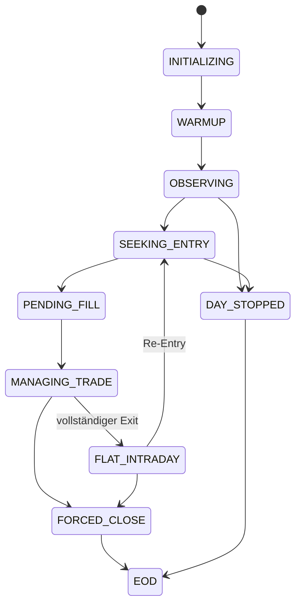

# ODIN/IA — Hybrid Intraday Trading System (Long-only, Equities)  
## Unified Concept v2.1: Symmetric Hybrid (QuantEngine ⇄ LLM)

**Stand:** 2026-02-20  
**Version:** 2.1 (konzeptionell & algorithmisch; absichtlich ohne Framework-/Provider-Festlegung)

> **Hinweis:** Dieses Dokument ist **keine Anlageberatung**. Es beschreibt eine Architektur-/Algorithmus-Spezifikation für ein Intraday-Trading-System.

---

## Normative Sprache

Dieses Dokument verwendet folgende Modalverben:

- **MUSS**: zwingend erforderlich  
- **DARF NICHT / NIE**: verboten  
- **SOLL**: dringend empfohlen (Abweichung nur mit dokumentierter Begründung)  
- **KANN**: optional

---

## Inhaltsverzeichnis

1. [Zielbild und Scope](#1-zielbild-und-scope)  
2. [Daten, Zeitauflösung und Feature-Grundlage](#2-daten-zeitauflösung-und-feature-grundlage)  
3. [Systemarchitektur und Verantwortlichkeiten](#3-systemarchitektur-und-verantwortlichkeiten)  
4. [Signal- und Entscheidungs-Hierarchie](#4-signal--und-entscheidungs-hierarchie)  
5. [Regime-, Pattern- und Strategiemodell](#5-regime--pattern--und-strategiemodell)  
6. [Symmetric Hybrid Protocol](#6-symmetric-hybrid-protocol)  
7. [Strategielogik im Detail](#7-strategielogik-im-detail)  
8. [Stops, Profit-Protection, Trailing, Scaling](#8-stops-profit-protection-trailing-scaling)  
9. [Risk & Guardrails](#9-risk--guardrails)  
10. [Execution Policy ohne Orderbuchdaten](#10-execution-policy-ohne-orderbuchdaten)  
11. [LLM-Integration: Input, Output, Sicherheit](#11-llm-integration-input-output-sicherheit)  
12. [Backtesting- & Validierungsdesign](#12-backtesting--validierungsdesign)  
13. [Challenger-Suite: 20 Intraday-Szenarien](#13-challenger-suite-20-intraday-szenarien)  
14. [Observability, Audit, Reproduzierbarkeit](#14-observability-audit-reproduzierbarkeit)  
15. [Edge Cases & Failure Modes](#15-edge-cases--failure-modes)  
16. [Roadmap & offene Entscheidungen](#16-roadmap--offene-entscheidungen)  
17. [Appendix: Enums, Schemata, Glossar](#17-appendix-enums-schemata-glossar)  

---

## 1. Zielbild und Scope

### 1.1 Zielbild

Das System handelt **Aktien (Equities)** intraday, **Long-only**, mit Fokus auf:

- **Entry-Timing** nach Open-Volatilität und Konsolidierung (typisch 15–45 Min nach Open, aber adaptiv)  
- **Gewinnmitnahmen** in parabolischen Bewegungen (Exhaustion/Climax)  
- **Re-Entry / Aufstocken** nach bestätigter Trendwiederaufnahme (Multi-Cycle-Day)  
- **Regime-Umschalten** (Trend ↔ Range ↔ HighVol ↔ Recovery) ohne hektisches Overtrading  
- robuste Reaktion auf **Extremsituationen** (Breakout-Spike, Crash/News-Schock, Halt/Resume)

### 1.2 Kernthese zur Zeitauflösung (Stakeholder-Entscheidung)

- **1-Minute** = Rohsignal + Monitoring (schnelle Ereigniserkennung)  
- **3-Minute** = Entscheidungs-/KPI-Ebene (weniger Noise, bessere Stabilität)  
- **10-Minute** = Bestätigungsebene (Trend-Quercheck, Fakeout-Filter)

Zielkonflikt (Noise vs. Latenz) wird durch **Hierarchie** gelöst statt durch “eine perfekte Bargröße”.

### 1.3 Nicht-Ziele

- Keine Tick-/Orderbuch-Strategien  
- Kein Arbitrage/HFT  
- Keine Overnight-Positionen  
- Kein internes Symbol-Screening (Symbolauswahl extern)

### 1.4 Designprinzip: Duo auf Augenhöhe

Das System ist ein **symmetrischer Hybrid**:

- **QuantEngine**: deterministische KPIs, Signale, Scores, Vetos, Risk-Fakten  
- **LLM**: Lagebeurteilung (Regime/Szenario), Pattern-Hypothesen, taktische Profile/Parameter (bounded), Kontext-Interpretation

**Gleichberechtigung bedeutet:**
- Beide liefern **Vote + Confidence** (Entry/Exit/No-Trade)  
- Beide können **Soft-Vetos** setzen (z. B. “Unsicherheit”, “Exhaustion Risk”)  
- Der Arbiter kombiniert beides **deterministisch**  
- **Ausnahme:** Harte Risk-Exits (Stop, Forced Close, Kill-Switch) sind nicht verhandelbar.

---

## 2. Daten, Zeitauflösung und Feature-Grundlage

### 2.1 Datenrestriktion (hart)

Verfügbar sind **nur**:

- **1-Min OHLCV Bars** (Open/High/Low/Close/Volume)

Nicht verfügbar:
- Bid/Ask, Spread, Orderbuch (L2), Ticks, Marktbreite, Imbalance

**Konsequenz:**  
- Liquiditäts-/Ausführungsqualität wird über Proxies modelliert (Volumen/Range/Fill-Rate).  
- Alle Signale müssen aus OHLCV ableitbar sein.

### 2.2 Timeframes und Rolling Buffers

Es existieren pro Instrument drei Rolling Buffers:

- `B1`: 1m Bars (Monitor)  
- `B3`: 3m Bars (Decision)  
- `B10`: 10m Bars (Confirmation)

**Lookback-Mindestanforderung (normativ):**
- Für ATR(14), RSI(14), ADX(14): mindestens `period + 1` Bars (also 15) pro Timeframe.  
- Für Bollinger(20): mindestens 21 Bars.  
- Zusätzlich: mindestens 1 Tag intraday für VWAP.

### 2.3 Resampling-Regeln

**3m-Bar** = Aggregation aus drei 1m-Bars:
- O = Open(Bar1), H = max(High), L = min(Low), C = Close(Bar3), V = Sum(Volume)

**10m-Bar** analog (10x 1m).

### 2.4 Feature-Katalog (nur OHLCV)

#### 2.4.1 Primär (3m)

- VWAP intraday (aus 1m Volume, aber als Feature je 3m Snapshot)
- EMA(9), EMA(21)
- RSI(14)
- ATR(14)
- ADX(14)
- Volumenratio: `vol_ratio = vol / SMA(vol, 20)`
- VWAP-Extension: `ext_vwap_atr = (close - vwap) / atr`
- Struktur: Swing-High/Low, Higher-Low, Lower-High (deterministisch)

#### 2.4.2 Bestätigung (10m)

- EMA(9), EMA(21)
- ADX(14) oder Trendstärke-Proxies
- Compression/Expansion: ATR-Slope, Range-Slope

#### 2.4.3 Monitoring (1m)

- Jump/Crash Detection: `abs(return_1m)` + Volumenratio
- Wick Ratios (oben/unten): z. B. `(high - max(open, close)) / (high-low)`
- Micro-Structure Proxy: Folge großer Kerzen in eine Richtung, “climax bar”
- Bar-Completeness, Staleness, Outlier

#### 2.4.4 Mehrtägige Kontextfeatures (aus OHLC aggregiert)

- ADR(14): Average Daily Range (14 Tage) aus Daily Aggregation der 1m Bars  
- Relative Move: `intraday_range / ADR14`  
- Gap vs. Vortagsschluss (wenn Vortag verfügbar)

Diese Features erlauben robuste “ist das schon zu weit gelaufen?”-Checks ohne L2.

---

## 3. Systemarchitektur und Verantwortlichkeiten

### 3.1 Schichtenmodell (fachlich)

1. **Data Layer**
   - Datenempfang, Validierung, Buffers, Resampling, DQ-Gates, Event-Emission

2. **Brain Layer**
   - QuantEngine, LLM Engine, Strategy Rules, Decision Arbiter, Regime Fusion

3. **Risk & Execution Layer**
   - Risk Gate, OMS (Stops/Targets/Scaling), Broker Adapter

4. **Control/Observability**
   - Audit Logs, Metrics, Replay/Simulation Runner, Operator Controls (Kill Switch)

### 3.2 Verantwortlichkeits-Matrix (symmetrisch)

| Aufgabe | QuantEngine | LLM | Rules/Arbiter | Risk/OMS |
|---|---:|---:|---:|---:|
| KPIs berechnen | ✅ | ⛔ | ⛔ | ⛔ |
| Regime-Vote (enum + confidence) | ✅ | ✅ | ✅ (Fusion) | ⛔ |
| Pattern-Kandidaten | ✅ (heuristisch) | ✅ (semantisch) | ✅ (aktivieren) | ⛔ |
| Entry/Exit/Scale Vote | ✅ | ✅ | ✅ (final) | ⛔ |
| Harte Vetos (Warmup, DQ) | ✅ | ✅ (Safety) | ✅ | ✅ |
| Stop/Targets/Forced Close | ⛔ | ⛔ | ⛔ | ✅ |
| Parameterprofile (Trail/Scale/Protection) | ✅ (Baseline) | ✅ (Modifier) | ✅ (Konfliktlösung) | ✅ (Enforce) |

### 3.3 “Gegenseitige Schutzwirkung” (wichtiges Designziel)

- **Quant schützt vor LLM-Fehlern:**  
  - invalides Schema → verworfen  
  - LLM-Vote ohne Quant-Bestätigung → kein Entry  
  - numerische Grenzen: keine Stop/Size-Freiheit

- **LLM schützt vor Quant-Blindheit:**  
  - erkennt “Plateau ist Distribution” vs. “Plateau ist Pause”  
  - erkennt Wechsel in “HighVol/Chop” früher, bevor Quant-Filter zu spät reagieren  
  - kann “No-Trade” empfehlen, obwohl Quant formal ok ist (z. B. unsaubere Struktur)

---

## 4. Signal- und Entscheidungs-Hierarchie

### 4.1 Tagesphasen (parameterisiert)

Zeiten in **Exchange Time Zone** (MarketClock).

Empfohlene Default-Phasen (US-Beispiel, aber parametrisierbar):
- **Opening Buffer:** Open bis +15 min (Diagnose, keine Entries)  
- **Active Phase:** +15 min bis ~45 min vor Close  
- **Power Hour:** letzte ~60 min (defensiver, keine neuen Entries nach Cutoff)  
- **Forced Close:** letzte 10–15 min (Positionen schließen)  
- **EOD:** Logging/Recon

### 4.2 FSM (pro Instrument)

### 4.3 Decision Loop (3m Decision-Bar)

Pro 3m-Bar-Close:

1. **Risk Hard Stop**: Tages-DD, Exposure-Limit, Max-Cycles  
2. **Data Quality Gate**: Bar completeness/staleness/outlier/crash  
3. Snapshot (1m/3m/10m) erstellen  
4. QuantEngine Output berechnen (KPIs/Score/Vetos)  
5. LLM Output (aus Store, TTL-Check) lesen  
6. Regime Fusion (Quant + LLM + 10m Confirm + Hysterese)  
7. Strategy Rules (Setup FSMs) evaluieren  
8. Arbiter: Votes + Konfliktlösung → TradeIntent/None  
9. Risk Gate: Sizing/RR/Budget  
10. OMS: Orders/Stops/Targets oder Reject (mit Grund)

**Ein-Intent-pro-Decision-Bar:** Max 1 Intent. Tie-Break: Exit > Entry.

### 4.4 1m Monitor Events (nur Eskalation)

1m Layer erzeugt Events:
- `CRASH_DOWN`, `SPIKE_UP`
- `EXHAUSTION_CLIMAX`
- `STRUCTURE_BREAK_1M`
- `DQ_STALE`, `DQ_OUTLIER`, `DQ_GAP`
- `VWAP_CROSS_1M`, `EMA_CROSS_1M` (Hinweise)

Events wirken so:
- triggern LLM refresh  
- schalten Risk Mode / Protect Mode  
- priorisieren Exit Checks im nächsten 3m Cycle

### 4.5 Data Quality Gates (bar-only, normativ)

Reihenfolge MUSS eingehalten werden:

1. **Bar Completeness**  
   - OHLC vorhanden, Volume ≥ 0  
   - unvollständig → verwerfen + `DQ_ALERT`

2. **Time Sync** (wenn verfügbar)  
   - Drift > Schwelle → Warnung (kein sofortiger Stop)

3. **Staleness**  
   - keine neue 1m-Bar innerhalb von `stale_threshold` (z. B. 120s) während Active → `DQ_STALE`  
   - wenn Position offen: Kill-Switch/Forced-Exit (konfigurierbar)

4. **Crash Detection (markieren, nicht verwerfen)**  
   - Move > `crash_pct` innerhalb 1m **und** Volumenratio > `crash_vol_ratio`  
   - emittiere `CRASH_DOWN`/`SPIKE_UP`

5. **Outlier Filter (nur wenn kein CrashSignal)**  
   - Move extrem, aber ohne Volumenbestätigung → Bar verwerfen

6. **Gap Detection**  
   - Open vs. vorheriger Close > Schwelle → `DQ_GAP` (realistisch, nicht verwerfen)  
   - Strategieregeln verschärfen (z. B. keine Market-Entries, größere Stops, kein Add)

---

## 5. Regime-, Pattern- und Strategiemodell

### 5.1 Gemeinsames Regime-Vokabular (enum)

- `OPENING_VOLATILITY`  
- `TREND_UP`  
- `TREND_DOWN`  
- `RANGE_BOUND`  
- `HIGH_VOLATILITY`  
- `BREAKOUT_ATTEMPT`  
- `EXHAUSTION_RISK`  
- `RECOVERY`  
- `UNCERTAIN`

### 5.2 Regime Hysterese (Anti-Flipping)

- Regime-Wechsel nur nach **2 aufeinanderfolgenden** 3m-Closes mit neuem Regime  
- Ausnahme: Crash-Event kann sofort `HIGH_VOLATILITY` erzwingen

### 5.3 “Strategie-Policy Map” (Regime → erlaubte Aktionen)

| Regime | Primärziel | Entries? | Adds? | Scale-Out? | Re-Entry? |
|---|---|---:|---:|---:|---:|
| OPENING_VOLATILITY | Diagnose | ❌ | ❌ | nur Risk | ❌ |
| TREND_UP | Trend reiten | ✅ | ✅ | Standard/Trail | ✅ (nach Korrektur) |
| RANGE_BOUND | Kapital schützen | selten | ❌ | klein/defensiv | selten |
| HIGH_VOLATILITY | Überleben | sehr selektiv | ❌ | aggressiv (risk) | erst nach Beruhigung |
| EXHAUSTION_RISK | Gewinne schützen | ❌ (spät) | ❌ | aggressiv | ggf. später |
| RECOVERY | Turn nutzen | ✅ (konservativ) | selektiv | Standard | ✅ |
| TREND_DOWN | Long-only: vermeiden | ❌ | ❌ | Exit/flat | ❌ |
| UNCERTAIN | warten | ❌ | ❌ | nur risk | ❌ |

### 5.4 Patterns / Setups (State Machines)

Alle Setups existieren in Form einer FSM, die auf 3m-Entscheidungslogik basiert und 1m-Ereignisse als Trigger nutzt.

Minimal:
- Setup A: Opening Consolidation → Trend Entry  
- Setup B: Flush → Reclaim → Run  
- Setup C: Coil/Compression → Breakout  
- Setup D: Pullback-Reentry / Scale-Up

**Pattern-Aktivierung (hybrid, normativ):**
- LLM liefert `pattern_candidates` (Enum + confidence + phase)  
- Quant/Rules müssen Pattern-Features bestätigen  
- Aktivierung nur wenn: `llm_confidence >= 0.5` **UND** `quant_pattern_confirm = true`

---

## 6. Symmetric Hybrid Protocol

### 6.1 Dual-Key Decision (Grundsatz)

Entscheidungen entstehen aus:
- Quant-Key = QuantVote + Confidence + HardVetoFlags + Score
- LLM-Key = LlmVote + Confidence + SafetyFlags + TacticalControls

Arbiter kombiniert beides deterministisch.

### 6.2 Votes (bounded enums)

Votes:
- `STRONG_ENTRY`, `ALLOW_ENTRY`, `NO_TRADE`
- `HOLD`, `EXIT_SOON`, `EXIT_NOW`
- `ALLOW_REENTRY`, `BLOCK_REENTRY`
- `SAFETY_VETO` (LLM) / `HARD_VETO` (Quant)

### 6.3 Arbiter-Logik (konkret)

#### 6.3.1 Entry

Entry MUSS erfüllt sein:

- **keine** Quant Hard Vetos  
- LLM nicht `SAFETY_VETO`  
- QuantVote ∈ {ALLOW_ENTRY, STRONG_ENTRY}  
- LlmVote ∈ {ALLOW_ENTRY, STRONG_ENTRY}  
- Confidences beider Seiten ≥ `min_conf_entry`  
- 10m Confirmation nicht gegensätzlich (z. B. 10m TrendDown)

Optional: `quant_score >= threshold` (z. B. 0.55)

#### 6.3.2 Scale-In / Add

Add MUSS zusätzlich:
- Struktur-Confirm (Higher-Low)  
- kein Exhaustion-Risk  
- risk_budget_remaining ausreichend

#### 6.3.3 Scale-Out / Tactical Exit

- **Hard-Risk** (Stop, Kill, Forced Close): sofort  
- Sonst gilt:
  - Wenn **eine** Seite `EXIT_NOW` → setze `PENDING_EXIT`  
  - Exit wird ausgeführt, wenn innerhalb von N=1–2 3m-Bars bestätigt **oder** 1m-Event `EXHAUSTION_CLIMAX`/`STRUCTURE_BREAK_1M` eintritt.  
  - Wenn nicht bestätigt: `EXIT_SOON`-Profile (Trail tighter, Scale-Out aggressiver)

#### 6.3.4 Re-Entry (Multi-Cycle)

Re-Entry nur wenn:
- State = `FLAT_INTRADAY` oder Position stark reduziert  
- CycleCounter < MaxCycles  
- beide Keys stimmen zu (`ALLOW_REENTRY` bzw. `ALLOW_ENTRY`)  
- 10m Confirmation unterstützt (oder mindestens nicht widerspricht)

### 6.4 Parameter-Fusion (Quant Baseline + LLM Modifier)

Für risiko-relevante Parameter gilt **konservativ gewinnt**:

- Beispiel: Trailing-Faktor  
  - Quant liefert `base_trail_factor`  
  - LLM liefert `trail_mode` (WIDE/NORMAL/TIGHT) → multiplier  
  - Effective: `effective_trail_factor = min(base_trail_factor, base_trail_factor * llm_multiplier)` wenn llm tighter, bzw. clamp auf [min,max]

Generelle Regeln:
- LLM darf nur **enger** machen als Safety-Floor? → konfigurierbar  
- Wenn LLM “weiter” will, darf es nur bis zu einem quant-definierten Maximum.

---

## 7. Strategielogik im Detail

### 7.1 Gemeinsame “Gates” vor jedem Entry (hart)

Entry ist blockiert, wenn:
- Opening Buffer aktiv  
- Warmup unvollständig  
- Data Quality nicht ok  
- Tages-DD / Max-Cycles erreicht  
- Liquiditätsproxy zu schwach  
- Regime `TREND_DOWN`/`UNCERTAIN`/`HIGH_VOLATILITY` (je nach Policy)

### 7.2 Setup A — Opening Consolidation → Trend Entry

**Ziel:** “richtiger Einstiegszeitpunkt” nach Open, wenn erste High-Vol-Phase vorbei ist.

#### 7.2.1 Opening-Beruhigung (Detection)

Kombination aus:
- Zeitgate: `t >= open + opening_buffer_minutes`  
- ATR-Decay: `atr_current / atr_opening_baseline < threshold`  
- Range-Contraction: 2 von 3 letzten 3m Bars kleiner  
- VWAP-Akzeptanz: Preis handelt nahe/über VWAP, keine massiven Rejects

#### 7.2.2 Entry-Typen

1) **Pullback-Entry**
- Regime TREND_UP oder BREAKOUT_ATTEMPT  
- Pullback in VWAP/EMA-Zone  
- 1m zeigt “Selling Pressure Decay” (kleinere rote Kerzen, lower volume)  
- 3m Close zurück über EMA9

2) **Breakout-Entry**
- 3m Konsolidierungsrange wird gebrochen  
- 3m Range Expansion (z. B. >1.5× ATR(3m))  
- Volume ratio > threshold  
- 10m Confirmation nicht dagegen

#### 7.2.3 Add-Regeln

- Add nur, wenn nach Entry:
  - höhere Tiefs bestätigt  
  - kein Exhaustion-Risk  
  - 1m Monitor kein `EXHAUSTION_CLIMAX`

### 7.3 Setup B — Flush → Reclaim → Run (V-Reversal / Bottom)

#### 7.3.1 FLUSH_DETECTED (1m)

- Return > `flush_pct` in <= `flush_minutes`  
- Volumenratio > threshold  
- Wick unten hoch (Capitulation) KANN Bonus sein

#### 7.3.2 RECLAIM (3m)

- Close > VWAP  
- EMA9 beginnt zu drehen  
- erste Higher-Low Struktur sichtbar  
- LLM regime `RECOVERY` oder `BREAKOUT_ATTEMPT` (confidence >= min)

#### 7.3.3 RUN

- Break lokaler Highs  
- Add möglich nach Pullback + HL

#### 7.3.4 Failure Modes

- Bull Trap: reclaim, dann sofort unter VWAP zurück → Exit klein, cooldown

### 7.4 Setup C — Coil/Compression → Breakout

#### 7.4.1 COIL_FORMING (3m/10m)

- Range schrumpft über N Bars  
- ATR-Slope negativ (Compression)  
- klare Grenzen (Upper/Lower Band)

#### 7.4.2 BREAKOUT

- 3m Close außerhalb Range  
- Range expansion + volume confirm  
- Fakeout-Regel: reentry in coil innerhalb M Bars → Exit

### 7.5 Setup D — Re-Entry / Aufstocken nach Korrektur

**Ziel:** nach Teil-/Gesamtexit eine neue Opportunität erkennen (Talsohle → Trend up).

Erkennung:
- Korrektur hat Struktur (Lower-Lows enden, Higher-Low entsteht)  
- VWAP reclaim + 10m trend kippt (oder stabilisiert)  
- LLM sieht “re-accumulation” statt “distribution”

Aktion:
- Re-Entry mit konservativerem Profil (kleiner, engerer Stop)  
- Aufstocken nur, wenn existierende Restposition + Struktur bestätigt

---

## 8. Stops, Profit-Protection, Trailing, Scaling

### 8.1 Initial Stop (normativ)

Initial Stop wird aus Kandidaten berechnet:

- **Structure Stop:** unter letztem validen Swing-Low / Flush-Low  
- **ATR Stop:** `entry - stop_atr_factor * ATR(3m)`  
- Optional: VWAP-Offset Stop (wenn Trend-VWAP relevant): `vwap - vwap_offset_atr * ATR`

Final:
- `initial_stop = min(structure_stop, atr_stop, vwap_offset_stop)` (für Long: “tiefer” = mehr Raum)  
- aber: Risk Gate begrenzt maximale Stop-Distanz (sonst Sizing zu klein / RR kaputt)

### 8.2 Trailing Stop (Highwater, never down)

Stop hat eine **Highwater Mark**:
- Stop darf nur steigen, nie fallen.

Stop-Kandidaten (für Long):
- ATR Trail: `highwater - trail_atr_factor * ATR(3m)`  
- Structure Trail: unter letztem bestätigten Higher-Low minus buffer  
- Time-based Tightening in Power Hour

Effective Stop:
- `effective_stop = max(current_stop, atr_trail, structure_trail, powerhour_trail)`  
  (max = engster/höchster Stop, konservativ)

### 8.3 Profit Protection (MFE-Lock)

MFE = Maximum Favorable Excursion seit Entry.

R = Entry - InitialStop (positiv).

Beispiel-Ladder (konfigurierbar):
- bei 1R erreicht: Stop auf Break-Even + 0.1R  
- bei 2R erreicht: Stop auf +1R  
- bei 3R erreicht: Stop auf +2R  
- etc.

**Konfliktlösung:** LLM darf “mehr Schutz” anfordern (AGGRESSIVE), aber darf nicht unter Safety-Floor gehen.

### 8.4 Scaling-Out (Tranchen)

Profile (Beispiel):
- STANDARD: 30% @1R, 30% @2R, 20% @3R, 20% Runner  
- AGGRESSIVE: 40% @1R, 30% @1.5R, 20% @2R, 10% Runner  
- TRAIL_ONLY: keine Targets, alles trail (nur wenn beide Keys + TrendConfirm)

### 8.5 Parabolic/Exhaustion Handling

Triggerquellen:
- 1m Event `EXHAUSTION_CLIMAX`  
- Regime `EXHAUSTION_RISK`  
- ADR14-Extension: intraday move > x% ADR

Aktionen:
- Scale-Out Profil aggressiver  
- Trail enger  
- Adds blockieren  
- wenn Struktur bricht: Exit

---

## 9. Risk & Guardrails

### 9.1 Risk Budgets (Beispiele)

- Max Risk/Trade: 2–3% Tageskapital  
- Max Tagesverlust (Hard Stop): 10%  
- Max Cycles/Tag: 3  
- Exposure Limit: 80%

### 9.2 Liquiditätsgates ohne Spread (Proxy)

MUSS erfüllt sein:
- Preis > Mindestpreis  
- Volumen (z. B. letzte 30m) > Schwelle  
- keine anhaltenden 0-Volumen Bars  
- Fill Difficulty Proxy: wenn wiederholt Limits nicht gefüllt werden → Degradation / Block

### 9.3 Anti-Overtrade

- Cooldown nach Stop-Out (z. B. 15 min oder bis Regime stabil)  
- Entry nur auf 3m-Takt  
- Max Orders/Minute (soft) und Max Cancel/Replace Rate (falls genutzt)  
- In RANGE_BOUND/UNCERTAIN: strenger Gate (no-trade default)

### 9.4 Kill Switch (Safety)

Auslöser (Beispiele):
- Data staleness > threshold  
- mehrfaches Crash-Event + große Slippage  
- System-Fehler im OMS  
- Operator-Manuell

Aktion:
- Positionen schließen (Forced), dann DAY_STOPPED

---

## 10. Execution Policy ohne Orderbuchdaten

### 10.1 Grundsatz

Ohne Bid/Ask: Execution ist konservativ, limit-lastig, event-getrieben.

### 10.2 Ordertypen (Policy)

- Entry: Limit  
- Targets: Limit  
- Stop: Stop-Limit mit zeitlichem Fallback auf Stop-Market  
- Forced Close / Kill: Market

Market Orders sind NUR erlaubt bei:
- Forced Close  
- Kill Switch  
- Stop-Fallback  
- Gap unter Stop

### 10.3 Preiszonen aus Bars

Entry-Zone:
- ideal = Pullback-Level (VWAP/EMA/Struktur)  
- max = ideal + cap (z. B. 0.2R)

Repricing (falls implementiert):
- max K Zyklen, kleine Schritte, nie > max  
- wenn nicht gefüllt: Abandon (Opportunity verpasst)

---

## 11. LLM-Integration: Input, Output, Sicherheit

### 11.1 Input-Paket (komprimiert)

- Sequenzen von 1m/3m/10m Bars (kompakt)  
- KPIs und Ratios  
- Tagesphase  
- Monitor Events  
- optional strukturierte News-Metadaten (ohne Rohtexte)

### 11.2 Call-Cadence (eventgetrieben)

Baseline:
- normal: alle 6–12 min  
- high vol: alle 3–6 min

Sofort:
- Crash/Spike  
- Exhaustion Climax  
- Statewechsel (Entry/Exit)  
- bestätigter Regimewechsel (10m)

### 11.3 Criticality/TTL

- Für Entries/Re-Entries MUSS LLM Output “frisch” sein (TTL z. B. <= 6 min)  
- Für Exits/Stops ist frischer Output SOLL, aber nicht zwingend (Risk dominiert)  
- Bei stale/fehlend: keine neuen Entries

### 11.4 Output-Schema (bounded, normativ)

- JSON only, required fields  
- Enums + Confidences  
- Freitext = logging_only

### 11.5 Sicherheitsmaßnahmen

- Schema-Validation  
- Rate-Limit + single-flight (kein Prompt-Sturm)  
- Anomalie-Detection: wenn Output stark abweicht ohne Marktsignal → verwerfen  
- Prompt-Versionierung + Rollback

---

## 12. Backtesting- & Validierungsdesign

### 12.1 Ziele

- gleicher Decision Path in Sim und Live  
- realistische Fills und Kosten trotz fehlender Spread-Daten  
- deterministische Replays inkl. LLM via Caching

### 12.2 Daten-Hygiene

- Splits/Corporate Actions berücksichtigen (Preis/Volumen adjustiert)  
- Survivorship Bias vermeiden (wenn möglich)  
- Timezone/Kalender korrekt (Handelstage, Halts)

### 12.3 Fill-Modell (OHLCV)

- Fills frühestens nächste Bar  
- Limit Fill, wenn High/Low kreuzt  
- konservativ: Fill schlechterer Preis als Limit möglich (Slippage)

### 12.4 Kostenmodell ohne Spread

- Commission fix/param  
- Spread Proxy: Funktion von ATR/Preis, plus Mindest-bps  
- Slippage Proxy: % der Bar-Range abhängig von Volumenratio und Volatilitätsregime  
- Stress: bei Crash/HighVol Faktor erhöhen

### 12.5 Walk-Forward und Robustheit

- 60 Tage train / 20 Tage test, rollierend  
- Sensitivität +/-10% (Plateau-Test)  
- Ablation: Hybrid vs Quant-only vs LLM-only (Mehrausbeute messen)  
- Scenario-Backtests: Challenger Suite gezielt

### 12.6 Qualitätsmetriken (nicht nur P&L)

- Max Drawdown, Profit Factor, Hit Rate  
- Turnover / Trades pro Tag  
- “Capture Ratio”: Anteil an Tagesrange eingefangen  
- “Overtrade Score”: unnötige Trades in Chop  
- “Safety Score”: Verhalten in Crash/Halt Szenarien

---

## 13. Challenger-Suite: 20 Intraday-Szenarien

Jedes Szenario definiert:
- Detection Cues  
- Erwartetes Verhalten  
- pass/fail Kriterien

| # | Szenario | Detection (Kurz) | Erwartetes Verhalten |
|---:|---|---|---|
| 1 | Open HV → Konsolidierung → Breakout | ATR-decay, contraction, breakout + vol | Setup A Entry nach Buffer, Add nach HL |
| 2 | Open Drive → Plateau → Fade | Momentum drop, Lower-Highs, exhaustion | Scale-Out früh, Trail tight, flat vor Close |
| 3 | Gap Up & Reversal | spike + wick, VWAP fail | No-trade oder schneller Exit |
| 4 | Gap Down → V-Reversal → Rally | flush + reclaim + HL | Setup B konservativ |
| 5 | 8–10% Dump → Recovery | CRASH_DOWN + vol spike | Protect → Reclaim Entry |
| 6 | Lunch Chop | ADX low, ATR-decay | Range: wenige Trades |
| 7 | Midday Coil → Breakout | 10m compression | Setup C + Fakeout-Regeln |
| 8 | Grind-Up Trend Day | 10m trend stabil | Trail-only möglich |
| 9 | Grind-Down | TrendDown | No-trade (long-only) |
|10 | False Breakout Trap | reentry in formation | Exit + cooldown |
|11 | Parabolic Blowoff | climax bar, ADR extension | aggressive scale-out, tight trail |
|12 | Shock Down | crash + follow-through | Stop/Kill, ggf. day-stopped |
|13 | Halt/Resume | gaps/missing bars | Pause, re-assess, no blind |
|14 | Morning weak → Afternoon reversal | regime shift + confirm | Cycle2 re-entry klein |
|15 | Double Bottom W | HL confirm + VWAP reclaim | re-entry/scale-up |
|16 | Low-Volume Breakout | breakout ohne vol confirm | block gate |
|17 | VWAP Whipsaw | crosses häufig | range: no-trade |
|18 | Up → Deep Pullback → 2nd leg | drawdown k·ATR, reclaim | partial exit + re-entry |
|19 | Late ramp | vol up late | entries bis cutoff, sonst manage |
|20 | Multi-cycle (3x) | mehrere runs | budgets, cooldowns, konservativer Zyklus2+ |

---

## 14. Observability, Audit, Reproduzierbarkeit

### 14.1 Audit-Trail (normativ)

Jeder 3m Cycle loggt:
- Snapshot-Hash  
- Quant Output  
- LLM Output (inkl. Prompt-Version)  
- Fusion-Entscheidung  
- Intent/Reject Grund  
- OMS Aktionen  
- FSM Transition  
- CycleNumber

### 14.2 Repro

- Prompt semver  
- LLM response caching  
- Replay deterministic (same inputs -> same decisions)

---

## 15. Edge Cases & Failure Modes

| Szenario | Erkennung | Reaktion |
|---|---|---|
| LLM outage | timeouts / invalid schema | Degraded: keine neuen Entries, manage/close |
| Daten-Feed-Stale | keine 1m bars | Kill switch / forced close |
| Flash crash | CRASH_DOWN | Exit/Protect, ggf. DAY_STOPPED |
| Gap unter Stop | open < stop | sofortiger Exit (fallback market) |
| Halt/Resume | missing bars / big gap | Pause, Re-Assessment, keine Adds |
| Outlier prints | Outlier ohne Vol | verwerfen + alert |
| Overtrading in chop | viele rejections/whipsaws | tighten gates, cooldown |

---

## 16. Roadmap & offene Entscheidungen

- genaue Schwellen (ATR-decay, crash_pct, min_conf, etc.) via Backtests kalibrieren  
- ob TRAIL_ONLY für bestimmte Regime default sein darf  
- genaue Definition “liquidity proxy” je Markt (US vs EU)  
- wie strikt LLM “wider” gegen Quant sein darf (z. B. Soft-Veto im Entry)

---

## 17. Appendix: Enums, Schemata, Glossar

### 17.1 Enums (Beispiel)

- `regime`: OPENING_VOLATILITY, TREND_UP, TREND_DOWN, RANGE_BOUND, HIGH_VOLATILITY, BREAKOUT_ATTEMPT, EXHAUSTION_RISK, RECOVERY, UNCERTAIN  
- `vote`: STRONG_ENTRY, ALLOW_ENTRY, NO_TRADE, HOLD, EXIT_SOON, EXIT_NOW, ALLOW_REENTRY, BLOCK_REENTRY, SAFETY_VETO  
- `trail_mode`: WIDE, NORMAL, TIGHT  
- `profit_protection_profile`: OFF, STANDARD, AGGRESSIVE  
- `scale_out_profile`: STANDARD, AGGRESSIVE, TRAIL_ONLY  
- `risk_mode`: NORMAL, CONSERVATIVE, DEFENSIVE  
- `entry_timing_bias`: IMMEDIATE, WAIT_FOR_PULLBACK, WAIT_FOR_CONFIRM

### 17.2 Mini-Glossar

- **ADR14**: Average Daily Range über 14 Tage  
- **ATR**: Average True Range (Volatilität)  
- **VWAP**: Volume Weighted Average Price  
- **MFE**: Maximum Favorable Excursion  
- **R**: Risiko-Einheit = Entry − InitialStop (Long)  
- **Cycle**: vollständiger Entry→Exit Run auf demselben Instrument am selben Tag  
