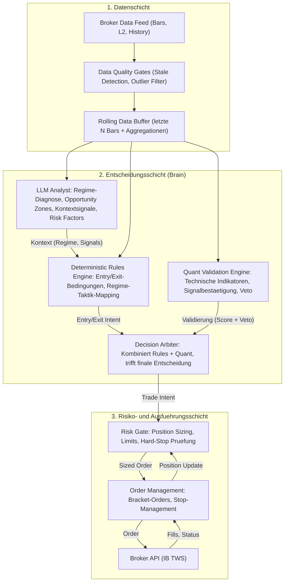
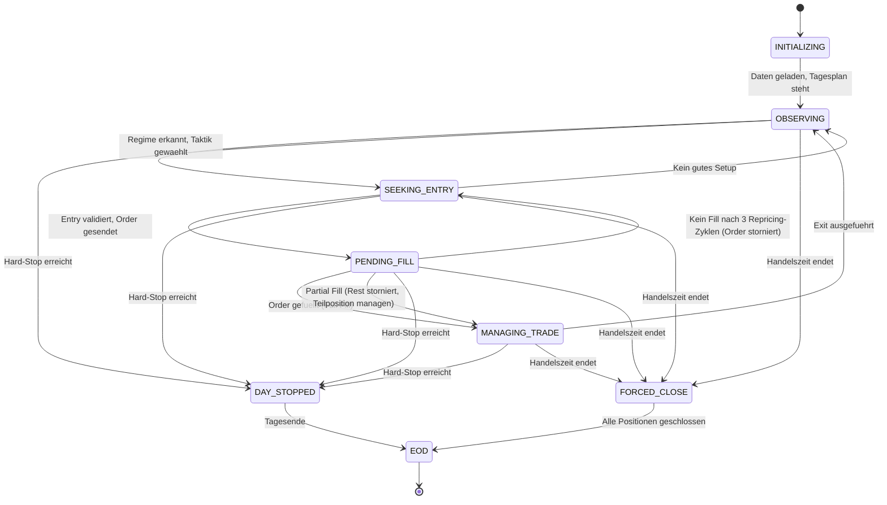

# LLM Intraday Trading Agent — Konzept v1.5

Hybrides System aus LLM-Situationsanalyse, deterministischen Regeln und quantitativer Validierung — Februar 2026

---

## Inhaltsverzeichnis

1. [Systemparameter & Rahmenbedingungen](#1-systemparameter--rahmenbedingungen)
2. [Designphilosophie](#2-designphilosophie)
3. [Vier-Schichten-Architektur](#3-vier-schichten-architektur)
4. [Tages-Lifecycle](#4-tages-lifecycle)
5. [Zustandsmaschine des Agenten](#5-zustandsmaschine-des-agenten)
6. [LLM-Integration & Prompt-Architektur](#6-llm-integration--prompt-architektur)
7. [Deterministic Strategy Rules](#7-deterministic-strategy-rules)
8. [Quantitative Validierungsschicht](#8-quantitative-validierungsschicht)
9. [Entscheidungsschleife (Decision Loop)](#9-entscheidungsschleife-decision-loop)
10. [Risikomanagement & Guardrails](#10-risikomanagement--guardrails)
11. [Anti-Halluzination & Absicherung](#11-anti-halluzination--absicherung)
12. [Datenarchitektur & Subscriptions](#12-datenarchitektur--subscriptions)
13. [Intraday Regime Detection](#13-intraday-regime-detection)
14. [Volatilitaetsabnahme im Tagesverlauf](#14-volatilitaetsabnahme-im-tagesverlauf)
15. [Execution Policy](#15-execution-policy)
16. [News Security & Input Validation](#16-news-security--input-validation)
17. [Backtesting & Validierungspipeline](#17-backtesting--validierungspipeline)
18. [Model Risk Management](#18-model-risk-management)
19. [Security & Isolation](#19-security--isolation)
20. [Operationelle Sicherheit](#20-operationelle-sicherheit)
21. [Edge Cases & Failure Modes](#21-edge-cases--failure-modes)
22. [Monitoring & Logging](#22-monitoring--logging)
23. [Appendix: Glossar](#23-appendix-glossar)

---

## 1. Systemparameter & Rahmenbedingungen

| Parameter | Wert |
|-----------|------|
| Tageskapital | 10.000 EUR (aufgeteilt auf aktive Pipelines) |
| Max. Tagesverlust (Hard-Stop) | -10% (1.000 EUR) — global ueber alle Pipelines |
| Instrumente | 1–3 parallel (je Pipeline ein Instrument) |
| Richtung | Long only |
| Instrumenttyp | Aktien |
| Handelszeiten | Pre-Market + RTH |
| Autonomie | Vollautomatisch |

> **Kerngedanke:** Der Agent betreibt 1–3 isolierte Pipelines parallel, jede Pipeline handelt genau ein Instrument pro Tag. Die Instrumente werden extern vorgegeben und beim Start der Pre-Market-Phase (07:00 ET) eingefroren — kein Symbolwechsel waehrend des Handelstages. Wird ein Instrument vor RTH gehalted oder mit einer Trading-Restriction belegt, wechselt die betroffene Pipeline in DAY_STOPPED (kein Ersatzsymbol, andere Pipelines laufen weiter). Jede Pipeline diagnostiziert selbststaendig das Intraday-Regime (steigend, fallend, seitwaerts) und waehlt die passende Taktik. Am Ende des Handelstages sind alle Positionen aller Pipelines geschlossen.

---

## 2. Designphilosophie

### Das Prinzip der asymmetrischen Verantwortung

Das zentrale Designprinzip lautet: **Das LLM analysiert und kontextualisiert — deterministische Regeln entscheiden und handeln.**

| Faehigkeit | Verantwortlich | Begruendung |
|------------|---------------|-------------|
| Marktlage diagnostizieren (Regime) | LLM Analyst | Musterkennung in komplexen, nicht-stationaeren Situationen |
| Kontextsignale & Opportunity Zones liefern | LLM Analyst | Kontextuelles Verstaendnis von Kursverlaeufen, Nachrichtenlage, Anomalien |
| Entry/Exit-Entscheidung treffen | Deterministic Rules | Testbar, reproduzierbar, kein stochastisches Verhalten |
| Entry-Signale validieren | Quant | Deterministische Gegenkontrolle, Anti-Halluzination |
| Position Sizing | Rules | Muss deterministisch und verlaesslich sein |
| Stop-Loss setzen | Rules | Ausschliesslich ATR-basiert. LLM hat null Einfluss auf Stop-Levels |
| Hard-Stop (Tagesverlust) | Rules | Ultimative Sicherheit, nicht verhandelbar |
| Exit-Timing optimieren | Rules + Quant | Rules reagieren auf LLM-Regime-Wechsel, Quant validiert Signal |
| Order-Execution | Execution | Rein technisch, deterministisch |

> **Eiserne Regel:** Das LLM hat niemals direkten Zugriff auf Broker-APIs und trifft keine Handelsentscheidungen. Es ist ein *Analyst*, kein *Policy-Maker*. Jede LLM-Analyse durchlaeuft zwingend die Deterministic Rules Engine, die Quant-Validierung und die Risiko-Schicht, bevor sie als Order materialisiert wird. Das LLM produziert Kontext und Einschaetzungen in einem strukturierten Format — niemals Handlungsanweisungen.

### Warum ein LLM und nicht nur Quant?

Klassische quantitative Algorithmen arbeiten mit festen mathematischen Regeln. Sie sind exzellent in stationaeren Marktphasen, aber kaempfen mit:

- **Regime-Uebergaengen:** Der Moment, in dem ein Aufwaertstrend kippt, liegt per Definition ausserhalb der bisherigen statistischen Verteilung.
- **Kontextabhaengiger Volatilitaetsabnahme:** Die Intraday-Volatilitaet haengt von Nachrichtenlage, Sektor, Earnings-Kalender und Marktphase ab.
- **Muster-Erkennung in verrauschten Daten:** Ein LLM kann Muster (Doppelboden, Erschoepfungsluecken, Volumenanomalien) holistisch bewerten.

Das LLM bringt die adaptive Intelligenz fuer Situationsbeurteilung. Die Deterministic Rules Engine bringt die reproduzierbare Entscheidungslogik. Die Quant-Schicht bringt die mathematische Disziplin fuer Risikokontrolle.

### Warum das LLM kein Policy-Maker ist (v1.1 Shift)

In v1.0 lieferte das LLM direkte Handlungsempfehlungen (BUY/SELL). Das ist problematisch:

- **Nicht reproduzierbar:** Gleicher Input kann unterschiedliche Actions ergeben.
- **Nicht testbar:** Eine BUY/SELL-Entscheidung des LLM ist nicht unit-testbar.
- **Verantwortungsdiffusion:** Unklar ob LLM-Signal oder Marktlage fuer Verlust verantwortlich.

Stattdessen liefert das LLM jetzt *Kontext* (Regime, Opportunity Zones, Risikofaktoren, Urgency), und die **Deterministic Rules Engine** trifft die Handelsentscheidung basierend auf diesem Kontext plus quantitativen Indikatoren. Jede Entscheidung ist nachvollziehbar und testbar.

---

## 3. Vier-Schichten-Architektur

**LLM Analyst** — Erhaelt komprimierte Marktdaten, historischen Kontext und den aktuellen Agenten-Zustand. Produziert strukturierte Analysen (JSON): Regime-Label mit Confidence, Opportunity Zones, Kontextsignale und Risikofaktoren. Trifft **keine** Handelsentscheidungen. Event-driven aufgerufen.

**Deterministic Rules Engine (v1.1 NEU)** — Neue Schicht zwischen LLM und Quant. Empfaengt LLM-Kontext (Regime, Opportunity Zones, Urgency) und kombiniert diesen mit quantitativen Indikatoren zu deterministischen Entry/Exit-Entscheidungen. Regeln sind explizit, testbar und reproduzierbar. Siehe Kapitel 7.

**Quant Validation Engine** — Laeuft synchron auf jedem relevanten Bar-Update. Berechnet technische Indikatoren (VWAP, RSI, ATR, Volumen-Profil) und kann die Rules-Engine-Entscheidung mit einem Veto blockieren. Das Veto ist nicht verhandelbar.

**Execution Layer** — Nimmt validierte Trade-Intents entgegen, berechnet Position Size und Stops nach festen Regeln, erzeugt Orders (Limit/OCA-Gruppen) und ueberwacht die Ausfuehrung. Null LLM-Einfluss — rein regelbasiert. **Single Source of Truth fuer Positionsdaten ist der Broker-State** (IB Account/Portfolio-Updates). Der interne OMS-State wird bei jedem Fill-Event vom Broker synchronisiert. Bei Drift zwischen internem State und Broker-State gilt der Broker-State. EOD-Reconciliation prueft und korrigiert verbleibende Abweichungen.

---

## 4. Tages-Lifecycle

> **Zeitzone:** Alle Uhrzeiten in diesem Dokument sind in **US Eastern Time (ET)** angegeben — EST (UTC-5) im Winter, EDT (UTC-4) im Sommer. Die Implementierung muss den Sommerzeitwechsel korrekt behandeln (Exchange-TZ `America/New_York`).

### Phase 1: Pre-Market (07:00 – 09:30 ET)

1. **System-Initialisierung:** Tageskapital festlegen, Verlust-Counter auf 0, Agent-State auf INITIALIZING. Historische Tagesdaten laden (letzte 20 Tage Daily Bars, letzte 5 Tage Intraday-Bars).
2. **LLM Overnight-Gap Analyse:** LLM erhaelt Schlusskurs Vortag, Pre-Market-Preis, Nachrichtenlage, historisches Gap-Verhalten. Erstellt Gap-Einschaetzung.
3. **LLM Tagesplan:** Erwartetes Regime, Opportunity Zones, Zeitfenster mit hoechster Chance.
4. **Pre-Market Monitoring:** Passive Beobachtung, Datensammlung. LLM kann Tagesplan revidieren. Trades nur bei aktiviertem Pre-Market-Trading (siehe unten).

### Phase 2: Regular Trading Hours (09:30 – 15:55 ET)

1. **Opening Auction (09:30 – 09:45):** Beobachtung der Eroeffnung. Kein sofortiger Trade — die ersten 15 Minuten sind reine Diagnose. Quant-Engine kalibriert Intraday-ATR und Volumen-Baseline.
2. **Aktive Handelsphase (09:45 – 15:15 ET):** Die Decision Loop laeuft. Trades werden eroeffnet und geschlossen. LLM wird periodisch konsultiert (alle 3–15 Minuten je nach Volatilitaet, siehe Kap. 9).
3. **Power Hour (15:15 – 15:45):** Verschaerfte Regeln. Keine neuen Positionen nach 15:30. Bestehende Positionen auf enge Trailing-Stops.
4. **Forced Close (15:45 – 15:55):** Alle offenen Positionen werden zwangsgeschlossen. Keine Position ueber Nacht.

### Phase 3: End-of-Day (15:55 – 16:15 ET)

1. **Reconciliation:** Abgleich aller Fills mit dem internen State. Berechnung der Tages-P&L.
2. **Performance-Logging:** Jeder Trade wird mit LLM-Analyse, Quant-Score und Ergebnis protokolliert.

> **Pre-Market Trading (v1.3 praezisiert):** Pre-Market-Trading ist per Konfigurationsschalter steuerbar (`moses.intraday.pre-market-trading-enabled`, **Default: false**). Bei aktiviertem Schalter darf der Agent waehrend Phase 1 von OBSERVING nach SEEKING_ENTRY wechseln — die Zustandsmaschine gilt unveraendert, lediglich der State-Uebergang OBSERVING→SEEKING_ENTRY wird vor 09:30 ET freigeschaltet. Es gelten die verschaerften Pre-Market-Regeln aus Kap. 15 (halbe Positionsgroesse, Mindest-Spread < 0.5%, Mindest-Volumen > 10.000, kein Repricing). Bei deaktiviertem Schalter: Agent bleibt in OBSERVING bis RTH-Beginn.

---

## 5. Zustandsmaschine des Agenten

| State | Beschreibung | LLM aktiv? | Trading erlaubt? |
|-------|-------------|------------|-----------------|
| INITIALIZING | Systemstart, Daten laden, Tagesplan erstellen | Ja (Planung) | Nein |
| OBSERVING | Markt beobachten, Regime diagnostizieren | Ja (Analyse) | Nein |
| SEEKING_ENTRY | Aktiv nach Entry-Punkt suchen | Ja (Kontext) | Ja (Entry) |
| PENDING_FILL | Order gesendet, warte auf Fill. Repricing-Zyklen laufen | Nein | Nein (wartend) |
| MANAGING_TRADE | Position offen, Stop aktiv, Exit-Timing | Ja (Kontext) | Ja (Exit/Adjust) |
| DAY_STOPPED | Tagesverlust-Limit erreicht | Nein | Nein |
| FORCED_CLOSE | Handelszeit vorbei, Positionen schliessen | Nein | Nur Exits |
| EOD | Reconciliation und Logging | Nein | Nein |

> **PENDING_FILL (v1.2 NEU):** Dieser State trennt sauber zwischen "Order validiert und gesendet" und "Position offen". Waehrend PENDING_FILL laufen die Repricing-Zyklen der Execution Policy (max. 3). Das LLM wird nicht konsultiert — die Order-Verwaltung ist rein deterministisch. Bei Partial Fill nach Timeout wird der Rest storniert und mit der Teilposition in MANAGING_TRADE gewechselt.

---

## 6. LLM-Integration & Prompt-Architektur

### Strukturierter Output (Anti-Halluzination by Design)

Das LLM kommuniziert ausschliesslich ueber ein definiertes JSON-Schema. Freitext-Antworten werden verworfen.

### LLM-Analyse-Schema (v1.1 — kein `action`, kein `stop_loss_suggestion`)

| Feld | Typ | Beschreibung |
|------|-----|-------------|
| regime | Enum | TREND_UP, TREND_DOWN, RANGE_BOUND, HIGH_VOLATILITY, UNCERTAIN |
| regime_confidence | Float 0.0–1.0 | Wie sicher ist die Regime-Einschaetzung? |
| opportunity_zones | Object[] | Preis-Zonen mit erhoehter Chance: `{price_min, price_max, type: ENTRY/EXIT, reasoning}`. Kontextuell — informiert die Rules Engine ueber potentielle Kauf-/Verkaufszonen (v1.4 Klarstellung) |
| market_context_signals | String[] | Kontextuell relevante Beobachtungen (max 5): z.B. "Gap-Fill 70% abgeschlossen", "Volumen-Divergenz zu Preis" |
| urgency_level | Enum | LOW, MEDIUM, HIGH, CRITICAL — Wie zeitkritisch ist die aktuelle Situation? |
| entry_price_zone | Object | `{min, ideal, max}` — konkreter Preisbereich fuer den Entry (nur bei erkannter Opportunity). `ideal` = Limit-Preis fuer Execution, `max` = harte Obergrenze fuer Repricing, `min`/`max` = Plausibilitaetsgrenzen. **Beziehung zu opportunity_zones:** `entry_price_zone` ist die Konkretisierung einer ENTRY-typed `opportunity_zone` auf einen handelbaren Preisbereich. Die Rules Engine prueft ob der aktuelle Preis in einer `opportunity_zone` liegt; die Execution nutzt `entry_price_zone` fuer den Order-Preis (v1.4 Klarstellung) |
| target_price | Float oder null | Optionales Gewinnziel (LLM-Schaetzung, wird von Rules validiert) |
| hold_duration_bars | Int | Erwartete Haltedauer in 5-Minuten-Bars (Referenz-Timeframe fuer alle LLM-Haltedauer-Angaben). Beispiel: 15 = 75 Minuten |
| reasoning | String | Kurze Begruendung (max 200 Zeichen, fuer Logging) |
| key_observations | String[] | Bis zu 5 Beobachtungen, die zur Analyse gefuehrt haben |
| risk_factors | String[] | Erkannte Risiken, auch wenn Einschaetzung positiv |
| pattern_candidates | Object[] | Erkannte Pattern mit Confidence: `{pattern: Enum, confidence: Float 0.0–1.0, phase: String}`. Pattern-Enum: FLUSH_RECLAIM_RUN, COIL_BREAKOUT, NONE. Phase beschreibt den vermuteten aktuellen State (z.B. "FLUSH_DETECTED", "COIL_MATURE"). Max. 2 Kandidaten (v1.3 NEU) |

> **Entfernte Felder (v1.0 → v1.1):**
> - `action` (BUY/SELL/HOLD/NO_ACTION) — Entry/Exit-Entscheidung liegt jetzt bei der Deterministic Rules Engine
> - `action_confidence` — Ersetzt durch `urgency_level` als qualitatives Signal
> - `stop_loss_suggestion` — Stop-Loss ist ausschliesslich Rules-Domaene (ATR-basiert). Das LLM hat null Einfluss auf Stop-Levels.

### Regime-Confidence-Schwellen

- **regime_confidence < 0.5:** Regime gilt als UNCERTAIN, unabhaengig vom Label. Deterministic Rules verbieten Entry.
- **regime_confidence 0.5–0.7:** Entry nur bei Quant-Score >= 0.70 (hohe Quant-Huerde).
- **regime_confidence > 0.7:** Entry bei Quant-Score >= 0.50 (Standard-Huerde, da LLM sicher ist).

Die Schwellen sind konfigurierbar und werden durch Backtesting optimiert.

### Prompt-Architektur: Dreistufiges Context Window

1. **System Prompt (fest):** Rollendefinition ("Du bist ein Intraday-Marktanalyst"), Regeln (Output-Schema, Confidence-Kalibrierung, verbotene Felder), Instrument-Profil (Name, Sektor, Beta, avg. Tagesvolatilitaet)
2. **Kontext-Fenster (dynamisch):** Komprimierte Kurshistorie (20d Daily + 5d Intraday), heutiger Tagesplan, bisherige Trades heute, aktuelle Position & offene Stops
3. **Aktueller Tick (pro Aufruf):** Letzte N Bars (Detaildaten), aktuelle Indikatoren (RSI, VWAP, ATR), Volumen-Anomalien, Uhrzeit & verbleibende Handelszeit

### Datenkompression fuer das Context Window

| Zeitfenster | Granularitaet | Datenpunkte |
|-------------|--------------|-------------|
| Letzte 15 Minuten | 1-Minuten-Bars (OHLCV) | ~15 |
| Letzte 2 Stunden | 5-Minuten-Bars (OHLCV) | ~24 |
| Rest des Tages | 15-Minuten-Bars (OHLCV) | ~16 |
| Letzte 5 Handelstage | 30-Minuten-Bars | ~65 |
| Letzte 20 Handelstage | Daily Bars | 20 |

Zusaetzlich vorberechnete Aggregationen: VWAP, kumulatives Volumen-Profil, Intraday-High/Low, aktuelle RSI-Werte auf mehreren Timeframes.

### LLM-Aufruf-Strategie: Event-Driven, nicht Tick-Driven

1. **Periodisch:** Alle 3 Minuten bei hoher Volatilitaet (> 120% Daily-ATR), alle 5 Minuten bei normaler, alle 15 Minuten bei niedriger Volatilitaet. Exakte Schwellen siehe Kap. 9.
2. **Event-Driven:** Bei signifikanten Ereignissen sofort (VWAP-Durchbruch, Volumen-Spike >2x, Stop-Loss-Annaeherung, Profit-Target erreicht).
3. **Entry-Approaching (v1.4 NEU):** Wenn der Preis eine LLM-Opportunity-Zone **betritt** (Edge-triggered: Crossing, nicht Level-triggered) oder den naechsten Rand der `entry_price_zone` (min oder max) auf < 0.5x ATR(14) unterschreitet, wird ein LLM-Refresh getriggert. **Debounce:** Min. 90 Sekunden zwischen zwei *proaktiven* Entry-Approaching-Refreshes pro Zone. **Ausnahme:** Wenn die Rules Engine einen Entry evaluiert und der Kontext > 2 Min alt ist, wird der Debounce ueberbruckt — das Freshness-Gate fuer Entries hat Vorrang. **Single-Flight:** Nie mehr als ein laufender LLM-Call gleichzeitig; weitere Trigger werden koalesziert. Nur Preis-Crossings triggern (Zonenverschiebung durch LLM-Update zaehlt nicht als Eintritt). **Pre-Market:** Vor RTH-Kalibrierung (< 09:45 ET) wird der letzte RTH-ATR(14) als Referenz verwendet. Trigger nur in SEEKING_ENTRY (und OBSERVING bei aktiviertem Pre-Market).
4. **State-Transition:** Bei jedem Zustandswechsel der State Machine.

### Optionales Vision-Modul (Ausblick)

Ergaenzend zur zahlenbasierten Analyse (2a) ist ein Vision-Modul denkbar, das Chart-Bilder analysiert (2b). **Wichtig:** Vision ist nur als sekundaeres Signal vorgesehen, nicht als primaere Entscheidungsquelle.

- **Einsatz:** Vision-Modell erkennt **ausschliesslich Pattern-Labels** (Triangle, Pennant, Flag, Double-Bottom). Keine Kurslevels, keine Handlungsempfehlungen.
- **Order-Trigger bleibt zahlenbasiert:** Breakout-Level, ATR, Stops werden weiterhin aus numerischen Daten berechnet. Vision liefert nur eine Zweitmeinung zur Pattern-Klassifikation.
- **Problem:** Chart-Bilder sind "messy" — Layout, Zoom und Indikatorfarben veraendern die Interpretation. Backtesting ist schwieriger, weil Bild-Pipeline und Ground-Truth auseinanderlaufen.
- **Priorisierung:** Erst nach erfolgreicher Validierung des zahlenbasierten Kerns (Kap. 17 Pipeline komplett). Vision-Modul ist kein MVP-Bestandteil.

---

## 7. Deterministic Strategy Rules (v1.1 NEU)

Die Deterministic Rules Engine ist die neue Schicht zwischen LLM-Analyse und Quant-Validierung. Sie empfaengt den LLM-Kontext (Regime, Opportunity Zones, Urgency, Risk Factors) und trifft basierend auf expliziten, testbaren Regeln die Entry/Exit-Entscheidung.

### Design-Prinzipien

- **Determinismus:** Gleicher Input → gleiches Ergebnis. Keine Zufallskomponente.
- **Testbarkeit:** Jede Regel ist als Unit-Test formulierbar.
- **Transparenz:** Jede Entscheidung ist vollstaendig nachvollziehbar (Audit Trail).
- **Konfigurierbarkeit:** Schwellenwerte sind externalisiert (Properties), nicht hartcodiert.

### Entry-Regeln pro Regime

| Regime | Entry-Bedingung | Zusaetzliche Quant-Anforderung |
|--------|----------------|-------------------------------|
| TREND_UP | Preis in LLM-Opportunity-Zone AND Preis <= VWAP + 0.5x ATR(14) AND urgency >= MEDIUM | EMA(9) > EMA(21), RSI < 70 |
| TREND_DOWN | **Default: Kein Entry.** Nur bei explizit aktiviertem Aggressive Mode (siehe Kap. 13) | RSI < 25, Volumen-Spike, halbe Positionsgroesse |
| RANGE_BOUND | Preis am unteren Range-Ende (LLM-Zone) AND urgency >= MEDIUM | RSI < 40, Preis nahe VWAP-Support |
| HIGH_VOLATILITY | LLM urgency = HIGH/CRITICAL AND Preis in Opportunity Zone | Volumen > 1.5x Durchschnitt, Spread < 0.3% |
| UNCERTAIN | **Kein Entry.** Beobachten und warten. | — |

### Exit-Regeln

| Trigger | Bedingung | Aktion |
|---------|-----------|--------|
| Stop-Loss | Preis <= Entry - 1.5x ATR(14) | Sofortiger Exit (Broker-seitiger Stop) |
| Trailing-Stop | Preis faellt um 1x ATR vom Intraday-High | Exit |
| Regime-Wechsel | LLM meldet neues Regime (2x bestaetigt), Position passt nicht | Beschleunigter Exit |
| Gewinnmitnahmen | R-basierte Tranchen (siehe Scaling-Out-Strategie) | Stufenweiser Exit in 3–5 Tranchen (budgetabhaengig) |
| Zeitbasiert | hold_duration_bars ueberschritten ODER < 30 Min bis Forced Close | Exit |
| Urgency CRITICAL | LLM urgency = CRITICAL bei offener Position | Sofortige Re-Evaluation durch Rules Engine. Rules entscheiden ueber Exit basierend auf Quant-Signalen — Urgency allein loest keinen Exit aus (v1.2 praezisiert) |

### Scaling-Out-Strategie (Gewinnmitnahmen in Chargen)

Statt eines einzelnen Profit-Targets wird die Position in Chargen abgebaut. Dies sichert Teilgewinne frueh und laesst einen kleinen "Runner" fuer grosse Trend-Moves laufen. Der psychologische Effekt ist erheblich: Nach der ersten Tranche ist der Trade "bezahlt", was Hope-Trading eliminiert.

Die Tranchenanzahl ist **budgetabhaengig konfigurierbar**. Bei kleinem Kapital (z.B. 3.000 EUR) wuerden 5 Tranchen zu winzigen Teilverkaufs-Stueckzahlen fuehren, deren Kommissionskosten den Gewinn aufzehren. Die Konfiguration bestimmt daher automatisch die passende Variante:

| Variante | Bedingung (Positionsgroesse) | Tranchen | Aufteilung |
|----------|------------------------------|----------|------------|
| **Kompakt (3T)** | < 5.000 USD Positionswert | 3 | 40% @ 1R, 40% @ 2R, 20% Runner |
| **Standard (4T)** | 5.000–15.000 USD | 4 | 30% @ 1R, 30% @ Key-Level, 25% @ 2R, 15% Runner |
| **Voll (5T)** | > 15.000 USD | 5 | 25% @ 1R, 25% @ Key-Level, 25% @ 2R, 15% @ 3R, 10% Runner |

> **Schwellenwerte als Properties konfigurierbar.** Die USD-Grenzen und Prozentaufteilungen sind externalisiert, nicht hartcodiert. Die Auswahl der Variante erfolgt automatisch basierend auf der berechneten Positionsgroesse zum Zeitpunkt des Entries.

**Vollstaendige Tranchentabelle (Variante 5T als Referenz):**

| Tranche | Anteil | Trigger | Zweck |
|---------|--------|---------|-------|
| Tranche 1 | 25% | Entry + 1R (1x Stop-Distance) | Trade bezahlt sich. Stop auf Break-Even nachziehen |
| Tranche 2 | 25% | Key-Level / First Meaningful Resistance (aus LLM `opportunity_zones`) | Gewinnsicherung an natuerlicher Supply-Zone |
| Tranche 3 | 25% | Entry + 2R | Signifikanter Gewinn realisiert |
| Tranche 4 | 15% | Entry + 3R | Aggressives Reduzieren in Staerke |
| Runner | 10% | Trailing-Stop (siehe unten) | Offener Upside fuer Trend-Days |

Bei 3T/4T entfallen die hoeheren Tranchen; der Runner-Anteil wird entsprechend angehoben, damit immer ein Restbestand fuer Trend-Days gehalten wird.

**Runner-Trailing-Regeln:**

- **Standard:** Trail unter EMA(9) oder letztes Higher-Low — je nachdem was naeher am Kurs liegt
- **Ueberhitzter Kurs** (RSI > 80, Preis am oberen Bollinger-Band): Trail enger, unter letzte Kerze
- **Exit:** Close unter MA-Zone oder Strukturbruch (Lower-Low)

**If-Then-Exit am Rücksetzer (kein Hope-Trading):**

- **Rücksetzer gesund** (Preis hält über MA-Zone, kein Lower-Low, nur flacher Pullback): Runner halten — oft folgt ein zweiter Impuls
- **Rücksetzer kippt** (Close deutlich unter MA-Zone oder Lower-Low): Runner sofort schliessen — Trendbruch / Regimewechsel

> **Konfigurierbar:** Die Chargen-Prozentsaetze und R-Multiples sind als Properties externalisiert, nicht hartcodiert.

### Warum keine LLM-gesteuerten Stops?

Stop-Loss-Level werden **ausschliesslich** durch die Rules Engine berechnet (ATR-basiert). Gruende:

- **Determinismus:** ATR-basierte Stops sind reproduzierbar und testbar.
- **Kein Halluzinationsrisiko:** Das LLM koennte unrealistische Stop-Levels vorschlagen.
- **Konsistenz:** Jeder Trade hat eine mathematisch begruendete Stop-Distance.

### Trade-Pattern-State-Machines

Die Rules Engine kennt konkrete, wiederholbare Intraday-Setups als Pattern-State-Machines. Jedes Pattern durchlaeuft definierte Zustaende mit expliziten Uebergangsbedingungen. Pattern-State-Machines operieren innerhalb der Agent-States SEEKING_ENTRY und MANAGING_TRADE.

#### Setup A: Flush → Reclaim → Run (V-Reversal)

Klassisches Mean-Reversion-zu-Momentum-Play: Ein scharfer Abverkauf (Stop-Run / Flush) wird gefolgt von einer schnellen Rueckeroberung (Reclaim) relevanter Referenzniveaus. Dieses Pattern hat keinen Silver-Bullet-Charakter — es ist eine **Edge-Schablone**, die stark ist wenn Kontext und Struktur passen, aber durchschnittlich bis schlecht performt wenn der Markt keinen Trend hergibt. Die "Bullet" kommt aus Risikomanagement + Skalierung + klarer Invalidierung.

| State | Erkennungskriterien | Uebergang |
|-------|---------------------|-----------|
| FLUSH_DETECTED | Kerze mit Range > 2x ATR(14), Close nahe Low, Sweep unter Key-Level (Tages-Low, VWAP) | → RECLAIM wenn Preis innerhalb von 3 Bars > VWAP/MA-Zone zurueckkehrt |
| RECLAIM | Preis zurueck ueber VWAP + MA-Cluster, Hold fuer min. 2 Bars | → RUN wenn Higher-Low gebildet + EMA(9) > EMA(21). Starter-Position Entry |
| RUN | Hoehere Tiefs, Pullbacks flach (< 0.5x ATR), Preis > Trend-MA | → EXIT bei Lower-Low oder Close unter MA-Zone. Add-Position bei Bestaetigung |
| EXIT | Strukturbruch (Lower-Low) ODER Close unter MA-Cluster ODER Trailing-Stop getriggert | → OBSERVING |

**Invalidierungslevel:** Das Low des Flush. Wird dieses unterschritten, ist das Setup sofort ungueltig.

**Optimale Bedingungen:** Shorts gefangen (schnelle Reversal-Kerze), Volumen steigt beim Reclaim, ADX dreht von schwach auf staerker.

**Regime-Abhaengigkeit:** Das Pattern liefert Edge vor allem wenn der Markt danach Trend-Momentum entwickelt. In choppy/mean-reverting Phasen wird man haeufiger ausgestoppt oder bekommt nur kleine Moves.

#### Setup B: Coil → Breakout (Volatilitaets-Kontraktion)

Trichterfoermig zulaufende Kursbewegungen (symmetrisches Dreieck, Pennant, Keil) als Vorbote einer Expansion. Fallende Hochs + steigende Tiefs signalisieren ein kurzfristiges Kaeufer/Verkaeufer-Gleichgewicht — eine "Energieaufladung", der typischerweise eine schnelle Expansion folgt.

| State | Erkennungskriterien | Uebergang |
|-------|---------------------|-----------|
| COIL_FORMING | Fallende Hochs + steigende Tiefs ueber min. 5 Bars, ATR faellt, Range schrumpft | → COIL_MATURE wenn Kontraktion > 40% vs. initiale Range |
| COIL_MATURE | Range < 60% der initialen Range, Preis nahe Apex | → BREAKOUT bei Close ausserhalb der oberen Begrenzung + Tempo/Range-Bestaetigung |
| BREAKOUT | Close oberhalb oberer Trendlinie + Bar-Range > 1.5x aktuelle ATR | → RUN. Entry bei Breakout oder Retest |
| RUN | Trend etabliert, Pullbacks halten Breakout-Level | → EXIT bei Reentry in die Formation oder Lower-Low |
| EXIT | Rueckkehr in die Formation ODER Trailing-Stop getriggert | → OBSERVING |

**Continuation-Bias:** Nach vorhergehendem Aufwaertsimpuls ist die statistische Wahrscheinlichkeit fuer einen Breakout nach oben erhoeht (Bull-Pennant-Signatur), solange der Preis ueber den relevanten MAs bleibt und Ruecksetzer an der unteren Trendlinie schnell gekauft werden.

**Distribution-Warnsignale:** Untere Trendlinie wird weich (Tiefs nicht mehr verteidigt), Erholungen werden schwaecher (obere Begrenzung bleibt Deckel), Close unter unterer Linie + unter MAs = Regimewechsel.

**Fakeout-Schutz:** Je naeher am Apex, desto hoeher das Fakeout-Risiko. Am Apex wird keine neue Position eroeffnet — Entry nur bei Breakout mit klarer Bestaetigung (Close ausserhalb + Range). Risiko am Apex reduzieren, Markt "zeigen lassen" wohin er will.

#### Position Building: Starter + Add

Fuer Setup A (Flush→Reclaim→Run) wird eine gestufte Positionsaufbau-Strategie verwendet statt eines einzelnen Entry mit voller Groesse:

1. **Starter-Position (klein, ~40% der Zielgroesse):** Entry im RECLAIM-State bei erstem Hold ueber MA/VWAP. Stop unter Flush-Low. Da der Stop weit entfernt sein kann, wird die Position klein gehalten, um das Risiko zu begrenzen.
2. **Add-Position (~60% der Zielgroesse):** Erst wenn der RUN-State bestaetigt ist (Reclaim + kleiner Pullback + Continuation, Higher-Low). Stop fuer den Add enger (unter letztes Higher-Low).

> Der Gesamtrisikobetrag (Starter + Add) darf den `max_risk` pro Trade (3% Tageskapital) nicht ueberschreiten.

#### Pattern-Auswahl durch LLM (v1.3 ueberarbeitet)

Das LLM identifiziert via das strukturierte Feld `pattern_candidates` (Enum + Confidence + Phase), welches Pattern sich aktuell formiert. Die Rules Engine aktiviert die entsprechende Pattern-State-Machine **nur wenn** die Pattern-Confidence >= 0.5 ist UND die deterministische Pattern-Feature-Erkennung (Kap. 12) den Uebergang bestaetigt.

> **Kein unstrukturierter Text fuer Pattern-Aktivierung.** In v1.2 wurden Patterns via `market_context_signals` (String[]) identifiziert — das war halluzinationsanfaellig. Ab v1.3 ist `pattern_candidates` ein typisiertes Feld mit Enum-Werten. Die Rules Engine reagiert ausschliesslich auf dieses Feld, nicht auf Freitext-Signale. `market_context_signals` bleibt als ergaenzender Kontext erhalten, hat aber keinen Einfluss auf die Pattern-Aktivierung.

Mehrere Patterns koennen parallel ueberwacht werden, aber nur ein Pattern darf gleichzeitig eine Position halten.

---

## 8. Quantitative Validierungsschicht

Die Quant-Engine laeuft deterministisch und schnell (Sub-Millisekunde).

### Indikator-Toolkit

| Indikator | Verwendung | Veto-Kriterium |
|-----------|-----------|----------------|
| VWAP | Intraday-Trend-Richtung und Fair Value | Long-Entry bei Preis > 2% ueber VWAP → Veto |
| RSI(14) auf 5-Min | Ueberkauft/Ueberverkauft | Long-Entry bei RSI > 75 → Veto |
| ATR(14) auf 5-Min | Volatilitaetsmessung, Stop-Berechnung | Kein Veto, aber bestimmt Stop-Distance |
| Volumen-Profil | Support/Resistance-Zonen | Entry in Volumen-Luecke → Warnung |
| EMA(9) / EMA(21) auf 1-Min | Kurzfristiger Trend | Long-Entry bei EMA(9) < EMA(21) → Veto |
| Spread-Monitor | Liquiditaetspruefung | Spread > 0.5% → Hard-Veto |
| Intraday-ATR-Decay | Abnehmende Volatilitaet messen | ATR-Decay > 60% → Taktik-Wechsel |

### Quant-Validierung: Scoring-Modell (0.0–1.0)

Der `quant_score` ist durchgaengig auf 0.0–1.0 normiert (nicht 0–100%):

| Check | Gewichtung |
|-------|-----------|
| Trend-Alignment (EMA, VWAP) | 0.25 |
| Overbought/Sold (RSI) | 0.20 |
| Volumen-Bestaetigung | 0.20 |
| Spread-Pruefung | 0.15 |
| Risk/Reward-Ratio | 0.20 |

**Schwelle:** `quant_score >= 0.50` → Trade erlaubt. `quant_score < 0.50` → Trade blockiert.

> **Veto ist absolut:** Einzelne Checks haben ein Hard-Veto-Recht unabhaengig vom Gesamtscore. Beispiel: Spread > 0.5% ist ein sofortiges Veto.

---

## 9. Entscheidungsschleife (Decision Loop)

Die Decision Loop orchestriert LLM Analyst, Deterministic Rules, Quant-Engine und Risk Gate waehrend der aktiven Handelsphase.

### Flow (v1.2)

1. **Timer/Event-Trigger** feuert
2. **Hard-Stop-Pruefung** — wenn Tagesverlust >= 10%: → DAY_STOPPED
3. **LLM Analyst** liefert Kontext (Regime, Opportunity Zones, Urgency, Risk Factors). **Fuer Entries zwingend frisch (< 2 Min), fuer Exits/Stops nicht erforderlich** (siehe LLM-Criticality-Klassifikation)
4. **Deterministic Rules** pruefen Entry/Exit-Bedingungen basierend auf LLM-Kontext + Quant-Indikatoren
5. **Quant Validation** bestaetigt oder blockiert (Score + Hard-Veto)
6. **Risk Gate** prueft Position Sizing, Limits, R/R-Ratio, verbleibendes Tages-Budget
7. **Execute** oder **Reject** (mit vollstaendigem Audit-Log)

### Reject-Semantik (v1.2 NEU)

Wenn ein Trade-Intent in Schritt 5, 6 oder 7 abgelehnt wird, gilt:

| Ablehnungsgrund | Reaktion | Retry? |
|-----------------|----------|--------|
| Quant Hard-Veto (Spread, RSI, EMA) | Intent verwerfen. Kein Retry fuer diesen Trigger-Zyklus | Nein |
| Quant Soft-Block (Score < Schwelle) | Intent verwerfen. Naechster regulaerer Trigger-Zyklus darf neu evaluieren | Nein (naechster Zyklus) |
| Risk Gate: Position zu gross | Intent verwerfen. Kein automatisches Downsizing — naechster Zyklus mit neuen Marktdaten | Nein |
| Risk Gate: Tages-Budget erschoepft | Intent verwerfen. Keine weiteren Entries heute | Nein (final) |
| Risk Gate: R/R-Ratio unzureichend | Intent verwerfen. Naechster Zyklus darf neu evaluieren | Nein (naechster Zyklus) |

> **Kein automatisches Retry.** Jeder abgelehnte Intent wird final verworfen und im Audit-Log mit Ablehnungsgrund protokolliert. Der naechste regulaere Timer-/Event-Trigger startet eine komplett neue Evaluation mit frischen Marktdaten. Retry-Schleifen wuerden zu Overtrading und Signal-Fixierung fuehren.

### LLM-Criticality-Klassifikation (v1.2 NEU)

Nicht jeder Schritt im Decision Loop benoetigt das LLM. Bei LLM-Latenz oder -Ausfall darf das System zeitkritische Aktionen nicht blockieren.

| Aktion | LLM-Abhaengigkeit | Begruendung |
|--------|-------------------|-------------|
| Stop-Loss-Execution | **Keine** (rein Rules/Broker) | Stops sind broker-seitig gesetzt, reagieren ohne Systemeingriff |
| Forced Close (15:45+) | **Keine** (rein Execution) | Zeitbasiert, deterministisch, keine Analyse noetig |
| Kill-Switch | **Keine** (rein System) | Notfall, jede Millisekunde zaehlt |
| Trailing-Stop-Anpassung | **Keine** (rein Quant/Rules) | ATR-basiert, deterministisch |
| Neuer Entry | **Erforderlich, frisch** (max. 2 Min alt, gemessen ab LLM-Response-Timestamp) | Regime-Kontext ist Voraussetzung fuer Entry-Entscheidung. Veralteter Kontext (> 2 Min) reicht NICHT fuer Entry — kein Entry bis frischer Kontext vorliegt. Entry-Approaching-Trigger (Kap. 6) sorgt fuer proaktiven LLM-Refresh |
| Regime-Wechsel-Pruefung | **Erforderlich** | LLM liefert Regime-Diagnose |
| Exit bei Regime-Wechsel | **Erforderlich** (mit Timeout) | LLM-Timeout 10s → Fallback: Quant-Only-Exit wenn Quant-Signale negativ |
| Position-Management (offene Position) | **Wuenschenswert** (max. 15 Min alt) | Letzter gueltiger Kontext reicht fuer Trailing-Stop-Anpassung und Regime-Monitoring. Bei Timeout: bestehende Stops bleiben, kein aktives Management |
| Scaling-Out (Tranchen) | **Keine** (rein Rules) | R-basierte Trigger, deterministisch |

### LLM-Timeout- und Ausfall-Policy (v1.2 NEU)

| Ebene | Schwelle | Reaktion | Recovery |
|-------|----------|----------|----------|
| **Per-Call-Timeout** | LLM-Response > 10 Sekunden | Call abbrechen. Fuer Entries: kein Entry (frischer Kontext noetig). Fuer Position-Management: letzten gueltigen Kontext verwenden (max. 15 Min alt) | Naechster regulaerer Call |
| **Consecutive Failures** | 3 aufeinanderfolgende Timeouts oder HTTP 5xx | Wechsel in Quant-Only-Modus (keine neuen Entries, bestehende Positionen mit Trailing-Stops managen) | Erster erfolgreicher LLM-Call hebt Quant-Only auf |
| **Prolonged Outage** | > 30 Min ohne erfolgreichen LLM-Call | Keine neuen Trades mehr, bestehende Positionen bis EOD managen oder bei naechstem Exit-Signal schliessen | Manueller Reset durch Operator |

> **Kritisch:** Zeitkritische Aktionen (Stop-Loss, Forced Close, Kill-Switch, Trailing-Stop, Scaling-Out) sind **grundsaetzlich LLM-unabhaengig** und werden von dieser Timeout-Policy nicht beeinflusst. Sie laufen immer durch — auch bei totalem LLM-Ausfall.

### Flow pro Agent-State

- **OBSERVING:** LLM Analyst → Regime-Diagnose → Regime klar (confidence >= 0.6)? → SEEKING_ENTRY
- **SEEKING_ENTRY:** LLM Analyst → Kontext + Opportunity Zones → Deterministic Rules pruefen Entry-Bedingungen → Quant validiert → Risk Gate → Order senden → PENDING_FILL → (Fill) → MANAGING_TRADE
- **MANAGING_TRADE:** LLM Analyst → Kontext-Update → Deterministic Rules pruefen Exit-Bedingungen → Quant bestaetigt → Position schliessen → OBSERVING

### Timing der Loop-Durchlaeufe

| Volatilitaet (ATR vs. Daily-ATR) | LLM-Intervall | Quant-Intervall |
|---------------------------------|---------------|-----------------|
| Hoch (> 120% Daily-ATR) | Alle 3 Minuten | Jeder 1-Min-Bar |
| Normal (80–120%) | Alle 5 Minuten | Jeder 1-Min-Bar |
| Niedrig (< 80%) | Alle 15 Minuten | Jeder 5-Min-Bar |

> Events (Stop-Loss-Annaeherung, Volumen-Spike, VWAP-Durchbruch) unterbrechen den Timer-Zyklus und loesen sofort einen Loop-Durchlauf aus.

---

## 10. Risikomanagement & Guardrails

### Drei Verteidigungslinien

**Linie 1: Per-Trade**

| Regel | Wert | Begruendung |
|-------|------|-------------|
| Stop-Loss-Distance | 1.5 x ATR(14) auf 5-Min-Bars | Adaptiv an aktuelle Volatilitaet. Ausschliesslich Rules-Domaene |
| Max. Positionsgroesse | 50% des Tageskapitals (5.000 EUR) | Nie All-In |
| Min. Risk/Reward-Ratio | 1 : 1.5 | Nur Trades mit positivem Erwartungswert |
| Max. Slippage-Toleranz | 0.3% vom Entry-Preis | Order wird storniert bei zu viel Abweichung |

**Linie 2: Tages-Ebene**

- Hard-Stop bei -10% Tageskapital: Absolut und nicht verhandelbar. Realisierte + unrealisierte Verluste zaehlen zusammen. **Echtzeit-Pruefung** ueber IB PnL-Stream (`reqPnL()`), nicht ueber den 3-Min-Account-Update-Zyklus. Lokale P&L-Berechnung als Primaerquelle (Position x Live-Price), IB PnL-Stream als Bestaetigung, `reqAccountUpdates()` nur als Reconciliation-Backup (v1.3).
- Max. 5 Round-Trip-Trades pro Tag: Verhindert Overtrading.
- Cooling-Off nach 3 Verlusten in Folge: 30 Minuten Pause. Unterbricht moegliche Fehlsignal-Kaskaden.

**Linie 3: System-Ebene**

- Broker-seitige Stops: Server-seitiger Stop-Loss bei IB als Redundanz.
- Heartbeat-Monitor: Alle 30 Sekunden. 3 Heartbeats fehlen (= 90s) → Kill-Switch.
- Daten-Feed-Monitor: Kein valider Tick seit > 60s → Kill-Switch (siehe Kap. 12, DQ-Gate "Stale Quote Detection").
- Kill-Switch: Sofort alle Positionen schliessen, alle Orders stornieren.

> **Harmonisierung (v1.3):** Heartbeat-Monitor (System-Gesundheit) und Stale-Quote-Detection (Daten-Gesundheit) sind zwei unabhaengige Kill-Trigger. Beide fuehren zum selben Kill-Switch. Im Audit-Log wird der ausloesende Trigger dokumentiert (HEARTBEAT_FAILURE vs. DATA_FEED_LOSS).

### Position Sizing: Fixed Fractional Risk mit Confidence-Skalierung

Die Positionsgroesse wird nach dem **Fixed Fractional Risk**-Ansatz berechnet (nicht Kelly-Criterion). Warum kein echtes Kelly: Im Intraday-Kontext fehlen zuverlaessige Schaetzungen fuer Edge (Gewinnwahrscheinlichkeit) und Varianz. Kelly wuerde auf unsicheren Parametern basieren und zu aggressives Sizing erzeugen.

| Schritt | Formel / Regel |
|---------|---------------|
| 1. Risikobetrag pro Trade (EUR) | `max_risk_eur = min(Tageskapital x 3%, remaining_daily_budget x 0.8)` (v1.2: Budget-aware) |
| 1b. FX-Conversion (v1.4) | `max_risk_usd = max_risk_eur x EUR/USD_spot` (Spot-Kurs vom Broker, aktualisiert bei jedem Sizing-Durchlauf) |
| 2. Stop-Distance (USD) | `stop_dist = 1.5 x ATR(14)` in USD-Preis-Einheiten |
| 2b. Stress-Adjusted Stop (v1.3) | `effective_stop_dist = stop_dist x stress_factor` (Default: 1.0, bei HIGH_VOLATILITY: 1.3) |
| 3. Stueckzahl | `shares = floor(max_risk_usd / effective_stop_dist)` |
| 4. Positionswert (USD) | `position_value_usd = shares x entry_price` |
| 5. Cap anwenden | `if position_value_usd > 50% x Tageskapital x EUR/USD_spot → reduziere shares` |
| 6. Confidence-Skalierung | `shares = shares x min(regime_confidence, quant_score)` |

Beide Werte (`regime_confidence` und `quant_score`) sind auf 0.0–1.0 normiert. Bei 0.6 Confidence wird die Position auf 60% der berechneten Groesse reduziert.

> **Stress-Factor (v1.3 NEU):** In HIGH_VOLATILITY-Regimen oder bei aktivem Aggressive Mode kann ein Gap oder Fast-Move die Stop-Limit-Order ueberspringen. Der `stress_factor` von 1.3 sorgt dafuer, dass die Positionsgroesse so berechnet wird, als waere der Stop 30% weiter entfernt — ein Puffer fuer Worst-Case-Slippage. Im Normalregime (TREND_UP, RANGE_BOUND) bleibt der Faktor bei 1.0.

### Dynamisches Tages-Budget (v1.2 NEU)

Der `remaining_daily_budget` ist die Differenz zwischen Hard-Stop-Grenze und aktuellem realisiertem + unrealisiertem Tagesverlust:

`remaining_daily_budget = (Tageskapital x 10%) - abs(realisierte_verluste + unrealisierte_verluste)`

**Problem ohne Budget-Awareness:** Bei 8% Tagesverlust und weiterhin 3% Risk pro Trade kann ein einzelner Trade den Hard-Stop durchbrechen. Durch den Faktor 0.8 (Safety Margin) wird sichergestellt, dass immer ein Puffer zum Hard-Stop bleibt.

**Beispiel:** Tageskapital 10.000 EUR, bereits 700 EUR Verlust realisiert.
- `remaining_daily_budget = 1.000 - 700 = 300 EUR`
- `max_risk = min(300, 300 x 0.8) = min(300, 240) = 240 EUR` (statt pauschal 300 EUR)

### Transaktionskosten und Waehrungsrisiko (v1.2 NEU)

- **Kommissionen:** IB-Tiered-Pricing (0.0035 USD/Share, min. 0.35 USD, max. 1% des Handelswertes) wird als Standard-Kostenmodell verwendet — konsistent in R/R-Berechnung und Backtesting (Kap. 17).
- **FX-Exposure:** Bei EUR-Budget und USD-Instrumenten entsteht intraday ein FX-Risiko. Fuer das Tageskapital von 10.000 EUR ist die Intraday-EUR/USD-Schwankung (< 0.1%) vernachlaessigbar. Die P&L-Berechnung erfolgt dennoch in der Settlement-Waehrung (USD) und wird erst bei EOD-Reconciliation in EUR umgerechnet.
- **Spread-Kosten:** Der Bid-Ask-Spread ist in der Quant-Validierung als eigener Check enthalten (Hard-Veto bei > 0.5%). Bei der R/R-Berechnung wird der halbe Spread als zusaetzliche Kostenkomponente beruecksichtigt.

### Risk/Reward ohne Target-Price

Wenn das LLM kein `target_price` liefert (null), wird der **Expected Move** als synthetisches Target verwendet:

- `expected_move = 2 x ATR(14)` auf 5-Min-Bars
- `synthetic_target = entry_price + expected_move`
- `risk_reward_ratio = expected_move / stop_dist` (muss >= 1.5 sein)

Damit wird sichergestellt, dass auch ohne LLM-Target jeder Trade eine valide R/R-Ratio hat.

---

## 11. Anti-Halluzination & Absicherung

Fuenf Verteidigungsschichten gegen fehlerhafte LLM-Ausgaben:

### Schicht 1: Schema-Validierung

Jede LLM-Antwort wird gegen das JSON-Schema validiert. Fehlende Felder, falsche Typen → Verwerfung. Ein Retry erlaubt, dann wird das letzte gueltige Assessment weiterverwendet.

### Schicht 2: Plausibilitaetspruefung

| Halluzinationstyp | Erkennung | Aktion |
|-------------------|-----------|--------|
| entry_price_zone weicht > 1.5x ATR(14) vom aktuellen Kurs ab | ATR-relative Pruefung (v1.2: statt fixer 1%) | Verwerfen |
| target_price unrealistisch (> 4x ATR(14) vom Entry) | ATR-relative Pruefung (v1.2: statt fixer 5%) | Target auf 2x ATR begrenzen |
| hold_duration_bars > verbleibende Handelszeit | Vergleich mit Uhrzeit | Verwerfen oder kuerzen |
| regime_confidence = 1.0 bei offensichtlich unklarem Markt | Quant-Gegencheck | Confidence auf 0.7 deckeln |
| opportunity_zones ausserhalb der heutigen Range + 1x ATR | ATR-erweiterte Range (v1.2) | Verwerfen |

> **ATR-relative Schwellen (v1.2):** Fixe Prozent-Schwellen (z.B. "1% vom Kurs") verwerfen in hochvolatilen Regimen (ATR > 150% Daily-ATR) systematisch valide Setups. Alle Plausibilitaetsschwellen werden daher in ATR-Einheiten ausgedrueckt. Dadurch passen sie sich automatisch an die aktuelle Volatilitaet an.

### Schicht 3: Konsistenzpruefung

LLM-Output wird gegen sich selbst geprueft:
- Regime = TREND_DOWN + Opportunity Zone vom Typ ENTRY → Inkonsistent (ausser Aggressive Mode aktiv)
- Regime = UNCERTAIN + urgency = HIGH → Inkonsistent (UNCERTAIN impliziert LOW/MEDIUM urgency)
- risk_factors enthalten "starker Abwaertstrend" + regime = TREND_UP → Warnung

### Schicht 4: Quant-Gegenstimme

Siehe Kapitel 8 — Quant-Score und Hard-Veto-System.

### Schicht 5: Historische Kalibrierung

Nach einer Einlaufphase von mindestens **100 Handelstagen** (nicht 20 wie in v1.0 — 20 Tage sind statistisch nicht belastbar) wird die Kalibrierung der LLM-Confidence geprueft:

- Ist `regime_confidence = 0.8` tatsaechlich in 80% der Faelle korrekt?
- **Bootstrapping-Methode:** Aus den gesammelten Daten werden per Resampling Konfidenzintervalle fuer die Kalibrierungskurve berechnet.
- Systematische Ueber-/Unterschaetzung fuehrt zur Anpassung der Schwellenwerte in der Rules Engine.

### Ground-Truth-Labeling fuer Regime-Accuracy (v1.2 NEU)

Um die LLM-Regime-Diagnose zu kalibrieren (Schicht 5), wird ein ex-post Ground-Truth-Label benoetigt. Definition:

| Regime-Label | Ground-Truth-Kriterium (ex-post, auf 30-Min-Fenster) |
|--------------|------------------------------------------------------|
| TREND_UP | Close(t+30min) > Close(t) + 0.5x ATR UND hoehere Hochs/Tiefs im Fenster |
| TREND_DOWN | Close(t+30min) < Close(t) - 0.5x ATR UND tiefere Hochs/Tiefs im Fenster |
| RANGE_BOUND | abs(Close(t+30min) - Close(t)) < 0.3x ATR UND keine klare Richtung |
| HIGH_VOLATILITY | Intra-Fenster-Range > 2x ATR |
| UNCERTAIN | Keines der obigen Kriterien eindeutig erfuellt |

> Das Labeling erfolgt automatisiert im EOD-Report (Kap. 22). Kein manuelles Labeling erforderlich. Die 30-Minuten-Fenster vermeiden Leakage (kein Vorwissen ueber den gesamten Resttag). Die Kalibrierungskurve wird nach 100 Handelstagen erstmals berechnet und danach taeglich rollierend aktualisiert.

> **Worst Case — LLM faellt komplett aus:** System schaltet in Quant-Only-Modus. Keine neuen Trades, bestehende Positionen mit Trailing-Stops managen, bei EOD schliessen. Graceful Degradation.

---

## 12. Datenarchitektur & Subscriptions

### Benoetigte Daten-Feeds (IB TWS API)

| Feed | Subscription | Verwendung | Update-Frequenz |
|------|-------------|-----------|-----------------|
| Realtime Bars | reqRealTimeBars() | 5-Sekunden-Bars fuer Quant-Engine | Alle 5 Sekunden |
| Historical Data | reqHistoricalData() | 1-Min + 5-Min Bars fuer LLM-Kontext | Init + alle 5 Min Refresh |
| Market Depth (L2) | reqMktDepth() | Spread-Monitoring, Liquiditaets-Check | Echtzeit |
| Tick Data | reqMktData() | Last Price, Bid/Ask, Volume | Echtzeit |
| Order Status | reqOpenOrders() | Fill-Bestaetigung, Order-Tracking | Event-basiert |
| Account Data | reqAccountUpdates() | Cash-Balance, Reconciliation-Backup | Alle 3 Min |
| P&L Stream (v1.3) | reqPnL() / reqPnLSingle() | Echtzeit unrealisierte P&L pro Position | Echtzeit (IB-Push) |

### Interner Rolling Data Buffer

- Raw Ring Buffer (letzte 2h, 5s-Bars) → Aggregationen: 1-Min, 5-Min, 15-Min
- Indikator-Cache (RSI, VWAP, EMA, ATR)
- Spread Tracker (Min, Max, Avg) aus Level 2 + Ticks
- Verbraucher: Quant Engine, LLM Prompt Builder, Deterministic Rules, Risk Monitor

### Pattern-Feature-Erkennung

Aus dem Rolling Data Buffer werden deterministische Pattern-Features berechnet, die als Input fuer die Trade-Pattern-State-Machines (Kap. 7) und das LLM dienen:

| Feature | Berechnung | Verwendung |
|---------|-----------|-----------|
| Flush-Detection | Bar-Range > 2x ATR(14) AND Close < Open AND Close nahe Bar-Low (< 20% der Range) | Trigger fuer Setup A (FLUSH_DETECTED) |
| Reclaim-Detection | Nach Flush: Preis > VWAP AND Preis > MA-Cluster innerhalb von 3 Bars | Uebergang FLUSH_DETECTED → RECLAIM |
| Coiling-Detection | Fallende N-Bar-Hochs + steigende N-Bar-Tiefs + ATR(5) < 60% ATR(14) | Trigger fuer Setup B (COIL_FORMING) |
| Higher-Low-Detection | Lokales Minimum > vorheriges lokales Minimum (Swing-Low-Analyse) | Trendbestaetigung, Trailing-Stop-Anker |
| Breakout-Strength | Bar-Range bei Breakout vs. durchschnittliche Range der Coil-Phase | Validierung ob echter Breakout vs. Fakeout |
| Pullback-Depth | Ruecksetzer-Tiefe relativ zum vorherigen Impuls (in ATR-Einheiten) | Beurteilung ob Pullback "gesund" (< 0.5x ATR) oder strukturbrechend |

### Data Quality Gates (v1.2 aktualisiert)

Vor der Einspeisung in den Rolling Buffer durchlaufen alle Daten Quality Gates. **Wichtig:** Die Verarbeitungsreihenfolge ist entscheidend — Crash-Detection laeuft VOR dem Outlier-Filter, damit extreme aber reale Marktbewegungen nicht faelschlich herausgefiltert werden.

**Verarbeitungsreihenfolge:**

1. **Bar Completeness** → unvollstaendige Bars verwerfen
2. **Time Sync** → Drift-Warnung
3. **L2 Integrity** → invertiertes Book verwerfen
4. **Stale Quote Detection** → Warnung/Kill-Switch
5. **Crash Detection (v1.2 NEU)** → Extreme Bewegung erkennen und als Signal weiterleiten (NICHT verwerfen)
6. **Outlier Filter** → Nur Bars verwerfen die NICHT als Crash klassifiziert wurden

| Gate | Pruefung | Reaktion |
|------|---------|---------|
| Bar Completeness | OHLCV-Werte vollstaendig? Volume > 0? | Unvollstaendige Bars verwerfen |
| Time Sync | System-Clock vs. Exchange-Timestamp Drift > 2s | Warnung an Monitoring |
| L2 Integrity | Bid > Ask (inverted book)? Spread > 10%? | L2-Daten verwerfen, Spread-Monitor auf Last-Tick-Basis |
| Stale Quote Detection | Kein neuer Tick seit > 30s waehrend RTH | Warnung → nach 60s Kill-Switch |
| Crash Detection | Preis > 5% Abweichung in < 1 Min UND Volumen > 3x Durchschnitt | Bar als **Crash-Signal** markieren, an Rules Engine weiterleiten (Flash-Crash-Exit-Trigger) |
| Outlier Filter | Preis > 5% Abweichung in < 1 Bar UND **kein Crash-Signal** UND Volumen normal | Bar verwerfen, naechsten Bar abwarten |

> **Signal-Interferenz-Schutz (v1.2):** Der Outlier-Filter prueft explizit, ob die Crash-Detection den Bar bereits als reale Extrembewegung klassifiziert hat. Nur Bars die sowohl eine extreme Preisabweichung zeigen ALS AUCH kein erhoehtes Volumen haben (typisch fuer fehlerhafte Ticks/Bad Prints), werden als Outlier verworfen.

**Degradation vor Kill-Switch:** Bei einzelnen Quality-Gate-Verletzungen wird das System zunaechst degradiert (z.B. groessere Intervalle, konservativere Regeln), bevor der Kill-Switch gezogen wird. Nur bei persistierendem Datenausfall (> 60s keine validen Ticks) wird sofort geschlossen.

---

## 13. Intraday Regime Detection

### Regime-Taktik-Zuordnung

| Regime | Diagnose-Kriterien | Taktik (Long-Only) |
|--------|-------------------|-------------------|
| TREND_UP | Preis ueber VWAP, hoehere Hochs/Tiefs, EMA(9) > EMA(21) | Trend-Following: Pullbacks zum VWAP kaufen, Trailing-Stop, Gewinne laufen lassen |
| TREND_DOWN | Preis unter VWAP, tiefere Hochs/Tiefs | **Default: Nicht handeln.** Siehe Aggressive Mode unten |
| RANGE_BOUND | Preis pendelt um VWAP, keine klare Richtung, ATR abnehmend | Mean-Reversion: Am unteren Range-Ende kaufen, am oberen verkaufen |
| HIGH_VOLATILITY | ATR > 150% Daily-ATR, grosse Swings | Spike-Harvesting: Schnelle Trades, sehr enge Stops, halbe Positionsgroesse |
| UNCERTAIN | Kein klares Muster, widerspruechliche Signale | Nicht handeln. Beobachten und warten |

### TREND_DOWN: Aggressive Mode (v1.1 Praezisierung)

Im Normalfall wird bei TREND_DOWN **nicht gehandelt** — die professionellste Entscheidung fuer einen Long-Only-Agent in einem Abwaertstrend ist, dem Markt fernzubleiben.

**Aggressive Mode** ist ein explizit zu aktivierender Modus (Konfigurationsschalter, default: OFF) fuer Spike-Harvesting in Abwaertstrends:

- **Halbes Kapital:** Max. Positionsgroesse = 25% statt 50% des Tageskapitals
- **Enge RSI-Schwelle:** Entry nur bei RSI < 25 (extrem ueberverkauft)
- **Volumen-Bestaetigung:** Volumen-Spike > 2x Durchschnitt (Zeichen fuer Kapitulation)
- **Sehr kurze Haltedauer:** Max. 15 Bars (bei 5-Min-Bars = 75 Minuten)
- **Enge Stops:** 1.0x ATR statt 1.5x ATR
- **Max. 2 Trades/Tag** im Aggressive Mode (strengeres Limit als normal)

### Regime-Wechsel-Erkennung

1. **Frueherkennung:** LLM erkennt Warnsignale (abnehmende Highs bei TREND_UP, Volumen-Einbruch bei Rally)
2. **Confirmation Lag:** Regime-Wechsel erst nach zwei aufeinanderfolgenden Auswertungen mit neuem Regime. Bei niedrigem LLM-Intervall (15 Min) sind Event-Trigger (VWAP-Durchbruch, Volumen-Spike) die primaere Beschleunigung — sie erzwingen einen sofortigen LLM-Refresh unabhaengig vom periodischen Intervall. Damit kann ein Regime-Wechsel auch bei 15-Min-Grundintervall innerhalb weniger Minuten bestaetigt werden.
3. **Schutz bei Wechsel:** Sofortige Pruefung ob aktuelle Position zum neuen Regime passt, ggf. beschleunigter Exit

---

## 14. Volatilitaetsabnahme im Tagesverlauf

| Tageszeit (ET) | Typische Volatilitaet | Agent-Verhalten |
|-----------------|----------------------|-----------------|
| 09:30 – 10:30 | Hoch (Opening Rush) | Volle Positionsgroesse, enge Stops. Hoechste Chance fuer profitable Trades |
| 10:30 – 11:30 | Mittel (Stabilisierung) | Trends bestaetigen sich oder kippen. Guter Zeitraum fuer Trend-Following-Entries |
| 11:30 – 14:00 | Niedrig (Lunch Doldrums) | Konservativ. Groessere Bar-Intervalle, kleinere Positionen. Mean-Reversion bei RANGE_BOUND |
| 14:00 – 15:00 | Zunehmend | Institutionelle Kaeufer aktiv. Erhoehte Aufmerksamkeit, kuerzeres LLM-Intervall |
| 15:00 – 15:45 | Hoch (Power Hour) | Letzte Chance. Keine neuen Positionen nach 15:30 |

**Adaptive ATR-Decay-Messung:** `decay_ratio = current_5min_ATR / morning_5min_ATR`. Wird dem LLM als Kontext mitgegeben fuer dynamische Anpassung.

---

## 15. Execution Policy (v1.1 NEU)

### Order-Typ-Strategie

| Situation | Order-Typ | Details |
|-----------|----------|---------|
| Normal Entry | Limit Order | Preis = `entry_price_zone.ideal` aus LLM-Schema. Aggressives Repricing alle 5 Sekunden in Richtung NBBO |
| Entry nach 15s ohne Fill | Cancel/Replace | Neuer Limit-Preis = min(aktueller Ask, `entry_price_zone.max`) (bei Long). Max. 3 Cancel/Replace-Zyklen. **Repricing darf `entry_price_zone.max` nicht ueberschreiten** (v1.4 NEU) |
| Entry nach 3 Zyklen ohne Fill ODER Preis > entry_price_zone.max | Abandon | Kein Entry. Opportunity verpasst, State zurueck auf SEEKING_ENTRY |
| Normal Exit (Tranchen) | Limit Order | Preis = aktueller Bid. Repricing alle 5s |
| Forced Close (15:45+) | Market Order | Position MUSS geschlossen werden, Slippage wird akzeptiert |
| Kill-Switch | Market Order | Notfall-Schliessung, keine Limit-Logik |
| Stop-Loss | Stop-Limit (bei IB) | Stop-Trigger = Stop-Level, Limit = Stop - 0.1%. Fallback-Kriterien siehe unten |

> **Market-Order-Policy (v1.3 vollstaendig):** Market Orders sind ausschliesslich in folgenden Faellen erlaubt:
> 1. **Forced Close** (15:45+ ET) — Position MUSS geschlossen werden
> 2. **Kill-Switch** — Notfall-Schliessung
> 3. **Stop-Market-Fallback** — wenn Stop-Limit nach 5s nicht gefuellt (Kap. 15 Stop-Market-Fallback-Kriterien)
> 4. **Partial-Fill-Notfall auf Stop** — Restmenge + alle Targets sofort als Market schliessen
> 5. **Gap-Opening unter Stop** — sofort Market-Order bei Markteroeffnung
>
> Jeder Market-Order-Einsatz wird im Audit-Log mit Ausnahmegrund klassifiziert. Kein Market-Order fuer regulaere Entries oder planmaessige Exits.

### Stop-Market-Fallback-Kriterien (v1.2 NEU)

Der Stop-Loss ist als Stop-Limit konfiguriert (Stop-Trigger mit 0.1% Limit-Offset). Wenn der Stop-Limit-Order nicht gefuellt wird, greift ein zeitbasierter Fallback:

| Bedingung | Aktion |
|-----------|--------|
| Stop-Limit nicht gefuellt nach 5 Sekunden | Cancel Stop-Limit, ersetze durch Stop-Market |
| Gap-Opening unter Stop-Level (Pre-Market-Check) | Sofort Market-Order bei Markteroeffnung |
| LULD-Halt aktiv | Keine Aktion moeglich, nach Resume sofort Market-Close |

### Multi-Tranchen-Order-Management (v1.2 NEU, v1.3 ueberarbeitet, v1.5 erweitert)

Die Scaling-Out-Strategie (Kap. 7) arbeitet je nach Budget mit 3, 4 oder 5 Tranchen. IB-Bracket-Orders bestehen aus Entry + 1 Stop + 1 Target — fuer mehrere Targets wird ein separates Order-Management benoetigt. Die OMS-Logik ist fuer alle Tranchen-Varianten identisch; nur die Anzahl der initialen Target-Orders variiert.

**Architektur: Stop und Targets sind getrennte Strukturen**

- **Stop-Loss-Order:** Immer als eigenstaendige Stop-Order auf die **gesamte Restposition**. NICHT in einer OCA-Gruppe mit Targets. Der Stop wird bei jedem Teil-Exit auf die verbleibende Stueckzahl angepasst (Reduce-Only).
- **Target-Orders:** Jede Tranche als separate Limit-Sell-Order mit exakter Stueckzahl. Targets sind untereinander unabhaengig (keine OCA). Werden durch OMS-Logik verwaltet, nicht durch Broker-seitige Gruppenlogik.

**Fill-Event-Handling (atomar, idempotent):**

| Event | OMS-Reaktion |
|-------|-------------|
| Target-Tranche gefuellt | Stop-Quantity reduzieren (= Restposition). Stop-Preis ggf. anpassen (Tranche 1 → Break-Even). Alle verbleibenden Targets behalten ihre Stueckzahl |
| Stop getriggert | Alle offenen Target-Orders sofort stornieren. Position ist geschlossen |
| Partial Fill auf Target | OMS trackt gefuellte vs. offene Menge. Stop-Quantity wird auf Restposition angepasst. Kein neuer Target-Order fuer den Restbetrag der Tranche |
| Partial Fill auf Stop | Verbleibende Stop-Menge + alle Targets sofort als Market-Order schliessen (Notfall) |

> **Kein OCA-Einsatz fuer Stop/Target-Kombination.** OCA wuerde bei einem Target-Fill den Stop canceln — das waere fatal. Die Synchronisation zwischen Stop und Targets erfolgt ausschliesslich ueber die interne OMS-Logik, die nach jedem Fill-Event atomar die Restposition und offene Orders abgleicht.

### Pre-Market-Regeln

- **Mindest-Spread:** < 0.5% (Bid-Ask-Spread relativ zum Midpoint)
- **Mindest-Volumen:** > 10.000 Stueck in den letzten 30 Minuten Pre-Market
- **Halbe Positionsgroesse:** Max. 25% Tageskapital (statt 50%)
- **Kein Aggressive Repricing:** Nur ein Limit-Order-Versuch, kein Cancel/Replace

### Slippage-Management

- **Per-Trade Tracking:** Jeder Fill wird gegen den Intent-Preis verglichen. Slippage = Fill-Preis - Intent-Preis.
- **Alert-Schwelle:** Wenn durchschnittliche Slippage ueber 5 Trades > 0.2% → Warnung an Monitoring.
- **Auto-Adjustment:** Bei persistenter hoher Slippage (> 0.3% avg ueber 10 Trades) wird die max. Positionsgroesse um 25% reduziert, bis die Slippage wieder sinkt.

### Repricing-Degradation (v1.2 NEU)

Aggressives Repricing (alle 5s, max. 3 Zyklen) kann mit dem Order/Trade-Ratio-Monitoring (Kap. 22) kollidieren. Definierte Degradations-Stufen:

| Bedingung | Reaktion | Dauer |
|-----------|----------|-------|
| Cancel/Replace-Rate > 5:1 (ueber 30 Minuten) | Repricing-Intervall von 5s auf 10s erhoehen | Bis Rate < 3:1 |
| Order/Trade-Ratio > 10:1 (ueber 60 Minuten) | Repricing auf 1 Zyklus (statt 3) reduzieren, kein Abandon-Retry | Bis Ratio < 6:1 |
| Fill-Rate < 30% (ueber 5 aufeinanderfolgende Versuche) | Positionsgroesse halbieren ODER in OBSERVING wechseln | Bis naechster LLM-Zyklus |

> Die Degradation wird im Audit-Log protokolliert. Repricing-Parameter normalisieren sich automatisch wenn die Ratio-Metriken wieder unter den Schwellenwerten liegen.

---

## 16. News Security & Input Validation (v1.1 NEU)

### Grundprinzip

Externe Textdaten (Nachrichtenartikel, Social-Media-Posts, Analystenkommentare) sind potentielle Angriffsvektoren fuer Prompt Injection. Das System behandelt alle externen Texte als **untrusted input**.

### Input-Normalisierung

| Massnahme | Details |
|-----------|---------|
| Whitelist-Felder | Nur strukturierte Felder werden ans LLM weitergegeben: Headline (max 200 Chars), Source, Timestamp, Sentiment-Score (numerisch) |
| Keine Rohtexte | Artikel-Body wird NIEMALS in den LLM-Prompt eingespeist. Nur extrahierte, strukturierte Metadaten |
| Character-Sanitization | Nur ASCII + Standard-Unicode. Control Characters, Zero-Width-Zeichen, RTL-Override werden entfernt |
| Length Limits | Jedes String-Feld hat ein striktes Max-Length. Truncation bei Ueberschreitung |
| Prompt-Injection-Schutz | Externe Texte werden in einem dedizierten JSON-Block markiert (`external_context`), nicht als System/User-Prompt |

### Monitoring

- **Anomalie-Detection:** Wenn LLM-Output nach Einspeisung von News-Kontext signifikant vom Baseline-Verhalten abweicht (z.B. ploetzlich CRITICAL urgency bei normalem Markt), wird die Antwort verworfen und ohne News-Kontext wiederholt.
- **Audit-Trail:** Jeder LLM-Aufruf loggt den kompletten Input (inklusive News-Kontext) fuer spaetere Forensik.

---

## 17. Backtesting & Validierungspipeline (v1.1 NEU, v1.5 vereinfacht)

### Release-Gate: Zweistufiger Validierungsprozess

Keine Aenderung am Live-System ohne Durchlauf beider Stufen. Paper Trading gegen den IB-Paper-Account ist der Startpunkt.

| Stufe | Modus | Dauer | Kriterium fuer naechste Stufe |
|-------|-------|-------|------------------------------|
| 1. Paper Trading | Simulated Orders gegen echte Marktdaten (kein echtes Geld). Der Agent arbeitet vollstaendig, platziert aber Orders im IB-Paper-Account | Min. 20 Handelstage | Simulated P&L positiv, Drawdown < 10%, Win-Rate > 40% |
| 2. Klein-Live | Echtes Trading mit 10% des Normal-Kapitals (1.000 EUR) | Min. 20 Handelstage | P&L positiv, keine unerwarteten Failure Modes |

### Walk-Forward Validation

- Trainingsperiode: 60 Handelstage (Schwellenwerte optimieren)
- Validierungsperiode: 20 Handelstage (Out-of-Sample-Test)
- Rolling Window: Alle 20 Tage wird das Fenster um 20 Tage weitergeschoben
- **Kriterium:** Parameter muessen in mindestens 3 von 4 aufeinanderfolgenden Validierungsperioden profitabel sein

### Kostenmodell fuer Backtesting (v1.2 NEU)

Simulated P&L im Paper-Trading und Walk-Forward muss realistische Kosten abbilden:

| Kostenkomponente | Modellierung |
|-----------------|-------------|
| Kommissionen | IB-Tiered-Pricing: 0.0035 USD/Share (min. 0.35 USD, max. 1% des Handelswertes) |
| Spread-Kosten | Halber durchschnittlicher Bid-Ask-Spread des jeweiligen Instruments (aus historischen L2-Daten oder Tick-Daten) |
| Slippage | Konservativ: 1 Tick ueber Spread fuer Entries, 0.5 Tick fuer Exits. Bei Volumen < 50.000/Tag: 2 Ticks |
| Partial Fills | Nicht modelliert in Stufe 1 (Paper). In Stufe 2 (Klein-Live): echte Fills |
| FX-Kosten | 0.002% (IB-typischer FX-Spread bei automatischer Konvertierung) |

> **Kein Simulations-Paradies:** Backtesting ohne Kostenmodell ueberschaetzt die Performance systematisch. Alle drei Validierungsstufen verwenden dasselbe Kostenmodell, damit die Ergebnisse vergleichbar sind.

### LLM-Response-Caching fuer Replay (v1.2 NEU)

Fuer reproduzierbare Backtests werden alle LLM-Responses gecacht:

- **Cache-Key:** Hash aus (System-Prompt-Version + Kontext-Fenster + aktuellem Tick-Payload)
- **Speicherung:** Jeder LLM-Call im Paper-Trading und Klein-Live wird mit Input + Output + Model-ID + Timestamp persistiert
- **Replay-Modus:** Im Backtesting koennen gecachte Responses statt Live-LLM-Calls verwendet werden. Damit ist der gesamte Decision Loop deterministisch reproduzierbar — unabhaengig von LLM-Model-Updates
- **Cache-Invalidierung:** Bei Prompt-Version-Wechsel (Major/Minor) wird der Cache fuer die neue Version neu aufgebaut

> **Einschraenkung:** temp=0 + seed garantieren nicht 100% Reproduzierbarkeit ueber Model-Updates hinweg. Der Response-Cache ist daher die einzige zuverlaessige Methode fuer exakte Replays.

### Parameter-Stabilitaet

Konfigurierbare Schwellenwerte (z.B. RSI-Veto-Grenze, Confidence-Schwellen) werden auf Stabilitaet getestet:
- **Sensitivitaetsanalyse:** Parameter +/- 10% variieren. Wenn P&L-Ergebnis um > 30% schwankt, ist der Parameter instabil und muss ueberarbeitet werden.
- **Plateau-Test:** Optimaler Parameterwert sollte auf einem Plateau liegen, nicht auf einer Spitze.

---

## 18. Model Risk Management (v1.1 NEU)

### Prompt-Versionierung

- **Semantic Versioning:** Jeder System-Prompt hat eine Version (z.B. `prompt-v2.1.0`). Major = Schema-Aenderung, Minor = Regel-Aenderung, Patch = Wording.
- **Changelog:** Jede Aenderung am Prompt wird mit Datum, Autor und Begruendung dokumentiert.
- **Rollback:** Jederzeit auf vorherige Prompt-Version zurueckschaltbar (Konfigurationsschalter, kein Code-Deployment noetig).

### Deterministische LLM-Settings

| Setting | Wert | Begruendung |
|---------|------|-------------|
| temperature | 0 | Maximale Reproduzierbarkeit. Keine kreative Variation gewuenscht |
| top_p | 1.0 | Kein Nucleus-Sampling |
| seed | Fester Wert (konfigurierbar) | Reproduzierbare Ergebnisse bei gleichem Input |
| max_tokens | 2000 | Begrenzt Output-Laenge, verhindert Endlos-Generierung |

### Evaluation-Suites

Vor jedem Prompt-Update wird eine Evaluation-Suite durchlaufen:

- **Regressionstests:** 50+ historische Szenarien mit bekanntem Expected-Output. Alle muessen bestehen.
- **Halluzinations-Tests:** 10+ Szenarien mit absichtlich widerspruechlichen Daten. LLM muss UNCERTAIN melden.
- **Schema-Compliance:** 100% der Outputs muessen valides JSON nach Schema sein.
- **Performance-Benchmark:** Latenz p95 < 5 Sekunden.

### Change Management

1. Aenderung am Prompt/Schema wird als PR erstellt
2. Paper-Trading-Test (min. 5 Handelstage)
3. Review durch zweite Person (oder automatisierte Evaluation-Suite)
4. Erst nach Approval: Rollout via Konfigurationsschalter (kein Deployment)
5. Bei Anomalien: Sofortiger Rollback auf vorherige Version

---

## 19. Security & Isolation (v1.1 NEU)

### Secrets-Handling

- **Broker-Credentials:** Ausschliesslich via Environment-Variablen oder Secrets-Manager. Niemals in Code, Config-Files oder Logs.
- **LLM API-Keys:** Rotation alle 30 Tage. Separater Key pro Environment (Dev/Paper/Live).
- **Keine Secrets im LLM-Kontext:** Der LLM-Prompt enthaelt niemals Zugangsdaten, Account-Nummern oder persoenliche Daten.

### Netzwerk-Policy

- **Outbound-Whitelist:** Das System darf nur mit zwei externen Endpunkten kommunizieren:
  1. IB TWS Gateway (lokal oder feste IP)
  2. LLM API (fester FQDN)
- **Kein Internet-Zugang** fuer andere Dienste. News-Daten werden ueber einen separaten, isolierten Prozess vorverarbeitet und nur als strukturierte Metadaten eingespeist.

### Data-Leakage-Schutz

- **LLM-Kontext:** Keine Account-Groesse, keine persoenlichen Daten, keine historischen P&L-Werte im Prompt.
- **Logging:** Logs enthalten Trade-Daten (Preis, Stueckzahl), aber keine Kontoinformationen.
- **Retention:** Trade-Logs werden nach Ablauf der konfigurierbaren Aufbewahrungsfrist archiviert (`moses.intraday.log-retention-years`, Default: 5). Der Default von 5 Jahren ist pragmatisch gewaehlt und deckt den eigenen Bedarf an historischer Analyse ab.

### Trade-Intent-Signierung

Jeder Trade-Intent (Output der Decision Loop) wird mit einem HMAC signiert:
- **Payload:** Instrument, Richtung, Stueckzahl, Limit-Preis, Timestamp
- **Zweck:** Nachweisbarkeit, dass kein Trade-Intent nachtraeglich manipuliert wurde
- **Pruefung:** Die Execution-Schicht validiert die Signatur vor Order-Submission

### Tamper-Proof Audit Logs

- **Append-Only:** Logs koennen nur geschrieben, nicht geaendert oder geloescht werden.
- **Hash-Chain:** Jeder Log-Eintrag enthaelt den Hash des vorherigen Eintrags (Blockchain-Prinzip).
- **Externe Kopie:** Taeglich wird eine signierte Kopie auf einen separaten Storage geschrieben.

---

## 20. Operationelle Sicherheit (v1.1 NEU, v1.5 pragmatisiert)

### Kontext

Der Agent wird zunaechst ausschliesslich im privaten Kontext betrieben. Regulatorische Compliance (MiFID II, SEC) ist daher kein Designtreiber. Die folgenden Massnahmen dienen der **eigenen operationellen Sicherheit** — nicht der Erfuellung regulatorischer Pflichten.

> **Falls spaeter eine Lizenzierung angestrebt wird**, koennen die vorhandenen Mechanismen (Kill-Switch, Audit-Trail, Pre-Trade-Limits) als Grundlage fuer ein formales Compliance-Framework dienen. Zum jetzigen Zeitpunkt wird das nicht designed.

### Massnahmen

| Bereich | Umsetzung |
|---------|-----------|
| **Pre-Trade Limits** | Hard-Stop bei -10% Tageskapital, Max. 5 Trades/Tag, Max. Positionsgroesse 50%, Min. R/R 1:1.5 |
| **Validierung** | Paper Trading → Klein-Live Pipeline (Kap. 17). Walk-Forward Validation |
| **Real-Time Monitoring** | Heartbeat-Monitor, P&L-Tracking, Anomalie-Detection (Kap. 22) |
| **Kill-Switch** | Sofortige Schliessung aller Positionen + Order-Stornierung. Manuell + automatisch |
| **Audit-Trail** | Logs mit Hash-Chain. Jeder Trade-Intent, jede LLM-Antwort, jeder Fill protokolliert |
| **Change Management** | Prompt-Versionierung, Evaluation-Suites, Approval-Prozess (Kap. 18) |

### Kill-Switch-Spezifikation

Der Kill-Switch ist mehrfach implementiert:

1. **Software-Kill-Switch:** Agent geht in DAY_STOPPED, schliesst alle Positionen per Market-Order (einer der zwei erlaubten Market-Order-Faelle, siehe Kap. 15)
2. **Broker-seitiger Kill-Switch:** IB-Account-Limits als Fallback
3. **Hardware-Kill-Switch:** Externer Watchdog-Prozess, der den Agenten bei Anomalien beendet
4. **Manueller Kill-Switch:** Jederzeit per Tastendruck oder Remote-Command ausloesbar

---

## 21. Edge Cases & Failure Modes

| Szenario | Erkennung | Reaktion |
|----------|-----------|---------|
| LLM-Ausfall (API nicht erreichbar) | 3 aufeinanderfolgende Call-Timeouts (je > 10s) ODER HTTP 5xx | Quant-Only-Modus: Keine neuen Trades, Trailing-Stops, EOD schliessen. Recovery: erster erfolgreicher Call hebt Quant-Only auf |
| Daten-Feed-Ausfall | Keine Ticks seit > 60s (waehrend RTH) | Kill-Switch: Alle Positionen sofort schliessen |
| Flash Crash (> 5% in < 1 Min) | Quant-Engine erkennt abnormale Bewegung | Sofortiger Exit, DAY_STOPPED |
| Halt/LULD Pause | Feed zeigt Halt | Agent pausiert, nach Resume LLM-Re-Assessment |
| **LULD ueber Close** (v1.1) | Halt dauert bis nach 15:55 | Position kann nicht geschlossen werden. Broker-seitige MOC-Order als Fallback. Am naechsten Tag pruefen |
| Halluzinations-Kaskade (3+ verworfen) | Counter fuer verworfene Outputs | Quant-Only-Modus fuer Rest des Tages |
| Slippage-Ueberraschung (> 0.5%) | Fill vs. Order-Preis | Stop anpassen, ggf. sofortiger Exit wenn R/R zerstoert |
| Partial Fill | Nicht komplett nach 30s | Rest stornieren, mit Teilposition weiter |
| System-Neustart bei offener Position | Recovery-Check bei Start | Positionen aus Broker-API lesen, Stops setzen, MANAGING_TRADE |
| **"Cannot Liquidate"** (v1.1) | Broker lehnt Close-Order ab (z.B. Instrument halted, Account-Restriction) | Eskalation: Alert an Operator, Retry alle 30s, manueller Eingriff dokumentieren |
| **Pre-Trade Exposure-Limit** (v1.1) | Neue Position wuerde Tageskapital-Exposure > 80% bringen | Entry blockieren. Nur nach Teil-Exit einer bestehenden Position |
| **Abnormale Fill-Rate** (v1.1) | < 30% der Orders werden gefuellt (ueber 5 Versuche) | Liquiditaetsproblem erkannt. Positionsgroesse halbieren oder OBSERVING |
| **Quote Staleness** (v1.3 praezisiert) | Best Bid/Ask aelter als 15s bei aktivem Markt | Order-Sperre: Keine neuen Orders bis frische Quotes vorliegen. Ab 30s: DQ-Warnung. Ab 60s: Kill-Switch (siehe Kap. 12) |
| **Reclaim ohne Follow-through** (v1.1) | Setup A: Preis reclaimed VWAP/MAs, wird aber sofort wieder abverkauft (Bull Trap) | Position wird durch Initial-Stop (unter Flush-Low) geschuetzt. Wenn Starter-Position ausgestoppt wird, kein Re-Entry fuer dieses Pattern heute |
| **Zu tiefer Pullback** (v1.1) | Ruecksetzer frisst den Impuls, Lower-Low entsteht statt Higher-Low | Setup invalid. Sofortiger Exit bei Lower-Low, Pattern-State-Machine zurueck auf OBSERVING |
| **Spaeter Entry** (v1.1) | Entry erst nach der 2./3. gruenen Kerze statt beim Reclaim → schlechtes R/R, normaler Pullback spuelt raus | Rules Engine blockiert Entry wenn Preis bereits > 1R ueber optimalem Entry-Level (entry_price_zone.max) |
| **Fakeout am Apex** (v1.1) | Setup B: Ausbruch aus Coil-Formation wird sofort negiert, Preis kehrt in Formation zurueck | Exit bei Reentry in die Formation. Am Apex wird grundsaetzlich kein Entry eroeffnet (Fakeout-Schutz) |
| **Event-Schock waehrend Pattern** (v1.1) | News/Orderflow-Schock (Earnings, Fed-Speaker) zerreisst aktives Setup | Kill-Switch-Logik greift bei Flash-Crash. Bei moderatem Schock: LLM-Urgency wird CRITICAL → sofortige Re-Evaluation |

---

## 22. Monitoring & Logging

### Trade-Journal (pro Trade)

- Trade-Daten: Instrument, Entry/Exit-Zeit/Preis, Stueckzahl, P&L
- LLM-Analyse: Regime, regime_confidence, Opportunity Zones, market_context_signals, urgency_level, Risk-Factors
- Deterministic Rules: Welche Regel hat den Entry/Exit ausgeloest (Rule-ID + Parameter)
- Quant-Validierung: quant_score (gesamt + je Check), Vetos
- Risk-Gate: Position-Size, Stop-Level, Risk/Reward-Ratio
- Execution: Order-Typ, Fill-Preis, Slippage, Cancel/Replace-Zyklen, Dauer bis Fill
- Kontext: Tageszeit, Regime, bisherige Tages-P&L, Trade-Nr

### Tages-Report

- Gesamt-P&L, Anzahl Trades, Win-Rate, avg. Gewinn/Verlust
- LLM-Accuracy (Regime-Diagnose korrekt?)
- Quant-Veto-Rate und Veto-Qualitaet
- Rules-Engine-Statistiken: Welche Regeln haben am haeufigsten Entry/Exit ausgeloest?
- Max. Drawdown, groesster Einzeltrade-Verlust/Gewinn

### Langfrist-Metriken

- LLM Confidence Calibration (ueber 100+ Handelstage)
- Regime-Detection-Accuracy
- Quant-Override-Analyse (waere der Trade profitabel gewesen?)
- Adaptions-Tracking (optimale Schwellenwerte ueber Zeit)
- Sharpe Ratio vs. Buy-and-Hold

### Alert-Routing & Eskalation (v1.1 NEU)

| Alert-Level | Beispiele | Routing | Reaktionszeit |
|-------------|----------|---------|---------------|
| INFO | Tages-Report, Trade-Summary | Dashboard + Email (EOD) | Kein SLO |
| WARNING | Hohe Slippage, LLM-Retry, DQ-Gate-Verletzung | Push-Notification | < 30 Min |
| CRITICAL | Kill-Switch ausgeloest, LLM-Ausfall, Daten-Feed-Ausfall | Push + SMS/Call | < 5 Min |
| EMERGENCY | "Cannot Liquidate", Account-Restriction, System-Crash | SMS + Call + Auto-Escalation | < 2 Min |

### Eskalationspfade

1. **Automatische Reaktion** (System reagiert selbst: Kill-Switch, Quant-Only, etc.)
2. **Operator-Alert** (Mensch wird informiert, System laeuft weiter)
3. **Operator-Eingriff** (System pausiert, wartet auf manuellen Eingriff)
4. **Notfall-Shutdown** (System wird komplett gestoppt, alle Positionen geschlossen)

### SLOs (Service Level Objectives)

| Metrik | SLO | Messung |
|--------|-----|---------|
| System-Uptime (waehrend RTH) | 99.5% pro Monat | Heartbeat-Monitoring |
| LLM-Response-Latenz (p95) | < 5 Sekunden | Per-Call-Messung |
| Order-Latenz (Intent → Broker) | < 500ms | Per-Order-Messung |
| Kill-Switch-Latenz | < 2 Sekunden | Regelmaessige Tests |
| DQ-Gate-False-Positive-Rate | < 1% | Taeglich auswerten |

### Market Surveillance (v1.1 NEU)

Ueberwachung des eigenen Orderverhaltens zur Compliance und Selbstkontrolle:

- **Cancel/Replace-Rate:** Verhaeltnis Cancel/Replace zu gefuellten Orders. Alert bei > 5:1.
- **Order/Trade-Ratio:** Gesamtzahl gesendeter Orders zu ausgefuehrten Trades. Alert bei > 10:1.
- **Clustering-Detection:** Erkennung ob der Agent repetitiv in den gleichen Preisbaendern Orders platziert (koennte als Marktmanipulation interpretiert werden).
- **Runbooks:** Fuer jeden Alert-Typ existiert ein dokumentiertes Runbook mit Schritt-fuer-Schritt-Anleitung zur Diagnose und Behebung.

---

## 23. Appendix: Glossar

| Begriff | Bedeutung |
|---------|----------|
| ATR | Average True Range — Mass fuer Volatilitaet, berechnet ueber N Perioden |
| Bracket Order | Kombination aus Entry-Order + Stop-Loss + Profit-Target bei IB |
| Decision Arbiter | Komponente, die Rules-Engine-Intent und Quant-Score zu einer finalen Entscheidung kombiniert |
| Deterministic Rules Engine | Regelbasierte Schicht, die basierend auf LLM-Kontext + Quant-Indikatoren Entry/Exit-Entscheidungen trifft (v1.1 NEU) |
| EMA | Exponential Moving Average — gewichteter gleitender Durchschnitt |
| Fixed Fractional Risk | Position-Sizing-Methode: Fixer Prozentsatz des Kapitals wird pro Trade riskiert (v1.1: ersetzt "Kelly") |
| Hard-Stop | Absolutes Verlustlimit, bei dem der Agent den Handel fuer den Tag einstellt |
| Kill-Switch | Notfall-Mechanismus: Alle Positionen sofort schliessen, alle Orders stornieren |
| LULD | Limit Up / Limit Down — SEC-Regel, die den Handel bei extremen Kursbewegungen pausiert |
| Mean Reversion | Strategie, die auf Rueckkehr zum Mittelwert setzt |
| MiFID II Art. 17 | EU-Regulierung fuer algorithmischen Handel. Derzeit nicht designrelevant (Privatbetrieb), aber vorhandene Mechanismen (Kill-Switch, Audit-Trail) koennten spaeter als Grundlage dienen |
| Prompt Versioning | Versionierung von LLM-System-Prompts mit Semantic Versioning und Rollback-Faehigkeit (v1.1 NEU) |
| Quant-Only-Modus | Degraded Mode ohne LLM: Nur deterministische Regeln, keine neuen Trades |
| Regime | Aktueller Marktzustand (Trend-Up, Trend-Down, Range, High-Vol, Uncertain) |
| RSI | Relative Strength Index — Momentum-Oszillator (0–100) |
| RTH | Regular Trading Hours — regulaere Handelszeiten (US: 09:30–16:00 EST) |
| Paper Trading | Betriebsmodus bei dem Orders im IB-Paper-Account ausgefuehrt werden. Erste Validierungsstufe vor Live-Betrieb |
| Spike-Harvesting | Strategie, die kurze Gegenbewegungen in einem Trend fuer schnelle Gewinne nutzt |
| Trailing-Stop | Stop-Loss, der dem Kurs in Gewinnrichtung folgt |
| VWAP | Volume Weighted Average Price — volumensgewichteter Durchschnittspreis des Tages |
| Coiling | Trichterfoermig zulaufende Kursbewegungen (Volatilitaets-Kontraktion). Vorbote einer Expansion. Siehe Setup B (v1.1 NEU) |
| Flush | Scharfer Abverkauf (Stop-Run), typischerweise mit Range > 2x ATR und Close nahe Low. Siehe Setup A (v1.1 NEU) |
| Pattern-State-Machine | Zustandsmaschine fuer ein konkretes Intraday-Setup (z.B. Flush→Reclaim→Run). Operiert innerhalb der Agent-State-Machine (v1.1 NEU) |
| Reclaim | Schnelle Rueckeroberung wichtiger Referenzniveaus (VWAP, MA-Zone) nach einem Flush (v1.1 NEU) |
| Runner | Kleiner Restbestand einer Position (10%), der mit Trailing-Stop fuer grosse Trend-Moves gehalten wird (v1.1 NEU) |
| Scaling-Out | Stufenweiser Abbau einer Position in R-basierten Tranchen statt eines einzelnen Exit (v1.1 NEU) |
| Starter + Add | Gestufte Positionsaufbau-Strategie: Kleine Starter-Position bei erstem Signal, Add bei Bestaetigung (v1.1 NEU) |
| Walk-Forward Validation | Backtesting-Methode mit rollendem Train/Test-Fenster zur Vermeidung von Overfitting (v1.1 NEU) |
